# AI Data Analytics Platform — Architecture

A generic, source-agnostic analytics platform. Connect any data source, let an AI agent
understand it through introspection, run analysis, and generate publishable dashboards.

**Not an app. A tool that works against data it has never seen before.**

| Layer | Status |
|---|---|
| 1 — Connectors & Ingestion | **Specified, build-ready** |
| 2–8 | **Designed, pending review** — decisions marked ⚠ need your sign-off |

---

## Table of contents

- [System overview](#system-overview)
- [Two flows: design time and run time](#two-flows-design-time-and-run-time)
- [Cross-cutting principles](#cross-cutting-principles)
- [Layer 1 — Connectors & Ingestion](#layer-1--connectors--ingestion)
- [Layer 2 — Storage & Query Engine](#layer-2--storage--query-engine)
- [Layer 3 — Metadata & Semantic Layer](#layer-3--metadata--semantic-layer)
- [Layer 4 — AI Agent Orchestration](#layer-4--ai-agent-orchestration)
- [Layer 5 — Analysis & Execution](#layer-5--analysis--execution)
- [Layer 6 — Visualization & Dashboards](#layer-6--visualization--dashboards)
- [Layer 7 — Publishing & Sharing](#layer-7--publishing--sharing)
- [Layer 8 — Platform Core](#layer-8--platform-core)
- [Full repository structure](#full-repository-structure)
- [Deployment topology](#deployment-topology)
- [Consolidated tool index](#consolidated-tool-index)
- [Licence register](#licence-register)
- [Delivery roadmap](#delivery-roadmap)
- [Open decisions](#open-decisions)

---

## System overview

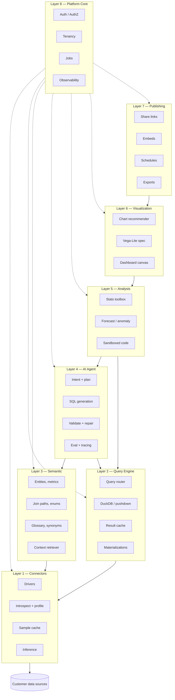

Layer 8 is drawn with dashed edges because it is not a stage in the pipeline — it wraps
every other layer.

### What each layer means, in one line

| # | Layer | Plain meaning |
|---|---|---|
| 1 | Connectors & Ingestion | Gets you connected and extracts structure |
| 2 | Storage & Query Engine | Decides where a query runs and runs it |
| 3 | Metadata & Semantic | Turns structure into business meaning |
| 4 | AI Agent Orchestration | The brain: question in, correct SQL out |
| 5 | Analysis & Execution | Everything beyond plain SQL |
| 6 | Visualization & Dashboards | Turns results into charts and layouts |
| 7 | Publishing & Sharing | Gets the work outside the product |
| 8 | Platform Core | Who can do what, and is anything on fire |

**Difficulty is not evenly distributed.** Layers 3 and 4 decide whether the product works.
Layers 1, 2, 5, 6, 7, 8 are conventional engineering with known answers.

---

## Two flows: design time and run time

Almost every design mistake in this product category comes from mixing these.

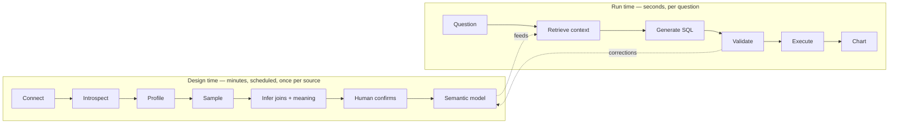

| | Design time | Run time |
|---|---|---|
| Frequency | Once per source, then nightly | Every question |
| Latency budget | Minutes | Seconds |
| Touches customer source | Yes, briefly | Once, at the end |
| Human in the loop | Yes — confirmation | Only when ambiguous |
| Output | Semantic model | Answer + chart |

The dashed feedback edge is important: when a user corrects a wrong answer at run time, that
correction is written back into the design-time model. The system gets more accurate with use.

---

## Cross-cutting principles

1. **Two planes.** Metadata is cheap, cached, and agent-facing. Data is expensive, live, and
   user-facing. Never conflate them.
2. **Read the engine's own statistics** before computing your own. `pg_stats` in milliseconds
   beats a full scan in minutes.
3. **Capability flags, not subclass sprawl.** Callers branch on what a driver can do, never on
   `isinstance`.
4. **One exit point for SQL.** Every outbound query is parsed by `sqlglot`, checked, limited,
   and re-rendered. Never string concatenation. This applies to agent-generated SQL and your
   own alike.
5. **Inference is a proposal, never a fact.** Everything derived carries `confidence` and
   `source`. Human confirmation outranks inference permanently.
6. **Arrow end to end.** One type system from driver to chart. pandas only at the edge, if at all.
7. **Deterministic first, LLM second.** Chart choice, statistics, join resolution — use rules
   where rules work. The model handles ambiguity, not arithmetic.
8. **Everything traced.** Layer 8 instrumentation is installed in layer 1, not retrofitted.

---

# Layer 1 — Connectors & Ingestion

**Purpose:** connect to any source and extract everything derivable about it — schema,
statistics, samples, probable relationships.

## Core principles

### Two planes, not one

| | Metadata plane | Data plane |
|---|---|---|
| Content | Schema, statistics, 1k-row samples | Full query results |
| Size | Megabytes per source | Unbounded |
| Frequency | Scheduled (nightly) | On demand |
| Consumer | The AI agent | The end user |
| Location | Cached locally in DuckDB | Executed on the source |

The agent iterates — profiles, guesses a join, fails, retries. If every iteration hits the
customer's production database, you get blocked from their infrastructure within weeks.

### Three ingestion modes, set per table

| Mode | When | Freshness |
|---|---|---|
| Federated | Analytical stores, small OLTP tables | Real-time |
| Materialized | Files, SaaS APIs, slow sources | Stale by interval |
| **Hybrid** ← default | Large production databases | Real-time results, stale metadata |

## Diagram

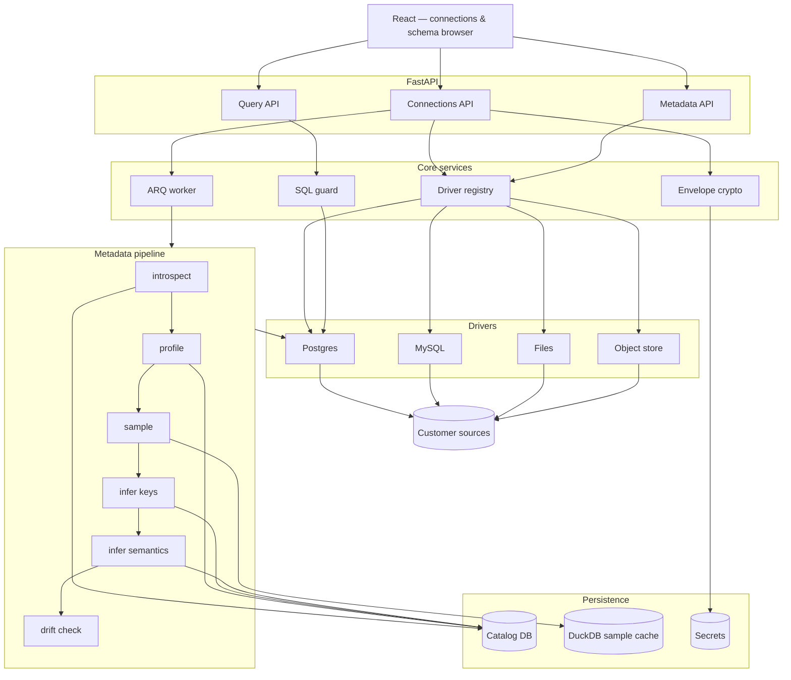

## The ingestion pipeline

### Stage 0 — Register

| Step | File | Detail |
|---|---|---|
| 0.1 | `apps/api/routers/connections.py` | `POST /connections` — type, name, DSN parts, network config |
| 0.2 | `packages/core/schemas.py` | Pydantic validation; reject unsupported types early |
| 0.3 | `packages/crypto/envelope.py` | Per-connection data key; store ciphertext + key ref only |
| 0.4 | `packages/drivers/registry.py` | Resolve type → driver; return `Capabilities` to the client |
| 0.5 | `packages/drivers/postgres.py` | `test_connection()` — open, `SELECT 1`, close, 5s cap |
| 0.6 | `packages/core/models.py` | Insert `connections` row, `status='pending'`, enqueue sync |

Credentials are never returned by any endpoint, including to the user who entered them.

### Stage 1 — Discover

| Step | File | Detail |
|---|---|---|
| 1.1 | `workers/tasks/sync_connection.py` | ARQ job; opens a `sync_runs` row |
| 1.2 | `packages/drivers/postgres.py` | `list_objects()` — tables, views, matviews; skip system schemas |
| 1.3 | `packages/metadata/introspect.py` | For each object, call `describe()` |
| 1.4 | `packages/drivers/postgres.py` | SQLAlchemy `Inspector` — columns, PK, FK, indexes, comments |
| 1.5 | `packages/drivers/types_map.py` | Native type → Arrow type |
| 1.6 | `packages/core/models.py` | Upsert `objects` and `columns` |

**Type mapping traps**

| Case | Wrong | Right |
|---|---|---|
| `NUMERIC` / `DECIMAL` | `float64` — loses money precision | `decimal128(38, 9)` |
| `timestamptz` vs `timestamp` | Collapse both | Preserve tz — all time-series depends on it |
| PostGIS `geometry` | Stringify | Keep WKB binary + SRID |
| Excel dates | Treat as integers | Serial from 1900, with the leap-year bug |
| MySQL `0000-00-00` | Crash or silently null | Flag as invalid, record it |
| Oracle `NUMBER` (no precision) | Assume integer | Inspect scale, fall back to decimal |
| `JSON` / `JSONB` | Auto-flatten | Keep opaque in v1; tell the agent it is JSON |
| Unsigned integers | Same-width signed | Widen to avoid overflow |

### Stage 2 — Profile

| Step | File | Detail |
|---|---|---|
| 2.1 | `packages/metadata/profile.py` | Check `caps.has_statistics`; branch |
| 2.2 | `packages/drivers/postgres.py` | `profile()` reads `pg_stats` — one query, no scan |
| 2.3 | `packages/metadata/profile.py` | Normalize `n_distinct` (negative = fraction of rows) |
| 2.4 | `packages/metadata/profile.py` | Parse `most_common_vals` (Postgres text array) |
| 2.5 | `packages/metadata/profile.py` | Optional exact path — `TABLESAMPLE` + aggregates, opt-in |
| 2.6 | `packages/core/models.py` | Upsert `column_stats` with `exact` flag |

**What each statistic buys the agent**

| Statistic | Enables |
|---|---|
| `null_ratio` | `JOIN` vs `LEFT JOIN`; judging column reliability |
| `distinct_count` | Dimensions vs measures; valid `GROUP BY` targets |
| `distinct_count / row_count ≈ 1` | Undeclared candidate keys |
| **`top_k`** | Knowing `status` is `('active','churned')` not `('A','C')`. **Highest-value statistic** — without it the agent invents `WHERE` values |
| `min` / `max` on dates | The available time range, before answering "last quarter" |
| `avg_width` + regex | Semantic types: email, phone, national ID, coordinates |
| `row_count` | Federated vs materialized |

Always compute `top_k` where `distinct_count < 100`.

### Stage 3 — Sample

| Step | File | Detail |
|---|---|---|
| 3.1 | `packages/metadata/sample.py` | Choose strategy from `caps` and object kind |
| 3.2 | `packages/drivers/postgres.py` | `TABLESAMPLE SYSTEM (1)` for tables; `LIMIT` for views |
| 3.3 | `packages/safety/pii.py` | Detect and mask before anything leaves the process |
| 3.4 | `packages/metadata/cache.py` | ~1000 rows per object into DuckDB |
| 3.5 | `packages/metadata/cache.py` | Size budget; LRU eviction |

Strategies: `TABLESAMPLE` (fast, page-biased — acceptable), reservoir (streams, files),
stratified (when a low-cardinality `status`/`type` column exists — sample every value).

### Stage 4 — Infer relationships

Declared foreign keys are frequently absent in real databases. This stage is the highest-value
part of the layer.

| Step | File | Detail |
|---|---|---|
| 4.1 | `packages/metadata/infer_keys.py` | Seed with declared FKs — `confidence=1.0`, `source='declared'` |
| 4.2 | `packages/metadata/infer_keys.py` | Name candidates: `customer_id` → `customers.id`, `<table>_id`, `fk_*`, shared prefixes |
| 4.3 | `packages/metadata/infer_keys.py` | Type compatibility filter |
| 4.4 | `packages/metadata/infer_keys.py` | Value-overlap on DuckDB samples: ≥0.95 high, 0.7–0.95 review, <0.7 discard |
| 4.5 | `packages/metadata/infer_keys.py` | Cardinality direction — distinct side is the parent |
| 4.6 | `packages/core/models.py` | Write `relationships` with confidence and evidence |

Overlap testing runs against cached samples — a local DuckDB join, not a source query.

### Stage 5 — Infer semantics

| Step | File | Detail |
|---|---|---|
| 5.1 | `packages/metadata/infer_semantic.py` | Regex classifiers: email, phone, URL, IP, IBAN, coordinates, national ID |
| 5.2 | `packages/metadata/infer_semantic.py` | Role heuristics: measure / dimension / identifier / timestamp |
| 5.3 | `packages/metadata/infer_semantic.py` | Deprecation signals: `_old`, `_bak`, `tmp_`, zero rows, stale `last_autoanalyze` |
| 5.4 | `packages/metadata/infer_semantic.py` | LLM pass — table name, column name, type, `top_k`, masked sample → JSON description |
| 5.5 | `packages/core/models.py` | Store as `source='inferred'`. **Never as fact** |

### Stage 6 — Fingerprint and finalize

| Step | File | Detail |
|---|---|---|
| 6.1 | `packages/metadata/drift.py` | SHA-256 over sorted `(schema, table, column, type, nullable)` |
| 6.2 | `packages/metadata/drift.py` | Compare to previous `schema_versions` |
| 6.3 | `packages/metadata/drift.py` | On change, emit a drift event — **do not resync silently**. Confirmed annotations on removed columns are orphaned and must be flagged |
| 6.4 | `packages/core/models.py` | `status='ready'`; close `sync_runs` |

### Stage 7 — Human confirmation

A connection alone yields roughly 60–70% understanding. The remaining 30% — which joins are
valid, what `st_cd` means, which date column the business actually uses — is not in the
database and never will be.

| Step | File | Detail |
|---|---|---|
| 7.1 | `apps/api/routers/relationships.py` | `GET /connections/{id}/review` — inferred items below threshold |
| 7.2 | `apps/web/src/pages/ReviewGraph.tsx` | React Flow join graph; inferred dashed, declared solid |
| 7.3 | `apps/web/src/pages/ReviewColumns.tsx` | Per-column descriptions and enum meanings |
| 7.4 | `apps/api/routers/relationships.py` | `POST .../confirm` → `source='confirmed'`, `confidence=1.0` |
| 7.5 | `packages/core/models.py` | Confirmations survive resync |

**Target: a correct semantic model in under ten minutes.** If it takes a week of hand-authoring,
you have rebuilt Cube with extra steps.

### Stage 8 — Scheduled resync

| Step | File | Detail |
|---|---|---|
| 8.1 | `workers/worker.py` | ARQ cron, nightly per connection |
| 8.2 | `workers/tasks/sync_connection.py` | Re-run stages 1–6; skip 7 |
| 8.3 | `packages/metadata/introspect.py` | Merge, do not replace |
| 8.4 | `packages/core/models.py` | Advance `watermarks` |

## Stack

| Tool | Package | Licence | Used in | Why |
|---|---|---|---|---|
| FastAPI | `fastapi` | MIT | `apps/api/` | Async, Pydantic-native, OpenAPI free |
| Pydantic v2 | `pydantic` | MIT | `core/schemas.py` | Rust-backed boundary validation |
| SQLAlchemy 2.0 | `sqlalchemy` | MIT | `core/models.py`, drivers | `Inspector` normalizes introspection across 10+ dialects — the biggest single saving here |
| Alembic | `alembic` | MIT | `migrations/` | Catalog migration history |
| psycopg 3 | `psycopg[binary]` | LGPL | Postgres driver | `statement_timeout` via connect options |
| DuckDB | `duckdb` | MIT | cache, files, object store | One dependency covers four jobs |
| sqlglot | `sqlglot` | MIT | `safety/sqlguard.py` | Real AST, 25+ dialects, pure Python |
| ConnectorX | `connectorx` | MIT | data plane | ~10× pandas for DB → Arrow |
| PyArrow | `pyarrow` | Apache 2.0 | everywhere | Canonical type system, zero-copy |
| python-calamine | `python-calamine` | MIT | `drivers/files.py` | 10–80× openpyxl; raw typed cell grid |
| ARQ | `arq` | MIT | `workers/` | Asyncio-native; one dependency over Redis |
| cryptography | `cryptography` | Apache 2.0 | `crypto/envelope.py` | Fernet envelope encryption |
| React Flow | `reactflow` | MIT | `ReviewGraph.tsx` | The join-graph confirmation canvas |

**Deferred:** dlt (SaaS connectors), Temporal (durable jobs), OpenBao (secrets), Debezium (CDC), ADBC.
**Rejected:** Airbyte/Meltano/NiFi (servers to operate; Airbyte is ELv2), pandas in the ingestion
path (uncontrolled coercion), openpyxl (slow, no typed grid), Mongo/Elastic drivers in v1
(sample-and-infer is a different code path).

## Data model

```sql
create table connections (
    id uuid primary key default gen_random_uuid(),
    tenant_id uuid not null,
    name text not null,
    type text not null,                      -- postgres | mysql | file | s3
    config jsonb not null,
    credential_ref text not null,            -- pointer, never the secret
    network jsonb,                           -- ssh tunnel, static ip, tls
    ingestion_mode text not null default 'hybrid',
    status text not null default 'pending',
    last_synced_at timestamptz,
    created_at timestamptz not null default now(),
    unique (tenant_id, name)
);

create table objects (
    id uuid primary key default gen_random_uuid(),
    connection_id uuid not null references connections(id) on delete cascade,
    schema_name text, name text not null, kind text not null,
    row_count_estimate bigint,
    is_deprecated boolean not null default false,
    description text, description_source text,
    last_profiled_at timestamptz,
    unique (connection_id, schema_name, name)
);

create table columns (
    id uuid primary key default gen_random_uuid(),
    object_id uuid not null references objects(id) on delete cascade,
    name text not null, position int not null,
    arrow_type text not null, native_type text not null, nullable boolean not null,
    comment text,                            -- from the source catalog
    description text,                        -- inferred or confirmed
    semantic_type text,                      -- email | phone | currency | geo
    role text,                               -- measure | dimension | identifier | timestamp
    source text not null default 'introspected',
    unique (object_id, name)
);

create table column_stats (
    column_id uuid primary key references columns(id) on delete cascade,
    null_ratio double precision, distinct_count bigint,
    top_k jsonb, min_value text, max_value text, avg_width int,
    exact boolean not null default false,
    computed_at timestamptz not null default now()
);

create table relationships (
    id uuid primary key default gen_random_uuid(),
    connection_id uuid not null references connections(id) on delete cascade,
    from_object_id uuid not null references objects(id) on delete cascade,
    from_columns text[] not null,
    to_object_id uuid not null references objects(id) on delete cascade,
    to_columns text[] not null,
    cardinality text, confidence double precision not null,
    source text not null,                    -- declared | inferred | confirmed
    evidence jsonb,                          -- overlap ratio, name match, sample size
    created_at timestamptz not null default now()
);

create table watermarks (
    object_id uuid primary key references objects(id) on delete cascade,
    strategy text not null, cursor_column text, cursor_value text,
    updated_at timestamptz not null default now()
);

create table schema_versions (
    id uuid primary key default gen_random_uuid(),
    connection_id uuid not null references connections(id) on delete cascade,
    fingerprint text not null, diff jsonb,
    detected_at timestamptz not null default now()
);

create table sync_runs (
    id uuid primary key default gen_random_uuid(),
    connection_id uuid not null references connections(id) on delete cascade,
    trigger text not null, status text not null, stages jsonb, error text,
    started_at timestamptz not null default now(), finished_at timestamptz
);
```

`source='confirmed'` is never overwritten by resync. `evidence` stores why an inference was
made, so the review UI can justify each suggestion rather than asking for blind trust.

## Security requirements

| Requirement | Where |
|---|---|
| Read-only credentials, enforced at the database | Source config |
| `statement_timeout` + `idle_in_transaction_session_timeout` | `safety/limits.py` |
| `LIMIT` injection via AST rewrite — **never concatenation** | `safety/sqlguard.py` |
| Reject `INSERT`/`UPDATE`/`DELETE`/DDL/`GRANT`/`MERGE` | `safety/sqlguard.py` |
| Single-statement enforcement (blocks stacked injection) | `safety/sqlguard.py` |
| Per-tenant connection pool | `safety/limits.py` |
| Byte-scanned caps on metered sources | `safety/limits.py` |
| PII masking before samples reach an LLM | `safety/pii.py` |
| Egress control — SSH tunnel or static IP | `connections.network` |
| Audit log of connects, queries, samples | all routers |

`test_sqlguard.py` carries the highest coverage bar in the repo. It is the boundary layer 4
will push against.

## Milestones

| # | Deliverable | Est. |
|---|---|---|
| M1.1 | Driver contract, registry, Postgres `describe()`, catalog tables | 3–4 d |
| M1.2 | `profile()` via `pg_stats`, `sample()` into DuckDB | 2–3 d |
| M1.3 | SQL guard + limits + `test_sqlguard.py` | 2 d |
| M1.4 | FK inference with precision/recall measured | 3 d |
| M1.5 | ARQ jobs + progress endpoint | 2 d |
| M1.6 | Schema browser + React Flow review UI | 4–5 d |
| M1.7 | File driver + LLM table detection | 3 d |

Guard before inference, inference before job plumbing — M1.4 is where you discover whether the
metadata model is rich enough, and you want that finding while the schema is still cheap to change.
M1.7 is the abstraction test: if adding the file driver requires touching `packages/metadata/`,
the `SourceDriver` contract was wrong.

---

# Layer 2 — Storage & Query Engine

**Purpose:** decide where a query executes, execute it, and avoid executing it again.

## Key decisions

⚠ **D2.1 — DuckDB is the default engine; Trino only on evidence.** DuckDB handles federation,
files, object storage, and cross-source joins at single-node scale. Trino is a cluster to
operate. Add it when a real customer exceeds single-node memory, not before.

⚠ **D2.2 — Cache on `(normalized SQL hash, source fingerprint, tenant)`.** Normalize via sqlglot
so formatting differences hit the same entry. Invalidate on schema drift or materialization
refresh, never on a timer alone.

⚠ **D2.3 — Cross-source joins pull the small side.** Estimate both sides from layer 1 statistics;
materialize the smaller into DuckDB, push the predicate down to the larger. Refuse the query
if both sides exceed the memory budget rather than silently thrashing.

## Diagram

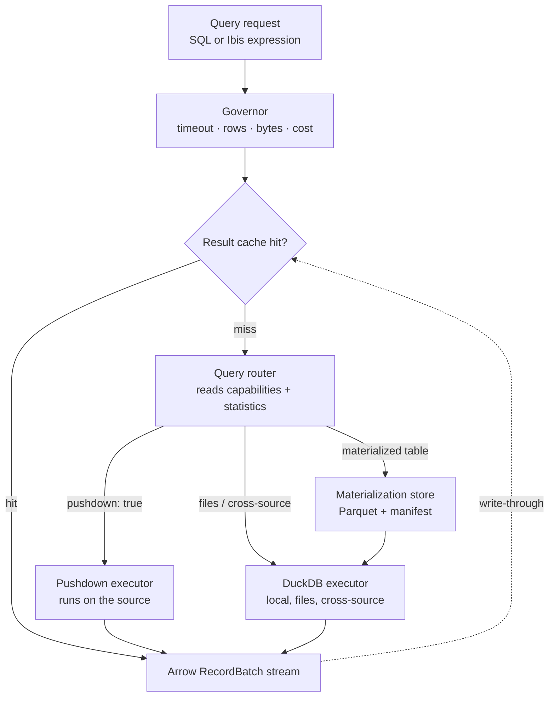

## Routing rules

| Condition | Route |
|---|---|
| Single source, `caps.pushdown = true`, source is analytical | Pushdown |
| Single source, OLTP, estimated rows < 1M | Pushdown with governor caps |
| Source is a file or object store | DuckDB |
| Two or more sources in one query | DuckDB, small side materialized |
| Table marked `materialized` and manifest is fresh | Read Parquet |
| Source `metered = true` and estimated bytes > cap | **Refuse before sending** |

## Files

```
packages/engine/
├── router.py          Routing rules above; returns an executor + plan
├── planner.py         Ibis/sqlglot expression → dialect SQL; predicate pushdown
├── cost.py            Estimate rows and bytes from layer 1 statistics
├── governor.py        Timeouts, row caps, byte caps, per-tenant concurrency
├── cache.py           Normalized-SQL keying, write-through, invalidation
├── materialize.py     Refresh schedules, incremental via watermarks, manifests
└── executors/
    ├── pushdown.py    Delegates to a layer 1 driver
    ├── duck.py        Local DuckDB; ATTACH remote sources; cross-source joins
    └── trino.py       Deferred until D2.1 triggers
```

## Data model

```sql
create table materializations (
    id uuid primary key default gen_random_uuid(),
    object_id uuid not null references objects(id) on delete cascade,
    storage_uri text not null,               -- s3://bucket/prefix or file://
    format text not null default 'parquet',
    partition_by text[],
    strategy text not null,                  -- full | incremental
    row_count bigint, size_bytes bigint,
    refreshed_at timestamptz, next_refresh_at timestamptz,
    status text not null default 'stale'
);

create table query_runs (
    id uuid primary key default gen_random_uuid(),
    tenant_id uuid not null, user_id uuid,
    agent_run_id uuid,                       -- links to layer 4 when agent-originated
    sql_hash text not null, sql_text text not null,
    executor text not null,                  -- pushdown | duckdb | trino | cache
    rows_returned bigint, bytes_scanned bigint, duration_ms int,
    cache_hit boolean not null default false,
    error text,
    created_at timestamptz not null default now()
);
```

`query_runs` is not just telemetry — it is the training signal for layer 4's example memory
and the input to cost governance.

## Stack

| Tool | Licence | Why |
|---|---|---|
| **DuckDB** | MIT | Federation, files, object storage, cross-source joins, all single-node |
| **Ibis** | Apache 2.0 | One expression compiled to many dialects; makes `Query` a real object rather than a string |
| **sqlglot** | MIT | Normalization for cache keys; predicate pushdown rewrites |
| **PyArrow** | Apache 2.0 | Streaming result transport |
| **Valkey** | BSD | Small-result cache. Prefer over Redis (relicensed RSALv2/SSPL) |
| **Parquet** | Apache 2.0 | Materialization format |
| Trino *(deferred)* | Apache 2.0 | Only if D2.1 triggers |
| Apache Iceberg *(deferred)* | Apache 2.0 | Only if materializations need time travel and schema evolution |

## Milestones

| # | Deliverable | Est. |
|---|---|---|
| M2.1 | Router + pushdown executor + governor | 3 d |
| M2.2 | DuckDB executor; ATTACH remote Postgres | 2 d |
| M2.3 | Result cache with sqlglot normalization | 2 d |
| M2.4 | Cross-source join with small-side materialization | 3 d |
| M2.5 | Materialization manager + incremental refresh | 4 d |

---

# Layer 3 — Metadata & Semantic Layer

**Purpose:** turn structure into meaning, and put the right slice of that meaning into the
agent's context window.

This layer and layer 4 decide whether the product works.

## Key decisions

⚠ **D3.1 — Auto-generated draft plus confirmation, not hand-authored definitions.** Cube, dbt,
and Lightdash all require a human to write the semantic model. That is a week of work per
source and the reason those tools stay in the hands of data teams. Your wedge is generating
the draft from layer 1 inference and getting it confirmed in ten minutes.

⚠ **D3.2 — Context retrieval is a first-class component, not a prompt-building helper.** A
500-table database does not fit in a context window. Retrieval quality caps agent accuracy
regardless of model size.

⚠ **D3.3 — Metrics are formulas, validated by sqlglot, not free text.** "Revenue" must compile
to real SQL against real columns, or the agent will paraphrase it differently every time.

## Diagram

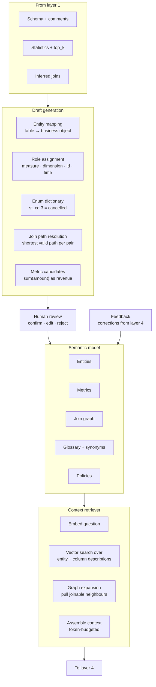

## Context retrieval — the pipeline that caps your accuracy

| Step | File | Detail |
|---|---|---|
| R.1 | `packages/semantic/retrieve.py` | Embed the question with a self-hosted embedding model |
| R.2 | `packages/semantic/retrieve.py` | Vector search over entity and column descriptions in pgvector |
| R.3 | `packages/semantic/retrieve.py` | Exact-match boost on glossary terms and metric names |
| R.4 | `packages/semantic/retrieve.py` | Graph expansion — add tables reachable by one confirmed join |
| R.5 | `packages/semantic/retrieve.py` | Pull `top_k` enum values for every retrieved dimension |
| R.6 | `packages/semantic/retrieve.py` | Retrieve nearest confirmed query examples from `query_examples` |
| R.7 | `packages/semantic/retrieve.py` | Assemble under a token budget; drop lowest-scoring first |

Steps R.4 and R.5 are what separate this from naive RAG. A question about "cancelled orders in
Cairo" needs `orders`, the confirmed join to `cities`, *and* the knowledge that cancelled is
`st_cd = 3`. Vector search alone finds the tables; graph expansion and enum injection make the
SQL correct.

## The embeddings service — concrete design

The abstract requirement above ("a self-hosted embedding model") is settled as a dedicated
container in the compose network, sized for an air-gapped CPU deployment rather than a GPU
inference server:

| Decision | Choice | Why |
|---|---|---|
| Model | `paraphrase-multilingual-MiniLM-L12-v2` (ONNX export) | Multilingual with real Arabic coverage (questions and glossary are Arabic ↔ English), 384-dim, and **prefix-free** — E5-family models want `query:`/`passage:` prefixes that an OpenAI-compatible `/v1/embeddings` contract has no field to express, so their published quality is unreachable behind that API |
| Runtime | ONNX Runtime + `tokenizers` + numpy mean-pool/L2-norm | No torch: a CPU ONNX image is a few hundred MB where a torch layer alone is ~2 GB — this matters when the whole platform ships as a docker-save bundle into an isolated network |
| Weights | Downloaded inside a Dockerfile `RUN` layer at build time | Builds happen outside the isolated network; at runtime the container never touches the internet. The offline bundle carries the weights inside the image |
| API | `POST /v1/embeddings` (OpenAI shape), `/health` reporting model + dim | The retrieval client (`retrieval.py` Backend B) already speaks this contract; the server is built to the client, not the other way round |
| Deployment | Compose-network only, no host ports, healthcheck, memory-capped | Same isolation posture as Valkey |
| Failure | Circuit breaker in the client + lexical TF-IDF fallback | A dead or slow embeddings service degrades retrieval quality, never availability — ranking answers from the lexical scorer within one request |
| Persistence | Vectors cached in `retrieval_embeddings` keyed by `(text_hash, model)` | A restart re-embeds nothing; a model change (different tag) invalidates naturally. pgvector remains the scale-up path — at the current catalog size, in-process cosine over cached vectors is exact and fast, and the table is the seam pgvector slots into without rework |

Enabled by default in compose (`EMBEDDING_BASE_URL` → the service): the fallback ladder makes
"on by default" safe, and an embeddings server that ships disabled is a gap wearing a feature's
name.


## Files

```
packages/semantic/
├── model.py        Entities, metrics, dimensions — the domain objects
├── draft.py        Layer 1 inference → draft semantic model
├── glossary.py     Business terms, synonyms, abbreviations, Arabic ↔ English aliases
├── metrics.py      Formula parsing and validation via sqlglot
├── joins.py        Join graph; shortest confirmed path between any two entities
├── policies.py     Row-level filters attached to entities
├── retrieve.py     The R.1–R.7 pipeline above
├── embed.py        Self-hosted embedding client + pgvector upsert
└── feedback.py     Corrections from layer 4 written back into the model
```

## Data model

```sql
create table entities (
    id uuid primary key default gen_random_uuid(),
    connection_id uuid not null references connections(id) on delete cascade,
    object_id uuid references objects(id) on delete cascade,
    name text not null,                      -- business name: "Orders"
    description text,
    grain text,                              -- "one row per order line"
    is_primary boolean not null default false,
    source text not null,                    -- inferred | confirmed
    embedding vector(1024)
);

create table metrics (
    id uuid primary key default gen_random_uuid(),
    entity_id uuid not null references entities(id) on delete cascade,
    name text not null,                      -- "revenue"
    expression text not null,                -- "sum(order_items.amount)"
    filters text,                            -- "status <> 'cancelled'"
    format text,                             -- currency | percent | count
    description text,
    source text not null,
    embedding vector(1024),
    unique (entity_id, name)
);

create table enum_values (
    id uuid primary key default gen_random_uuid(),
    column_id uuid not null references columns(id) on delete cascade,
    raw_value text not null,                 -- "3"
    label text not null,                     -- "cancelled"
    description text,
    source text not null,
    unique (column_id, raw_value)
);

create table glossary_terms (
    id uuid primary key default gen_random_uuid(),
    tenant_id uuid not null,
    term text not null,                      -- "GMV"
    synonyms text[],                         -- {"gross merchandise value","إجمالي المبيعات"}
    resolves_to jsonb not null,              -- {"metric_id": "..."} or {"column_id": "..."}
    embedding vector(1024)
);

create table join_paths (
    id uuid primary key default gen_random_uuid(),
    from_entity_id uuid not null references entities(id) on delete cascade,
    to_entity_id uuid not null references entities(id) on delete cascade,
    path jsonb not null,                     -- ordered relationship ids
    hops int not null,
    is_preferred boolean not null default false
);

create table row_policies (
    id uuid primary key default gen_random_uuid(),
    entity_id uuid not null references entities(id) on delete cascade,
    predicate text not null,                 -- "tenant_id = :current_tenant"
    applies_to jsonb                         -- role or group scope
);

create table query_examples (
    id uuid primary key default gen_random_uuid(),
    tenant_id uuid not null,
    question text not null, sql_text text not null,
    verified boolean not null default false,
    upvotes int not null default 0,
    embedding vector(1024),
    created_at timestamptz not null default now()
);
```

`glossary_terms.synonyms` carrying Arabic aliases is not a nice-to-have for your market — it is
how "إجمالي المبيعات" and "GMV" resolve to the same metric.

## Stack

| Tool | Licence | Why |
|---|---|---|
| **pgvector** | PostgreSQL | Embeddings next to the relational model; one database, no sync problem |
| **sqlglot** | MIT | Metric formula validation — a metric that does not compile is rejected at save time |
| **Self-hosted embeddings** — settled: multilingual MiniLM (ONNX, CPU container; see §The embeddings service). bge-m3 via vLLM remains the scale-up option if a GPU host appears | MIT/Apache | Multilingual matters for Arabic ↔ English term matching; prefix-free beats bigger-but-prefixed behind an OpenAI-shape API |
| **NetworkX** | BSD | Shortest-path over the join graph; small dependency, exactly the right tool |
| Cube *(optional export)* | Apache 2.0 | Emit a Cube-compatible model so data teams can adopt without lock-in |

## Milestones

| # | Deliverable | Est. |
|---|---|---|
| M3.1 | Semantic model schema + domain objects | 2 d |
| M3.2 | Draft generation from layer 1 inference | 4 d |
| M3.3 | Metric formula parsing and validation | 2 d |
| M3.4 | Join graph + shortest confirmed path | 2 d |
| M3.5 | Embedding pipeline + pgvector search | 3 d |
| M3.6 | Full retrieval pipeline R.1–R.7 with token budgeting | 4 d |
| M3.7 | Glossary UI + Arabic synonym support | 3 d |

---

# Layer 4 — AI Agent Orchestration

**Purpose:** question in, correct answer out — with the loop, validation, and repair that make
that reliable rather than lucky.

## Key decisions

⚠ **D4.1 — Validation ladder, cheapest first.** Static parse → schema existence → join validity
→ policy check → `EXPLAIN` dry run → execute. Most failures are caught before any query runs.

⚠ **D4.2 — Constrained decoding, not prompt-begging.** Force valid JSON and valid SQL grammar at
the token level with XGrammar or Outlines. "Please respond only in JSON" is not a contract.

⚠ **D4.3 — Clarify when ambiguous; do not guess.** If the question maps to two metrics or two
date columns with similar scores, ask. A wrong confident answer destroys trust faster than a
question costs patience.

⚠ **D4.4 — Bounded repair.** Maximum three repair attempts, each with the specific error fed
back. Then fail honestly with what was tried.

## Diagram

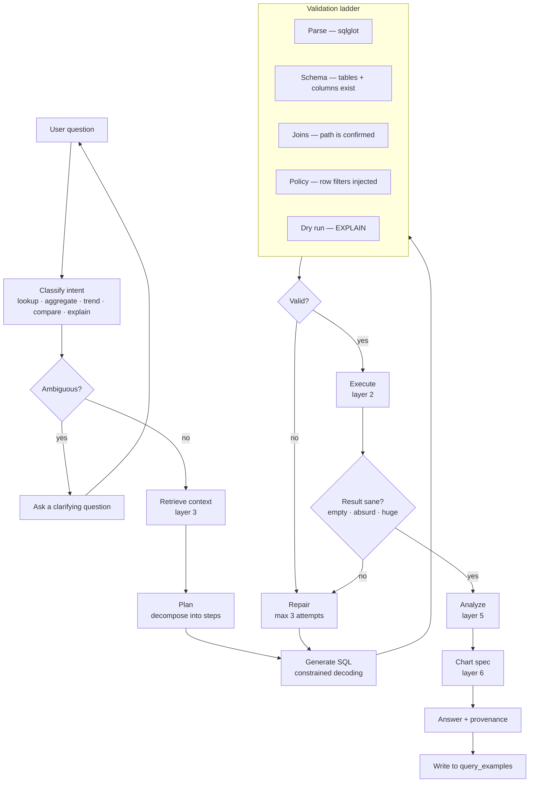

## The validation ladder in detail

| Level | File | Catches | Cost |
|---|---|---|---|
| V1 Parse | `agent/validate.py` | Syntax errors, wrong dialect | Microseconds |
| V2 Schema | `agent/validate.py` | Hallucinated tables and columns — **the most common failure** | Milliseconds, catalog lookup |
| V3 Joins | `agent/validate.py` | Invented joins; unconfirmed paths | Milliseconds, graph lookup |
| V4 Policy | `agent/policy.py` | Missing row-level filters — injected as AST predicates, never appended as text | Milliseconds |
| V5 Dry run | `agent/validate.py` | Type errors, ambiguous columns, permission failures | One `EXPLAIN` |

V2 alone eliminates a large share of failures and costs nothing, because layer 1 already has
the full column list in the catalog.

## Row-level security path

This is the security-critical flow of the whole platform:

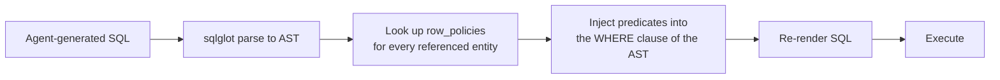

Predicates are injected into the AST, never concatenated onto the string, and never applied by
filtering results after the fact. Post-filtering leaks row counts, aggregates, and existence.

## Files

```
packages/agent/
├── graph.py              LangGraph state machine — the diagram above
├── state.py              Typed agent state passed between nodes
├── nodes/
│   ├── classify.py       Intent + ambiguity detection
│   ├── clarify.py        Question generation when ambiguous
│   ├── plan.py           Decomposition into ordered steps
│   ├── generate.py       SQL generation with constrained decoding
│   ├── validate.py       The V1–V5 ladder
│   ├── repair.py         Error-specific repair prompts, bounded
│   ├── sanity.py         Empty / absurd / oversized result detection
│   └── explain.py        Natural-language answer + provenance
├── policy.py             Row-level predicate injection
├── prompts/              Versioned prompt templates, one file each
├── llm.py                vLLM client, retries, token accounting
├── memory.py             query_examples read and write
└── tracing.py            Langfuse spans per node
```

```
evals/
├── golden/               Your own question → SQL pairs per customer schema
├── run_eval.py           Execution accuracy, not string match
├── datasets/             Spider 2.0, BIRD subsets
└── report.py             Per-intent breakdown; CI gate
```

## Data model

```sql
create table conversations (
    id uuid primary key default gen_random_uuid(),
    tenant_id uuid not null, user_id uuid not null,
    connection_id uuid references connections(id),
    title text, created_at timestamptz not null default now()
);

create table messages (
    id uuid primary key default gen_random_uuid(),
    conversation_id uuid not null references conversations(id) on delete cascade,
    role text not null,                      -- user | assistant | system
    content text not null,
    agent_run_id uuid,
    created_at timestamptz not null default now()
);

create table agent_runs (
    id uuid primary key default gen_random_uuid(),
    conversation_id uuid not null references conversations(id) on delete cascade,
    question text not null, intent text,
    final_sql text, status text not null,    -- answered | clarifying | failed
    repair_attempts int not null default 0,
    tokens_in int, tokens_out int, duration_ms int,
    trace_id text,                           -- Langfuse correlation
    created_at timestamptz not null default now()
);

create table agent_steps (
    id uuid primary key default gen_random_uuid(),
    agent_run_id uuid not null references agent_runs(id) on delete cascade,
    step_index int not null, node text not null,
    input jsonb, output jsonb, error text, duration_ms int
);

create table feedback (
    id uuid primary key default gen_random_uuid(),
    agent_run_id uuid not null references agent_runs(id) on delete cascade,
    verdict text not null,                   -- correct | wrong | partial
    corrected_sql text, note text,
    created_at timestamptz not null default now()
);
```

`feedback` with `verdict='wrong'` plus `corrected_sql` is the highest-value data your product
generates. It flows back into `query_examples` and into layer 3's model.

## Stack

| Tool | Licence | Why |
|---|---|---|
| **LangGraph** | MIT | Explicit state machine with cycles — repair loops are edges, not `while` blocks |
| **vLLM** | Apache 2.0 | Self-hosted serving; already in your stack |
| **XGrammar** or **Outlines** | Apache 2.0 | Token-level grammar constraints for JSON and SQL |
| **sqlglot** | MIT | The validation ladder and policy injection |
| **Langfuse** | MIT (core) | Per-node traces, token cost, latency. Install on day one |
| **promptfoo** / **Ragas** | MIT / Apache 2.0 | Regression testing on prompt changes |
| **Spider 2.0** / **BIRD** | Academic | Public benchmarks for calibration against the field |
| **MCP** | Open spec | Expose the platform as tools so external agents can call it |
| Pydantic AI *(alternative)* | MIT | If LangGraph proves heavier than needed |

## Evaluation — non-negotiable

Measure **execution accuracy** (does the result match the golden result set), not SQL string
similarity. Two correct queries can look nothing alike.

| Metric | Target |
|---|---|
| Execution accuracy, simple lookups | > 95% |
| Execution accuracy, aggregate + single join | > 85% |
| Execution accuracy, multi-join or window | > 70% |
| Clarification rate | 5–15% — below 5% means it is guessing |
| Mean repair attempts | < 0.5 |
| Hallucinated column rate | ~0% — V2 should make this structurally impossible |

Wire the eval into CI. Any prompt or retrieval change that moves these numbers should fail the
build loudly.

## Milestones

| # | Deliverable | Est. |
|---|---|---|
| M4.1 | LangGraph skeleton + state + tracing | 3 d |
| M4.2 | Generation with constrained decoding | 3 d |
| M4.3 | Validation ladder V1–V5 | 4 d |
| M4.4 | Policy injection + row-level security tests | 3 d |
| M4.5 | Repair loop + sanity checks | 3 d |
| M4.6 | Golden eval set + CI gate | 4 d |
| M4.7 | Clarification flow | 2 d |
| M4.8 | Feedback capture → `query_examples` | 2 d |

---

# Layer 5 — Analysis & Execution

**Purpose:** everything beyond plain SQL — statistics, forecasting, anomaly detection, and, as
a last resort, arbitrary code.

## Key decisions

⚠ **D5.1 — Named deterministic tools first, free-form code last.** The agent should call
`forecast(series, horizon=12)`, not write pandas. Named tools are testable, fast, safe, and
give reproducible results. Free-form code is the escape hatch for the long tail.

⚠ **D5.2 — When code is unavoidable, isolate at the kernel boundary.** gVisor or a Firecracker
microVM. No network. Read-only Arrow input. Hard CPU, memory, and wall-clock caps. A container
alone is not a sandbox for code an LLM wrote.

## Diagram

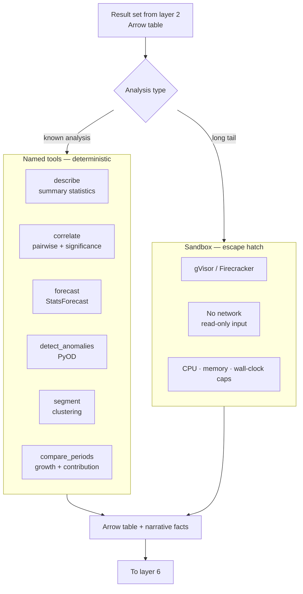

## The tool contract

Every named tool has the same shape, which is what lets layer 4 call them reliably:

```python
def forecast(
    table: pa.Table,
    time_column: str,
    value_column: str,
    horizon: int,
    freq: str = "auto",
) -> AnalysisResult:
    """Returns Arrow output plus structured facts the agent can narrate."""
```

`AnalysisResult` carries the output table, a list of plain-language facts ("revenue grew 12%
quarter over quarter; the trend is significant at p < 0.01"), and a suggested chart hint for
layer 6. The facts matter — they are what turns a chart into an answer.

## Files

```
packages/analysis/
├── contract.py       AnalysisResult; the shared tool signature
├── describe.py       Summary statistics, distributions, missingness
├── correlate.py      Pairwise correlation with significance testing
├── forecast.py       StatsForecast wrappers; seasonality detection
├── anomaly.py        PyOD detectors; threshold selection
├── segment.py        Clustering with automatic k selection
├── compare.py        Period-over-period, contribution analysis
└── registry.py       Tool catalogue exposed to layer 4

packages/sandbox/
├── runner.py         Submit code + Arrow input, collect Arrow output
├── policy.py         Resource limits, timeouts, syscall policy
├── image/            Minimal rootfs: python, pyarrow, numpy, scipy only
└── audit.py          Every execution logged with the code that ran
```

## Stack

| Tool | Licence | Why |
|---|---|---|
| **statsmodels** / **scipy** | BSD | Core statistics and significance testing |
| **StatsForecast** | Apache 2.0 | Fast classical forecasting; far lighter than deep models and usually as accurate at business scale |
| **PyOD** | BSD | Broad anomaly detection catalogue behind one interface |
| **scikit-learn** | BSD | Clustering, preprocessing |
| **gVisor** | Apache 2.0 | Kernel-level isolation with container ergonomics |
| **Firecracker** *(alternative)* | Apache 2.0 | Stronger isolation, higher operational cost |
| **Pyodide** *(fallback)* | MPL 2.0 | Browser-side execution — sandboxing for free when data is small |
| **PyArrow** | Apache 2.0 | The input/output boundary for every tool |

## Milestones

| # | Deliverable | Est. |
|---|---|---|
| M5.1 | Tool contract + registry + `describe` | 2 d |
| M5.2 | Forecast, anomaly, compare tools | 4 d |
| M5.3 | Correlate and segment tools | 2 d |
| M5.4 | gVisor sandbox runner + resource policy | 4 d |
| M5.5 | Layer 4 tool exposure + selection prompts | 2 d |

---

# Layer 6 — Visualization & Dashboards

**Purpose:** turn a result set into the right chart, and charts into a dashboard.

## Key decisions

⚠ **D6.1 — Vega-Lite JSON specs, generated against a schema and validated before render.** Not
chart code. A spec is validatable, serializable, versionable, diffable, and renderable
server-side for exports. Generated React code is none of those things.

⚠ **D6.2 — Chart choice is mostly deterministic.** Data shape decides it: column count, types,
cardinality, row count. Use rules; call the model only for ties and for titles.

⚠ **D6.3 — Dashboards are documents with versions.** Every save is a new version. Layer 7
publishes a specific version, never "latest", so a shared link cannot change under the viewer.

## Chart recommendation rules

| Shape | Chart |
|---|---|
| 1 categorical (≤ 12 distinct) + 1 numeric | Bar |
| 1 categorical (> 12 distinct) + 1 numeric | Horizontal bar, top-N + "other" |
| 1 temporal + 1 numeric | Line |
| 1 temporal + 1 numeric + 1 categorical (≤ 6) | Multi-series line |
| 2 numeric | Scatter |
| 2 numeric + 1 categorical | Coloured scatter |
| 1 categorical + 1 temporal + 1 numeric (high cardinality) | Heatmap |
| 1 numeric only | Histogram |
| Single aggregate row | Big number + delta |
| Geospatial columns present | Map — MapLibre or deck.gl |
| > 6 columns, exploratory | Table with conditional formatting |

Rules first, model second. This is faster, free, reproducible, and better than asking an LLM to
pick a chart type.

## Diagram

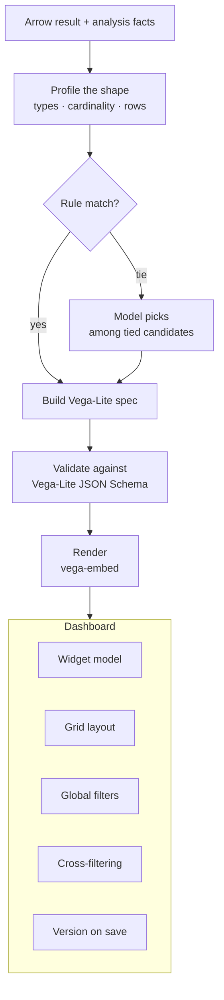

## Files

```
packages/viz/
├── shape.py          Profile a result set: types, cardinality, row count
├── recommend.py      The rules table above; returns ranked candidates
├── spec.py           Vega-Lite spec construction
├── validate.py       JSON Schema validation before anything renders
├── theme.py          Shared colour ramps, typography, number formats
└── dashboard.py      Widget and layout domain objects

apps/web/src/dashboard/
├── Canvas.tsx        react-grid-layout drag and resize
├── Widget.tsx        Wraps a chart, a table, or a big number
├── VegaChart.tsx     vega-embed wrapper
├── DataGrid.tsx      Perspective for large result sets
├── GeoMap.tsx        MapLibre + deck.gl
├── Filters.tsx       Global filter bar
├── CrossFilter.tsx   Click a bar, filter siblings
└── VersionBar.tsx    History, restore, publish
```

## Data model

```sql
create table dashboards (
    id uuid primary key default gen_random_uuid(),
    tenant_id uuid not null, owner_id uuid not null,
    name text not null, description text,
    folder_id uuid,
    current_version int not null default 1,
    created_at timestamptz not null default now()
);

create table dashboard_versions (
    id uuid primary key default gen_random_uuid(),
    dashboard_id uuid not null references dashboards(id) on delete cascade,
    version int not null,
    layout jsonb not null,                   -- grid positions
    created_by uuid, created_at timestamptz not null default now(),
    unique (dashboard_id, version)
);

create table widgets (
    id uuid primary key default gen_random_uuid(),
    dashboard_version_id uuid not null references dashboard_versions(id) on delete cascade,
    kind text not null,                      -- chart | table | metric | text | map
    title text,
    query_spec jsonb not null,               -- semantic query, not raw SQL
    vega_spec jsonb,                         -- null for non-chart widgets
    position jsonb not null,
    refresh_interval_s int
);

create table dashboard_filters (
    id uuid primary key default gen_random_uuid(),
    dashboard_version_id uuid not null references dashboard_versions(id) on delete cascade,
    name text not null,
    entity_id uuid references entities(id),
    column_name text,
    kind text not null,                      -- select | multiselect | daterange | search
    default_value jsonb
);
```

`widgets.query_spec` stores a **semantic query** — entity, metric, dimensions, filters — not raw
SQL. That means a dashboard keeps working when the underlying schema changes, and the same
widget can be re-executed against a different connection.

## Stack

| Tool | Licence | Why |
|---|---|---|
| **Vega-Lite** | BSD-3 | Declarative JSON grammar — validatable, versionable, server-renderable |
| **vega-embed** | BSD-3 | Browser rendering |
| **ECharts** *(fallback)* | Apache 2.0 | Exotic chart types Vega-Lite handles awkwardly (sankey, gauge, radar) |
| **react-grid-layout** | MIT | Drag and resize canvas |
| **Perspective** (FINOS) | Apache 2.0 | WASM pivot grids for large result sets |
| **uPlot** | MIT | Dense time series — millions of points |
| **MapLibre GL** / **deck.gl** | BSD / MIT | Geospatial. Pairs directly with PostGIS sources |
| **TanStack Table** | MIT | Small tables; headless, no licence ambiguity |

## Milestones

| # | Deliverable | Est. |
|---|---|---|
| M6.1 | Shape profiler + recommendation rules | 3 d |
| M6.2 | Vega-Lite spec builder + schema validation | 3 d |
| M6.3 | Chart rendering + theme | 2 d |
| M6.4 | Dashboard canvas, widgets, layout persistence | 5 d |
| M6.5 | Global filters + cross-filtering | 4 d |
| M6.6 | Versioning + history UI | 2 d |
| M6.7 | Geo and large-grid widgets | 3 d |

---

# Layer 7 — Publishing & Sharing

**Purpose:** get the work out of the product — links, embeds, schedules, exports.

## Key decisions

⚠ **D7.1 — Embeds use a token signed by the parent application, never client-supplied context.**
The host app signs a JWT containing tenant, user, and row-level filter values. Your server
verifies the signature and applies those filters through layer 4's policy injection. The
browser is never trusted with scope.

⚠ **D7.2 — Publish a version, not a dashboard.** A share link points at
`dashboard_versions.id`. A viewer's link cannot change underneath them because someone edited
the source.

⚠ **D7.3 — Server-side rendering via Playwright for exports.** One renderer for PNG, PDF, and
scheduled email. Re-implementing charts server-side guarantees divergence from what users see.

## Diagram

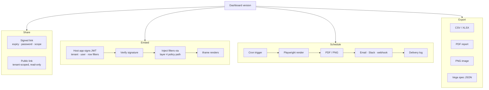

## Files

```
packages/publish/
├── share.py       Signed links, expiry, optional password, revocation
├── embed.py       JWT verification, filter extraction, scope enforcement
├── render.py      Playwright headless rendering; one renderer for all outputs
├── export.py      CSV, XLSX, PDF, PNG, raw spec
├── schedule.py    Cron definitions, timezone handling, delivery
└── deliver/
    ├── email.py
    ├── slack.py
    └── webhook.py
```

## Data model

```sql
create table shares (
    id uuid primary key default gen_random_uuid(),
    dashboard_version_id uuid not null references dashboard_versions(id) on delete cascade,
    token text not null unique,
    kind text not null,                      -- link | public | embed
    password_hash text, expires_at timestamptz,
    row_filters jsonb,                       -- scope pinned at share time
    revoked_at timestamptz,
    created_by uuid, created_at timestamptz not null default now()
);

create table embed_configs (
    id uuid primary key default gen_random_uuid(),
    tenant_id uuid not null,
    name text not null,
    public_key text not null,                -- host app's signing key
    allowed_origins text[] not null,
    created_at timestamptz not null default now()
);

create table schedules (
    id uuid primary key default gen_random_uuid(),
    dashboard_version_id uuid not null references dashboard_versions(id) on delete cascade,
    cron text not null, timezone text not null default 'UTC',
    format text not null,                    -- pdf | png | xlsx
    recipients jsonb not null,
    row_filters jsonb,
    enabled boolean not null default true,
    last_run_at timestamptz, next_run_at timestamptz
);

create table deliveries (
    id uuid primary key default gen_random_uuid(),
    schedule_id uuid not null references schedules(id) on delete cascade,
    status text not null, artifact_uri text, error text,
    duration_ms int, created_at timestamptz not null default now()
);
```

## Stack

| Tool | Licence | Why |
|---|---|---|
| **Playwright** | Apache 2.0 | One headless renderer for PNG, PDF, and email. Renders exactly what users see |
| **PyJWT** | MIT | Embed token verification |
| **XlsxWriter** | BSD | Excel exports with formatting |
| **WeasyPrint** or **Typst** | BSD / Apache 2.0 | Multi-page PDF reports with headers and pagination |
| **ARQ cron** | MIT | Scheduling in v1; move to Temporal if delivery guarantees tighten |

## Milestones

| # | Deliverable | Est. |
|---|---|---|
| M7.1 | Signed share links + expiry + revocation | 2 d |
| M7.2 | Embed JWT verification + filter injection | 3 d |
| M7.3 | Playwright render service | 3 d |
| M7.4 | CSV / XLSX / PDF exports | 3 d |
| M7.5 | Schedules + email delivery + delivery log | 4 d |

---

# Layer 8 — Platform Core

**Purpose:** who can do what, and is anything on fire.

## Key decisions

⚠ **D8.1 — Relationship-based authorization (OpenFGA), not role strings.** The object model is
naturally relational: folders contain dashboards, dashboards have viewers and editors,
connections belong to workspaces. Role enums collapse under that within months.

⚠ **D8.2 — Row-level security is enforced in the query AST, never in the application layer.**
Post-filtering results leaks row counts, aggregates, and existence. Predicates go into the
`WHERE` clause via layer 4's policy injection, before execution.

⚠ **D8.3 — Shared database with `tenant_id`, plus enforced session context.** Simpler than
schema-per-tenant and adequate with disciplined query construction. Revisit only if a
compliance requirement forces physical separation.

⚠ **D8.4 — Trace the agent from day one.** Layer 4 without per-node tracing is undebuggable.
Langfuse plus OpenTelemetry, installed in layer 1 so instrumentation is never retrofitted.

## Diagram

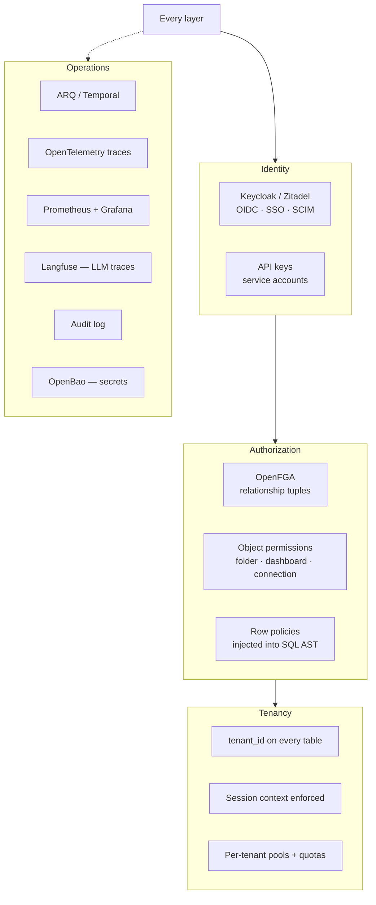

## Files

```
packages/platform/
├── auth.py         OIDC verification, session handling, API keys
├── authz.py        OpenFGA client; check() and expand() helpers
├── tenancy.py      Tenant context propagation; session-scoped enforcement
├── quotas.py       Per-tenant limits: queries, tokens, storage, concurrency
├── audit.py        Append-only audit trail
├── ratelimit.py    Per-tenant and per-user throttling
├── telemetry.py    OpenTelemetry setup, trace propagation
└── health.py       Liveness, readiness, dependency checks
```

## Data model

```sql
create table tenants (
    id uuid primary key default gen_random_uuid(),
    name text not null, plan text not null default 'free',
    settings jsonb not null default '{}',
    created_at timestamptz not null default now()
);

create table users (
    id uuid primary key default gen_random_uuid(),
    tenant_id uuid not null references tenants(id) on delete cascade,
    external_id text not null,               -- OIDC subject
    email text not null, display_name text,
    locale text not null default 'en',       -- en | ar
    created_at timestamptz not null default now(),
    unique (tenant_id, external_id)
);

create table audit_log (
    id bigserial primary key,
    tenant_id uuid not null, actor_id uuid,
    action text not null,                    -- connection.create | query.execute | share.create
    resource_type text not null, resource_id uuid,
    detail jsonb, ip inet, user_agent text,
    created_at timestamptz not null default now()
);

create table quotas (
    tenant_id uuid primary key references tenants(id) on delete cascade,
    max_connections int, max_queries_per_day int,
    max_tokens_per_day bigint, max_storage_gb int,
    max_concurrent_queries int not null default 5
);
```

`audit_log` is append-only with no update or delete grants. It will be the first thing an
enterprise security review asks for.

## Stack

| Tool | Licence | Why |
|---|---|---|
| **Keycloak** or **Zitadel** | Apache 2.0 | OIDC, SSO, SCIM. Zitadel is lighter; Keycloak more widely deployed |
| **OpenFGA** | Apache 2.0 | Relationship-based authorization; Zanzibar model |
| **OpenTelemetry** | Apache 2.0 | Traces, metrics, logs — one standard |
| **Prometheus + Grafana** | Apache 2.0 / AGPL | Metrics and dashboards. Grafana is AGPL — deploy alongside, do not embed |
| **Loki** | AGPL | Log aggregation, same caveat |
| **Langfuse** | MIT (core) | LLM-specific tracing: prompts, tokens, cost, per-node latency |
| **OpenBao** | Apache 2.0 | Secrets. The Apache-licensed Vault fork |
| **GlitchTip** | MIT | Error tracking; Sentry-compatible without Sentry's licence |

## Milestones

| # | Deliverable | Est. |
|---|---|---|
| M8.1 | OIDC auth + session + API keys | 3 d |
| M8.2 | Tenancy context + enforced scoping | 3 d |
| M8.3 | OpenFGA model + permission checks | 4 d |
| M8.4 | Audit log + retention | 2 d |
| M8.5 | OpenTelemetry + Prometheus + Langfuse wiring | 3 d |
| M8.6 | Quotas + rate limiting | 2 d |

---

## Full repository structure

```
data-platform/
├── ARCHITECTURE.md
├── docker-compose.yml
├── pyproject.toml
├── alembic.ini
├── .env.example
│
├── apps/
│   ├── api/
│   │   ├── main.py  config.py  deps.py  errors.py
│   │   └── routers/
│   │       ├── connections.py  objects.py  metadata.py  relationships.py
│   │       ├── semantic.py  metrics.py  glossary.py
│   │       ├── chat.py  agent.py  feedback.py
│   │       ├── query.py  analysis.py
│   │       ├── dashboards.py  widgets.py
│   │       ├── shares.py  schedules.py  exports.py
│   │       └── admin.py
│   └── web/src/
│       ├── pages/
│       │   ├── Connections.tsx  ConnectionWizard.tsx  SchemaBrowser.tsx
│       │   ├── ReviewGraph.tsx  ReviewColumns.tsx  Glossary.tsx  Metrics.tsx
│       │   ├── Chat.tsx  DashboardView.tsx  DashboardEdit.tsx
│       │   └── Shares.tsx  Schedules.tsx  Admin.tsx
│       ├── dashboard/    Canvas · Widget · VegaChart · DataGrid · GeoMap · Filters
│       ├── api/          client · arrow · hooks
│       └── components/ui/
│
├── packages/
│   ├── core/         types · models · schemas · errors
│   ├── drivers/      base · registry · types_map · postgres · mysql · files · objectstore
│   ├── metadata/     introspect · profile · sample · cache · infer_keys · infer_semantic · drift
│   ├── safety/       sqlguard · limits · pii
│   ├── crypto/       envelope
│   ├── engine/       router · planner · cost · governor · cache · materialize · executors/
│   ├── semantic/     model · draft · glossary · metrics · joins · policies · retrieve · embed · feedback
│   ├── agent/        graph · state · nodes/ · policy · prompts/ · llm · memory · tracing
│   ├── analysis/     contract · describe · correlate · forecast · anomaly · segment · compare · registry
│   ├── sandbox/      runner · policy · image/ · audit
│   ├── viz/          shape · recommend · spec · validate · theme · dashboard
│   ├── publish/      share · embed · render · export · schedule · deliver/
│   └── platform/     auth · authz · tenancy · quotas · audit · ratelimit · telemetry · health
│
├── workers/
│   ├── worker.py
│   └── tasks/  sync_connection · profile_object · infer_relationships
│                · refresh_materialization · run_schedule · reembed_semantic
│
├── evals/        golden/ · datasets/ · run_eval.py · report.py
├── migrations/versions/
├── tests/
└── docker/       api · worker · web · sandbox
```

---

## Deployment topology

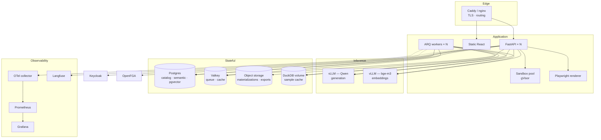

**Minimum viable deployment:** one machine with a GPU. `docker compose` brings up api, worker,
web, postgres, valkey, vllm. Everything else is additive.

---

## Consolidated tool index

| Tool | Licence | Layers | Role |
|---|---|---|---|
| FastAPI | MIT | all | HTTP API |
| Pydantic v2 | MIT | all | Boundary validation |
| SQLAlchemy 2.0 | MIT | 1, 2, 8 | ORM + cross-dialect introspection |
| Alembic | MIT | all | Migrations |
| **DuckDB** | MIT | 1, 2, 5 | Cache, files, object store, local engine |
| **sqlglot** | MIT | 1, 2, 3, 4 | Parsing, validation, policy injection, normalization |
| **PyArrow** | Apache 2.0 | 1–6 | Universal type system |
| ConnectorX | MIT | 1, 2 | Fast DB → Arrow |
| python-calamine | MIT | 1 | Excel cell grids |
| Ibis | Apache 2.0 | 2 | Multi-backend expressions |
| pgvector | PostgreSQL | 3 | Embedding search |
| NetworkX | BSD | 3 | Join-path resolution |
| **LangGraph** | MIT | 4 | Agent state machine |
| **vLLM** | Apache 2.0 | 3, 4 | Self-hosted inference |
| XGrammar / Outlines | Apache 2.0 | 4 | Constrained decoding |
| **Langfuse** | MIT (core) | 4, 8 | LLM tracing |
| promptfoo / Ragas | MIT / Apache 2.0 | 4 | Prompt regression tests |
| statsmodels / scipy | BSD | 5 | Statistics |
| StatsForecast | Apache 2.0 | 5 | Forecasting |
| PyOD | BSD | 5 | Anomaly detection |
| gVisor | Apache 2.0 | 5 | Code sandbox |
| **Vega-Lite** | BSD-3 | 6 | Chart grammar |
| ECharts | Apache 2.0 | 6 | Fallback charts |
| react-grid-layout | MIT | 6 | Dashboard canvas |
| Perspective | Apache 2.0 | 6 | Large grids |
| MapLibre / deck.gl | BSD / MIT | 6 | Geospatial |
| React Flow | MIT | 1, 3 | Join-graph review |
| Playwright | Apache 2.0 | 7 | Server-side rendering |
| PyJWT | MIT | 7 | Embed tokens |
| XlsxWriter | BSD | 7 | Excel export |
| Keycloak / Zitadel | Apache 2.0 | 8 | Identity |
| **OpenFGA** | Apache 2.0 | 8 | Authorization |
| OpenTelemetry | Apache 2.0 | 8 | Tracing |
| Prometheus | Apache 2.0 | 8 | Metrics |
| OpenBao | Apache 2.0 | 8 | Secrets |
| ARQ | MIT | all | Background jobs |
| Valkey | BSD | 2, 8 | Queue + cache |
| cryptography | Apache 2.0 | 1, 8 | Envelope encryption |

## Licence register

Every dependency above is permissive (MIT, BSD, Apache 2.0, PostgreSQL, MPL) and safe to build a
commercial product on. Deliberate exceptions, isolated at the deployment boundary:

| Component | Licence | Handling |
|---|---|---|
| Grafana | AGPL | Deployed as a separate service. Never linked or embedded |
| Loki | AGPL | Same |
| psycopg | LGPL | Dynamically linked; no source obligation |

**Avoided entirely:** WrenAI (AGPL), Metabase (AGPL), MinIO (AGPL), Redis (RSALv2/SSPL — use
Valkey), Airbyte platform (ELv2), CloudQuery (source-available), DragonflyDB (BSL).

Study AGPL projects for design. Do not copy their code.

---

## Delivery roadmap

### Phase 1 — Prove the hard part (6–8 weeks)

Layers 1, 2 (minimal), 3, 4. One connection type — Postgres. No dashboards. Output is a chat
answer plus a table.

**Success criterion:** on a schema the system has never seen, after ten minutes of human
confirmation, execution accuracy above 85% on aggregate-with-one-join questions.

If this fails, no amount of dashboard polish saves the product. If it succeeds, everything
after is known engineering.

### Phase 2 — Make it a product (6–8 weeks)

Layers 5, 6. Charts, dashboards, filters, versioning. File and object-store connectors.
Analysis tools.

### Phase 3 — Make it shareable (4 weeks)

Layer 7. Links, embeds, schedules, exports.

### Phase 4 — Make it sellable (4–6 weeks)

Layer 8 fully. SSO, OpenFGA, audit, quotas, observability. Additional connectors via dlt.

**Total: roughly 5–6 months to a sellable v1** at a steady pace, assuming the Phase 1 accuracy
gate is met on the first or second attempt.

---

## Open decisions

Numbered so we can resolve them one at a time.

| # | Question | Blocks | Impact |
|---|---|---|---|
| **1** | **Who owns the connection?** Customer-hosted databases, or user-uploaded files on your infrastructure? | Layer 1 | Customer-hosted makes egress control, per-tenant pooling, and PII policy mandatory. Uploads-only collapses half of layer 1 and ships far sooner |
| **2** | **Is CDC in scope?** | Layer 1 | Roughly 3× the ingestion engineering. Nightly metadata sync plus live queries covers most analytics |
| **3** | **Maximum source size for v1** | Layer 2 | Sets whether DuckDB alone suffices or Trino is needed |
| **4** | **May sample data reach the LLM?** | Layers 1, 3, 4 | Even self-hosted this needs a written policy and audit trail. Some customers will forbid it — design a metadata-only fallback |
| **5** | **Multi-tenant isolation model** | Layer 8 | Shared `tenant_id` vs schema-per-tenant. Changes every query in the codebase |
| **6** | **Which Qwen size, and what is the latency budget?** | Layer 4 | Drives GPU sizing, whether generation and embedding share a GPU, and whether multi-step planning is affordable |
| **7** | **Arabic as a first-class query language?** | Layers 3, 4 | Affects embedding model choice, glossary design, and evaluation set construction |
| **8** | **Is the primary v1 surface chat, or dashboards?** | Layers 4, 6 | They share a query engine and almost nothing else. Picking one halves Phase 1 |

Questions 1 and 8 change the most. Everything else can be deferred a few weeks.

---

## Changelog

| Date | Change |
|---|---|
| 2026-08-24 | Layer 1 specified in full |
| 2026-08-24 | Layers 2–8 designed; diagrams, stacks, data models, roadmap added |
