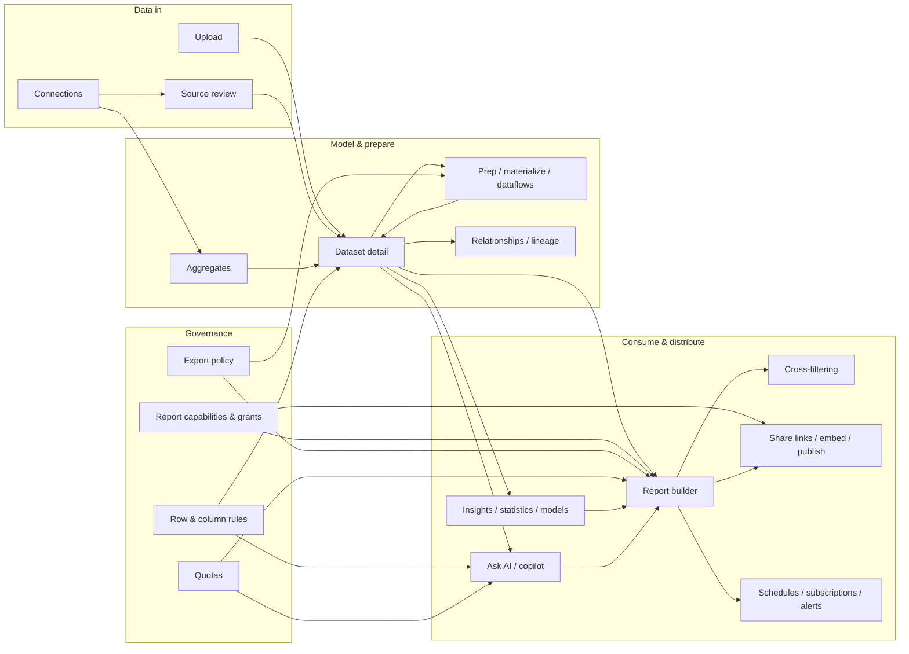
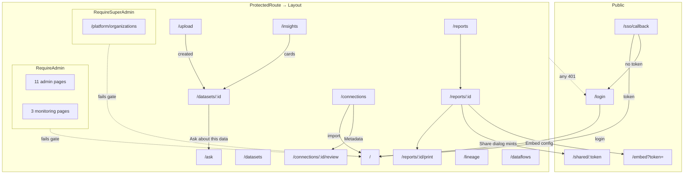
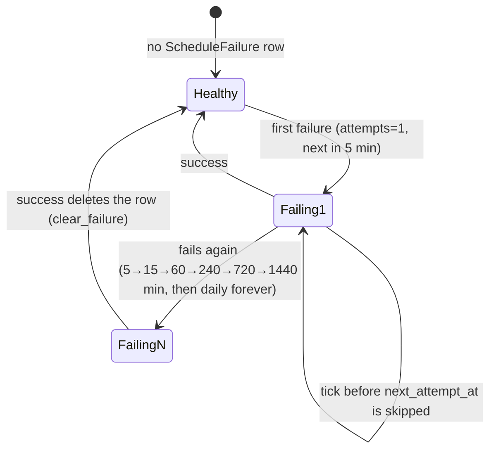
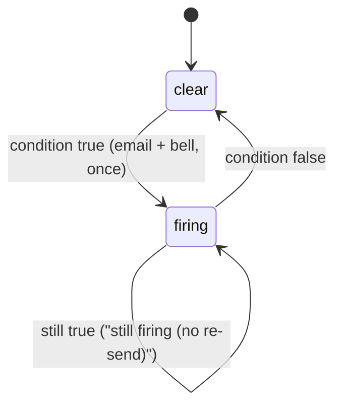
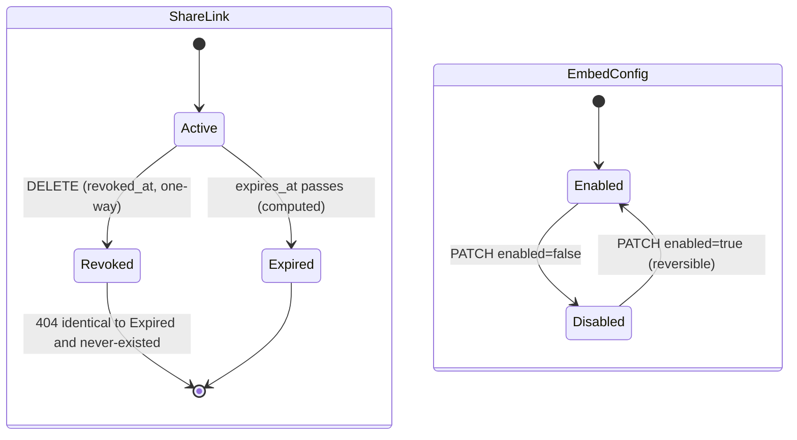

# Datalytics — Application Analysis for a UI/UX Redesign

**Date:** 2026-09-13
**Status:** analysis only. No code was modified. No is proposed here.
**Method:** the whole codebase was surveyed read-only (frontend `frontend/src`, backend `backend/app`, models, migrations, tests, the four narrative docs, the seeded-identity spreadsheet). Every claim carries one of three tags:

- **Confirmed** — read directly in the code, with a `file:line` reference.
- **Inferred** — strongly implied by structure or naming, not executed.
- **UNKNOWN — NEEDS VERIFICATION** — not established either way.

Where two sources disagree, `ARCHITECTURE.md` outranks `README.md` (the README is stale, see §1.4), and the code outranks both. Nine detailed survey reports sit behind this document; their findings are folded in here and the raw reports are kept in the analysis workspace for line-level detail.

---

## Table of contents

1. Application Overview
2. Business Model
3. User Personas
4. User Roles and Identity Classes
5. Core Features and the Feature Dependency Map
6. User Journeys
7. Screen Inventory
8. Navigation Architecture
9. API Architecture
10. Data Model
11. State Machines
12. Permissions Matrix
13. Forms and Validation
14. Business Rules
15. Critical UI Elements
16. Hidden Dependencies
17. Analytics and Tracking
18. Existing UX Problems (separated from Business Constraints)
19. Safety Contract (Do-Not-Change / Change-With-Care / Safe-To-Change)
20. Impact Analysis (Risk Map)
21. Regression Test Plan
22. Recommended Strategy
23. BEFORE I THE UI

---

## 1. Application Overview

### 1.1 What it is

Datalytics is a **self-hosted, air-gap-capable business-intelligence platform with an AI analyst built in**. One organisation runs it on its own hardware. It connects to databases or accepts uploaded files, profiles and models the data, and lets people build multi-page interactive dashboards with cross-filtering, row- and column-level security, scheduled delivery, and natural-language questions answered by an agent that writes governed SQL. *(Confirmed: `ARCHITECTURE.md:1-12`, `first-stop.md:38-73`.)*

### 1.2 Shape of the system

Five containers on one Docker network: a React/Vite frontend, a FastAPI backend (which also runs the scheduler loop in-process every 60 s), PostgreSQL 16, Valkey (an optional result cache that fails soft), and a local embeddings service. An external, self-hosted OpenAI-compatible model endpoint (vLLM) is optional; with `llm_enabled=False` the platform runs with no AI at all. *(Confirmed: `ARCHITECTURE.md:64-99`, `core/config.py`.)*

Three execution paths explain most of the code *(Confirmed: `ARCHITECTURE.md:1182-1243`)*:

| Path | Data lives | Aggregation | Governance |
|---|---|---|---|
| **Import mode** | uploaded/imported file on the `uploaded_files` volume, with a Parquet sidecar | pandas over the whole frame, or DuckDB pushdown when eligible (default on) | row rule applied to the frame, then denied columns dropped |
| **DirectQuery mode** | the customer's own database (5 SQL families) | pushed into dialect-correct SQL | row rule translated into the `WHERE` clause; a denied column in the widget is refused (403) |
| **Agent mode** | sandboxed DuckDB over already-secured frames | generated SQL through a six-rung validation ladder | inherits the same RLS; object row policies injected into the parsed AST |

### 1.3 Size, for orientation *(Confirmed, test-enforced counts in `ARCHITECTURE.md`)*

| Thing | Count |
|---|---|
| Frontend pages | 32 files (17 top-level, 12 admin, 3 monitoring) behind 34 routes |
| Widget types | 67 (`WIDGET_CATALOG`, `types/report.ts`) |
| Aggregations | 24 |
| Connectors | 45 registered, 36 DirectQuery-capable |
| Backend router modules | 25 (27 `include_router` calls) |
| Database tables | 77 (29 Alembic revisions, head `0029_aggregate_datasets`) |
| Frontend API functions | 264 across 67 `*Api` objects, all in one file (`services/api.ts`) |
| Tests | ~4,600 backend across 354 modules; 2,265 frontend across 169 files |

### 1.4 Documents that already exist, and which to trust

| Document | Trust | Why |
|---|---|---|
| `ARCHITECTURE.md` / `.html` | **authoritative** | its counts are re-derived from the tree by `tests/test_architecture_doc.py`; the build fails if prose drifts |
| `first-stop.md` | orientation | honest-gaps section; some gaps have since been closed (scheduler backoff, a `SyncRun` reaper and nginx serving exist now) |
| `docs/DEMO_WALKTHROUGH.md` | intended journeys | click paths for four use cases and the workspace menu |
| `datalytics-users-and-privileges.xlsx` | seeded identities | exported from a running database on 2026-09-05 |
| `README.md`, `README2.md` | **stale** | claim 12 widget types; do not plan from them *(Confirmed: `first-stop.md:24-30`)* |

---

## 2. Business Model

Written for a Product Manager who has never seen the product.

### 2.1 Business purpose

**Problem solved.** Organisations that cannot send data to a cloud BI vendor (regulated, air-gapped, or sovereignty-bound) still need dashboards, governed self-service analysis and, increasingly, a conversational analyst. Datalytics gives them a SAS-Visual-Analytics-class toolset that runs entirely inside their network. *(Inferred from `first-stop.md:38-56` and the recurring SAS comparisons in `ARCHITECTURE.md` and `docs/superpowers/specs/`.)*

**Core value proposition.** Three things the code goes out of its way to guarantee:

1. **Governance sits in the query path, not on top of it.** Row security, column security, capability levels, export policy and quotas are applied by every engine, including the AI. There is no path that returns a row the viewer may not see. *(Confirmed: `core/rls.py`, `services/agent/policy.py`, `ARCHITECTURE.md:1159-1180`.)*
2. **Nothing phones home.** Models, maps, fonts and drivers ship inside the images. *(Confirmed: `ARCHITECTURE.md:1747-1757`.)*
3. **Arabic and right-to-left are first-class**, end to end, including server-rendered PDFs. *(Confirmed: `contexts/DirectionContext.tsx`, `services/rtl_text.py`.)*

**Main business goals** *(Inferred from the roadmap specs and comparison documents)*: reach feature parity with SAS Visual Analytics on an evaluator's feature matrix, differentiate on the governed AI analyst and RTL, and stay deployable as `docker save` bundles.

**Main user goals**: get trustworthy numbers from their own data quickly; build and share dashboards without IT; ask questions in plain language; be sure that what they share shows each recipient only what that recipient is allowed to see.

### 2.2 Tenancy and commercial shape

- **Organisation = tenant.** Users, datasets, connections, dashboards never mix across organisations; every cross-tenant access answers 404, never 403. *(Confirmed: `core/org_scope.py`.)*
- **No self-signup, no billing, no subscriptions, no payments.** A platform super-admin creates organisations and their first admin; org admins create users. *(Confirmed: `routers/platform.py`, `routers/admin.py`; absence of any `/register`/payment route.)*
- **Quotas per organisation** (daily queries, daily agent asks, storage MB, concurrent asks) are the only "commercial" limits, set by the platform admin, `NULL` = unlimited. *(Confirmed: `services/quotas.py`, `models.Quota`.)*
- **Organisation hierarchy** exists (`org_parents`) but is structural only; it grants no data access. *(Confirmed: `models/models.py:939-949`.)*

### 2.3 Where the product currently stands

The SAS-parity plan is essentially built out: calculated context measures, automated explanation, goal seek, alerts UI, analysis registry with an agent that can invoke analyses, boundary sets for sub-national maps, decision trees, automated prediction with a model store, text topics, custom categories, aggregate datasets, an error contract and index advice. Known remaining gaps are recorded in the spec follow-up lists rather than hidden. *(Confirmed: this session's survey of `frontend/src` and `services/analysis/`.)*

---

## 3. User Personas

Personas are derived from the seeded accounts, the demo walkthrough and the capability model. They are not invented roles; each maps to a concrete identity class in §4.

| Persona | Who | Needs | Can do | Cannot do | Key screens | Key actions |
|---|---|---|---|---|---|---|
| **Analyst / dashboard author** (member with `data` capability on their own work) | e.g. `analyst@contoso.invalid` | bring data in, clean it, build dashboards, share them | upload, connect (own connections), prep pipelines, calculated columns and measures, build and publish dashboards, share links, subscribe, ask AI, run statistics, train models | manage users/roles/rules, set export policy, see other people's private datasets unless shared or reachable through a dashboard | Home, Datasets, Upload, Dataset detail, Dashboards, Report builder, Ask AI, Insights | build a widget, cross-filter, publish, create a share link |
| **Restricted viewer** (member with `view` capability and an RLS/column rule) | `demo-emea@example.invalid`: EMEA rows only, `cost` hidden | consume dashboards, filter, drill, bookmark, subscribe to a copy | open published or granted dashboards, cross-filter, subscribe (their own slice), ask AI within the same rules | edit, export where policy forbids, see hidden columns or rows | Home, Dashboards, Report builder in view mode, Ask AI | filter, bookmark, subscribe |
| **Data engineer / connection owner** | the person who added a connection | connect databases, review inferred metadata, run syncs, set up aggregates and dataflows | Connections (own), Source review, aggregates, dataflows (own grants), refresh schedules | administer connections they did not create *in the UI* (the API would allow a creator; the UI hides it — §18) | Connections, Source review, Dataset detail (Aggregates tab), Dataflows, Lineage | run sync, confirm relationships, create aggregate |
| **Org admin** (`Role.is_org_admin`) | `admin@contoso.invalid` | govern the tenant | everything a member can, plus users, roles, org chart, row and column rules, export policy, SSO, custom connectors, audit, monitoring; bypasses RLS and column rules | platform pages (unless also on the super-admin allowlist) | Admin section, Monitoring section | write a row rule, deactivate a user, review the audit trail |
| **Platform super-admin** (email allowlist, not a role) | `admin@datalytics.local` | run the multi-tenant installation | create organisations and their first admin, set quotas, parent orgs, toggle MCP/API-key access per org | org administration of other orgs (super-admin does not imply org-admin) | Platform → Organizations | create org, set quota |
| **Anonymous share-link recipient** | anyone with the URL | read one dashboard | view, cross-filter, switch pages, retry a throttled widget | edit, export, persist anything, navigate elsewhere | `/shared/:token` | read |
| **Embedding host application** | a third-party page with an embed config secret | show a dashboard inside its own product | render as the config's creator, with host-supplied filters that only narrow | anything interactive beyond filtering | `/embed?token=` | render |
| **Machine caller** (API key, e.g. an MCP server) | a script acting as a user | automate what that user can do | everything its issuing user can do, no more, no less (no scopes) | anything the user cannot | none (API only) | call the API |

---

## 4. User Roles and Identity Classes

The code distinguishes **18 identity classes**, not three roles. *(Confirmed: `04-auth-permissions.md`, §2, each with file:line.)* The ones a designer must keep straight:

| Class | Determined by | Where |
|---|---|---|
| Member | any `User` resolved by `get_current_user`, `role.is_org_admin = False` | `dependencies.py:54-68` |
| Org admin | `user.role.is_org_admin` | `dependencies.py:97-100` |
| Platform super-admin | email in `settings.super_admin_emails` (config, read on every call) | `dependencies.py:103-108` |
| Report capability `view < edit < data` | precedence: admin > author > per-user grant > folder grant > (published: role row or `view`) > none | `core/capability.py:148-232` |
| Dataflow grantee | `DataflowCapability`; **no rows = everyone `data`; any row = unlisted roles fall to `view`** (inverse of report capabilities) | `models.py:1937-1943` |
| Page-role visibility | `PageRoleVisibility`; no rows = everyone | `models.py:757-771` |
| Workspace folder role | **menu visibility only, not access** | `models.py:1770-1778` |
| Workspace folder grant | opens real access (`view`/`edit`, never `data`) | `models.py:1828-1846` |
| Dataset owner / share grantee | `Dataset.created_by`, `DatasetShare`, or reachable through a readable report | `core/capability.py:384-431` |
| Connection owner | `_may_administer` = org admin **or** creator | `routers/data_sources.py:65-75` |
| Workspace-node creator | `_may_manage` = org admin **or** creator; unowned nodes are admin-only | `routers/workspace.py:55-67` |
| Schedule / subscription creator | a scheduled run resolves RLS **as its creator** | `models.py:1915-1919`, `routers/reports.py:1339-1345` |
| Org-unit placement (`MYSCOPE()`) | `UserOrgUnit`, expanded down the org chart | `core/rls.py:67-113` |
| Share-link viewer | anonymous → resolves as the link's creator; an in-org signed-in viewer → resolves as themselves | `routers/shared.py:170-179` |
| Embed viewer | always the embed config's creator | `routers/embed.py:108-118` |
| API-key caller | acts as the issuing user, no scopes | `dependencies.py:35-51` |

Two facts that contradict common assumptions:

- **Admin is not a fourth capability tier.** Org admins always resolve to `data`; `none` is a resolution result that cannot be stored. *(Confirmed: `core/capability.py:1-29`.)*
- **API keys have no scopes.** *(Confirmed: `models.py:874-880`.)*

Authentication facts a must not disturb *(Confirmed: `routers/auth.py`, `core/security.py`, `services/api.ts:30-65`)*:

- One JWT, 7-day lifetime, `localStorage['datalytics_token']`, no refresh flow, no server-side revocation; logout is client-side deletion. Any 401 anywhere logs the whole session out via the Axios interceptor. 403s have no global handler.
- SSO (OIDC with PKCE, and SAML 2.0, both fully implemented) authenticates only; it never provisions a user. Token returns in the URL **fragment** (`/sso/callback#token=`), never a query string.
- No self-service password change or reset; an admin sets passwords. No password strength rule beyond non-empty.
- Login always redirects to `/`; there is no "return to where you were".

---

## 5. Core Features and the Feature Dependency Map

### 5.1 Feature catalogue (what · why · who · depends on · what depends on it · what breaks if the UI changes)

| Feature | What it does | Why it exists | Who | Depends on | Depended on by | UI-change hazard |
|---|---|---|---|---|---|---|
| **Upload** | CSV/XLSX/JSON/XML/Parquet/Access → datasets; multi-file separate-or-append | the value chain starts with data in | analyst | `POST /datasets`, `/datasets/batch`, 100 MB / 200 MB batch caps | everything | the extension regex decides which files take the one-dataset-per-table path; "stay on the page when a file fails" is a data-loss guard |
| **Connections** | live database/API sources; test, browse, import or DirectQuery | most data already lives in databases | connection owner, admin | connector registry (45), engines, net_guard | datasets, source review, Ask AI on a source | admin-only UI gate is stricter than the backend's creator rule |
| **Source review** | confirm inferred relationships, column descriptions, entities, drift, index advice | "a correct semantic model in under ten minutes" | connection admin | metadata sync (`SyncRun`), PII masking, key inference | lineage, agent context, join suggestions | high-confidence pre-selection is what makes bulk confirm safe |
| **Dataset detail** | analysis, data grid, prep pipeline, calculated columns, measures, custom categories, statistics, alerts, models, aggregates | one home for ~15 dataset-scoped capabilities | analyst | ~40 endpoints under `/datasets` | report builder, Ask AI, Insights hub | `?tab=statistics` is a bookmarked URL contract; DirectQuery gates mirror backend 400s |
| **Prep pipeline / materialize / dataflows** | transformation steps; snapshot as a new dataset; a dataflow owns a recipe and its permissions | joins and clean-ups as governed views; transformations that stay current | analyst, data engineer | prep engine, relationships, `__derived_from__` | lineage, refresh scheduler | materialize refuses governed sources; folder-style default-open grants |
| **Report builder** | design and consume dashboards: canvas, 67 widgets, properties rail, filters, parameters, bookmarks, pages, sharing, scheduling, comments, copilot | the product's centre | author, viewer | the entire `/reports` surface, widget-data | shared, embedded, print views | `canEdit`/`canData` gate; `COLS`/`ROW_H` grid constants; `WIDGET_CATALOG` |
| **Cross-filtering** | click a mark to filter the page; per-widget modes two-way/broadcast/receive/isolated; page modes manual/linked/oneway/twoway | interactive analysis without queries | viewer | `CrossFilterContext`, `config.interaction`, `mobile_layout.interaction_mode` | every report surface | five separate provider mounts; the mode string is published to public surfaces |
| **Sharing** | publish, per-user grants, share links (expiring, revocable, pinned layout), embed configs (origin allow-list) | distribution without accounts | author, admin | `ReportCapability`, `ShareLink`, `EmbedConfig` | public surfaces | identical-404 on any link failure; `geography` published instead of `column_meta` |
| **Delivery** | schedules (email, https webhooks), self-serve subscriptions, alerts (rising edge), in-app notifications | data that reaches people who never open the app | author, viewer | scheduler loop, SMTP, `Delivery` log, `ScheduleFailure` backoff | Monitoring pages | subscription = own schedule resolved as the subscriber |
| **Ask AI / copilot** | conversational questions over a dataset or a connection; a page copilot edits widgets | the differentiator | member | vLLM, agent graph, retrieval, object row policies, quotas | dashboards proposed from chat | three answer kinds must never blur; dataset rules do **not** apply to a connection scope, connection rules do |
| **Insights & statistics** | insight scan, anomalies, key influencers, patterns, segments, eight inferential tests, explain, goal seek, prediction models | analysis without a statistician | analyst | analysis registry, scipy/statsmodels/sklearn | Insights hub, pins | row floors; DirectQuery excluded; anchors are a cross-file contract |
| **Aggregates** | scheduled GROUP BY over a DirectQuery source saved as a governed import dataset | dashboards on 100M-row tables | data engineer | `services/aggregates.py`, scheduler, RLS redirect | dashboards on the aggregate | grain must cover RLS columns; Rebuild only for "query changed" |
| **Governance admin** | users, roles, org chart, row rules, column rules, connection row policies, export policy, SSO, custom connectors, API keys, audit | the platform's reason to exist | org admin | `/admin/*`, `require_org_admin` | every data read | banner "these rules do not apply to Ask AI" traces to a real leak |
| **Monitoring** | jobs, deliveries, activity | "did last night's refresh work?" | org admin | `ScheduleFailure`, `Delivery`, `AuditLogEntry` | none | status colouring is substring-based |
| **Platform** | organisations, parents, quotas, MCP toggle | multi-tenant operations | super-admin | `/platform/*` | everything | blank quota = unlimited |
| **Workspace tree** | folders, filing, role visibility, folder grants, publish-by-folder | organised navigation and a sharing instrument | everyone; admins tidy | `workspace_nodes`, grants | Layout rail | visibility ≠ access; delete re-parents, never deletes reports |
| **Localisation** | English/Arabic chrome (170 keys), app-wide direction, mirrored charts, Arabic PDF shaping | Arabic-first customers | everyone | `DirectionContext`, `rtl_text.py` | every screen | `widgetIsRtl` semantics; `svg.recharts-surface { direction: ltr }` |

### 5.2 Feature dependency map



---

## 6. User Journeys

Each journey lists entry, goal, action, system response, backend action, next screen, success and error states, alternatives, permissions and data. *(All routes and calls Confirmed in `01-routes-navigation.md` and `02-api-inventory.md`.)*

### 6.1 Sign in

```mermaid
flowchart TD
  A[Open app] --> B{Token in localStorage?}
  B -- yes --> C[GET /auth/me]
  C -- 200 --> H[Home /]
  C -- 401 --> L[/login]
  B -- no --> L
  L --> D{Password or SSO?}
  D -- password --> E[POST /auth/login]
  E -- 200 --> C
  E -- 401 --> T[toast: Invalid email or password]
  D -- SSO --> F[POST /auth/sso/discover]
  F -- sso true --> G[full-page redirect to IdP]
  G --> S[/sso/callback#token=]
  S -- token --> R[window.location.replace('/')]
  S -- no token --> L2[/login?sso_error=missing_token]
  F -- sso false --> T2[toast: SSO not configured]
```

- Inactive user, unknown email and wrong password are indistinguishable by design (timing and message). *(Confirmed: `routers/auth.py:16-36`.)*
- Permissions: none. Data: email, password; token stored client-side only.

### 6.2 Bring data in and understand it

```mermaid
flowchart TD
  U[/upload] --> P{How many files?}
  P -- one ordinary --> S1[POST /datasets multipart]
  P -- several, or any .mdb/.accdb --> S2[POST /datasets/batch mode=separate|append]
  S1 -- 201 --> DD[/datasets/:id]
  S2 -- all ok, one dataset --> DD
  S2 -- all ok, many --> DL[/datasets]
  S2 -- any failure --> STAY[stay on /upload, list failures]
  DD --> AN[Run analysis POST /datasets/:id/analysis]
  DD --> DATA[Data tab: filters, prep, calc columns, measures]
  DD --> ST[Analysis tab ?tab=statistics]
  DD --> ASK[/ask?dataset=:id]
```

- Error states: 413 over the batch size limit; per-file errors listed inline; `refresh_warning` toast when an incremental refresh fell back to full.
- Alternative path: Connections → Browse → Import or Create DirectQuery dataset → currently redirects to `/` (Home), not to the new dataset (inconsistent with Upload; see §18).
- Permissions: any member may upload. Data: file bytes, name, description, mode.

### 6.3 Build and share a dashboard

```mermaid
flowchart TD
  R[/reports] --> N[+ New dashboard: name, description, dataset]
  N --> C[POST /reports]
  C --> R2[card prepended, user clicks Open designer]
  R2 --> B[/reports/:id edit mode]
  B --> W[Insert widget from WIDGET_CATALOG → POST widgets]
  W --> CFG[Properties rail: Fields, Data & aggregation, Filters, Sort, Formatting, Appearance, Actions, Display rules, Interactions]
  CFG --> WD[POST /datasets/:id/widget-data per widget]
  WD -- 200 rows --> DRAW[chart drawn]
  WD -- 200 type=error --> EMPTY[EmptyState with message]
  WD -- 413 row_cap / 403 forbidden_column --> EMPTY
  WD -- 502 source_unavailable / 429 quota --> RETRY[EmptyState + Try again]
  B --> PUB[Publish POST /reports/:id/publish]
  B --> SL[Share → share link / embed config]
  B --> SUB[Subscribe / Schedule]
  B --> PDF[GET /reports/:id/pdf]
  B --> PRINT[/reports/:id/print → browser print or PPTX]
```

- Every edit autosaves; there is no Save button and no unsaved-changes prompt. A stale-revision banner warns (never blocks) when someone else saved. *(Confirmed: `ReportBuilder.tsx:605-611`.)*
- Permissions: create needs membership; edit needs `edit`; the Data/Model tabs need `data`; Access dialog needs org admin.

### 6.4 Consume as a restricted viewer

1. Open a published dashboard from Home, the workspace tree or a grant → `GET /reports/:id` returns only the pages the viewer's role may see; `my_capability: 'view'` hides the whole left rail and toolbar.
2. Click a bar → `CrossFilterContext` emits a filter; every receiving widget refetches; the filter bar shows a chip with a clear button.
3. Widgets return only rows that pass the role's row rule; denied columns are absent from the projection, not blanked.
4. Subscribe → `POST /reports/:id/subscribe` creates a schedule owned by the viewer, so the emailed copy is their own slice.
5. Ask AI about the same dataset → generated SQL inherits the same rule. Ask AI about a **connection** obeys connection row policies instead (§14).

### 6.5 Govern the tenant (org admin)

Admin → Roles (create) → Users (create, assign role) → Organization chart (place users; `MYSCOPE()`) → Row security (rule per role+dataset; quick setup; auto-generate; overlap notice) → Column security (delete-and-recreate; no edit) → Connection rules (Ask AI) → Export policy (per dataset, per format, auto-private) → Audit trail. Every step is `require_org_admin` on the server; the frontend `RequireAdmin` guard is a convenience only. *(Confirmed: `08-screens-admin-public.md`.)*

### 6.6 Operate (platform super-admin)

Platform → Organizations: create org with first admin → set parent (structural) → toggle MCP/API-key access → set quotas (blank = unlimited). *(Confirmed: `PlatformOrgs.tsx`, `routers/platform.py`.)*

### 6.7 Read a shared link (anonymous)

`/shared/:token` → `GET /shared/{token}` (404 identically for missing, revoked, expired, cross-org) → per-widget `POST /shared/{token}/widget-data/{widgetId}` resolved as the creator (or as the viewer if they are signed in to the same org) → page tabs, cross-filter (ephemeral), filter bar, retry on throttle. No export, no persistence, no navigation. *(Confirmed: `routers/shared.py`, `SharedReport.tsx`.)*

---

## 7. Screen Inventory

Legend for **UI change risk**: 🟢 safe to change · 🟡 change with care · 🔴 business/technically critical. Full per-element detail is in `07-screens-core.md` and `08-screens-admin-public.md`; this table is the consolidated inventory.

| # | Screen | Route | Roles | Purpose | Primary CTA | Data displayed | Data modified | States (loading / empty / error) | Riskiest elements |
|---|---|---|---|---|---|---|---|---|---|
| 1 | Login | `/login` | public | password or SSO sign-in | Sign in → `authApi.login` | — | token | busy labels; all errors are toasts; 8 SSO error codes mapped | 🟡 SSO error-code table; 🟡 `window.location.replace` when already signed in |
| 2 | SSO callback | `/sso/callback` | public | read `#token=`, re-bootstrap | automatic | — | token | whole screen is the loading state | 🔴 fragment regex (token never in a query string) |
| 3 | Home | `/` | member | resume work: pins, recents, my dashboards, datasets, explore | New dashboard → `/reports` | reports, datasets, recents, pins | none | plain loading text; `LoadError` full page; pins error as separate alert; per-section empties | 🔴 keep the `loadError` branch; 🟡 DirectQuery "Live" chip means "row count unknown", not 0 |
| 4 | Datasets (`Dashboard.tsx`) | `/datasets` | member | dataset inventory + personal pinned tiles | + Upload | datasets, pins, per-pin widget data | delete dataset, seed demo, pin reorder/resize/unpin | text loading; `LoadError`; empty with two CTAs; no-match | 🟡 pin `position`/`size` contract; 🔴 `ltr()` bidi wrapper on byte sizes; 🟡 confirm-only-when-non-empty demo load |
| 5 | Upload | `/upload` | member | files → datasets | Upload | — | upload / batch | `LoadingState` with operation name; inline failure list | 🔴 `ACCEPT`/`ACCESS_RE`; 🔴 no navigation on failure; 🟡 name-suffix preview must match server |
| 6 | Dataset detail | `/datasets/:id` (`?tab=`, `#anchor`) | member; Share is admin-only | per-dataset workspace, six tabs: Overview, Data, Analysis (`statistics`), Alerts, Models, Aggregates | Run analysis / Apply | dataset, analysis, preview, insights, influencers, rules, segments, registry | refresh, schedule, filter, prep (wholesale), pins, panels' writes | `LoadError`/`LoadingState` page; per-section busy/error; file-not-found recovery panel | 🔴 tab key `statistics` is a URL contract; 🔴 10+ `mode === 'directquery'` gates mirror backend 400s; 🔴 `mergeCellEdit` writes the whole pipeline; 🟡 auto-run-once refs; 🟡 back link says Datasets but goes to `/` |
| 7 | Dashboards (`Reports.tsx`) | `/reports` | member | list, create, publish, share-to-person, delete | + New dashboard | reports, datasets, grants | create/delete/publish/grants | text loading; `LoadError`; empty; no-match | 🔴 `canEdit`/`canAdminister` mirror server rules; 🟡 mine/granted grouping; 🔴 `<option value>` for grant levels |
| 8 | Report builder | `/reports/:id` (`?page=`, `?widget=`, `p.<name>=`) | member; edit needs `edit`, Data/Model tabs need `data`, Access needs admin | design and consumption | Edit mode toggle | report, datasets, measures, relationships, hierarchies, templates, themes, schedules… + one widget-data call per widget | everything under `/reports/{id}` | `LoadError`; "Loading…"; stale-revision banner | 🔴 `myCapability`/`canEdit`/`canData`; 🔴 `WIDGET_CATALOG`-driven palette; 🔴 `COLS`/`ROW_H`/`GAP` grid; 🔴 primary/overflow panel split; 🟡 Present forces view mode; 🟡 header `flexWrap` (1366×850 bug) |
| 9 | Print | `/reports/:id/print` | member (own RLS) | linear print layout; browser PDF; client PPTX | Print / Save as PDF | report, dataset formats | none | `LoadingState`; `LoadError`; no empty-pages state | 🟡 fixed 1050 px grid; 🟡 identity is the printing user, not the author; PPTX has no export-policy check (§14) |
| 10 | Connections | `/connections` | member (read); admin for actions | manage sources; test, browse, query builder, import | + New connection | sources, connector catalog | create/update/delete/test/import | text loading; `LoadError` with `window.location.reload`; empty; no-match | 🔴 frontend `is_org_admin` gate vs backend admin-or-creator; 🟡 import redirects to `/`; 🔴 `show_if` and custom-connector empty-string stripping |
| 11 | Source review | `/connections/:id/review` | any member by URL (only admins see the link) | confirm inferred metadata; sync; drift; index advice | Run sync | review queue, latest sync, entities, drift, advice | confirm relationships/columns/objects/entities, settings | `LoadError`; `LoadingState`; per-tab errors; "nothing awaiting review" | 🔴 high-confidence pre-selection; 🟡 route not `RequireAdmin`-wrapped (UNKNOWN backend gate); 🔴 "grouped columns excluded" rule; 🟡 no way to add enum labels from scratch |
| 12 | Ask AI | `/ask` (`?dataset=`, `?source=`) | member | conversational analysis | Send → `agentApi.ask` | datasets, sources, conversations, messages | conversations, feedback | inline error bubble; Pending bubble; empty states differ by "no data" vs "no scope" | 🔴 three answer kinds `ok/needs_clarification/failed`; 🔴 `matchesTarget` order-insensitive ids; 🟡 `loadSeq` guard (StrictMode); 🟡 `d:`/`s:` scope encoding |
| 13 | Insights hub | `/insights` | member | front door to six analyses; live top insights | pick a dataset | datasets, shared insight scan | none | `LoadingState`/`LoadError`/`EmptyState`; DirectQuery cards `aria-disabled` | 🔴 anchor suffixes are a cross-file contract with Dataset detail; 🔴 `importOnly` flags mirror backend gates; 🟡 `runShared` de-dup |
| 14 | Dataflows | `/dataflows` | member; run needs `edit`, delete/permissions need `data` | recipes with own schedule and permissions | New dataflow | dataflows, datasets, roles, capabilities | create/run/remove/grants | `LoadingState`/`LoadError`; inline action error; `EmptyState` | 🔴 there is **no** dataflow editor screen (recipe lives in the source dataset's prep pipeline); 🔴 `your_capability ?? 'data'` default; 🟡 `window.prompt` for first output; 🟡 "no grants = open to everyone" |
| 15 | Lineage | `/lineage` | member | Sources → Datasets → Reports graph | click a node | lineage graph | none | `LoadError` (fixed from empty-graph bug); `LoadingState`; per-column empties | 🔴 measured DOM edge geometry (RTL fix); 🔴 ResizeObserver + rAF re-measure; 🟡 empty vs error distinction |
| 16 | Admin: Users | `/admin/users` | org admin | CRUD, bulk import | + New User | users, roles | create/update/delete/bulk | `LoadingState`; `LoadError` (not a toast, by comment); "create a role first"; empty | 🟡 CSV parser skips a header row silently; 🟡 keep `LoadError` |
| 17 | Admin: Roles | `/admin/roles` | org admin | CRUD; the `is_org_admin` bit | + New Role | roles | CRUD | standard three states | 🔴 `is_org_admin` checkbox is the whole admin/bypass surface |
| 18 | Admin: Organization chart | `/admin/org-units` | org admin | hierarchy + user placement for `MYSCOPE()` | Add top-level unit (`window.prompt`) | units, users, placements | create/remove/place | standard | 🔴 delete-cascade confirm copy (only warning that others' visible rows change); 🟡 `window.prompt` |
| 19 | Admin: Row security | `/admin/row-security-rules` | org admin | rule per role+dataset; quick setup; auto-generate; preflight overlap notice | + New Rule | rules, roles, datasets (+columns), preflight | CRUD, auto-generate | standard; auto-generate scanning/empty | 🔴 "these rules do not apply to Ask AI" banner (real leak); 🔴 overlap notice wording; 🟡 `isUserishColumn` heuristic; 🟡 role/dataset locked on edit (unique pair) |
| 20 | Admin: Connection rules (Ask AI) | `/admin/connection-rules` | org admin | row predicates per source object for the agent | Add rule | sources, roles, review objects, policies | create/remove | **no** `LoadingState`/`LoadError`/`EmptyState`; inline red text | 🔴 separate rule system from RLS; 🟡 missing shared state components; **no rail entry** (command palette only) |
| 21 | Admin: Column security | `/admin/column-security-rules` | org admin | denied columns per role+dataset | + New Rule | rules, roles, datasets | create/delete (no PATCH exists) | standard | 🔴 delete-and-recreate is intentional; 🟡 "cease to exist" copy must stay true |
| 22 | Admin: Export policy | `/admin/export-policy` | org admin | all-off / per-format / auto-private per dataset | inline checkboxes | datasets, per-dataset policy + `has_security_rules` (+ unused `inherited_from`) | set all / set granular | standard; per-dataset fetch failure silently reads as "no restriction" | 🟡 fail-open display on partial outage; 🟡 aggregates now answer 400 on set and show the source's policy |
| 23 | Admin: SSO | `/admin/sso` | org admin | OIDC or SAML config | Save | config (secret redacted) | put/delete | full-page `LoadingState`/`LoadError`; required-field toasts | 🔴 `__SECRET_UNCHANGED__` sentinel round-trip; 🟡 protocol-dependent required fields |
| 24 | Admin: Custom connectors | `/admin/custom-connectors` | org admin | presets with locked fields | + New | presets, connector catalog | CRUD | standard | 🟡 "Locked" per field decides what non-admins may override |
| 25 | Admin: Audit trail | `/admin/audit` | org admin | security-plane mutations | Apply filter | admin audit rows | none | standard | 🟡 action filter built only from loaded rows |
| 26 | Admin: API keys | `/admin/api-keys` | route admin-gated; keys are personal | create/revoke own keys | Create key | keys (prefix only) | create/revoke | standard; revoke has its own try/catch | 🔴 one-time reveal of the plaintext key; 🟡 revoke error handling; semantic mismatch route-vs-scope |
| 27 | Platform: Organizations | `/platform/organizations` | super-admin | create orgs, parents, MCP, quotas | Create organization | orgs with usage and quota | create/parent/MCP/quota | standard | 🔴 "parent is structural, not access"; 🟡 blank quota = unlimited; 🟡 MCP master switch |
| 28 | Monitoring: Refresh & jobs | `/monitoring/jobs` | org admin | all scheduled items and last status | none (links) | jobs | none | standard | 🟡 `interval()` treats 0 as on-demand; 🟡 substring status colouring |
| 29 | Monitoring: Deliveries | `/monitoring/deliveries` | org admin | delivery log | none | deliveries | none | standard | 🟢 |
| 30 | Monitoring: Activity | `/monitoring/activity` | org admin | general activity log | none | audit log | none | standard | 🟢 |
| 31 | Shared report | `/shared/:token` | public | read-only guest view | none | report (+ `geography`), per-widget data | none (server logs access) | "Loading…"; single error message for every failure; no-pages; rate-limited placeholder | 🔴 `geography` never `column_meta`; 🔴 identical-404; 🟡 `RATE_LIMITED` sentinel; 🟡 `widgets` prop on the provider |
| 32 | Embedded report | `/embed?token=` | public (host JWT) | iframe view | none | report + `embed_session_token`, per-widget data | none | missing-token, loading, invalid/expired/origin, no-pages | 🔴 session-token exchange; 🔴 no host `postMessage` exists; 🟡 empty allow-list = open |
| — | Notifications bell | in `TopBar` | member | alerts, delivery failures, comments; polled every 60 s | open = mark all read | notifications | mark-read | silent poll failure | 🟡 unread count is capped at the page size (bug, §18) |
| — | Account menu / theme / language / direction | `TopBar`, rail foot | member | identity, logout, theme, language, direction | — | — | localStorage only | — | 🟢 presentation; no profile page exists |

The widget properties panel (`WidgetConfigPanel.tsx`, 2,455 lines) is the settings rail inside screen 8. *(Confirmed this session: `WidgetConfigPanel.tsx:852-944`, `1253-2444`.)* Ten property groups route to eight tabs:

| Group (`ExpandableGroup` title) | Tab |
|---|---|
| Appearance, Formatting, Sort & limit | Options |
| Data & aggregation | Data |
| Fields | Data roles |
| Actions, Interactions | Actions |
| Display rules | Display rules |
| Filters | Filters |
| Ranking | Ranks |
| *(everything)* | All |

`settingsTabs.test.tsx` walks the rail and asserts the reachable set equals the set of groups that exist; a group added without a `TAB_OF_GROUP` entry fails the suite. Search outranks the active tab. The aggregation select's option **values** are an API contract (`countd`, not `count_distinct`); its labels are free.

---

## 8. Navigation Architecture

### 8.1 Routes *(Confirmed: `App.tsx:64-121`, `01-routes-navigation.md`)*

| Route | Page | Auth | Gate | Params | Notes |
|---|---|---|---|---|---|
| `/login` | Login | public | — | `?sso_error=` | already-signed-in → hard reload to `/` |
| `/sso/callback` | SsoCallback | public | — | `#token=` | hard reload to `/` |
| `/shared/:token` | SharedReport | public | token validity (server) | `:token` | dead end |
| `/embed` | EmbeddedReport | public | host JWT + origin allow-list (server) | `?token=` | dead end |
| `/` | Home | protected | member | — | old dataset-list root; must not 404 |
| `/datasets` | Dashboard | protected | member | — | |
| `/upload` | Upload | protected | member | — | |
| `/ask` | AskAI | protected | member | `?dataset=`, `?source=` | |
| `/insights` | InsightsHub | protected | member | — | |
| `/datasets/:id` | DatasetDetail | protected | member | `?tab=`, `#anchor` | `?tab=statistics` for the "Analysis" tab |
| `/reports` | Reports | protected | member | — | |
| `/reports/:id` | ReportBuilder | protected | member (edit by capability) | `?page=`, `?widget=`, `p.<name>=` | |
| `/dashboards`, `/dashboards/:id` | redirect aliases | protected | member | `:id` | inline `<Navigate>` |
| `/reports/:id/print` | ReportPrint | protected | member | `:id` | |
| `/connections` | Connections | protected | member (actions admin-narrowed) | — | |
| `/lineage` | Lineage | protected | member | — | |
| `/dataflows` | Dataflows | protected | member | — | |
| `/connections/:id/review` | SourceReview | protected | member (entry link admin-only) | `:id` | **not** under `RequireAdmin` |
| `/admin/users`, `/admin/roles`, `/admin/org-units`, `/admin/row-security-rules`, `/admin/connection-rules`, `/admin/column-security-rules`, `/admin/export-policy`, `/admin/api-keys`, `/admin/custom-connectors`, `/admin/sso`, `/admin/audit` | admin pages | protected | `RequireAdmin` (`user.role.is_org_admin`) → `/` | — | `/admin/connection-rules` has **no rail entry** |
| `/monitoring/jobs`, `/monitoring/deliveries`, `/monitoring/activity` | monitoring pages | protected | `RequireAdmin` | — | a rail section, not an `/admin` path |
| `/platform/organizations` | PlatformOrgs | protected | `RequireSuperAdmin` (`user.is_super_admin`) → `/` | — | |

Facts a must carry:

- **No catch-all route.** An unmatched path renders a blank main area inside the shell. *(Confirmed by absence.)*
- **Three client guards are UX only**; the server's `require_org_admin`/`require_super_admin` are the enforcement. `navigationGuards.test.ts` parses `App.tsx` and pins that every rail entry's permission equals its route guard. *(Confirmed: `components/navigationGuards.test.ts`.)*
- **No `navigate(-1)`, no `beforeunload`, no unsaved-changes prompt anywhere.** *(Confirmed by exhaustive search.)*
- **No org switcher, no footer, no profile page.** `User.organization` is singular.
- **Post-action navigation**: login → `/`; upload single → `/datasets/:id`; batch many → `/datasets`; batch with failures → stay; schema-browser import → `/` (Home); create dashboard → stays on the list; AI proposal accepted → `/reports/:id`; 401 anywhere → `/login`.
- **Deep links**: `?tab=` and `#anchor` on dataset detail (consumed by Insights hub cards), `?page=`/`?widget=` on the builder (produced by the workspace tree and "Copy link"), `?dataset=`/`?source=` on Ask AI, notification `link` strings built server-side (UNKNOWN exact shapes).
- **Modals as navigation** (state-driven, not URL): SchemaBrowser, ShareLinksDialog (mints the `/shared/` and `/embed?token=` URLs), DatasetShareDialog, FolderShareDialog, AccessDialog, ExplainDialog, OutlierDetailsDialog, CommandPalette (Ctrl+K; the only route to `/admin/connection-rules` besides a typed URL).

### 8.2 Shell *(Confirmed: `components/Layout.tsx`, `navigation.ts`, `TopBar.tsx`, `WorkspaceTree.tsx`)*

- Rail declared as data in `navigation.ts` (sections: top, Data, Data sources, Analyse (+ workspace tree), Monitoring, Admin, Platform), filtered by `visibleSections({isOrgAdmin, isSuperAdmin})`. Widths 248 px / 56 px; below 900 px it becomes a focus-trapped drawer that closes on navigation. The direction toggle is the rail's only foot control.
- Top bar: hamburger (narrow), page title from `i18n/index.ts` (two admin pages have no title entry), search button that opens the command palette, language switcher, theme toggle, notifications bell, account menu with Logout.
- Workspace tree renders only when the rail is expanded; folders → reports → pages (pages joined at read time, never stored); buckets My workspaces / Shared with me / Organisation; `can_manage` is **server-computed**.

### 8.3 Navigation graph



---

## 9. API Architecture

All 264 frontend calls go through one Axios instance in `services/api.ts`; no other file performs HTTP. *(Confirmed by repo-wide grep.)* Base URL: `VITE_API_URL`, else same-origin in production builds, else `http://localhost:8000`; every path is prefixed `/api/v1`. No default timeout. Only 401 is handled centrally. No automatic retry exists; every retry is a user's "Try again". Widget data has client-side de-duplication, a 30 s TTL cache (100 entries) and a concurrency gate of 6. *(Confirmed: `api.ts:1-65, 1476-1546`.)*

### 9.1 Business-critical APIs (CRITICAL rows from the full inventory)

| Feature | Screen | API | Method | Request | Response | Used for | What if it fails | UI depends on fields |
|---|---|---|---|---|---|---|---|---|
| Auth | Login, app boot | `/auth/login`, `/auth/me` | POST, GET | email+password | token; `User` with `role.is_org_admin`, `is_super_admin`, `organization` | session | no app | `is_org_admin`, `is_super_admin` drive every gate |
| SSO | Login, Admin SSO | `/auth/sso/discover`, `/auth/sso/{oidc\|saml}/login`, `/auth/sso/config` | POST, GET, GET/PUT/DELETE | email; config | `{sso, protocol}`; config with redacted secret | SSO | password login still works | `__SECRET_UNCHANGED__` sentinel |
| Datasets | Upload, Datasets, Detail | `/datasets`, `/datasets/batch`, `/datasets/{id}`, `/refresh`, `/refresh-schedule` | POST/GET/DELETE/PATCH | multipart; interval | `Dataset` (+`refresh_warning`, `shared`, `mode`, `aggregate_spec`) | data in | nothing to analyse | `mode`, `refresh_warning`, `shared`, `aggregate_of_dataset_id` |
| Prep | Dataset detail, builder | `/datasets/{id}/prep-steps` (GET/PUT wholesale), `/prep-preview`, `/materialize`, `/rebuild` | | steps | steps; counts; `Dataset` | transforms | reports read raw data | pipeline is written whole |
| Calc columns / measures / custom functions | Dataset detail, builder | `/calculated-columns`, `/measures`, `/custom-functions` (+`/preview`) | GET/PUT/DELETE/POST | definitions | lists; previews | modelling | widgets lose fields | names are referenced by widget configs |
| Widget data | every report surface | `/datasets/{id}/widget-data` | POST | `{config, calculated_columns, widget_type, report_id?, parameters}` | rows/columns; or `{type:'error', code, message}` | **the** render call | empty widgets | `type==='error'`, `code` (`source_unavailable`/`quota` get Retry), `detail` |
| Widget export | builder | `/datasets/{id}/widget-data/export?format=` | POST (blob) | same | file; filename from `Content-Disposition` | per-widget export | no download | `export_disabled` code |
| Reports | list, builder | `/reports`, `/reports/{id}`, `/publish`, `/pages`, `/widgets`, `/versions/{id}/restore`, `/classification`, `/common-filters` | CRUD | | `Report` with `my_capability`, `revision`, `published`, pages/widgets | authoring | no dashboards | `my_capability`, `revision`, `page_type`, `mobile_layout.interaction_mode` |
| Copilot | builder FAB | `/reports/{id}/pages/{pageId}/copilot` | POST | `{message, history?, selected_widget_id?}` | `{reply, applied, notes, results}` | AI edits | manual editing only | `applied` |
| Capabilities & grants | Reports, builder Access dialog | `/reports/{id}/capabilities`, `/grants`, `/pages/{pid}/visibility` | GET/PUT/POST/DELETE | levels; email+level; role ids | | who can do what | wrong access | `view\|edit\|data` values |
| Sharing | Share dialog, public pages | `/reports/{id}/share-links`, `/embed-configs`, `/shared/{token}`, `/shared/{token}/widget-data/{wid}`, `/embed/report`, `/embed/widget-data/{wid}` | | days+pinned; name+origins | token/secret shown once; report + `geography`; `embed_session_token` | guest access | links dead | `pinned`, `classification`, `geography`, `embed_session_token` |
| Delivery | builder Schedule panel, Subscribe button, Alerts tab | `/reports/{id}/schedules` (+`/run-now`), `/deliveries`, `/subscription`, `/subscribe`, `/datasets/{id}/alerts` | | recipients (emails or https webhooks), cadence, format | | distribution | nothing sent | subscription is a schedule with reserved recipient markers |
| Agent | Ask AI, builder ask panel | `/agent/conversations`, `/messages`, `/ask`, `/runs/{id}`, `/runs/{id}/export`, `/feedback`, `/agent/row-policies` | | question | `AgentAnswer` with `status`, `presentation`, rows, SQL | AI | "Could not reach the agent" | `status` ∈ `ok\|failed\|needs_clarification` |
| Workspace | rail tree | `/workspace/tree`, `/nodes`, `/nodes/{id}/roles`, `/grants`, `/share-options` | | | tree with `can_manage`, `my_capability`, `is_mine`, `shared_with_me` | navigation | tree renders empty (deliberately) | all flags server-computed |
| Admin | admin pages | `/admin/users` (+`/bulk`), `/roles`, `/org-units`, `/users/{id}/org-units`, `/row-security-rules` (+`/preflight`, `/rls-rules/auto-generate`), `/column-security-rules`, `/admin-audit`, `/audit-log`, `/monitoring/*` | CRUD | | | governance | | preflight `{columns, denied}` |
| Export policy | Admin export policy | `/datasets/{id}/export-policy` (+`?disabled=`) | GET/POST | formats, auto_private | `{export_policy, has_security_rules, inherited_from}` | policy | | `inherited_from` not consumed yet |
| Dataflows | Dataflows | `/dataflows` (+`/run`, `/capabilities`) | | | `your_capability`, outputs, last run | pipelines | | `your_capability` gates buttons |
| Aggregates | Dataset detail Aggregates tab | `/datasets/{id}/aggregate-preflight`, `/aggregates` (GET/POST), `/aggregates/{aggId}` (PUT) | | grain, measures, interval | `rls_columns`; list with `last_error`, `attempts` | scale | | `last_error` regex `/query changed/` decides Rebuild |
| Prediction models | Models tab | `/datasets/{id}/prediction-models` (+`/score`) | | target, predictors; rows | summary; `ScoreResult` with `unseen_values` | ML | | `unseen_values` must be shown |
| Platform | Platform orgs | `/platform/organizations` (+`/parent`, `/mcp`, `/quota`) | | | usage + quota | tenancy | | blank = unlimited |
| API keys | Admin API keys | `/auth/api-keys` | GET/POST/DELETE | name | key shown once | machine access | | one-time `key` |
| Pins | Home, Datasets | `/pins` | CRUD | widget id or finding key | | personal home | | `finding_key` = `kind\|sorted cols` |

### 9.2 Zero-caller functions (do not delete without verifying) *(Confirmed: `02-api-inventory.md`)*

`boundarySetsApi.remove`, `columnFormatsApi.get`, `dataViewsApi.delete`, `dataflowsApi.get`, `dataflowsApi.update`, `demoApi.unseed`, `hierarchyApi.create`, `metadataApi.columnStats`, `orgUnitsApi.myScope`, `orgUnitsApi.update`, `relationshipsApi.delete`, `reportsApi.getClassification`, `themesApi.create`, `themesApi.delete`, `workspaceApi.roles`. Three of these are "read current state" companions to setters that **are** wired, meaning the UI edits from a blank rather than the server's value (`getClassification`, `workspace roles`, `columnFormats get`). `metadataApi.columnStats` is the documented replacement for the always-empty `Dataset.columns[].stats` and has no caller. `demoApi.unseed` means demo content cannot be removed from the UI.

### 9.3 Router prefix map *(Confirmed: `main.py:495-529`)*

`/datasets` (datasets, analysis, hierarchy, widget_data, prediction_models, metadata stats), `/analysis`, `/reports` (reports, report_copilot), `/data-sources` (data_sources, metadata), `/custom-connectors`, `/boundary-sets`, `/auth` (auth, sso at `/auth/sso`), `/admin`, `/relationships`, `/demo`, `/notifications`, `/shared`, embed (hard-coded `/reports/{id}/embed-configs*` and `/embed/*`), `/widget-templates`, `/workspace`, `/dataflows`, `/platform`, `/pins`, `/agent`.

---

## 10. Data Model

77 tables, all integer primary keys (one exception: `saml_authn_requests.id` is the IdP's request id string). **No soft delete anywhere**: every deletion is a hard `CASCADE`, a `SET NULL` that keeps a person's work after the person is deleted, or a `RESTRICT` (a role in use, a custom connector in use). *(Confirmed: `03-data-model-states.md`, `models/models.py`.)*

### 10.1 Entity relationship diagram (core entities)

```mermaid
erDiagram
  ORGANIZATION ||--o{ USER : employs
  ORGANIZATION ||--o{ ROLE : defines
  ORGANIZATION ||--o{ ORG_UNIT : structures
  ORGANIZATION ||--o{ DATA_SOURCE : owns
  ORGANIZATION ||--o{ DATASET : owns
  ORGANIZATION ||--o{ REPORT : owns
  ORGANIZATION ||--o{ DATAFLOW : owns
  ORGANIZATION ||--o{ WORKSPACE_NODE : owns
  ORGANIZATION ||--o| QUOTA : "capped by"
  ORGANIZATION ||--o| ORG_IDP : "authenticates via"
  ROLE ||--o{ USER : "assigned to"
  ROLE ||--o{ ROW_SECURITY_RULE : scopes
  ROLE ||--o{ COLUMN_SECURITY_RULE : scopes
  ROLE ||--o{ REPORT_CAPABILITY : granted
  USER ||--o{ API_KEY : issues
  USER ||--o{ REPORT_SCHEDULE : "creates (RLS identity)"
  USER ||--o{ SHARE_LINK : "creates (RLS identity)"
  USER ||--o{ EMBED_CONFIG : "creates (RLS identity)"
  USER ||--o{ USER_ORG_UNIT : "placed at"
  DATA_SOURCE ||--o{ DATASET : backs
  DATA_SOURCE ||--o{ SOURCE_OBJECT : catalogues
  SOURCE_OBJECT ||--o{ OBJECT_ROW_POLICY : "agent policy"
  DATASET ||--o{ DATASET_COLUMN : has
  DATASET ||--o{ ROW_SECURITY_RULE : "governed by"
  DATASET ||--o{ COLUMN_SECURITY_RULE : "governed by"
  DATASET ||--o| MATERIALIZATION : manifest
  DATASET ||--o{ DATA_ALERT : "watched by"
  DATASET ||--o{ DATASET : "aggregate_of (CASCADE)"
  DATASET ||--o{ DATASET_SHARE : "shared to user"
  DATASET ||--o{ REPORT : feeds
  REPORT ||--o{ REPORT_PAGE : contains
  REPORT_PAGE ||--o{ REPORT_WIDGET : contains
  REPORT_PAGE ||--o{ PAGE_ROLE_VISIBILITY : "restricted to"
  REPORT ||--o{ REPORT_CAPABILITY : "restricted by"
  REPORT ||--o{ REPORT_USER_GRANT : "shared to"
  REPORT ||--o{ SHARE_LINK : "shared via"
  REPORT ||--o{ EMBED_CONFIG : "embedded via"
  REPORT ||--o{ REPORT_SCHEDULE : "delivered by"
  REPORT ||--o{ REPORT_VERSION : snapshots
  REPORT ||--o| WORKSPACE_NODE : "filed at"
  REPORT_SCHEDULE ||--o{ DELIVERY : logs
  WORKSPACE_NODE ||--o{ WORKSPACE_NODE : subtree
  WORKSPACE_NODE ||--o{ WORKSPACE_FOLDER_ROLE : "menu-restricted to"
  WORKSPACE_NODE ||--o{ WORKSPACE_FOLDER_GRANT : "opened to"
  DATAFLOW ||--o{ DATAFLOW_CAPABILITY : "granted"
  CONVERSATION ||--o{ AGENT_MESSAGE : holds
  CONVERSATION ||--o{ AGENT_RUN : produces
  AGENT_RUN ||--o{ AGENT_STEP : traces
```



### 10.2 Business meaning of the main entities

| Entity | Meaning | Notable fields (Confirmed) |
|---|---|---|
| Organization | the tenant boundary | `id`, `name` |
| User | a login identity; also the security identity for unattended jobs | `email` (unique), `role_id` (RESTRICT), `is_active` |
| Role | the org-scoped principal rules attach to | `is_org_admin` |
| OrgUnit / UserOrgUnit | the org chart and a user's placements for `MYSCOPE()` | `match_value` (the literal value that appears in data) |
| DataSource | a live connection | `type`, encrypted `config`, `allow_llm_sampling` (default off), `sync_status`, `cache_epoch` |
| Dataset | one slice of data: upload, import, saved query, snapshot, aggregate | `mode` (`import`/`directquery`), `column_meta` with reserved keys `__prep_steps__`, `__derived_from__`, `__exports_disabled__`, `calculated_columns`, `measures`, `custom_functions`, `query_model`, `aggregate_of_dataset_id`, `aggregate_spec`, `refresh_interval_minutes`, `default_filter_expr`, `is_deprecated` (advisory) |
| DatasetColumn | detected type plus semantic annotations | `dtype`, `semantic_type`, `stats` (always empty in production), `description_source` |
| Report | a dashboard | `published`, `revision`, `theme` (`custom:<OrgTheme.id>`), `display_rules`, `additional_dataset_ids`, `created_by` (NULL = unowned) |
| ReportPage | one canvas | `page_type` (`normal`, hidden/popup/tooltip/drillthrough), `page_size`, `mobile_layout` (also carries `interaction_mode`), `background_url` |
| ReportWidget | one visual | `widget_type`, `config` (type-specific; `interaction`, `rtl`, `dataset_id`, `pins`, `boundary_set_id`…), `layout {x,y,w,h}` |
| ReportVersion | restorable snapshot before every mutation (50 kept) | excludes name/owner/publish/classification |
| ReportParameter | typed `@name` value | `param_type` ∈ `number\|text\|date` |
| ReportCapability / ReportUserGrant | role ceiling / per-user opening grant | `level` ∈ `view\|edit\|data` |
| PageRoleVisibility | page hidden unless listed | no rows = everyone |
| RowSecurityRule / ColumnSecurityRule | rule per (role, dataset) | `filter_expr`, `auto_generated`; `denied_columns` |
| ObjectRowPolicy | agent-side predicate per (source object, role) | dialect-parsed `predicate` |
| ShareLink / ShareLinkAccess | guest URL (hash stored) and its access log | `expires_at`, `revoked_at`, `pinned`, `snapshot`; `ip_hash` |
| EmbedConfig | host-signed embed credential | `allowed_origins`, `enabled`, `secret_encrypted` |
| ReportSchedule / Delivery / DataAlert | recurring delivery; attempt log; watched condition | recipients JSON with `__calendar__`, `__format__`, `__subscription__` markers; `status` ∈ `ok\|error`; `last_state` ∈ `clear\|firing` |
| ScheduleFailure | the scheduler's memory of consecutive failures; **no FK** (polymorphic `kind`) | `attempts`, `next_attempt_at` |
| Dataflow / DataflowCapability | a transformation that owns its recipe, schedule and permissions | `last_run_status`, grants |
| WorkspaceNode / WorkspaceFolderRole / WorkspaceFolderGrant | navigation tree; menu restriction; access grant | `node_type` ∈ `folder\|report`, `published`, `created_by` |
| Conversation / AgentMessage / AgentRun / AgentStep / AgentFeedback | chat threads and traces | `status` ∈ `running→ok\|failed\|needs_clarification` |
| Quota / OrgMcpAccess / ApiKey / OrgIdp / SamlAuthnRequest | tenancy limits, kill switch, machine keys, SSO | all-nullable limits; `enabled`; `prefix`+`key_hash`; `protocol` |
| AuditLogEntry / AdminAudit | general activity; security-plane trail | denormalised emails survive user deletion |
| QueryRun | one executed query, hashed SQL, names only | `source_kind`, `executor`, `filter_columns`, `group_column` |
| PredictionModel / BoundarySet / OrgTheme / PinnedTile / RecentView / Materialization / Watermark / Notification / GlossaryTerm / Entity / RetrievalEmbedding / QueryExample / EvalRun | as named | see `03-data-model-states.md` |

### 10.3 Contradictions found in the data layer *(Confirmed)*

1. `postgres/init.sql` is a stale bootstrap: 8 tables including a `charts` table with no model. The live schema is `create_all` plus 29 migrations.
2. `SyncRun.status = "cancelled"` is documented in the model but never assigned.
3. `ShareLink` revoke is one-way (`revoked_at`); `EmbedConfig` revoke is a reversible `enabled` flag.
4. The notification unread count is computed over the fetched page (30), so it under-counts.
5. A `DataAlert` whose dataset or creator is gone returns without raising, so it is never backed off and re-evaluates every interval.
6. Two sync modules (`metadata/sync.py`, `metadata/catalog_sync.py`) both write `SyncRun.status` — which is live for which trigger is UNKNOWN.
7. `AgentFeedback`'s upsert has no unique constraint; `DataView.is_default` "at most one per org" is endpoint-enforced only.

---

## 11. State Machines

### 11.1 Dataset lifecycle — no stored status; inferred from populated columns *(Confirmed: `03-data-model-states.md` §3.1)*

```mermaid
stateDiagram-v2
  [*] --> Uploaded: POST /datasets
  Uploaded --> Analysed: POST /datasets/{id}/analysis
  Analysed --> Prepped: PUT prep-steps (__prep_steps__)
  Prepped --> Snapshot: POST /materialize (refused if DirectQuery or governed)
  Snapshot --> Snapshot: POST /rebuild
  Snapshot --> SelfRefreshing: refresh_interval_minutes set (derived rebuild on tick)
  Uploaded --> SourceBacked: data_source_id + table/query
  SourceBacked --> SourceBacked: tick refresh_one (advances last_refreshed_at even on failure)
  [*] --> DirectQuery: mode=directquery (no file, never refreshed)
  DirectQuery --> Aggregate: POST /aggregates (grain must cover RLS columns)
  Aggregate --> Aggregate: tick or PUT rebuild; staleness recorded as ScheduleFailure, last good file kept
```



Triggers and guards: materialize refuses DirectQuery and governed sources; DirectQuery datasets are excluded from the refresh loop; an unscheduled aggregate is checked for staleness by `list_aggregates` (the tab), not the tick; refresh advances `last_refreshed_at` even on failure so a broken source retries on schedule, not every tick.

### 11.2 Report

`draft (published=false)` ⇄ `published` via `POST /reports/{id}/publish {published}` (author or admin). Drafts are visible to the author, per-user grantees and folder grantees. Every mutation bumps `revision` and captures a `ReportVersion` (last 50); restore assigns new ids to pages and widgets, which cascades away pins and page-role visibility. Classification (`Public/Internal/Confidential/Restricted`) is a separate row, set via `PUT /classification`. *(Confirmed: `models.py:131-219`, `routers/reports.py:89-114`.)*

### 11.3 Scheduler backoff (datasets, dataflows, schedules, alerts)



Side effects: `Delivery` rows are appended for every schedule send and alert evaluation; the Aggregates tab shows `last_error` from the same row; an aggregate that "ran but chose not to rewrite" keeps its row on purpose. *(Confirmed: `refresh_scheduler.py:51-116, 786-820`.)*

### 11.4 Alert



Evaluated over the creator's own secured frame; a broken rule fails closed. *(Confirmed: `services/alerts.py:41-113`.)*

### 11.5 Share link and embed config



### 11.6 Metadata sync run

`running → ok | partial | failed`; a restart force-fails stuck `running` rows at startup (`reap_stuck_sync_runs`). `cancelled` is unreachable. Triggered by the Run sync button, never scheduled. *(Confirmed: `metadata/sync.py`, `refresh_scheduler.py:119-145`.)*

### 11.7 Agent run

`running → ok | failed | needs_clarification`, set once. Steps are inserted only in a terminal state, so there is no observable "step running" marker; the UI's Pending bubble is the only in-flight indicator. *(Confirmed: `services/agent/graph.py`, `ChatPane.tsx`.)*

### 11.8 User and notification

`User.is_active` is a reversible admin toggle enforced at login only; an issued JWT is not revoked by deactivation — UNKNOWN whether `get_current_user` re-checks `is_active` per request. `Notification.read_at` is set for all unread rows at once when the bell opens; there is no per-item mark-read or mark-unread. *(Confirmed: `routers/notifications.py:30-41`; `routers/auth.py:35`.)*

---

## 12. Permissions Matrix

Actual identity classes only (see §4). ✅ allowed · ❌ never · **Cond.** conditional, gate named. Backend gates are authoritative; every frontend gate is a convenience. *(Confirmed: `04-auth-permissions.md` §3 with file:line for every cell.)*

| Feature / action | Anon share viewer | Embed viewer | Member | Author / grantee | Org admin | Platform admin |
|---|---|---|---|---|---|---|
| View report | Cond. (link valid; creator's view, or own if signed in same org) | Cond. (as creator) | Cond. `require_capability(view)` | ✅ | ✅ | — |
| Edit report / pages / widgets | ❌ | ❌ | Cond. `edit` | ✅ if ≥ edit | ✅ | — |
| Create report | ❌ | ❌ | ✅ | ✅ | ✅ | — |
| Delete report | ❌ | ❌ | Cond. `edit` | ✅ if ≥ edit | ✅ | — |
| Manage report capabilities (role levels) | ❌ | ❌ | ❌ | ❌ | ✅ (`is_org_admin` check) | — |
| Share link create / revoke; embed config | ❌ | ❌ | Cond. `edit` | ✅ if ≥ edit | ✅ | — |
| Subscribe self | ❌ | ❌ | Cond. `view` | ✅ | ✅ | — |
| Create schedule for others | ❌ | ❌ | Cond. `edit` | ✅ | ✅ | — |
| Export PDF / CSV / XLSX / PPT | creator slice; export disabled client-side | same | Cond. view + export policy (policy not applied to PDF/PPT/delivery, §14) | ✅ | ✅ | — |
| View dataset | only through a visible report | same | Cond. owner, shared, or reachable via a readable report | ✅ | ✅ (all) | — |
| Upload dataset | ❌ | ❌ | ✅ | ✅ | ✅ | — |
| Delete dataset / refresh schedule / prep / calc columns / measures | ❌ | ❌ | Cond. `require_dataset_capability("data")` (dataflow grants first for an output) | ✅ if data | ✅ | — |
| Materialize | ❌ | ❌ | Cond. data **and** no rules on any source | ✅ same | ✅ (still refused if governed) | — |
| Dataflow create | ❌ | ❌ | ✅ | ✅ | ✅ | — |
| Dataflow edit / run | ❌ | ❌ | Cond. `edit` grant | ✅ | ✅ | — |
| Dataflow delete / grants | ❌ | ❌ | Cond. `data` grant | ✅ | ✅ | — |
| Connections see | ❌ | ❌ | own, unowned, or backing a readable dataset | ✅ | ✅ | — |
| Connections change / test / delete | ❌ | ❌ | Cond. `_may_administer` = admin **or creator** (UI shows only to admins) | ✅ if creator | ✅ | — |
| Source review approve | ❌ | ❌ | **UNKNOWN — NEEDS VERIFICATION** (route not `RequireAdmin`; backend gate not traced) | — | Inferred ✅ | — |
| Custom connectors | ❌ | ❌ | ❌ | ❌ | ✅ | — |
| Ask AI | ❌ | ❌ | Cond. `require_dataset_read` | ✅ | ✅ | — |
| Insights / statistics | ❌ | ❌ | Cond. `require_dataset_read` (import mode only) | ✅ | ✅ | — |
| Prediction model train / score | ❌ | ❌ | train: `data`; score: read + same `trained_rls` + no denied feature | ✅ | ✅ | — |
| Admin: users, roles, org units, row rules, column rules, connection rules, export policy, audit, SSO, monitoring | ❌ | ❌ | ❌ | ❌ | ✅ `require_org_admin` | — |
| Platform: orgs, quotas, parents, MCP | ❌ | ❌ | ❌ | ❌ | ❌ | ✅ `require_super_admin` |
| API keys (own) | ❌ | ❌ | ✅ (route is admin-gated in the UI) | ✅ | ✅ | — |
| Notifications | ❌ | ❌ | ✅ own | ✅ | ✅ | — |
| Workspace folder create / file a report | ❌ | ❌ | ✅ | ✅ | ✅ | — |
| Workspace folder edit / delete / restrict / share | ❌ | ❌ | Cond. `_may_manage` = admin **or creator**; unowned = admin only | ✅ if creator | ✅ | — |
| Boundary sets create / read | ❌ | ❌ | ✅ | ✅ | ✅ | — |
| Boundary sets delete | ❌ | ❌ | Cond. creator or admin | ✅ | ✅ | — |
| Alerts create / delete | ❌ | ❌ | Cond. read at minimum (Inferred data) | ✅ | ✅ | — |
| Demo seed | ❌ | ❌ | ✅ any member (no admin gate) | ✅ | ✅ | — |

Role checks, permission checks and conditional rendering on the frontend: `navigation.ts` (`canSee`), `RequireAdmin`, `RequireSuperAdmin`, `CommandPalette` (`isAdmin`), `DatasetDetail` (Share button), `DataView` (org default), `Reports` (`canEdit`, `canAdminister`), `ReportBuilder` (`canEdit`, `canData`, `isAdmin`), `Home`/`WorkspaceTree` (`my_capability === 'view'` badges), `Dataflows` (`your_capability`), `Connections` (`canAdminister`), `AdminRoles`/`AdminUsers` (`is_org_admin` badges). *(Confirmed: `04-auth-permissions.md` §5.)*

Feature flags that change what is visible: `llm_enabled` (Ask AI, copilot, narration), `widget_duckdb_pushdown` (engine choice, invisible), `import_row_cap` (413 on big imports), `super_admin_emails` (Platform section), `valkey_url` (cache only), `otel_enabled` (nothing visible), `rate_limit_*`, `smtp_host` (deliveries recorded undeliverable), `connector_allow_private_hosts` (SSRF guard), `eval_gate_enabled`. *(Confirmed: `core/config.py`.)*

---

## 13. Forms and Validation

Forty-one submitting forms and dialogs were inventoried *(Confirmed: `05-forms-validation-feedback.md`)*. Three validation conventions coexist, and a should pick one deliberately:

| Convention | Where |
|---|---|
| `toast.error` on a missing required field | Login, Upload, Connections, every admin modal, Platform orgs |
| Inline `error` state under the form | Measures, Custom functions, Aggregates, Alerts, Dataflows, Statistics, Boundary set picker, Explain/goal seek |
| Disabled button only, no message | Calculated columns (belt-and-braces early return too), Prediction models |

Global facts:

- **No unsaved-changes handling anywhere** (no `beforeunload`, no `useBlocker`, no dirty flag). Three save families exist: explicit Save with no dirty tracking; debounced live persistence (widget config 600 ms, report display rules 600 ms, flushed on in-app unmount only, acknowledged as loss-prone on a full-page navigation); write-then-reload per click (theme, pages, dataset attach). *(Confirmed: `ReportBuilder.tsx:757-793`, `WidgetConfigPanel.tsx:476`.)*
- **Optimistic-with-rollback exists in exactly two places**: the Datasets page pin tiles and page-visibility roles (security-motivated). Everything else awaits the server.
- **Destructive actions with no confirmation**: delete prediction model, remove connection row policy, delete embed config (in the same dialog whose share-link revoke *does* confirm), delete bookmark. Two `window.confirm` holdouts (Ask AI conversation delete, version restore); six `window.prompt` inputs (workspace tree ×4, dataflow first output name, org units ×2).
- **Delete handlers without try/catch** (silent failure, stale list): Connections, Calculated columns, Measures, Custom functions, Alerts, Workspace tree. API keys is the one place where this exact bug was fixed and documented.
- Server `detail` is shown verbatim by convention, on purpose: the refusals are written to be read by a person ("expression rejected: name 'os' is not defined", "Region 4 is a Point, not an area").

### 13.1 Form inventory (condensed)

| Form | Fields (required*) | Client validation | Submit | Success | Error | Unsaved |
|---|---|---|---|---|---|---|
| Login | email*, password* | both non-empty (toast) | `POST /auth/login`; SSO discover → redirect | navigate `/` | toast `detail`; 8 SSO error codes | — |
| Upload | files*, name* (defaulted from first file), description, mode (`separate`/`append`, only when >1 file) | toast if no file or no name; button disabled only on no file | `/datasets` or `/datasets/batch` (Access always batch) | navigate to dataset or list | inline per-file failure list; stays on page | — |
| Connection create/edit | name*, type (grouped catalog), dynamic `config` fields from `ConnectorSpec.config_fields` with `required`, `kind`, `show_if` | name only (toast); required config fields marked `*` but server-validated | `dataSourcesApi.create/update`; Test only on edit | toast; list upserted | toast `detail` | — |
| Schema browser import | query (optional), dataset name*, mode `import`/`directquery` | name (toast); empty query silently no-ops | `dataSourcesApi.import` | toast; navigate `/` | toast `detail` | — |
| Source review | relationship checkboxes (high-confidence pre-checked), per-column description, enum labels (only when present), entity name/grain/description, LLM sampling toggle, source description, retry sample, canonical | dirty-gated Save buttons | `metadataApi.confirm`, `confirmEntities`, `settings`, `sync` | toasts; whole queue reloads | toast; 409 "already running" special-cased | — |
| Dataset: global filter | expression | test no-ops on empty | `filterExprApi.preview` then `update` | toast saved/cleared | inline for test; toast for save | — |
| Dataset: refresh | mode `full`/`incremental`, cursor column | — | `datasetsApi.refresh` | toast rows loaded; **`refresh_warning` shown as an error toast on success** | toast `detail` | — |
| Dataset: schedule | interval select Off/5/15/60/360/1440 (`refresh_interval_minutes`) | server owns the 5-minute floor | `datasetsApi.setSchedule` | toast | toast `detail` | — |
| Dataset: cell edit | cell value → prep step | no-op if unchanged | `prepApi.get` + `prepApi.set` (whole pipeline) | toast | toast | — |
| Calculated column | name*, expression*, format | disabled buttons; preview inline | `calcColumnsApi.save` | **no toast**; modal closes | **unhandled** | — |
| Measure | name*, expression*, group_by for preview | inline message | `measuresApi.save` | silent | inline `detail` | — |
| Custom function | name*, params (comma list), expression* | silent early return | `customFunctionsApi.save` | silent | inline | — |
| Prep pipeline | 15 step kinds (`filter_rows`, `sort`, `dedupe`, `aggregate`, `rename`, `retype`, `split`, `trim`, `case`, `replace`, `remove_columns`, `drop_nulls`, `fill_nulls`, `join` with single or composite keys, `edit_cells`); disabled steps are still saved | 350 ms debounced preview; join fan-out flagged at >1.5× | `prepApi.set` (whole array) | toast | toast / inline preview error | — |
| Materialize | name*, description | disabled on empty name | `prepApi.materialize` | toast created | inline `detail` (governed / export-blocked refusals) | — |
| Alert | name*, expression*, emails* (comma list), `interval_minutes` (default 60; `<= 0` = not scheduled) | `complete` gates Save | `alertsApi.create` | silent; list reloads | inline `detail` | — |
| Aggregate | name* (immutable on edit), grain checkboxes (RLS columns locked on), measures `{column, agg ∈ sum/count/min/max, name?}`, refresh interval (`min=5`) | disabled until name + grain + measure | `aggregatesApi.create/update`; Rebuild = update `{}` | silent; list reloads | inline `detail` | — |
| Prediction model train / score | target*, name (defaulted) | disabled on no target; DirectQuery replaced by notice | `predictionModelsApi.train`, `score {from_dataset}` | toast; `unseen_values` surfaced | toast / inline | — |
| Boundary set picker | select existing; file (GeoJSON/TopoJSON, converted client-side); name derived from filename | JSON parse | `boundarySetsApi.create` | auto-selects new set | inline server wording | — |
| Statistics (registry-driven) | fields from `params_schema` (`enum` → select, array → multi, `format:'column'` → column select, number, text) | required via `answered()` (0 counts) | `analysisCatalogueApi.run` | inline result card | inline `detail` | — |
| Explain / goal seek | target*, min, max | Solve disabled without target | `explainApi.explain`, `goalSeek` | inline | inline `role="alert"` | — |
| Report: add/rename/delete page | name | confirm on delete | `reportsApi.addPage/updatePage/deletePage` | toast + reload | toast | — |
| Report: classification | select from `CLASSIFICATION_LABELS` | — | `reportsApi.setClassification` | toast | toast | — |
| Report: theme | swatch click | — | `reportsApi.update {theme}` | reload | toast | — |
| Widget config (settings rail) | role fields from `ROLE_SPECS` (`category→dimension`, `measure`), aggregation values, filters, sort, limit, formatting, appearance, actions (`action`, `actionPageId`, `actionBookmarkId`, `actionUrl`, `actionReportId`, `actionParamName`, `actionParamValue`), display rules, interactions, `rtl` | `roleAccepts()` filters dtypes; `DUAL_MEASURE_WIDGETS` allowlist for the second aggregation; partition widgets only additive aggregations | debounced 600 ms `reportsApi.updateWidget` | — | `ruleErrors` from `onFetchComplete` | flushed on in-app unmount |
| Page properties | name, title, page type (`normal/hidden/popup/tooltip/drillthrough`), prompt column/label, page size, background, interaction mode, **visibility roles** | — | `updatePage`; `pageVisibilityApi.set` | — | visibility reverts + toast (security) | — |
| Parameters | per param: name, `param_type` (`number/text/date/expression`), default, options (`[min,max,step]` for number; allowed values for text) | none (empty name saveable) | `parametersApi.save` (whole array; server echo adopted) | toast | toast | — |
| Schedule (delivery) | kind `interval/daily/weekly/monthly`, time, weekday, monthday 1–28, timezone (datalist), recipients* (emails or https webhooks), subject, format `xlsx/pdf` | server validates cadence, hour, minute, weekday, monthday, format, timezone | `schedulesApi.create`; Run now; delete with confirm ("Recipients are not told") | toast | toast `detail` | — |
| Subscribe | cadence fields; `weekday` only for weekly, `monthday` only for monthly | — | `subscriptionApi.subscribe` (creates own schedule) | — | — | — |
| Share link | days (default 7; bad input silently → 7), pinned | none | `shareLinksApi.create` | minted URL shown | — | — |
| Embed config | name (default `default`), allowed origins (comma list; empty = unrestricted) | none | `embedConfigsApi.create` | secret shown once + snippets | 409 duplicate name — UNKNOWN whether caught | — |
| Bookmark | name* | no-op on empty | `reportsApi.addBookmark` | appears in list | — | — |
| Copilot | message | empty/busy no-op | `reportsApi.copilot` (history capped) | transcript summary of `applied[]` | in-transcript; 403 vs other | — |
| Dataflow create / permissions | name*, source dataset*; per-role level (blank = none) | disabled until both | `dataflowsApi.create`; `setCapabilities` | list reload | inline `role="alert"` `detail` | — |
| Workspace tree | `window.prompt` for folder/subfolder/dashboard names, rename, role ids (empty = everyone); drag to move | server owns the cycle guard | `workspaceApi.create/update/setRoles/delete`; `reportsApi.create` | toasts, including "created but could not be filed" | toasts | — |
| Admin: row rule | role* (locked on edit), dataset* (locked), `filter_expr`*; quick setup (column, match target, literal); preflight overlap notice (advisory) | toasts | `adminRlsRulesApi.create/update`, `autoGenerate` | toast | toast `detail` | — |
| Admin: column rule | role*, dataset*, `denied_columns`* (cleared when dataset changes) | toasts | `columnSecurityApi.create` (no edit) | toast | toast | — |
| Admin: user | email*, password* (create) / optional (edit), role*, active; bulk CSV | toasts | `adminUsersApi.create/update/bulkCreate` | toast; per-row report | toast | — |
| Admin: role | name*, `is_org_admin` | toast | `adminRolesApi` | toast | toast | — |
| Admin: org unit | `window.prompt` name, level; placements checkboxes | — | `orgUnitsApi.create/remove/setForUser` | toasts naming `MYSCOPE()` consequences | toast | — |
| Admin: SSO | enabled, domain*, issuer*, OIDC client id*/secret (required only when unconfigured; `__SECRET_UNCHANGED__`/`REDACTED` sentinel), SAML sso url*/cert* | protocol-branched toasts | `ssoApi.putConfig` | toast | toast `detail` | — |
| Admin: export policy | per dataset: all off, formats ⊆ `csv/tsv/xlsx`, auto-private | — | `setAll` or `setGranular` | toast | toast | — |
| Admin: API key | name* | toast | `apiKeysApi.create`; revoke with confirm and its own try/catch | key shown once | toast | — |
| Admin: custom connector | key*, label*, base type, `base_config`, `locked_fields` | toast | `customConnectorsApi` | toast | toast | — |
| Platform: org / quota | name*, admin email*, admin password*; quota fields blank = unlimited | toast | `platformApi.*` | toast | toast | — |
| Ask AI | scope select (`d:<id>` / `s:<id>` → URL), rename inline, message | — | `agentApi.*` | transcript | in-transcript | — |

### 13.2 Fields that are API contracts (must not be casually renamed)

`dimension`, `dimension2`, `measure`, `aggregation`, `aggregation2`, `filters`, `interaction`, `rtl` (written at `WidgetConfigPanel.tsx:481-498`), `dataset_id` (widget config); `filter_expr` / `default_filter_expr` vs `expression` vs `display_rules` (three different expression fields); `denied_columns`; `refresh_interval_minutes` (dataset, aggregate) vs `interval_minutes` (alert, schedule) — same concept, different names; `grain`, `measures[].name`; connector config keys (`host`, `port`, `database`, `username`, `password`, `url`, `service_name`, `filepath`, `auth_type`, `token`, `api_key`, `key_header`, `json_path`, `schema`); `ROLE_SPECS` (its export syntax is regex-parsed by a backend test); `locked_fields`, `base_config`; the SSO `REDACTED` sentinel; workspace `parent_id` omitted vs `null`; `position` (dense 1-based renumbering is the client's job); pin `size` ∈ `s|m|l`; quota keys `max_queries_per_day`, `max_agent_asks_per_day`, `max_storage_mb`, `max_concurrent_asks`. *(Confirmed: `05-forms-validation-feedback.md` §4.)*

Server-side limits the forms rely on *(Confirmed)*: upload 100 MB per file, 20 files, 200 MB per batch (413); `import_row_cap` 2,000,000 (413, `code: row_cap`); `MATERIALIZE_MAX_ROWS` 2,000,000; `MIN_INTERVAL_MINUTES` 5 (hard-coded on both sides, drift risk); `PDF_MAX_TABLE_ROWS` 5,000 (silent truncation stated inside the PDF); measures, calculated columns and custom functions share **one namespace**; quotas raise `QuotaExceeded` (a plain exception with its own handler, 429/413 with `Retry-After`).

---

## 14. Business Rules

Format: **Rule → Reason → Where → UI that depends on it → What breaks if the UI ignores it.** Sixty-plus rules were catalogued *(Confirmed: `09-ux-design-system-business-rules.md` Part C)*; the ones a can collide with are listed here.

### 14.1 Ingest and scale

1. **Upload ≤ 100 MB per file; batch ≤ 200 MB, charged as each file lands** → refuse fast, before disk fills → `routers/datasets.py:32-51`, `config.py:11-16` → Upload page → an oversized batch accepted file-by-file until exhaustion.
2. **`import_row_cap` 2,000,000 rows, refused (413) not truncated** → "a confident wrong number is worse than an error"; one dataset could exhaust every tenant → `services/widget_data.py:128-142`, `routers/widget_data.py:351-354` → every import-mode widget; `EmptyState` with `code: row_cap` → silent OOM kills.
3. **`MATERIALIZE_MAX_ROWS` 2,000,000** → same class → `services/prep.py:68`, `datasets.py:2057-2062, 2254-2259` → Materialize, aggregate creation ("grain too fine") → unbounded snapshot files.
4. **Access files are import-only, read-only, one dataset per table, encrypted files refused by name** → mdbtools has no query engine → `services/mdb.py`, `connectors.py` → Upload notice, connector card → DirectQuery datasets that cannot render.
5. **Import-only sources are refused DirectQuery at the import request** → the schema probe would otherwise create an unrenderable dataset → `routers/data_sources.py` → Schema browser mode toggle → a "Live" dataset that 400s on every widget.

### 14.2 DirectQuery

6. **DirectQuery never silently falls back**: crosstab, running totals, non-grain-safe aggregations (`count`, `countd`, `std`, `variance`, `range`), `pct` without a measure, unsupported filter ops, percentiles outside Postgres/Oracle, unknown columns, untranslatable rules all raise `DirectQueryUnsupported` → "never silently wrong" → `services/direct_query.py:110-227, 571-596` → the properties rail should not offer these for a live dataset → a visible error on first render (not wrong numbers).
7. **Import-mode-only features**: insights, goal seek, explain, outlier details, data views, prep steps, prep preview, joining a DirectQuery dataset, refresh, statistics, prediction training, segmentation, anomalies → they read every row → ten `HTTPException(400)` sites in `routers/datasets.py` (1327–2792) → Dataset detail's `mode === 'directquery'` gates, Insights hub `importOnly`, Statistics/Prediction notices → controls that always 400.
8. **Aggregates require a DirectQuery source with a connection**; an import dataset "is already a file" → `datasets.py:2299-2301` → Aggregates tab → a 400 on create.
9. **A denied column referenced by a DirectQuery widget is refused (403 `forbidden_column`)**, not silently dropped; import mode drops the column → SQL is built from names → `routers/widget_data.py:277-286` → widget error rendering → a rewritten query nobody sees.

### 14.3 Governance of data

10. **One row rule per (role, dataset)**; unique constraint → `models.py:496` → the admin form locks role and dataset on edit → an insert that violates the constraint.
11. **Row rules fail closed**: a broken or untranslatable rule returns zero rows; ordinary report filters fail open → a broken security control must hide rows → `widget_data.py:3065-3079`, `core/rls.py:20-22` → nothing in the UI should "explain" an empty widget as "no data" when a rule is broken → misread outages.
12. **Row rule first, over every column, then denied columns dropped** (decided 2026-09-13 after deliberation; do not reopen) → the rule is the admin's predicate and the reader never receives the column → `widget_data.py:3321-3336`, DuckDB gate `:3260-3280` → the preflight overlap notice on the RLS form → a rule on a hidden column returning nothing on an imported copy while DirectQuery answers.
13. **Org admins bypass row and column rules; a role with no rule is unrestricted within the org** → `core/rls.py:167-185` → admin-eye demos → misreading "no rule" as "no access".
14. **Dynamic tokens `USEREMAIL()`, `USERID()`, `USER()`, `ORGID()`, `ORGNAME()`, `MYSCOPE()`** substitute server-side as literals; `MYSCOPE()` with no placement fails closed → injection-safe, no per-user rules → `core/rls.py:1-146` → the RLS form's quick setup and help text; org-chart placement toasts → tokens shown as literal text anywhere else.
15. **Dataset rules do not apply to Ask AI on a connection; connection row policies do**, injected into the parsed SQL, never concatenated, never post-filtered → a real leak (a student limited to one row pulled 5,000 rows via Ask AI) → `AdminRowSecurityRules.tsx:411-424`, `services/agent/policy.py` → the banner and the separate Connection rules page → merging the two pages' identity recreates the leak.
16. **Column security drops names too**: the dataset's `columns` list is filtered per role → names, dtypes and stats leak otherwise → `datasets.py:36-49` → column pickers → a denied column visible in a dropdown.
17. **Aggregates carry no rules; the source's rules apply at read time; the grain must cover every column a rule reads (checked at creation and on refresh); a denied source column denies every derived measure; `row_count` is reserved and never denied** → copies drift, and an aggregate that dropped a rule column could not be governed → `services/aggregates.py`, `core/rls.py:149-165, 250-287`, `routers/admin.py:184-196` → the Aggregates tab locks RLS columns into the grain; admin forms refuse rules on an aggregate → a security hole.
18. **Materialize refuses any governed source and is treated as an export** → a snapshot under one person's RLS becomes everyone's truncated table; materialize-then-export bypass → `datasets.py:1977-2029` → Materialize button, `detail` shown verbatim → silently wrong totals.
19. **Export policy resolves through the source for aggregates; org-admin only; formats ⊆ csv/tsv/xlsx; `auto_private` blocks all exports while any rule exists, checked live** → `datasets.py:650-790, 732-751` → Export policy page, per-widget export → policy bypass.
20. **Export policy is enforced only on whole-table export, per-widget export and materialize.** Server PDF, scheduled deliveries, agent run-file export and the client-side PowerPoint export perform **no** export-policy check. *(Confirmed by grep and by reading the PDF endpoint body `routers/reports.py:1008-1052`, which applies page-role visibility and the caller's RLS but reads no export policy under any name; `_exports_disabled(` has three call sites, none in `reports.py`, `pdf_export.py`, `delivery.py`, `agent.py`, `pptExport.ts`, and `EXPORT_DISABLED_KEY`/`export_policy`/`_policy_dataset` do not appear in those files.)* This is a business gap, not a UI defect; the must not widen it (for example by adding a PPT button to the builder toolbar) and product must rule on it.
21. **PII is masked before any sample is cached or sent to the model**, keyed-HMAC tokens preserve join inference → `services/pii.py:1-19` → Source review shows tokens → raw personal values in a cache.

### 14.4 Access to reports, datasets and folders

22. **Capability precedence: admin > author > per-user grant > folder grant > (published: role row or `view`) > none; a per-report grant beats a folder grant even downward; unpublished drafts 404 to strangers** → `core/capability.py:148-232` → every edit/data control → wrong access.
23. **Page visibility: no rows = everyone; any rows = those roles plus admins; enforced server-side at read** → `models.py:757-771` → page tabs, page properties → widget data serialised to a role that must not see it.
24. **Workspace folder roles hide menu entries only; they are not access control** → `models.py:1770-1778` → the tree's lock icon → a designer presenting the lock as "secured".
25. **Workspace folder grants open access, `view`/`edit` only, and sharing a folder publishes its subtree** → `models.py:1828-1846` → Folder share dialog → offering `data` at folder level.
26. **Deleting a folder re-parents its contents and never deletes a report; a node cannot move into its own subtree (server-checked)** → `routers/workspace.py` → tree confirm copy and drag-drop → users refusing to delete, or a cycle hanging the menu.
27. **Dataset visibility: admins see all; others see own, unowned, shared, and anything a readable report draws on** → `core/capability.py:384-431` → dataset lists and pickers → a dataset visible in a dashboard but absent from the list, which is intended.
28. **Dataflow grants: no rows = everyone `data`; any row = unlisted roles fall to `view`; clearing all grants reopens** → `models.py:1937-1943`, `routers/dataflows.py:413-430` → the permissions dialog copy → reading "no grants" as "locked".
29. **Deleting a dataflow keeps its outputs** → `Dataflows.tsx:112-115` → confirm copy → fear of data loss, or its opposite.
30. **Connections: read is broad; change/test/delete is admin or creator** → `routers/data_sources.py:60-93` → Connections page → the UI currently under-permissions creators (§18).
31. **Workspace nodes: anyone creates; only the creator or an admin changes or removes; unowned nodes are admin-only** → `routers/workspace.py:55-67` → tree action menus (server-computed `can_manage`) → re-deriving ownership client-side.

### 14.5 Sharing, embedding, delivery

32. **A share link resolves as its creator, or as the viewer if they are signed in to the same org; page visibility always follows the creator; revoke is one-way; expiry is computed; every failure is the same 404** → enumeration resistance and "no viewer must never mean no RLS" → `routers/shared.py:38-44, 153-179` → the single error message on the shared page → wording that distinguishes expired from revoked leaks which links exist.
33. **Public surfaces receive `interaction_mode` and `geography`, never `mobile_layout` or `column_meta`** → those blobs carry recipes and internals → `routers/shared.py:197-218`, `embed.py:139-160` → maps on shared pages → leaking `__prep_steps__` to an anonymous viewer.
34. **Embed: always as the creator; host-signed JWT exchanged for a 15-minute `aud="embed"` session token; empty origin allow-list = unrestricted; no headers = allowed; `frame-ancestors` CSP from the allow-list; enable/disable reversible** → `routers/embed.py:71-134`, `core/security.py:33-47` → the embed dialog copy → implying "empty = locked".
35. **A schedule runs as its creator; a subscription creates its own schedule owned by the subscriber (`view` suffices); re-subscribing edits; only the subscriber can unsubscribe; recipients are emails or `https://` webhooks in one list; deleting a schedule tells nobody** → sending the wrong slice cheaply is the wrong trade → `routers/reports.py:1292-1449`, `services/delivery.py:38-73` → Subscribe button outside the edit-gated toolbar; recipients field → a subscribe control hidden behind edit mode would hide it from its audience.
36. **Alerts fire on the rising edge only, over the creator's secured frame, bell and email together; `interval_minutes <= 0` means not scheduled** → `services/alerts.py:41-113` → the Alerts tab cadence copy → "every 0 minutes".
37. **Scheduler: 60 s tick, 5-minute floor, per-item isolation, backoff 5→15→60→240→720→1440 min then daily forever, advisory locks; DirectQuery datasets never refresh; a dataflow's outputs refresh with the dataflow** → `refresh_scheduler.py:34-67, 300-328` → refresh menus, Monitoring jobs → a schedule control on an ineligible dataset never runs.

### 14.6 Analysis and visuals

38. **Partition widgets (sunburst, icicle, circle pack) accept only additive aggregations (`sum`, `count`, `frequency`)**; children reconcile to parents beyond 12 via "Other"; depth ≤ 8; small multiples ≤ 12 panels; decomposition ≤ 12 children; cycles refused by name, orphans become roots → geometry would state something false → `widget_data.py:2249-2448, 3385-3605`, mirrored constants pinned by `tests/test_frontend_constant_mirrors.py` → the properties rail's filtered selects → offering a setting the shaper refuses.
39. **Statistics floors**: 60 rows for prediction, 40 for decision trees, 10 per group for tests, 10 events per predictor for logistic/Cox, regression `max(10, 5 × predictors)`; effect sizes always shown beside p-values → `services/analysis/*` → the statistics result card → confident trivia.
40. **Prediction models**: refused to a caller denied a feature; refused when `trained_rls` differs verbatim; unseen categories reported; a missing column refused → `routers/prediction_models.py:79-93, 200-211`, `model_store.py` → the Models tab must show `unseen_values` and the refusal reason → wrong scores presented as answers.
41. **Slicers: buttons < 5 values, list ≤ 10, search beyond; `auto` never becomes text** → `WidgetRenderer.tsx:1345-1363` → the slicer widget → a wall of checkboxes.
42. **Aggregation values are a contract** (`countd`, not `count_distinct`); on a pre-aggregated dataset the count family (`count`, `countd`, `frequency`, `pct`) counts groups, `avg`, `median`, percentiles and the statistical group over a derived measure mislead, and the builder warns; only `sum`/`min`/`max` re-aggregate correctly → `lib/aggregateDisclosure.ts`, `types/report.ts:484` → the aggregation select and its note → silent wrong numbers. Note the two different lists: `frequency` is *additive* for partition geometry (rule 38: a parent's wedge is the sum of its children's counts) and at the same time *misleading over a pre-aggregated dataset* (it counts groups, not source rows). Both are true; they answer different questions.
43. **Widget-delete prunes every action edge that targeted it, report-wide; a widget with no `actions` is left untouched because an empty list means "reaches nothing"** → `routers/reports.py:664-706` → the Actions group of the settings rail → dangling clicks that do nothing.
44. **`config.rtl`: only an explicit `true` overrides the app direction; a stored `false` means "never set"** → `WidgetConfigPanel` writes `rtl` into every config (`WidgetConfigPanel.tsx:201, 481-498`, toggle at `:1001-1006`) → read by `widgetIsRtl` at `DirectionContext.tsx:120-135` → a global RTL switch that does nothing. *(Confirmed on both the write and read side.)*
45. **Report parameters are typed; substitution encodes the value as a literal of that type** → injection safety → `models.py:575-593` → the parameter editor's `param_type` → an injection path.

### 14.7 Identity and platform

46. **Org scoping answers 404, never 403** → 403 reveals existence → `core/org_scope.py` → every "not found" message → wording that implies "exists but not yours".
47. **JWT 7 days, no refresh, no revocation; logout is client-side; any 401 ends the session** → `core/security.py:18`, `api.ts:56-65` → the sign-out affordance → a UI that claims a token is invalidated.
48. **SSO authenticates only; one IdP per org, resolved by email domain; token returned in the fragment** → `models.py:892-912`, `routers/sso.py:114-117` → the `no_account` error copy → telling a user to "enable SSO" when an admin must create the account.
49. **Platform super-admin is an email allowlist, not a role; super-admin does not imply org-admin** → `dependencies.py:103-114` → the Platform rail section → a combined "admin" concept.
50. **API keys impersonate their user fully; revoke = delete; org-wide MCP kill switch** → `models.py:874-880`, `routers/platform.py` → API keys page copy ("this key can do everything you can do") → a scope picker that does not exist.
51. **Quotas: four nullable per-org limits; 429 with `Retry-After` to next UTC midnight; storage 413; concurrent asks in-process only** → `services/quotas.py` → `code: quota` retry button; Platform quota editor (blank = unlimited) → a cleared field read as "reset to default".
52. **Rate limiting exists as in-process middleware** (300 requests per 60 s per user, 60 for guests, buckets capped at 10,000) → `main.py:466-468`, `core/rate_limit.py` → the shared page's `RATE_LIMITED` placeholder → conflating "throttled" with "empty". *(One survey pass reported rate limiting absent because it searched for third-party limiter libraries; the middleware is hand-written and present. Confirmed by reading `main.py:466-468`.)*

### 14.8 Shell and settings

53. **Rail permissions must equal route guards** (pinned by `navigationGuards.test.ts`) → `navigation.ts:7-30` → any new rail entry → an advertised page that redirects.
54. **Settings-rail tab routing (`TAB_OF_GROUP`) must be exhaustive; search outranks the active tab; the chosen tab is never rewritten** → `WidgetConfigPanel.tsx:846-875` → the properties panel → an unreachable group ("there is no such setting").
55. **Geography resolution order: `config.boundary_set_id` → the column's `column_meta` role → countries; deleting a boundary set clears classifications** → `ARCHITECTURE.md:1666-1684`, `ReportBuilder.tsx:921-949` → map widgets, the boundary picker's inherited name → a column that calls itself geography with no shapes.
56. **Widget insertion is driven by `WIDGET_CATALOG` only** (a parallel list once hid an entire category) → `ReportBuilder.tsx:1635-1674` → the Insert palette → uninsertable widgets.
57. **Grid constants `COLS`, `ROW_H`, `GAP` interpret every saved `layout`** → `ReportBuilder.tsx:73-101` → the canvas → every saved dashboard reflows.
58. **`?tab=statistics` is the URL key of the "Analysis" tab; Insights hub links to `#insights`, `#anomalies`, `#influencers`, `#associations`, `#segment`** → `DatasetDetail.tsx:92-116`, `InsightsHub.tsx:40-62` → deep links and cards → broken bookmarks.

---

## 15. Critical UI Elements (look visual, carry business logic)

| What the user sees | What actually happens | Business impact |
|---|---|---|
| The **Edit mode / View mode** toggle and "View only" label in the builder | `editMode = editModeWanted && canEdit`; `canEdit = my_capability !== 'view'` gates the left rail, toolbar, copilot | reopening any control for a `view` user shows promises the server refuses; a refactor computing `editMode` without `canEdit` is the single largest regression risk |
| The **aggregation dropdown** | option **values** (`sum`, `avg`, `countd`, `pct`, `p90`, `uss`…) are validated by the router and computed by `_agg_series`; a mirror test checks every offered value works | a renamed value silently degrades to `sum` or 400s |
| The **"Live" chip** on a dataset | `mode === 'directquery'`; row count is unknown, not zero; ten features are unavailable | showing "0 rows" or offering import-only features |
| The **Publish / Unpublish** buttons | `POST /reports/{id}/publish`; publishing opens org-wide `view` (or the role row) | a misplaced button exposes a draft |
| **Share → Create link**, **Embed**, **Subscribe** | mint credentials; the embed secret and API key are shown **once**; subscribe creates a schedule as the subscriber | re-rendering a secret, or hiding Subscribe behind edit mode |
| The **sensitivity badge** | `ReportClassification`, printed on every PDF page, shown on shared links | a dropped badge removes a compliance label |
| **Page tabs** | filtered by `page_type` per surface (hidden/popup/tooltip/drillthrough) and by role visibility server-side | a designer rendering hidden pages as tabs |
| The **filter bar** (even when empty) | shows the page can be filtered; per-pair actions and page modes decide who receives | removing the empty strip removes the only affordance that filtering exists |
| The **workspace lock icon** | `WorkspaceFolderRole`; menu visibility only | presenting it as security |
| **Delete** on a folder / dataflow / dataset | folder: re-parents; dataflow: keeps outputs; dataset: cascades to aggregates and unlinks files | wrong confirm copy causes either data loss or paralysis |
| The **org-unit delete** confirm | cascades placements; users placed only there see no rows | softening the text hides an invisible access change |
| The **`is_org_admin` checkbox** on a role | the entire admin/bypass surface | an accidental toggle is privilege escalation |
| **Quota fields** on the platform page | blank = unlimited | clearing a field removes the limit |
| **Row rule preflight notice** | advisory; the rule still applies; rows selected, column never shown | reading it as "blocked" |
| **"These rules do not apply to Ask AI"** banner | connection row policies are a separate system | removal recreates a documented leak |
| **Export buttons** | whole-table and per-widget exports honour policy; PDF, PPT, deliveries do not (§14.20) | adding an "export everything" button widens a gap |
| **Try again** on a widget | only for `source_unavailable` and `quota` | a generic retry hides deterministic refusals |
| The **stale-revision banner** | someone else saved; warn, never block | making it modal blocks the autosave model |
| The **date range / cadence** fields in schedules | `monthday` stops at 28; `weekday` only for weekly; timezone must be real | a prettier picker that sends day 31 |
| **Pinned tiles** | `position` renumbered densely by the client; `size ∈ s/m/l` | a drag-and-drop that sends gaps |
| **Load demo content** | seeds datasets, reports, two logins, a share link, an embed config; no UI to remove it | offering it prominently in a production org |

---

## 16. Hidden Dependencies

*(Confirmed: `06-hidden-deps-integrations-tracking.md`.)*

**Browser storage (localStorage only; no cookies, no sessionStorage, no IndexedDB):** `datalytics_token` (breaking if renamed), `theme` (stamped pre-paint in `main.tsx`), `datalytics.direction`, `datalytics.language`, `rail-expanded`, `palette-recents`, `workspace.open-folders`, `home.section.<Title>`, `datalytics.builderPanels`, `datalytics.builderPanelWidths`, `datalytics.panelGroups`. All wrapped in try/catch.

**URL state:** `?dataset=`/`?source=` (Ask AI), `?tab=`/`#anchor` (dataset detail), `?token=` (embed), `?sso_error=` (login, scrubbed by `replaceState`), `#token=` (SSO callback), `?page=`/`?widget=`/`p.<name>=` (builder; the last seeds parameters), "Copy link" writes `?page=`/`?widget=` back. `Connections.tsx` retries with a full reload.

**`window` interactions:** `window.open` for button URLs only after scheme re-validation post-substitution; `postMessage` only between a widget and its sandboxed custom-visual iframe (`datalytics:data` out, `datalytics:select`/`datalytics:clear` in, identity-checked); hard navigations for SSO and cross-report button actions. No host↔iframe messaging exists for embeds.

**Mirrored constants pinned by `tests/test_frontend_constant_mirrors.py` and `test_widget_roles.py`:** `HIER_MAX_DEPTH` 8, `ADDITIVE_AGGREGATIONS`, `PARTITION_WIDGETS`, `GRAPH_MARKS`, `HIERARCHY_WIDGETS`, `FACET_MAX_PANELS` 12, `FACETABLE_WIDGETS`, forecast 36/6, `AGGREGATIONS` (every value executed), `MAX_CELL_EDITS`, quick-calc expressions (executed), `RANKING_WIDGETS`, `ROLE_SPECS` (exactly 67 entries; the export syntax is regex-parsed), the statistics slug map `TYPED_SLUGS`, widget error codes. Renaming or reformatting any of these fails the backend suite.

**Selectors code and tests route by:** `role="tablist"` + `aria-label="Settings sections"`, `TAB_OF_GROUP` keyed by group **title**, `data-group-id`, `id="cfg-aggregation"`, `cfg-aggregation2`, `cfg-sort-order`, `cfg-sort-by`, `cfg-having-op`, `cfg-suppress`, `cfg-rank-mode`, `cfg-visible-columns-label`, `data-testid="bell-unread"`, the `home.section.*` test ids.

**Shared components and their reach:** `LoadError` (22 pages), `LoadingState` (19), `EmptyState` (15; carries the retry contract through its `action` prop), `ConfirmDialog` (19 sites), `useModalDialog` (20; the focus-trap every overlay must use, enforced by `overlayCoverage.test.ts`), `ActionMenu` (5), `ExpressionBuilder` (5), `WidgetRenderer` (6 surfaces; props `dataOverride`, `allowExport`, `eagerFetch`, `refreshNonce` carry security and cache meaning), `FilterBar` (3), **`CrossFilterProvider` mounted separately by five surfaces** (Datasets pins, Embedded, Builder, Print, Shared; embed and shared pre-scoped by `widgets`), `ChatPane` (2), `HierarchyTree` (2). `WidgetConfigPanel` is single-use but structurally central.

**Integrations and what the UI shows when they are down:** vLLM (`llm_enabled`; classification failure reads "could not classify the question"; narration returns `null`; a boot-time contract probe logs only), embeddings (TF-IDF fallback, silent), Valkey (in-process fallback, `degraded` in `/health/ready`), SMTP (deliveries recorded undeliverable), the 60 s in-process scheduler with advisory locks, server PDF (reportlab + Arabic shaping), client PPT (`pptxgenjs`, rasterises the print DOM), OIDC and SAML (both real), boundary sets (bundled world atlas; **no tile server or base-map provider exists in this checkout**), OpenTelemetry (opt-in), net_guard (private hosts allowed by default; metadata IPs always blocked), health probes (`/health` static; `/health/ready` grades dependencies), quotas and rate limiting. The `script_tile` service runs admin-authored Python in a scrubbed subprocess with hard caps — a hidden power surface if the widget authoring UI is redesigned.

**Background jobs and where their state appears:** dataset refresh, dataflow refresh, derived rebuild, schedules and alerts → Monitoring jobs and deliveries, the Aggregates tab's `last_error`, the dataset refresh menu; catalog sync → Source review's polled status; the eval gate → no UI (UNKNOWN).

**Caches that can show stale data:** the client widget-data cache (30 s), the server widget cache and frame memo (keyed on path + mtime + size; a rebuild writes a new path), the DirectQuery cache keyed on `cache_epoch`, `get_quota` (30 s). A that adds a "refresh" affordance must bump `refreshNonce`, as the pinned tiles do.

**Operational traps documented in code:** `secret_key`/`connector_secret_key` rotation makes stored connection secrets undecryptable; `init.sql` is stale; `create_all` never ALTERs a deployed table (which is why several features live in JSON blobs and separate tables).

---

## 17. Analytics and Tracking

**There is no product-analytics SDK.** No gtag, Segment, Mixpanel, PostHog or Amplitude anywhere in `frontend/src`. *(Confirmed by grep.)* What is recorded, and must survive a because pages read it:

| Store | Events | Trigger | Data | Business purpose | Surfaced at |
|---|---|---|---|---|---|
| `audit_log` (`services/audit.py`, 44 call sites) | `dataset.delete`, `dataset.export`, `dataset.export_policy`, `dataset.prep_steps`, `dataset.materialize`, `dataset.aggregate`, `dataset.aggregate.update`, `dataset.rebuild`, `dataset.share_created/revoked`, data-view events; `report.create`, `report.classify`, `report.publish/unpublish`, `report.share/unshare`, `report.delete`, `report.restore_version`, `report.subscribe/unsubscribe`, `report.capabilities`, `report.share_link_created/revoked`, `report.embed_config_*`, common filters; `dataflow.create/update/delete/run/capabilities`; `platform.create_org`, `platform.set_org_quota`, `platform.set_org_mcp`, `platform.set_org_parent`; `widget_template.*`; `workspace.share` | the routers, on success | actor email (denormalised), target type and id, short detail | "what happened" | Monitoring → Activity |
| `admin_audit` (17 call sites) | `api_key.create/revoke`, `row_security_rule.create/auto_generate/update/delete`, `column_security_rule.create/delete`, `org_unit.create/update/delete`, `user.org_units`, `export_policy.set`, `dataset_share.create/revoke`, `share_link.create/revoke` | security-plane mutations | hash-safe detail ≤ 500 chars | "who changed the rules" | Admin → Audit trail |
| `query_runs` | every executed widget/agent query | render | `sql_hash` (never SQL), executor, source kind, column **names**, latency | index advice, quotas, telemetry | Source review → Source health; quota counters |
| `share_link_access` | every guest render | `GET /shared/{token}` | salted `ip_hash`, truncated UA, optional viewer id | link owner's access log | (UNKNOWN whether any page lists it) |
| `deliveries` | every schedule send and alert evaluation | scheduler | status, error, duration, artifact | operations | Monitoring → Deliveries; builder Schedule panel |
| `recent_views` | opening a dashboard (upsert) | `GET /reports/{id}` | last opened | Home "Recents" (deliberately not audit-grade) | Home |
| `agent_runs/steps/feedback` | every question, 👍/👎 | Ask AI | status, SQL per step, capped rows | eval gate, "show your work" | Ask AI run detail |
| OpenTelemetry metrics | `widget.query.duration`, `widget.query.total`, `cache.operations`, `quota.rejections` | opt-in | low-cardinality labels | operations | external collector |

Events that must keep firing after a redesign: everything in the first two rows (two admin pages are built on them), `recent_views` (Home depends on it), `deliveries` (two pages), `query_runs` (index advice and quotas). None are emitted by the frontend; they fire in routers, so a that keeps calling the same endpoints keeps them.

---

## 18. Existing UX Problems — separated from Business Constraints

Only observations; no remedies proposed here. Each item says whether it is free to change or is a constraint.

### 18.1 UX problems (free to redesign, no business logic behind them)

1. **No profile or account page.** Identity, logout, theme, language and direction are scattered across the top bar and the rail foot; no self-service password change exists (an admin resets passwords). *(Confirmed.)*
2. **Three feedback conventions for the same event class** (toast vs inline vs disabled-button), and shared `LoadingState`/`EmptyState` components skipped by Home, Datasets, Connections, Dashboards, Report builder, Connection rules and Upload, which hand-roll their own. *(Confirmed: §13.)*
3. **Eight `window.prompt`/`window.confirm` dialogs** (workspace tree ×4, org units ×2, dataflow run, Ask AI delete, version restore) alongside a themed, focus-trapped `ConfirmDialog` used everywhere else.
4. **Four destructive actions without confirmation** (prediction model, connection row policy, embed config, bookmark) and six delete handlers whose failure is silent.
5. **No 404 page**; a wrong URL renders a blank main area inside the shell.
6. **No unsaved-changes prompt** anywhere; defensible for the autosaving builder, but the modal forms (calculated column, connection, alert…) silently discard drafts on navigation.
7. **Inconsistent post-action navigation**: single upload → the dataset; schema-browser import → Home; create dashboard → stays on the list and the user must click into it; the dataset detail back link says "Datasets" but goes to Home.
8. **Discoverability**: `/admin/connection-rules` has no rail entry (command palette only); `demoApi.unseed` has no UI; Explain and Goal seek live behind a "?" on a field in the builder, not on the dataset page where the statistics are; enum labels cannot be added from scratch in Source review; the Data view "read current value" companions are unwired so editors start blank.
9. **Cognitive load in the builder**: 17 right-panel modes behind an 8-plus-9 primary/overflow split; a 2,455-line properties panel with ten groups and eight tabs; the header once overflowed at 1366×850 (fixed with `flexWrap`, pinned by a test that cannot measure it). The `ui_walkthrough.py` run found a 67-chart palette with no search (since fixed), a settings filter present on one panel and missing on its twin, and three places where text is clipped with no way to read it. *(Confirmed: `ui_walkthrough.py:8-12`.)*
10. **Information hierarchy on Home**: loading is plain text with no skeletons; sections are collapsible but the state key is per-title text.
11. **Accessibility**: strong foundations (358 `aria-label`, focus-visible ring, one shared focus-trap hook enforced by a test, a labelled tablist) but no skip link, contrast chosen by eye rather than computed, `window.prompt` inputs are unlabelled by nature, the Connection rules page lacks the shared load/error/empty states, and the notifications bell's dismissal handling is not verified.
12. **Responsive**: two `@media` rules in the whole app (both on the print route); one 900 px rail breakpoint; a per-page `mobile_layout` editor exists but the narrow-viewport threshold could not be pinned; the builder canvas is a fixed 12-column grid.
13. **Copy**: page titles missing for two admin routes; status colouring on Monitoring → Jobs is substring-based ("fail"/"error"); the SSO `no_account` message and the "Invalid email or password" message for an inactive user are indistinguishable by design (that one is a constraint, see below).
14. **Wholesale-mock brittleness**: several page tests mock `services/api` as a whole object, so any new API call a redesigned page makes must be added to the mock or the page throws in tests.
15. **Inline styles dominate** (3,368 `style={{` occurrences in 161 of 304 components); the MCAIT token set is imported but only as CSS variables, with the accent overridden to enterprise blue; no breakpoint tokens; a small `.btn/.badge/.card` class vocabulary.

### 18.2 Business constraints that look like UX problems (do not "fix" without product/backend approval)

| Looks like | Actually |
|---|---|
| "Invalid email or password" for a deactivated user | timing-safe, deliberately indistinguishable (`routers/auth.py:16-36`) |
| One identical error for expired, revoked and missing share links | enumeration resistance (`routers/shared.py:157`) |
| 404 instead of 403 across the app | org-scoping rule (`core/org_scope.py`) |
| Column security has no Edit, only delete-and-recreate | no PATCH exists by design (`AdminColumnSecurityRules.tsx:21-24`) |
| Alerts cannot be edited | create/delete only, documented scope decision |
| Role and dataset locked when editing a row rule | unique per pair |
| Quota field blank means unlimited | server semantics |
| Empty embed origin allow-list means open | documented tradeoff |
| Folder lock does not stop access | menu visibility, not an ACL, pinned by `TestVisibilityIsNotAccessControl` |
| "No grants = everyone" on dataflows | documented default; clearing grants is the only way back |
| The Subscribe button sits outside the edit toolbar | subscribing needs only `view`; the toolbar is edit-gated |
| Widget `Try again` only sometimes | retry only where the answer can change |
| An empty widget after adding a rule on a hidden column on the source of an aggregate | fail-closed by design until the grain covers the column |
| DirectQuery datasets missing ten features | "never silently wrong"; the features read every row |
| The "Analysis" tab's URL says `statistics` | bookmark compatibility |
| Print view identity differs from shared/embed identity | print is the printing user's own RLS; shared/embed resolve as the creator |
| Materialize refuses governed data | snapshot would freeze one person's slice |
| PowerPoint export ignores export policy | a genuine gap (§14.20), needs a product ruling, not a UI change |
| The `charts` table in `init.sql` | dead legacy; nothing reads it |

---

## 19. Safety Contract

### DO NOT CHANGE (functionally identical, backend/product approval required)

- **Routes and their guards**: every path in §8, the three guards, the `/dashboards` aliases, the public routes, the SSO fragment contract, the `?tab=statistics` key, the `#insights`/`#anomalies`/`#influencers`/`#associations`/`#segment` anchors, `?page=`/`?widget=`/`p.<name>=`, `?dataset=`/`?source=`.
- **API contracts**: every function in `services/api.ts`; request field names in §13.2; the widget config keys; response fields consumed by name (§9.1); the error contract (`detail` + `code`; `type: 'error'`).
- **Authorization gates and their frontend mirrors**: `canEdit`/`canData`/`isAdmin` in the builder, `canEdit`/`canAdminister` on the Dashboards list, `navigation.ts` permissions, `RequireAdmin`/`RequireSuperAdmin`, server-computed `can_manage`/`my_capability`/`your_capability` (never re-derive them).
- **Business rules in §14**, in particular: RLS before column drop; fail-closed rules; capability precedence; page visibility and folder-role semantics; share/embed identity and the identical 404; export-policy call sites; scheduler floors; DirectQuery refusals; partition-widget additive aggregations; `countd`/`pct`/`frequency` vocabulary; `rtl` semantics; `WIDGET_CATALOG` as the only palette source; `COLS`/`ROW_H`/`GAP`.
- **Public surfaces**: `geography` and `interaction_mode` published, never `column_meta`/`mobile_layout`; `allowExport={false}`; no persistence; the `widgets` prop on their `CrossFilterProvider`; the `embed_session_token` exchange.
- **Secrets shown once**: embed secret, API key plaintext, the SSO `REDACTED` sentinel round-trip.
- **Analytics/audit events** (§17) — keep calling the same endpoints.
- **Mirrored constants and the selectors tests route by** (§16).
- **Storage keys**, above all `datalytics_token`.
- **Line-of-business copy that encodes a rule**: the org-unit delete warning, the folder-delete "no dashboards are deleted", the dataflow-delete "outputs are kept", the schedule-delete "recipients are not told", the Ask AI banner on the Row security page, the overlap notice, the "columns cease to exist" text, "structural, not access" on parent orgs, the pre-aggregated hints.

### CHANGE WITH CARE (allowed; needs regression testing and a look at the cited code)

- Layout and information architecture of every screen, including the builder's rail modes and the settings rail, **provided** the groups keep their titles (or `TAB_OF_GROUP` is updated with them) and every group remains reachable from some tab.
- Replacing `window.prompt`/`window.confirm` with themed dialogs (preserve "empty clears the restriction" and other empty-string semantics).
- Post-action navigation targets (align them, but each is a small contract users may rely on).
- Loading/empty/error state visuals — keep the three-state distinction and the retry affordance; never let an error render as an empty state (five pages once did).
- The Connections admin gate (currently stricter than the backend; loosening to admin-or-creator matches the server).
- The Source review route's admin gating (a product/security decision).
- Slicer thresholds, pin sizes, the 900 px drawer breakpoint, the print grid width (1050 px), page title map.
- Any consumer of `refreshNonce`, `eagerFetch`, `dataOverride`, `allowExport` on `WidgetRenderer`.
- The stale-revision banner (keep it non-blocking).
- Frontend tests that wholesale-mock `services/api` (add any new call to the mock).
- Line endings: many backend files and some frontend files are CRLF in git while others are LF; the editing tool on this machine flips LF files to CRLF, producing whole-file diffs. Check `git ls-files --eol` before editing.

### SAFE TO CHANGE (freely)

- Visual tokens (colour, type, spacing, radius, shadow, motion), iconography, the MCAIT bridge in `index.css`, dark/light palettes (keep the pre-paint stamp), the `.btn/.badge/.card` classes, inline styles.
- Card layouts, table styling, section ordering on Home, chart chrome, tooltip and legend styling, the empty-state illustrations, toast styling and position, skeletons.
- Labels (not values) in every select; button captions; help text that does not encode a rule; page titles; the wordmark.
- Rail width, icon set, section titles (update `SECTION_MESSAGE`), the top bar composition, the account menu, a future profile page (client-side preferences only, since the server has no settings blob).
- The command palette's presentation.
- Responsive behaviour and breakpoints, provided the builder's `mobile_layout` semantics survive.

---

## 20. Impact Analysis (Risk Map)

| UI element / screen | Business logic | API | Data | Navigation | Permissions | Analytics | Risk |
|---|---|---|---|---|---|---|---|
| Login / SSO callback | timing-safe errors; fragment token | `/auth/*`, `/auth/sso/*` | token | login → `/` | — | — | **MEDIUM** (fragment regex and error map) |
| Home | none | 4 reads | — | many exits | ownership filter | recents | **LOW** |
| Datasets list + pins | pin renumbering, demo seed | 6 | pins | → detail, upload | — | — | **LOW–MEDIUM** |
| Upload | batch routing by extension; stay-on-failure | 2 | files | conditional | — | — | **MEDIUM** |
| Dataset detail | ten DirectQuery gates; wholesale prep write; tab key; auto-run guards | ~40 | dataset, prep, rules | deep links | Share admin-only | audit on prep/materialize | **HIGH** |
| Report builder shell | capability gate; panel modes; grid; catalog; autosave; stale banner | ~60 | report tree | `?page=`, `?widget=` | edit/data/admin | audit on publish/share/classify | **CRITICAL** |
| Widget properties rail | tab routing; role fields; aggregation values; interactions; actions; `rtl` | `updateWidget` (debounced) | widget config | — | edit | — | **CRITICAL** |
| Widget renderer | error channels; retry codes; export gating; custom visual sandbox; pins | widget-data, export, pins | rows | button actions | `allowExport` | query_runs | **CRITICAL** |
| Cross-filter bar and page modes | modes; per-pair actions; sync slicers | none | `config.interaction`, `mobile_layout.interaction_mode` | — | — | — | **HIGH** |
| Share / embed / subscribe dialogs | one-time secrets; identity rules; cadence rules | share-links, embed-configs, subscribe | tokens | mints public URLs | edit / view | admin_audit | **CRITICAL** |
| Print | user's own RLS; PPT bypasses policy | 2 reads | — | back link | member | — | **MEDIUM** |
| Dashboards list | `canEdit`/`canAdminister`; grant levels | 6 | reports, grants | → builder | author/admin | audit | **HIGH** |
| Connections + schema browser | admin gate mismatch; `show_if`; import mode | 10 | sources | → Home after import | admin or creator | — | **HIGH** |
| Source review | high-confidence pre-selection; sync polling; index advice rule | 10 | catalog | dead end | UNKNOWN gate | — | **HIGH** |
| Ask AI / ChatPane | three answer kinds; conversation matching; sequence guard | 11 | conversations | `?dataset=` | dataset read | agent_runs | **HIGH** |
| Insights hub | anchor contract; `importOnly` mirrors | 2 | — | → detail anchors | — | — | **MEDIUM** |
| Dataflows | default-open grants; no editor | 6 | flows | → outputs | grant levels | audit | **MEDIUM** |
| Lineage | measured RTL geometry | 1 | — | → nodes | — | — | **MEDIUM** |
| Workspace tree | ownership; visibility ≠ access; delete re-parents; prompts | 9 | nodes | → builder pages | server `can_manage` | workspace.share | **HIGH** |
| Admin: users/roles/org units | `is_org_admin`; cascade warnings | 12 | identity | — | org admin | admin_audit | **HIGH** |
| Admin: row rules / connection rules / column rules | separate systems; overlap notice; delete-only | 12 | rules | cross-links | org admin | admin_audit | **CRITICAL** |
| Admin: export policy / SSO / custom connectors / API keys | live policy; secret sentinel; locked fields; one-time key | 14 | policy/config | — | org admin (keys personal) | admin_audit | **HIGH** |
| Platform orgs | structural parents; blank = unlimited; MCP switch | 5 | orgs, quotas | — | super-admin | audit | **HIGH** |
| Monitoring pages | read-only; substring status colours | 3 | logs | → owners | org admin | reads audit | **LOW** |
| Shared / embedded views | creator identity; published shapes; identical 404; session token | 4 | — | dead ends | token/origin | share_link_access | **CRITICAL** |
| Shell (rail, top bar, palette) | rail = route guards; direction; theme; drawer focus trap | tree | — | everything | `visibleSections` | — | **HIGH** |

---

## 21. Regression Test Plan

The existing suites are the first gate: backend `pytest` (~4,600, includes the doc-count audit, layer conformance, constant mirrors, widget roles parity, navigation-guard parity, choke-point pins) and frontend `vitest` (2,265). Run both before and after every screen change; bump `ARCHITECTURE.md` and `.html` counts when adding test files. Then the manual matrix below, driven in a real browser (`backend/scripts/ui_walkthrough.py` and `compat_check.py` exist for Chromium/Firefox/WebKit).

| Area | Action → Expected → What to test |
|---|---|
| Authentication | wrong password / inactive user → identical "Invalid email or password"; SSO → IdP → `/sso/callback#token=` → Home; expired token → any call 401 → `/login`; already signed in on `/login` → Home |
| Navigation | every rail entry for member, org admin, super-admin (super-admin alone must not see Admin); `/admin/*` as member → `/`; `/dashboards/:id` alias; unknown URL behaviour; Ctrl+K palette reaches `/admin/connection-rules`; deep links `?tab=statistics`, `#insights`, `?page=`, `?widget=`, `?dataset=` |
| CRUD | dataset upload single/batch/append/Access; connection create/edit/test/delete (as creator and as admin); report create/rename/delete; page add/rename/delete (last page cannot be deleted); widget add/config/delete (action edges pruned); folder create/move/delete (re-parent) |
| Forms & validation | each required field per §13.1; server refusals shown verbatim (materialize governed source; aggregate grain uncovered; measure name clash across measures/calc columns/functions; interval below 5); schedule monthday 28; embed duplicate name |
| Permissions | `demo-emea` vs `demo-global`: rows, `cost` column absent, Use cases folder absent for global; view-only user cannot enter edit mode, sees Subscribe; author can share, admin can set capabilities; dataflow with one grant demotes unlisted roles; connection creator (non-admin) can administer via API — decide the UI |
| Data security | rule on a hidden column selects rows on import and DirectQuery alike; aggregate inherits source rules; materialize refused; export policy blocks whole-table and widget export (and note that PDF/PPT/deliveries do not) |
| Sharing | share link renders anonymously as creator and as a signed-in in-org viewer as themselves; revoked/expired/missing all identical; pinned link freezes layout not data; embed with and without allow-list, wrong origin refused, session token used for widget data |
| Delivery | schedule create/run-now/delete; subscription creates own schedule and unsubscribes only itself; alert fires once on rising edge, bell and email; Monitoring pages reflect both |
| Search / filter / sort / pagination | dataset data grid filters, sort, search, pagination (ignored on DirectQuery with a notice); list filters on every list page; command palette |
| Cross-filtering | click → chips → clear; modes two-way/broadcast/receive/isolated; page mode linked/oneway/twoway; sync slicers across pages; bookmarks restore state; pinned tiles refresh-all |
| File operations | export widget CSV/XLSX (filename from header); server PDF (Arabic name, RTL text, 5,000-row truncation note); print view + PPTX; boundary set upload (GeoJSON/TopoJSON, bad file message) |
| Integrations | with the model endpoint down: Ask AI error bubble, narration absent, dashboards unaffected; Valkey down: `/health/ready` degraded, renders continue; source database down: widget shows `source_unavailable` with Try again |
| Error states | every page's `LoadError` on a forced 500 (must not show the empty state); widget 413 row cap, 403 forbidden column, 429 quota with retry |
| Loading states | print "Preparing print view…", upload progress label, sync stage progress, Pending bubble in chat |
| Empty states | no datasets (two CTAs), no dashboards, no rules (with "create a role first"), no notifications, no pages on a shared link |
| Responsive | rail drawer below 900 px with focus trap and auto-close; builder header at 1366×850 wraps; mobile stack honours `mobile_layout` order/hidden; RTL: whole shell mirrored, charts mirrored via `axisOptions`, arrows flipped, trend arrows not |
| Analytics/audit | after each admin mutation a row appears in Admin → Audit; after publish/share/classify a row in Monitoring → Activity; after a schedule run a row in Deliveries |
| Regression pins to keep green | `navigationGuards.test.ts`, `settingsTabs.test.tsx`, `test_frontend_constant_mirrors.py`, `test_widget_roles.py`, `test_rls_base_frame_choke_point.py`, `test_widget_error_codes.py`, `test_architecture_doc.py`, `overlayCoverage.test.ts`, `test_compose_defaults.py` |

---

## 22. Recommended Strategy

Sequencing only; no design decisions.

1. **Start with the visual layer everywhere at once**: tokens, type, spacing, buttons, cards, tables, toasts, the three state components. This is the SAFE column and it touches every screen without touching any contract.
2. **Then the shell**: rail, top bar, a real account/preferences page (client-side preferences only), a 404 route, unified dialogs replacing the eight native prompts. Keep `navigation.ts` as the single source and keep the guard-parity test green.
3. **Then the list and admin pages** (Home, Datasets, Dashboards, Connections, Dataflows, Lineage, Monitoring, the eleven admin pages): consistent states, confirmations, post-action navigation. These have the fewest hidden contracts and the clearest backend gates.
4. **Then Dataset detail and Ask AI**, keeping the tab key, anchors and DirectQuery gates.
5. **Last, the report builder, the properties rail, the renderer, and the public surfaces**, each with a dedicated regression pass against §21 and the security items in §19. These are where a visual change can become a security change.
6. Throughout: mirror the walkthrough discipline (drive the real app, screenshot each surface) because the unit suites cannot see layout.

---

## 23. BEFORE I THE UI

### The 10 most important things to understand

1. Governance is applied inside the query path by every engine, including the AI; the UI never enforces security, it only mirrors it. Hiding a control is a courtesy; showing one the server refuses is a lie.
2. One dashboard route serves both authoring and consumption; `my_capability` decides everything on it.
3. Three execution paths (import, DirectQuery, agent) have different capabilities; `mode === 'directquery'` removes ten features and changes what "empty" means.
4. Aggregate datasets are governed by their source; folders' locks are not security; workspace grants and per-user grants are.
5. Share links and embeds resolve as their creator (with one in-org exception for share links); the print view resolves as the printing user.
6. Export policy is real but partial: PDF, PowerPoint and scheduled deliveries bypass it today.
7. There is no signup, no billing, no refresh token, no revocation, no profile page, no 404 route, no unsaved-changes prompt, no product analytics.
8. Dozens of constants and selectors are pinned by tests that read the frontend as text (`ROLE_SPECS`, aggregations, `TAB_OF_GROUP` reachability, rail-guard parity, doc counts). A rename fails the backend suite.
9. Autosave is the builder's model; the stale-revision banner is its only concurrency control.
10. RTL is app-wide and chart-aware; Arabic is a first-class audience, but chrome strings are only translated for ~170 keys and content stays English.

### The 10 biggest risks in changing the UI

1. Decoupling `editMode` from `canEdit` or re-deriving any `can_*` flag client-side.
2. Renaming aggregation values, widget config keys, role names, or the settings-rail group titles.
3. Turning an error state back into an empty state (a documented, five-times-fixed bug class).
4. Publishing `column_meta` or `mobile_layout` to shared/embedded pages, or reusing the host token for widget data.
5. Distinguishing "expired" from "revoked" links, or 403 from 404, in copy.
6. Adding an export or "download everything" affordance that bypasses policy (PPT already does).
7. Changing grid constants, `WIDGET_CATALOG` sourcing, or `CrossFilterProvider` mounting on any of the five surfaces.
8. Softening the confirm texts that are the only warning of an invisible access change (org units, folders, dataflows, schedules).
9. Editing files with the wrong line endings and shipping whole-file diffs that hide the real change.
10. Redesigning the builder header or panels without re-testing at 1366×850 and in RTL, where the last two real layout bugs lived.

### Screens to first (lowest risk)

Monitoring → Activity, Deliveries, Jobs; Home; Datasets list; Dashboards list; Lineage; Insights hub; Login; the admin CRUD pages (Users, Roles, Custom connectors, Audit, API keys) — provided their state components, confirmations and gates are kept.

### Screens NOT to touch until later

Report builder and the widget properties rail; `WidgetRenderer` and the chart renderers; the shared and embedded report pages; the Share/Embed/Subscribe dialogs; Row security, Connection rules and Column security; Export policy; the workspace tree's ownership and visibility behaviours; Source review's pre-selection.

### Business rules to preserve absolutely

§14 items 2, 6–7, 9–20, 22–26, 32–37, 42–44, 46, 48–49, 53–58.

### APIs, data and models to be careful with

`services/api.ts` in full (one file, 264 functions); `Dataset.column_meta` reserved keys; `ReportWidget.config` and `ReportPage.mobile_layout`; `ReportCapability`/`ReportUserGrant`/`WorkspaceFolderGrant` levels; `RowSecurityRule`/`ColumnSecurityRule`/`ObjectRowPolicy`; `ShareLink`/`EmbedConfig`; `ReportSchedule.recipients` markers; `ScheduleFailure` (no FK); `Quota` nullables; `ApiKey` one-time secrets; `OrgIdp` sentinel; the widget-data request and error shapes.

### Questions that still need answers from the Product Owner / Business Team

1. Should PDF export, PowerPoint export and scheduled deliveries honour export policy? (Today they do not; §14.20.)
2. Should a non-admin connection creator see the administer controls the backend already allows? Should Source review be admin-gated at the route?
3. Is the workspace folder lock meant to remain menu-only, or does the business expect it to restrict access?
4. Is a self-service password change, a "forgot password" flow, or token revocation on logout expected?
5. Should demo content be removable from the UI (`demoApi.unseed` exists)?
6. Where should Explain and Goal seek live (currently only behind a field "?" in the builder)?
7. Should users be able to edit alerts and column rules, or does create/delete-only stand?
8. Is `interaction_mode` living inside `mobile_layout` acceptable long-term, or should the expose it as a page setting under its own name (a backend change)?
9. Which sync module is live (`metadata/sync.py` vs `catalog_sync.py`), and is the unreachable `cancelled` status wanted?
10. Should the notification badge count be exact (today it is capped at the page size)?
11. Is a base-map/tile provider planned? None exists in this checkout, and the SAS comparison lists it as a gap.
12. Which of the seventeen aggregate follow-ups and the six spec tickets should the expose (for example, a rebuild button, index advice, unscheduled-aggregate warnings)?
13. Is the 7-day, non-revocable JWT acceptable for the customers being targeted?
14. Does the org-of-orgs hierarchy ever need to grant access, or stay structural?
15. What is the intended narrow-viewport threshold for `mobile_layout`, and is a real mobile experience in scope?
