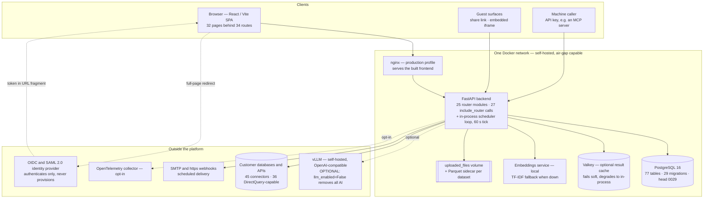
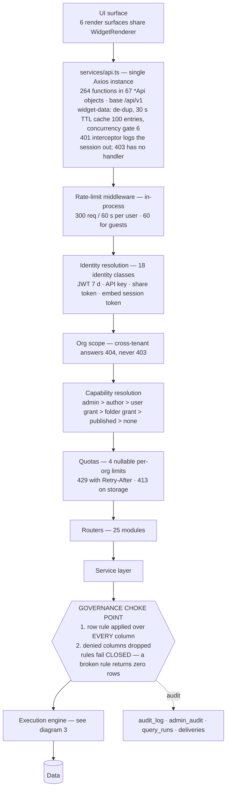
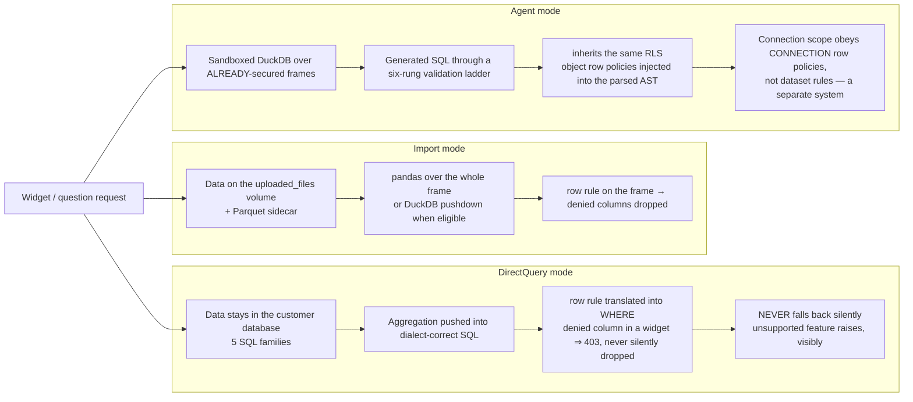
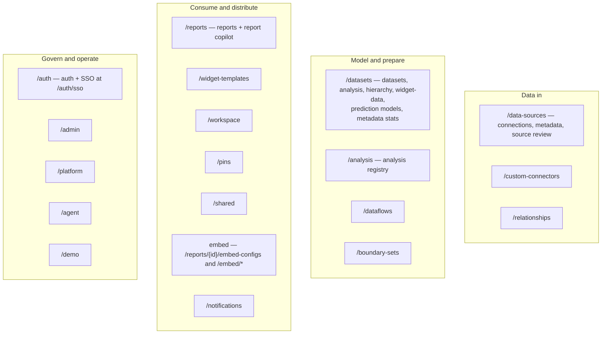
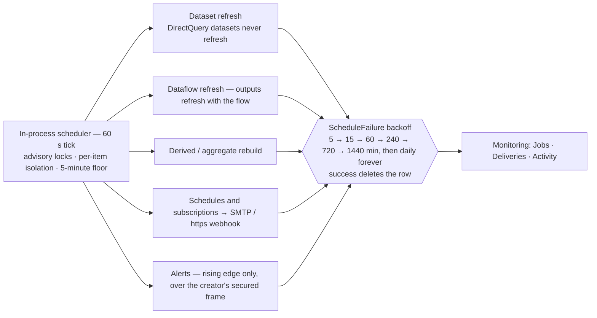

 #Datalytics — Platform Block Diagram

Extracted from `2026-09-13-application-analysis.md` only. Every block traces to a section; nothing is inferred beyond what that document states. Blocks marked **?** are listed in the document as UNKNOWN or unverified.

---

## 1. Deployment blocks — what runs where

Five containers on one Docker network, plus optional external endpoints. `llm_enabled=False` runs the whole platform with no AI at all. Nothing phones home: models, maps, fonts and drivers ship inside the images. *(§1.2, §2.1)*

| Block | Fact the document pins to it | § |
|---|---|---|
| Frontend | 32 page files · 34 routes · 67 widget types · 264 API functions in one file | §1.3 |
| Backend | 25 router modules, scheduler runs **in-process**, not as a separate container | §1.2, §1.3 |
| PostgreSQL | 77 tables, no soft delete anywhere — hard CASCADE / SET NULL / RESTRICT | §1.3, §10 |
| Valkey | optional; `/health/ready` reports `degraded`, renders continue | §1.2, §16 |
| Embeddings | local service; silent TF-IDF fallback | §1.2, §16 |
| vLLM | optional and external; down ⇒ "could not classify the question", narration returns null | §1.2, §16 |
| nginx | production serving profile (listed as a closed gap) | §1.4 |
| net_guard | SSRF guard on outbound connector traffic; metadata IPs always blocked | §16 |

---

## 2. Request-path blocks — one call from click to row

Every frontend call passes the same stack. All 264 calls go through **one** Axios instance; no other frontend file performs HTTP. Only 401 is handled centrally; there is no automatic retry anywhere.

Ordering inside the choke point — row rule first, column drop second — is a decision the document records as settled on 2026-09-13 and explicitly not to be reopened. *(§14.12)*

---

## 3. Execution-path blocks — the three engines

These three paths explain most of the code, and they are not interchangeable: the path decides what a widget can do and what "empty" means. *(§1.2, §14.6–14.9)*

**Aggregate datasets** are the bridge: a scheduled GROUP BY over a DirectQuery source, saved as an import dataset. They carry no rules of their own — the source's rules apply at read time, and the grain must cover every column a rule reads. *(§14.17)*

---

## 4. Subsystem blocks — the backend surface by router prefix

*(§9.3, §5.1)*

Governance blocks that every read passes through, wherever it originates: row security, column security, capability levels, export policy and quotas — applied by **every** engine, including the AI. The document states there is no path that returns a row the viewer may not see. *(§2.1)*

---

## 5. Background blocks

Metadata sync (`Run sync` on Source review) is **triggered, never scheduled**; a restart force-fails stuck `running` rows. *(§11.6)*

---

## 6. Identity blocks — who a query runs as

Not a hierarchy of three roles: the code distinguishes **18 identity classes**. The blocks that matter for a diagram are the ones where the executing identity is not the person at the screen. *(§4, §14.32–14.35)*

| Surface | Runs as |
|---|---|
| Signed-in app | the user |
| Share link, anonymous | the link's **creator** |
| Share link, viewer signed in to the same org | the **viewer** |
| Embedded report | always the config's **creator** |
| Scheduled delivery | the schedule's **creator** |
| Subscription | the **subscriber** (their own schedule) |
| Print view | the **printing user** |
| API key | the **issuing user**, no scopes |
| Org admin | bypasses row and column rules |

---

## Needs verification

- **Which metadata sync module is live** — `metadata/sync.py` and `metadata/catalog_sync.py` both write `SyncRun.status`; the document records which is live for which trigger as UNKNOWN. *(§10.3 item 6)*
- **Eval gate** — runs, but the document records no UI for it. *(§16)*
- **Base-map / tile provider** — none exists in this checkout; boundary sets ship as a bundled world atlas. *(§16)*
- **`postgres/init.sql`** — a stale 8-table bootstrap including a `charts` table with no model; the live schema is `create_all` plus 29 migrations. Do not draw it as part of the system. *(§10.3 item 1)*
