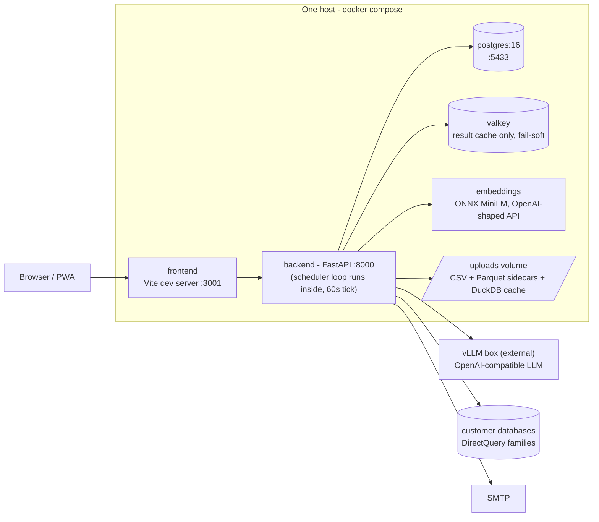
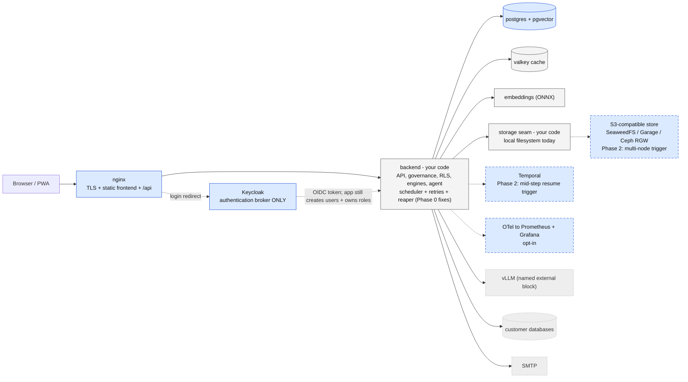

# First stop

This is the first document to read about **datalytics**. It explains what the
app is, how it works, where it is weak, and which open-source tools could
become blocks in its architecture — honestly, with reasons for and against.

---

## 1. How to read this

This document is for **orientation and decisions**. It is deliberately short.
It does not repeat the reference material — it points to it:

| Document | What it is |
|---|---|
| [ARCHITECTURE.md](ARCHITECTURE.md) | **The authoritative reference.** Seven layers, every subsystem, request lifecycles, extension points. It is *test-enforced*: `backend/tests/test_architecture_doc.py` re-derives its counts from the source tree and fails the build if the doc drifts. |
| [docs/OFFLINE_DEPLOYMENT.md](docs/OFFLINE_DEPLOYMENT.md) | How the stack ships into an air-gapped network (`docker save` bundles). |
| [docs/BACKUP_AND_RECOVERY.md](docs/BACKUP_AND_RECOVERY.md) | What state lives where, and the verified backup/restore scripts. |
| [docs/DEMO_WALKTHROUGH.md](docs/DEMO_WALKTHROUGH.md) | A guided tour with the seeded demo content. |
| [docs/superpowers/specs/](docs/superpowers/specs/) | The design documents — including the roadmap and the recorded "we decided NOT to do this" decisions. |

Two rules this document follows:

1. **It contains no inventory numbers** (widget counts, page counts, endpoint
   counts). Numbers rot: the old `README.md` still claims a widget count that
   is many times smaller than reality. Only ARCHITECTURE.md may carry counts,
   because only ARCHITECTURE.md is checked by a test. Where a number matters,
   this document links instead.
2. **When documents disagree, trust ARCHITECTURE.md**, then the code.
   `README.md` and `README2.md` are stale (see section 9).

> **بالعربي:** هذه الوثيقة هي نقطة البداية: تشرح الفكرة والقرارات فقط، ولا تكرر
> المرجع التفصيلي. المرجع الموثوق هو `ARCHITECTURE.md` لأن اختبارًا آليًا يتحقق
> من أرقامه، أما `README.md` القديم فمعلوماته قديمة فلا تعتمد عليه.

---

## 2. What datalytics is

Datalytics is a **self-hosted business-intelligence platform with an AI
analyst built in**. One team runs it on their own hardware — it is designed
from the start for **air-gapped** networks: every model, map and font ships
inside the Docker images, and nothing phones home.

What makes it different from "another dashboard tool":

- **An AI analyst, not just charts.** Users ask questions in plain language
  (Arabic or English); an agent plans, writes SQL, validates it against
  security rules, executes it in a sandbox, and explains the answer. A second
  copilot edits dashboard pages by instruction.
- **Governance is built into the query path, not bolted on.** Row-level
  security, column security, capability levels, workspace sharing, dataset
  ownership, quotas, export policy and audit all sit *between* the user and
  the data. Every engine applies them.
- **Arabic and RTL are first-class**, end to end — UI, charts, exports, PDF.

Data flows through **three execution paths**, and knowing them explains most
of the codebase (details: ARCHITECTURE.md → *"Layer 4 — Query & Semantic"*):

1. **Import mode** — uploaded files live on local disk with Parquet sidecars;
   widgets aggregate them with pandas, or push eligible queries down to an
   embedded DuckDB for speed.
2. **DirectQuery mode** — the app builds dialect-correct SQL and sends it to
   the customer's own database (five supported SQL families), applying the
   viewer's security as SQL predicates.
3. **Agent mode** — generated SQL always runs in a **sandboxed DuckDB** over
   frames that were already security-filtered, so the model can never see
   more than the person asking.

> **بالعربي:** المنصة نظام تحليل بيانات يعمل على خوادمك الخاصة وبدون إنترنت،
> ومعه محلل ذكاء اصطناعي يجيب عن الأسئلة بالعربية أو الإنجليزية. البيانات تمر
> بثلاثة مسارات تنفيذ: ملفات مرفوعة، أو استعلام مباشر من قاعدة بيانات العميل،
> أو تنفيذ ذكي معزول — وقواعد الأمان تُطبَّق في المسارات الثلاثة كلها.

---

## 3. Today's topology

Everything runs on **one host** with `docker compose` (see
[docker-compose.yml](docker-compose.yml)):

Honest footnotes — read them before trusting the picture:

- **The frontend container runs the Vite *development* server**, even in
  "production". The static-build + web-server path is documented in
  [docs/OFFLINE_DEPLOYMENT.md](docs/OFFLINE_DEPLOYMENT.md) but not wired into
  compose yet. This is the first thing to fix (section 8, Phase 0).
- **All background work runs inside the backend process** — one loop, one
  60-second tick, coordinated by Postgres advisory locks. There is no job
  queue and no worker service (section 5 explains what that costs).
- **Uploaded data is plain files on a local volume.** There is no object
  storage and no abstraction layer over the filesystem.
- **Valkey is only a result cache**, and the app works without it (it falls
  back to an in-process cache). It holds no sessions, no queues, no locks.
- **The LLM is an external box you operate** (any OpenAI-compatible server;
  see `llm_base_url` in [backend/app/core/config.py](backend/app/core/config.py)).
  If it is down, chat features degrade; dashboards keep working.
- Where state lives and how to back it up: the volume table in
  [docs/BACKUP_AND_RECOVERY.md](docs/BACKUP_AND_RECOVERY.md).

> **بالعربي:** كل شيء يعمل على خادم واحد عبر `docker compose`. ملاحظات مهمة:
> الواجهة تعمل حاليًا بخادم التطوير وليس نسخة إنتاج، وكل المهام المجدولة تعمل
> داخل عملية الخادم نفسها بلا نظام طوابير، والملفات المرفوعة مخزنة على القرص
> المحلي مباشرة. هذه النقاط الثلاث هي أساس التوصيات القادمة.

---

## 4. How a request flows — three short traces

**A widget renders (import mode).** The browser posts the widget's
configuration to the backend. The backend checks *who may read this dataset*
(owner, explicit share, or a dashboard the viewer can open), applies
row-level and column security to the base frame, then aggregates — DuckDB
over the Parquet sidecar when the query is eligible, pandas otherwise — and
caches the shaped result (Valkey or in-process). Details: ARCHITECTURE.md →
*"Request lifecycles — A widget renders"*.

**A user asks the AI a question.** The agent classifies the question, plans
steps, generates SQL, then climbs a validation ladder (syntax, schema,
column security, row policies injected into the SQL's parse tree), executes
in sandboxed DuckDB over already-filtered frames, sanity-checks the result
and explains it. Every model call goes to the external LLM box with
JSON-schema enforcement, so malformed model output is rejected, not parsed
hopefully. Details: ARCHITECTURE.md → *"Layer 5 — Analytics & AI"*.

**A scheduled refresh fires.** Every 60 seconds the in-process scheduler
wakes, takes a Postgres advisory lock per due item, and runs dataset
refreshes, dataflow runs, report deliveries and data alerts. If an item
fails, it is logged and will be *due again* next time — there is no retry
policy beyond that (see section 5). Details: ARCHITECTURE.md →
*"Cross-cutting concerns — Durable state"*.

> **بالعربي:** ثلاث رحلات تشرح النظام: عرض الرسم البياني يمر أولًا بفحص
> الصلاحيات ثم التجميع ثم التخزين المؤقت؛ وسؤال الذكاء الاصطناعي يمر بسلّم
> تحقق صارم قبل تنفيذ معزول؛ والمهام المجدولة تعمل كل ستين ثانية داخل عملية
> الخادم، وإذا فشلت مهمة تُسجَّل فقط وتُعاد المحاولة في الدورة التالية.

---

## 5. Honest gaps

Every recommendation in section 6 exists to close a gap named here. Most of
these gaps are *known and documented in the code itself* — some are even
deliberate decisions. That honesty is a strength: it means the seams for
improvement are already visible.

**Durability of background work.**
- No retries, no backoff, no dead-letter anywhere. "Retry" means "still due
  on the next 60-second tick".
- In the refresh tick, dataset and dataflow items are not isolated from each
  other — one raising item skips the rest of that tick's list.
- Metadata sync runs as a detached task started by an HTTP request. If the
  process restarts mid-sync, the `SyncRun` row says `running` **forever** —
  nothing cleans it up.
- Job state is Postgres rows + advisory locks + polling. Nothing resumes
  *mid-step* after a crash; it can only run again from the start.

**Identity.**
- Login tokens live 7 days and **cannot be revoked** — there is no refresh
  token, no logout endpoint, no revocation list.
- SSO exists (per-organization OIDC with PKCE **and** SAML 2.0, both
  hand-rolled) but **never provisions users** — a person must already exist
  in the org before SSO can log them in. No MFA. No LDAP. Two protocol
  stacks to maintain and patch by hand.
- Authorization (roles, capabilities, RLS, workspace grants) is deep,
  app-owned, and *good* — the gap is authentication, not authorization.

**Serving and storage.**
- The production frontend is a dev server (section 3).
- Uploaded data is local-disk-only, with three couplings that block a move
  to object storage: the frame cache keys on file `mtime`, the DuckDB
  pushdown writes literal local paths into SQL, and materialization records
  store absolute paths.
- Retrieval vectors sit in a Postgres JSON column. The retrieval design doc
  says this openly: the interface was built *"so pgvector can slot in later
  without rework"* — a reserved seat, still empty.

> **بالعربي:** الفجوات الصريحة ثلاث: أولًا المهام الخلفية بلا إعادة محاولة
> حقيقية وقد تعلق حالة المزامنة إلى الأبد بعد إعادة التشغيل؛ ثانيًا الهوية —
> رمز الدخول صالح سبعة أيام ولا يمكن إلغاؤه، وتسجيل الدخول الموحد لا يُنشئ
> المستخدمين تلقائيًا ولا توجد مصادقة ثنائية؛ ثالثًا التخزين والتقديم — واجهة
> تطوير في الإنتاج وملفات على قرص محلي فقط. كل توصية في القسم التالي تعالج
> واحدة من هذه الفجوات.

---

## 6. Open-source blocks: the verdicts

The question asked: *"if a part of my app is the same as a stable open-source
tool, better to use the tool."* Correct instinct — applied honestly below.
The rule used for every verdict: **adopt a tool only where it closes a gap
from section 5 and does not displace what makes the product special** (the
governance engine, the widget system, the AI analyst, RTL).

| Tool | Verdict | Gap it closes | What stays yours | Trigger |
|---|---|---|---|---|
| nginx | **ADOPT NOW** | Dev server in production | Everything else | None — do it first |
| Keycloak | **ADOPT (Phase 1)** | Revocation, MFA, LDAP, user provisioning, two hand-rolled SSO stacks | All authorization: roles, RLS, capabilities, API keys | When identity work is scheduled |
| pgvector | **ADOPT (Phase 1)** | Vectors in a JSON column | The retrieval scorer itself | The seat is already reserved |
| vLLM | **ALREADY IN USE — formalize** | The LLM box has no ops "home" | The agent, prompts, validation ladder | None |
| OTel → Prometheus/Grafana | **ADOPT LATER, opt-in** | "Why was yesterday slow?" | — | First real performance investigation |
| S3-compatible store | **GATED (Phase 2)** | Local-disk-only files | The storage seam (build it now, cheap) | Multi-node or versioning demand |
| Temporal.io | **FIX IN APP FIRST; GATED (Phase 2)** | No retries; stuck sync rows | The scheduler, made honest with small fixes | Mid-step crash resume demand |
| MinIO | **REJECT by name** | — | — | — |
| Superset | **REJECT as a block; reference only** | — | — | — |

### nginx — adopt now

One small web-server container: serves the **built** frontend as static
files (closing the gap [docs/OFFLINE_DEPLOYMENT.md](docs/OFFLINE_DEPLOYMENT.md)
already documents), terminates TLS, and proxies `/api` to the backend. One
ingress instead of two exposed ports. Air-gap note: automatic certificates
(Caddy's specialty) are useless offline — customer certificates or an
internal CA, which makes plain nginx the simpler pick.

### Keycloak — adopt, with an honest migration story

Today the app maintains **two** hand-rolled SSO protocol implementations
(OIDC and SAML, per organization, matched by email domain). Keycloak replaces
both: the app becomes **one OIDC client of Keycloak**, and Keycloak brokers
everything behind it — corporate SAML, other OIDC providers, **LDAP/Active
Directory**, **MFA**, session revocation, key rotation. Keycloak's
*Organizations* feature (Keycloak 26+) maps per-organization identity
providers with email-domain routing — the exact model the app already
implements by hand, which is what makes this a shrink, not a rewrite.

Three honest conditions:
1. **User provisioning is not free.** The app must add one "first login →
   create user from claims, map org and role" hook. Keycloak authenticates;
   it never writes app tables.
2. **Authorization stays app-owned.** Roles, capabilities, RLS, workspace
   grants, `dk_` API keys — none of it moves. Keycloak is authentication
   only.
3. **The fair alternative:** keep hand-rolled auth and just add refresh
   tokens + a revocation list + provisioning (small work). The tipping point
   for Keycloak is the first request for LDAP/AD, MFA, or a third identity
   provider. Cost: one JVM container (~0.5–1 GB RAM), its schema can live in
   the existing Postgres.

### pgvector — adopt; the seat is reserved

The retrieval layer already stores embedding vectors in Postgres and already
has a lexical fallback. Its own design document reserved the pgvector slot.
Adoption is: bake the extension into the Postgres image (air-gap — no
runtime downloads), migrate the JSON column, swap the similarity function.
No new container.

### vLLM — already in use; give it a name

The default `llm_base_url` points at a self-hosted, OpenAI-compatible model
server. That *is* the vLLM pattern. Formalizing it as a named block means:
documented sizing, a health check the app already knows how to probe, and a
clear upgrade path for models — instead of "the box with the IP address".

### S3-compatible object store — pattern yes, MinIO no

**Why not MinIO:** its Community Edition was stripped of the admin console in
May 2025, placed in maintenance in December 2025, and the repository was
**archived (read-only) in early 2026** (see
[Blocks & Files](https://www.blocksandfiles.com/ai-ml/2025/06/19/minio-users-complain-after-admin-ui-removed-from-community-edition/1610856)
and the 2026 [self-hosted S3 comparisons](https://rilavek.com/resources/self-hosted-s3-compatible-object-storage-2026)).
Recommending it by name into an air-gapped deployment — frozen images, total
dependence on upstream security patches — would ship dead software.

**What to do instead:** build the *seam* now (cheap, Phase 0): one small
storage module with a local-filesystem implementation, which collapses the
three couplings from section 5 into one file (cache keys move from `mtime`
to key+version; the DuckDB pushdown gets a path template — with the `httpfs`
extension baked into the image, since DuckDB extensions download at install
time; materialization records store keys, not absolute paths). When
multi-node or versioning demand actually arrives (Phase 2), pick a
**maintained** S3-compatible store behind the same seam: **SeaweedFS**,
**Garage**, or Ceph RGW — chosen at that moment, not today.

### Temporal.io — fix in-app first, adopt on a real trigger

Temporal is the right *category* for section 5's durability gaps — but all
four named gaps have small, honest in-app fixes that keep the deliberate
"no broker" design: an attempt counter with backoff (making "retry" real),
per-item isolation in the refresh tick, a startup reaper for `SyncRun` rows
stuck at `running`, and moving metadata sync from a detached task into the
scheduler. Do those first (Phase 0). Adopt Temporal when a requirement
appears that rows-and-locks cannot express: **a pipeline step that must
resume mid-step after a crash**, or workflow volume that outgrows one
60-second loop. Its cost is real for a single air-gapped box: server + UI +
workers + its own persistence, 2–3 extra containers.

### Superset — reject as a block, keep as a reference

Superset is not a component of a BI platform; it **is** a BI platform — the
same category this product competes in. Adopting it would displace exactly
the layers that make datalytics different (ARCHITECTURE.md → *"Layer 4"*
through *"Layer 7"*): the widget registry, full RTL, the app-owned security
model, the AI analyst. One salvage: Superset's dataset/metric model is the
best open reference to study when building the greenfield semantic layer
(section 7) — study, don't adopt.

### Considered and rejected — one line each

- **Airbyte / dbt** — overlap the shipped connector registry and first-class
  dataflows; adopting them would fork the transformation model in two.
- **Celery / RQ** — add a broker *without* durability or workflow semantics;
  they would rebuild today's gaps on new infrastructure. (Rejected for that
  reason — not because "more services is bad", or the Temporal verdict above
  would be a contradiction.)
- **Elasticsearch** — retrieval is fit-for-purpose (lexical + embeddings);
  pgvector is the upgrade path.
- **Kubernetes** — recorded as a decision: stay on compose; the whole
  product is `docker save`-shaped.
- **pgBackRest** — only if backup needs become stricter than daily; the
  verified `pg_dump` scripts are the right current answer.

### Target architecture

Grey solid = your code (unchanged heart). Blue solid = adopted open-source
blocks. Blue dashed = gated behind a real trigger, not adopted today.

> **بالعربي:** الخلاصة: نتبنى `nginx` فورًا، ثم `Keycloak` للهوية و`pgvector`
> للمتجهات، ونثبّت `vLLM` كمكوّن مسمّى. نرفض `MinIO` بالاسم لأن نسخته المجتمعية
> أُرشفت عام 2026، لكن نبني الآن طبقة فصل للتخزين ونختار لاحقًا بديلًا مصانًا
> مثل `SeaweedFS` أو `Garage` عند الحاجة الفعلية. نرفض `Superset` كمكوّن لأنه
> منافس للمنتج نفسه، ونؤجل `Temporal` بعد إصلاحات صغيرة داخل التطبيق. قلب
> النظام — الأمان والحوكمة والمحلل الذكي والواجهة — يبقى كودك أنت.

---

## 7. Extension roadmap — already mapped in the specs

The design documents under [docs/superpowers/specs/](docs/superpowers/specs/)
already record where the product wants to go, and what was deliberately cut.
The items, each tagged with the block it depends on:

- **Semantic layer** — greenfield (`services/semantic.py` is reserved in the
  core architecture spec). Depends on nothing above; **Superset is the
  reference to study**, not the base to adopt.
- **Custom-visual SDK** — the chart-renderer registry is already the
  extension point; the SDK work is turning an internal convention into a
  stable, documented contract. Depends on nothing above.
- **Plugin sandbox / marketplace** — *deliberately deferred* in the gap
  roadmap ("a security surface that dwarfs its value today"). Unchanged.
- **pgvector slot** — the reserved seat; filled by the Phase 1 adoption.
- **Recorded negative decisions** (respect them; they were made on purpose):
  no Trino/Spark distributed compute (push down to the source or DuckDB
  instead); PWA instead of native mobile apps; no Kubernetes.

The full extension-point table (add a connector, a widget type, an
aggregation, an analysis, an agent capability) lives at the end of
[ARCHITECTURE.md](ARCHITECTURE.md) → *"Extension points"*.

> **بالعربي:** خارطة الطريق موثقة أصلًا في مستندات التصميم: الطبقة الدلالية
> عمل جديد يُستلهم من `Superset` دون تبنيه، وعُدّة المرئيات المخصصة تحويل
> لاتفاق داخلي موجود إلى عقد موثّق، وصندوق الإضافات مؤجل عمدًا لأسباب أمنية.
> وهناك قرارات سلبية مسجلة عن قصد — لا حوسبة موزعة ولا تطبيق جوال أصلي ولا
> `Kubernetes` — فاحترمها قبل اقتراح عكسها.

---

## 8. Suggested order of work

Informational sequencing only — nothing here is being started now.

**Phase 0 — no new services, no judgment calls.**
Wire the nginx static build (the gap OFFLINE_DEPLOYMENT.md documents); make
the scheduler honest (attempt counter + backoff, per-item isolation in the
refresh tick, `SyncRun` reaper on startup, metadata sync into the
scheduler); build the storage seam module around the local filesystem.
*Exit: production serves built files; a killed process leaves no lying job
rows; all file access goes through one module.*

**Phase 1 — identity and reserved seats.**
Keycloak as authentication broker + the first-login provisioning hook;
pgvector into the Postgres image and migrate the vector column; write the
vLLM block's ops page (sizing, health, model upgrades); optionally switch on
OpenTelemetry export.
*Exit: a leaked session can be revoked; an LDAP/MFA request is configuration,
not a project; retrieval queries use a real vector index.*

**Phase 2 — trigger-gated. Do not start without the trigger.**
S3-compatible store (SeaweedFS / Garage / Ceph RGW — evaluate *then*) when
multi-node or versioning demand is real. Temporal when a workflow must
resume mid-step after a crash, or volume outgrows the loop.

> **بالعربي:** الترتيب المقترح: المرحلة صفر إصلاحات بلا خدمات جديدة — نسخة
> إنتاج للواجهة، وجدولة صادقة بإعادة محاولة حقيقية، وطبقة فصل للتخزين. المرحلة
> الأولى الهوية والمقاعد المحجوزة: `Keycloak` و`pgvector` وتوثيق `vLLM`.
> المرحلة الثانية مشروطة بحاجة حقيقية فقط: مخزن كائنات متوافق مع `S3` أو
> `Temporal`. لا تبدأ المرحلة الثانية قبل ظهور الحاجة فعلًا.

---

## 9. Repo hygiene — confirm, then remove

Non-destructive list; every item needs a human yes before deletion:

- `README2.md` — near-duplicate of the stale `README.md`. Suggest: shrink
  `README.md` to a short pointer at this file and ARCHITECTURE.md, delete
  `README2.md`.
- Stray copies at the repo root that are **not** the live code (the live
  versions are under `backend/app/` and `frontend/src/`):
  `ReportBuilder.tsx`, `WidgetRenderer.tsx`, `WidgetConfigPanel.tsx`,
  `CrossFilterContext.tsx`, `analytics.py`, `widget_data.py`.
- `init.sql` at the root — byte-identical duplicate of `postgres/init.sql`
  (only the latter is mounted); both predate the current schema anyway, which
  is created by the app at startup.
- `docker-compose2.yml` — stale older variant (different ports, different
  mounts).
- `COURSE_1_narrations.txt`, `COURSE_2_narrations.txt` — course transcripts
  used as research input for the roadmap specs; keep only if still wanted.
- `~$datalytics-users-and-privileges.xlsx` — an Excel lock file, safe to
  delete.
- `1.png`, `12.jfif` — loose screenshots.

> **بالعربي:** توجد ملفات قديمة أو مكررة في جذر المشروع — نسخ قديمة من ملفات
> الكود، وملف `README2.md` المكرر، وملف `init.sql` مكرر، وملفات مؤقتة. القائمة
> أعلاه للحذف بعد تأكيدك أنت، ولم يُحذف أي شيء الآن.
