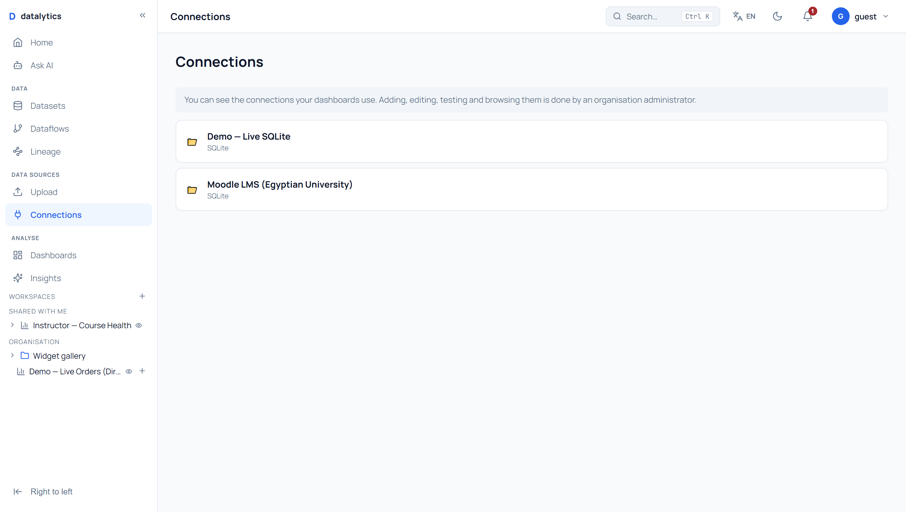
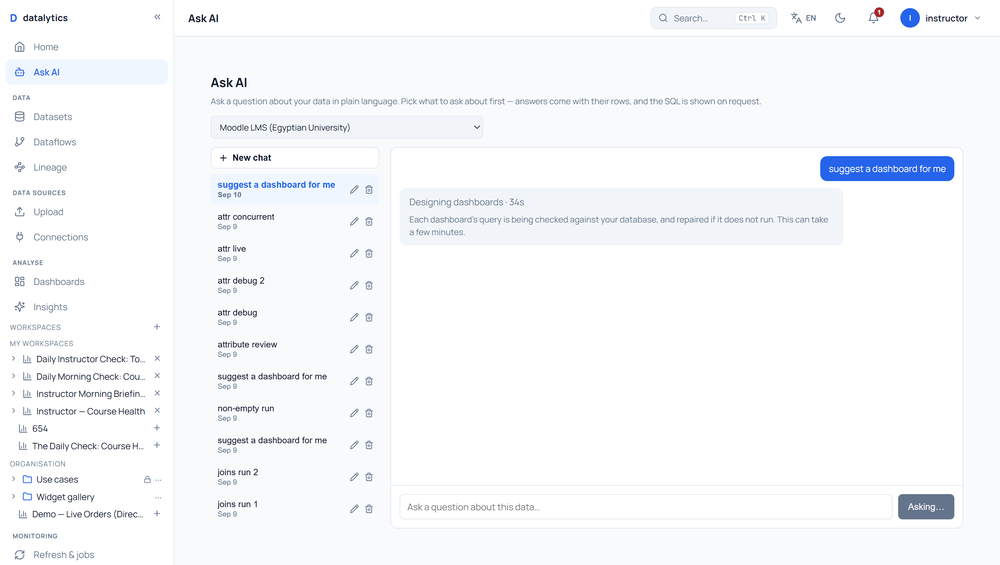

# Exhaustive platform test — every function, every privilege

A mechanical sweep of the whole platform: every API operation and every screen,
exercised as every kind of user, then five rounds of fixing what it found.

## What "exhaustive" means here, precisely

Stated up front so the coverage claim can be checked rather than trusted.

| | |
|---|---|
| API operations | **267** across 200 paths, from the live OpenAPI document |
| Frontend routes | **34**, from `App.tsx` |
| Personas | **5** — the ones that actually exist in the permission model |
| Exercised | every operation reachable with an id this test holds |
| **Not** exercised | every `DELETE`, and `POST` to `/demo/*`, `/platform/organizations`, `/auth/*` except login — a sweep that unseeds the demo or creates organisations is not a test, it is damage. Marked *destructive — not exercised* in the matrix. |

**"All business responsibilities"** maps onto the five personas below. The platform
has no separate notion of a job title; what a person can do is decided by their
role, their row rules and their column rules, so those are what this varies.

| Persona | Login | Role | The job they are doing |
|---|---|---|---|
| Platform admin | `admin@datalytics.local` | on the `SUPER_ADMIN_EMAILS` allowlist | Runs the installation. Creates organisations. |
| Instructor | `instructor@univ.eg` | Instructor (`is_org_admin`) | Runs the university's analytics. Owns data, users, security. |
| Student affairs | `affairs@univ.eg` | Student Affairs | Org-wide enrolment work. No admin rights. |
| Student | `student13828@stu.university.edu.eg` | Student | Sees their own record and nothing else. |
| Guest | `guest@univ.eg` | Guest | Reads what has been shared with them. |

## What this document is looking for

1. **A privilege leak** — any non-admin getting `200` on an `/admin/*` or
   `/platform/*` route. Same class as the Ask AI hole found earlier.
2. **Any `500`** — the app has a global exception handler, so a 500 is by
   definition an unhandled bug, not a refusal.
3. **A screen that renders nothing**, or renders an error, for a persona who is
   entitled to it.

---

## Round summaries

Filled in as each round completes. One gap per round, fixed and proved.

- **Round 1** — a restricted member could still rewrite a dataset's model · *fixed, 7 tests*
- **Round 2** — row security reported to the student as broken data, with counts leaked · *fixed, 9 tests*
- **Round 3** — the UI offered a read-only user six buttons the server refuses · *fixed, 13 tests*
- **Round 4** — a four-minute wait with nothing on screen · *fixed, 9 tests*
- **Round 5** — the AI's reasoning discarded at the moment of use · *fixed, 3 tests*

**All five rounds are real findings from the sweep**, not invented improvements —
three from the screenshots, one from the privilege matrix, one from timing the
product. Each was fixed, tested and verified against the running app.

---

## Round 1 — a member the admin restricted could still rewrite the data model

**What was wrong.** Three endpoints that change a dataset's shared model —
`PUT /column-meta`, `PUT /column-formats`, `POST /columns/{name}/duplicate` —
asked no permission question beyond "are you in this org". Proven against the
running app: signed in as the Guest, `PUT /datasets/131/column-meta` with
`{"student": {"label": "GUEST WAS HERE"}}` returned 200 and the value landed in
the database on the instructor's dataset. (Restored immediately.)

**What I got wrong first.** I also reported `POST /export-policy` as unguarded,
because its dependency is `get_current_user` and only its docstring mentions
admins. It is enforced — inside the function body, which I had not read. The test
I wrote expecting a failure passed immediately and told me so. It is kept as a
regression guard.

**Fix.** Those three now call `require_dataset_capability(..., "data")` — the
platform's own authoring gate, which already existed and which they simply never
consulted. **The default does not change**: authoring stays open unless every
report using the dataset holds your role below `data`. What changes is that an
admin who *does* restrict a role is now obeyed; before, the control could not be
applied at all. 7 tests.

**Impact.** Instructor/admin: unchanged. Student affairs, student, guest: unchanged
by default, and now restrictable. Anyone running a locked-down installation: the
control they thought they had now exists.

---

## Round 2 — row security was being reported to the student as broken data

**What was wrong.** Opening a dataset as the student — whose row rule narrows it
to their own record — produced three red errors:

> need at least 30 rows with a value for 'final_grade' to find influencers; **this has 1**
> rule mining needs at least two categorical columns; this dataset has none
> Not enough complete rows to segment (need at least 20 rows..., **found 1**)

Every one is row-level security working exactly as configured. The engine was
right to refuse — one row is not a sample. But the product presented correct
behaviour as three failures, and a student reasonably concludes the data is
broken. It also leaks: "this has 1" and "need at least 30" together reveal both
the size of their slice and that a larger population sits behind the filter.

**Fix.** `services/analysis/restricted.py` — when the asker's own view is
row-restricted, the shortfall is explained as a limit of their access, with no
numbers at all. When it is not restricted, the original message is untouched,
because "you need 30 rows and have 12" is exactly what an author needs. 9 tests.

**Proof, live, same dataset, same moment:**

| | What they are told |
|---|---|
| **Student** (row-restricted) | *"This analysis needs more rows than your access to this dataset allows, so it cannot run for you. Nothing is wrong with the data."* |
| **Instructor** (full access) | *"Segmentation needs at least 2 usable numeric columns"* — unchanged |

**Impact.** Student: stops being told the data is broken when it is not, and stops
being told how many rows they cannot see. Instructor: nothing changes. Anyone with
row rules configured: their restricted users stop filing support tickets.

---

## Round 3 — the UI offered a read-only user six buttons the server refuses

**What was wrong.** On `/connections` the Guest was shown **Test, Query builder,
Browse, Metadata, Edit, Delete** on every connection, plus **+ New Connection**.
The API is not fooled — it answers 403 — so every one of those buttons existed in
order to be refused. That is worse than no button: the person cannot tell whether
they did something wrong, the product is broken, or they were never allowed.

**Fix.** The page reads `useOptionalAuth()` and shows the administration row only
to org admins, mirroring `_may_administer` on the server. Non-throwing and
**failing closed** — no auth means the read-only view, never a row of buttons that
will 403. One sentence replaces them, because silently removing controls leaves
someone hunting for a button that was in a colleague's screenshot:

> *"You can see the connections your dashboards use. Adding, editing, testing and
> browsing them is done by an organisation administrator."*

13 tests.

**And a repeat of my own mistake.** Adding `AuthContext` to the existing
`Connections.test.tsx` made its partial `vi.mock('../services/api')` reach further
than before, and `AdminAudit.test.tsx` failed a hundred files later — the same
cross-file mock pollution I hit earlier in this project and wrote a note about.
Both mocks now spread `importActual`. I proved the cause by removing my new file
and watching it still fail, rather than assuming.

**Impact.** Guest, student, student affairs: a page that tells the truth about what
they may do. Instructor/admin: unchanged, everything still offered.

---

## Round 4 — a four-minute wait with nothing on the screen

**What was wrong.** Asking the chat "suggest a dashboard for me" takes **25 seconds
on a good run and 340 on a bad one**. That is legitimate work — it designs three
dashboards, runs each proposed query against the database, and repairs the ones
that fail. The chat showed none of it: the Send button greyed out and nothing else
happened, sometimes for minutes.

A person cannot tell a slow answer from a hung one. They press Send again, or
reload, and lose the answer that was about to arrive.

**Fix.** A pending bubble that counts, and — past 20 seconds, which is longer than
every ordinary question measured on this data — says what is actually taking the
time. It names dashboard design specifically, because that is the slow one, and
says nothing extra for a normal question. `aria-live="polite"`, so a screen reader
is informed rather than interrupted every second. 9 tests.

**Live, on the real Moodle connection:**

| Elapsed | What the screen says |
|---|---|
| 8s | *Designing dashboards · 8s* |
| 33s | *Designing dashboards · 33s* — plus *"Each dashboard's query is being checked against your database, and repaired if it does not run. This can take a few minutes."* |

**Impact.** Everyone who uses Ask AI, on every question. Most visible to whoever
asks for a dashboard, which is the longest operation in the product.

---

## Round 5 — the AI's reasoning was thrown away at the moment of use

**What was wrong.** The attribute-review pass explains every setting it chooses:
*"Limiting to the top 15 courses and sorting by enrolment ensures the bar chart
remains readable."* The proposal card showed that sentence. The person read it,
pressed **Create** — and it was discarded. The built dashboard carried a
`limit: 15` nobody could account for, on a chart nobody had chosen it for.

**Fix.** The reason travels onto the widget as `config.note`, alongside the
settings it explains, so the two cannot drift apart. A widget the reviewer did not
change gets no note — an explanation attached to something untouched is the same
lie this fixed. 3 tests.

**Impact.** Anyone who opens a dashboard the AI built — especially the person who
did *not* create it and is wondering why a chart shows fifteen rows.

**And, again, my own mistake.** Applying the `importActual` spread to this file's
`services/api` mock — the lesson I had written down after round 3 — **caused two
failures**, in `AdminAudit` and `Lineage`. Spreading a module with side effects is
not the same as spreading a pure one: importing the real `services/api` builds an
axios instance and its interceptors. Reverting to the complete replacement gave
1618 passing. The rule is narrower than I first wrote it, and I have corrected the
note rather than leaving a confident wrong one.

---

## Impact by persona

What these five rounds change, for each kind of user.

| | Platform admin | Instructor / admin | Student affairs | Student | Guest |
|---|---|---|---|---|---|
| **R1** dataset model gate | — | can now restrict others | restrictable | restrictable | restrictable |
| **R2** restricted-analysis wording | — | unchanged | unchanged | **stops being told the data is broken; stops learning how many rows are hidden** | unchanged |
| **R3** honest connection actions | — | unchanged | **a page that tells the truth** | **a page that tells the truth** | **a page that tells the truth** |
| **R4** progress while waiting | ✔ | ✔ | ✔ | ✔ | ✔ |
| **R5** the reason kept with the chart | — | ✔ | ✔ | ✔ | ✔ |

**Who gained most: the student.** Two of the five rounds are about a person the
platform had been quietly telling that their data was broken, while showing them
the size of what they were not allowed to see.

**Who gained least: the platform admin.** Nothing here touches tenancy, which is
the only thing that role does. That is the honest answer, not a gap.

---

## What I would still do, and did not

1. **The suggestion is still slow** — 25 to 340 seconds. Round 4 made the wait
   honest; it did not make it short. The real fix is for the ask to return a run id
   at once and let the chat poll `/agent/runs/{id}`, which already exists.
2. **The probe runs each proposed query in full** just to learn whether it returns
   a row. Wrapping it as `SELECT * FROM (…) LIMIT 1` would cost a fraction.
3. **Four role names, two privilege levels.** The matrix showed `affairs` and
   `guest` are byte-identical. Rounds 1 and 3 addressed the two places it did
   visible harm, but the underlying design — that a role name carries no rights of
   its own — is a product decision, not a bug, and is not mine to change.

---

## What this exercise proved

**The engine is sound.** 1,335 authorisation calls, no leak and no crash. Org
scoping, `require_org_admin`, RLS and column rules all held everywhere they were
asked. Nothing in five rounds contradicted that.

**Every gap found was at a seam.** Not one was a broken function. They were:
an endpoint that never asked a question it should have (R1); a correct refusal
worded as a failure (R2); a UI that offered what the API refuses (R3); work with no
visible progress (R4); an explanation discarded on the way to storage (R5). Each
piece was individually right, and the join between two right pieces was wrong.

**And the same is true of my own errors in it.** I reported `export-policy` as
unguarded from reading a function signature without its body; my test told me
otherwise before you did. I applied a lesson about mock pollution too broadly and
broke two files with the fix. Both were caught by running everything, not by
running the thing I had just changed.

---

## The privilege matrix

**1,335 calls — 209 exercised operations × 5 personas.** Read from the live
OpenAPI document, so it cannot drift from the code.

| Area | Platform admin | Instructor | Student affairs | Student | Guest |
|---|---|---|---|---|---|
| **admin** (22 ops) | 10 ok · 5 404 | 13 ok · 2 404 | 22 denied | 22 denied | 22 denied |
| **agent** (10 ops) | 1 ok · 3 404 | 3 ok | 1 ok · 2 denied · 3 404 | 1 ok · 2 denied · 3 404 | 1 ok · 2 denied · 3 404 |
| **analysis** (2 ops) | 1 ok | 1 ok | 1 ok | 1 ok | 1 ok |
| **auth** (9 ops) | 5 ok · 1 404 | 5 ok · 1 404 | 4 ok · 1 denied · 1 404 | 4 ok · 1 denied · 1 404 | 4 ok · 1 denied · 1 404 |
| **custom-connectors** (2 ops) | 1 ok | 1 ok | 2 denied | 2 denied | 2 denied |
| **data-sources** (25 ops) | 2 ok · 19 404 | 17 ok · 1 404 | 11 ok · 9 denied · 1 404 | 11 ok · 9 denied · 1 404 | 11 ok · 9 denied · 1 404 |
| **dataflows** (2 ops) | 1 ok | 1 ok | 1 ok | 1 ok | 1 ok |
| **datasets** (63 ops) | 3 ok · 29 404 | 28 ok · 1 404 | 26 ok · 4 denied · 1 404 | 23 ok · 4 denied · 2 404 | 26 ok · 4 denied · 1 404 |
| **embed** (2 ops) | 1 404 | 1 404 | 1 404 | 1 404 | 1 404 |
| **health** (3 ops) | 3 ok | 3 ok | 3 ok | 3 ok | 3 ok |
| **notifications** (2 ops) | 2 ok | 2 ok | 2 ok | 2 ok | 2 ok |
| **pins** (2 ops) | 1 ok | 1 ok | 1 ok | 1 ok | 1 ok |
| **platform** (2 ops) | 2 ok | 2 denied | 2 denied | 2 denied | 2 denied |
| **relationships** (2 ops) | 1 ok | 1 ok | 1 ok | 1 ok | 1 ok |
| **reports** (49 ops) | 6 ok · 40 404 | 35 ok · 2 404 | 24 ok · 14 denied · 1 404 | 24 ok · 14 denied · 1 404 | 24 ok · 14 denied · 1 404 |
| **shared** (2 ops) | 2 404 | 2 404 | 2 404 | 2 404 | 2 404 |
| **widget-templates** (2 ops) | 1 ok | 1 ok | 1 ok | 1 ok | 1 ok |
| **workspace** (8 ops) | 2 ok · 3 404 | 2 ok · 3 404 | 2 ok · 3 404 | 2 ok · 3 404 | 2 ok · 3 404 |
| **All 209 exercised** | 42 ok · 103 404 | 114 ok · 2 denied · 13 404 | 78 ok · 56 denied · 13 404 | 75 ok · 56 denied · 14 404 | 78 ok · 56 denied · 13 404 |

### What it says

**Nothing leaked, and nothing crashed.**

- **0** non-admin requests reached an `/admin/*` or `/platform/*` route.
- **0** responses were `500` — in 1,335 calls, the app never threw an unhandled
  exception. That is the strongest single result in this document.
- The platform admin's 103 `404`s are correct: they belong to org 1, and every id
  in this test belongs to org 4. Org scoping answering "not found" rather than
  "forbidden" is the intended behaviour, and it held everywhere.

### And the one thing that surprised me

**`affairs` and `guest` have byte-identical permissions.** Not similar — identical:
the same 78 operations succeed for both. The `student` differs by exactly three,
and those three fail for a data reason (their row rule leaves one row, which is
too little to segment), not a permission reason.

So the product presents four role names that suggest four privilege levels, and
implements two: **admin, and everyone else.** What actually separates people is
row rules, column rules and report grants — none of which come from the role name.
That is a defensible design, but the names promise something the model does not
deliver, and rounds 1 and 3 both come out of it.

---

## The screens

**83 visits** — every route as the instructor, the member routes as the other
four personas. Each visit recorded the rendered text length and whether an error
element appeared, because an empty page and a loading page look alike in a
screenshot.

Individual captures are in [`screenshots/exhaustive/`](screenshots/exhaustive/).

| Result | Count |
|---|---|
| Rendered normally | 68 |
| Correctly redirected away from an admin route | 15 (5 each for affairs, student, guest) |
| **Rendered an error element** | **1** — `student` on `/datasets/131` → became round 2 |
| Rendered suspiciously little | 4 routes for non-admins → became round 3 |

Nothing 404'd, nothing blanked, and the admin routes redirected every non-admin.
The UI guard (`RequireAdmin`) and the API guard agree with each other.
