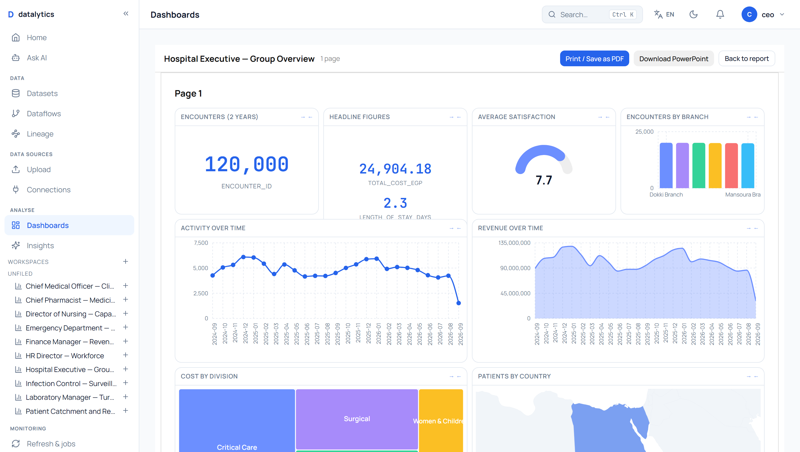
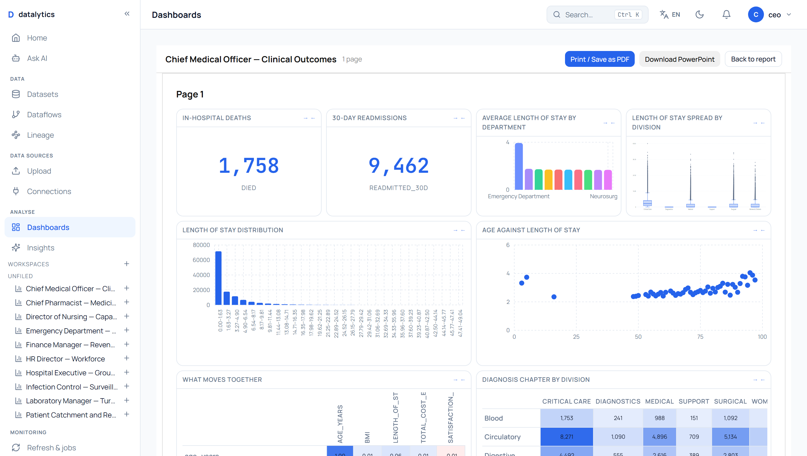
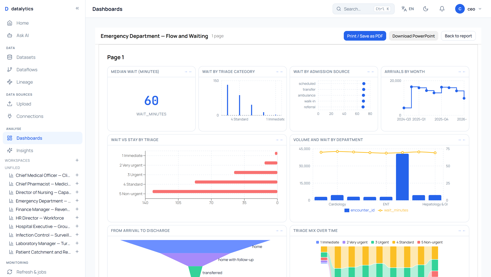
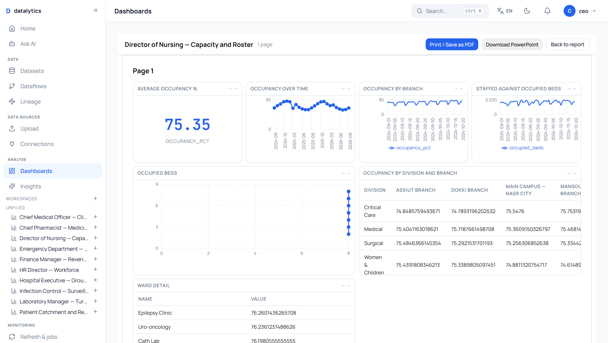
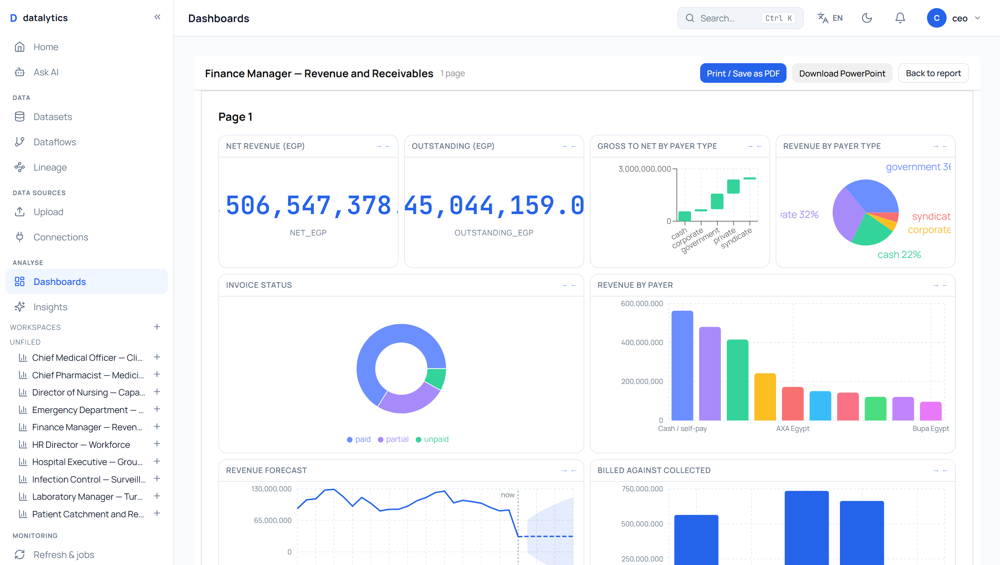
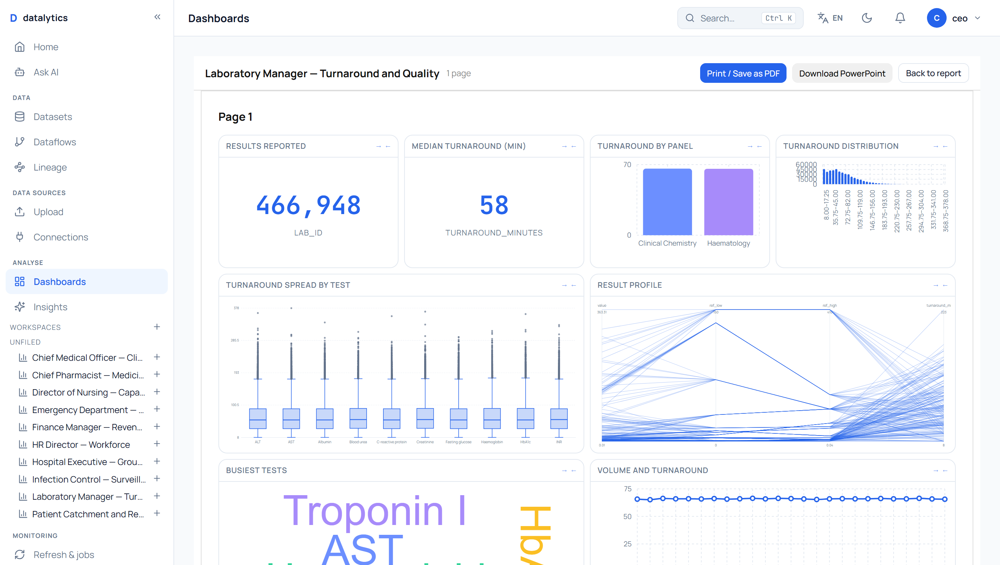
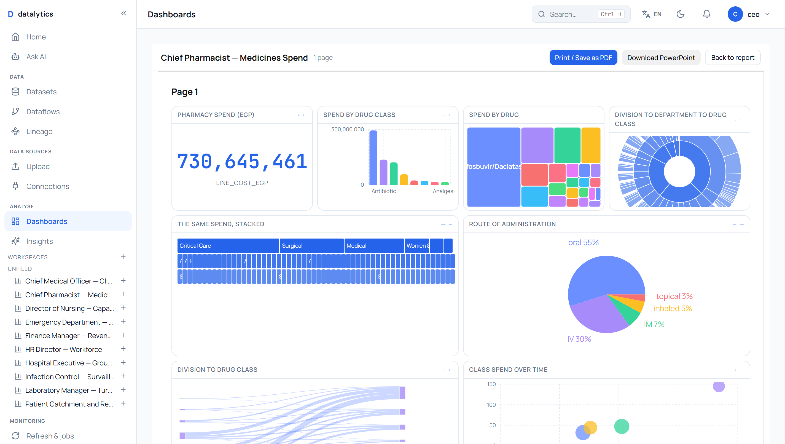
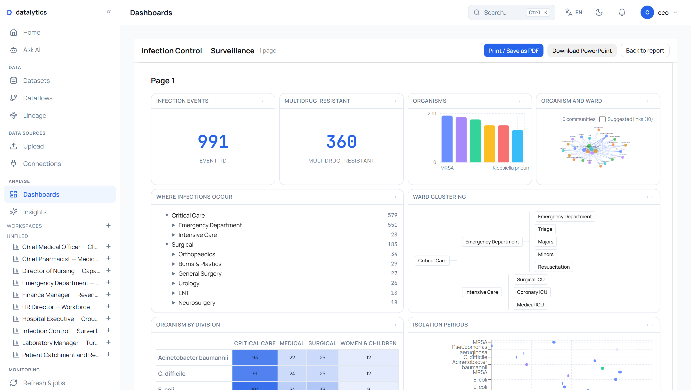
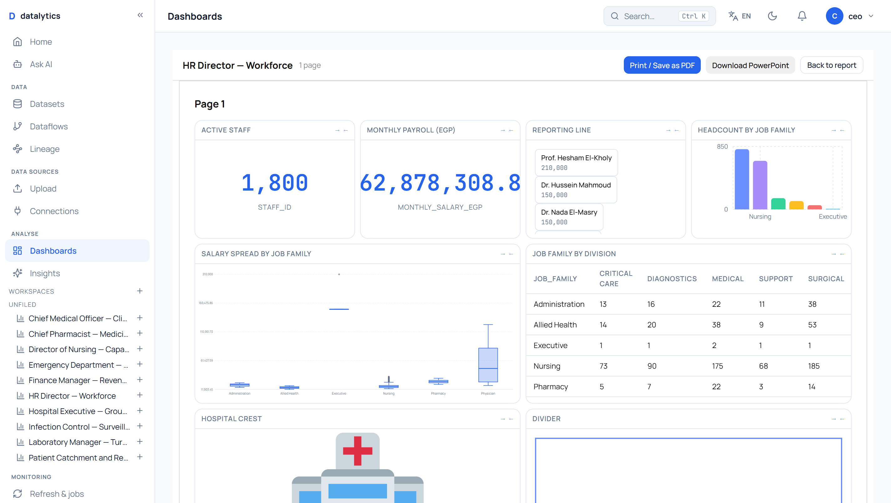
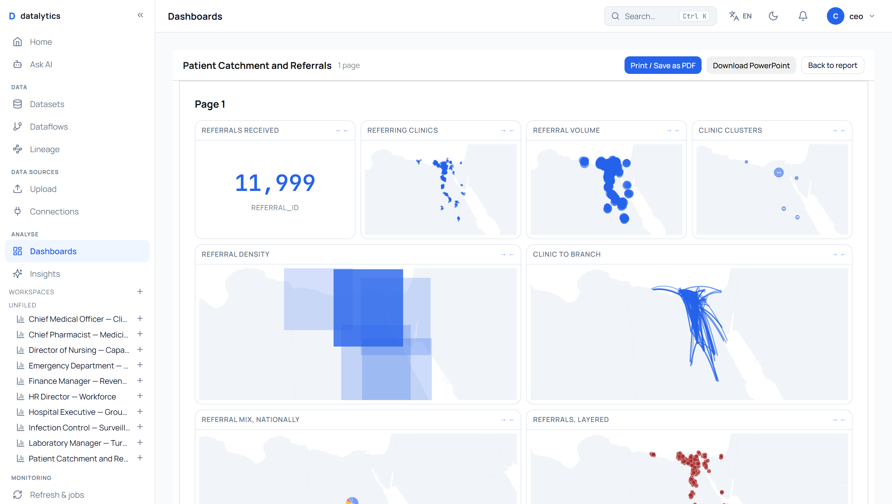

# Dar El Shifa Hospital Group — every widget, every job

A second exhaustive test of the platform, this time against a purpose-built
healthcare dataset: ten dashboards for ten hospital jobs, using **all 64 widget
types** the product has, on 1.5 million rows of synthetic Egyptian hospital data.

> **The data is entirely synthetic.** No real patient, clinician or hospital
> record is used or reproduced. Names, diagnoses and figures are generated from
> a seeded random model; the file rebuilds identically from
> `gen_hospital.py`. What is real is the *shape*: Egyptian governorates and their
> coordinates, ICD-10 codes, the local payer mix, and disease prevalences chosen
> to be plausible for Egypt — hepatitis C, diabetes, hypertension.

---

## The dataset, and why it is shaped this way

The schema was designed backwards from the 64 widgets. A widget catalogue this
wide needs geography, hierarchy, flow, distribution, correlation and time, and a
dataset that lacks any one of them leaves a category untestable.

| What the widgets need | What the data provides |
|---|---|
| **Maps** (9 types) | 27 governorates with real coordinates, 6 branches, 12 referring clinics — patients, referrals and sites all carry latitude and longitude |
| **Hierarchies** (tree, sunburst, icicle, dendrogram, org) | division → department → unit, 90 nodes deep, plus a real staff reporting line from the CEO down |
| **Flows** (funnel, sankey) | appointment → arrival → triage → admission → discharge, with genuine attrition at each step |
| **Distributions** (histogram, box plot) | length of stay, cost, wait time and lab values drawn from right-skewed distributions — a box plot of uniform noise shows nothing |
| **Correlation** (matrix, scatter, bubble) | HbA1c, creatinine, BMI, age and length of stay are deliberately related, so there is signal to find |
| **Time** (trend, forecast, comparative) | 740 days with weekday, seasonal, **Ramadan** and Eid effects |

### Tables

| Table | Rows | What it is |
|---|---:|---|
| `encounters` | 120,000 | one row per visit: arrival, triage, admission, discharge, outcome, cost |
| `lab_results` | 466,948 | 18 analytes with reference ranges, abnormal flags and turnaround |
| `pharmacy_dispense` | 228,050 | 22 medicines, priced in EGP, by route |
| `encounter_diagnoses` | 245,024 | primary and secondary ICD-10, up to four per encounter |
| `appointments` | 140,000 | booked, attended, no-show, cancelled — the top of the funnel |
| `bed_occupancy` | 53,280 | daily census by branch and department |
| `patients` | 40,000 | demographics, comorbidity, governorate and coordinates |
| `procedures` | 38,229 | 18 procedures from appendicectomy to CABG |
| `staff_shifts` | 33,300 | rosters — what the schedule widget draws |
| `referrals` | 11,999 | which clinic sent whom, and where to |
| `staff` | 1,800 | the reporting line, from the CEO down four levels |
| `equipment` | 1,200 | assets, value and uptime |
| `infection_events` | 991 | hospital-acquired infection with organism and resistance |
| `departments` | 90 | division → department → unit |
| `governorates / branches / diagnoses_ref` | 27 / 6 / 25 | reference data |

**125 MB, 18 tables, ~1.5 million rows**, at
`backend/sample_data/cairo_hospital.db`.

---

## The ten jobs

Each dashboard is shared, view-only, with the person whose job it is. Every
password is `Hospital-2026!`.

| Job | Login | What they need to know |
|---|---|---|
| **Hospital Executive** | `ceo@darelshifa.eg` | Runs the group. Activity, money, outcome, catchment. |
| **Chief Medical Officer** | `cmo@darelshifa.eg` | Mortality, length of stay, readmission, and what moves them. |
| **Emergency Department Manager** | `er.manager@darelshifa.eg` | Arrivals, triage acuity, where the queue builds. |
| **Director of Nursing** | `nursing@darelshifa.eg` | Beds, occupancy, ward staffing. |
| **Finance Manager** | `finance@darelshifa.eg` | Payer mix, collections, receivables age. |
| **Laboratory Manager** | `lab@darelshifa.eg` | Turnaround time and abnormal rates. |
| **Chief Pharmacist** | `pharmacy@darelshifa.eg` | Medicines spend by class, drug and division. |
| **Infection Control Lead** | `infection@darelshifa.eg` | Hospital-acquired infection, organism, resistance. |
| **HR Director** | `hr@darelshifa.eg` | Headcount, reporting line, payroll. |
| **Ward Physician** | `physician@darelshifa.eg` | Catchment and referral sources. |

Organisation: **Dar El Shifa Hospital Group** (`org_id 5`), 10 roles, 10 logins.

---

## Coverage: all 64 widget types

Every widget was created, executed against the dataset, **and photographed**.
Those are three different things, and this exercise learned the difference the
hard way — see [What the screenshots found](#what-the-screenshots-found).

```
92 widgets across 10 dashboards
   86 returned data
    6 are static by nature (text, image, shape, button, web content, container)
    0 returned an empty result
    0 returned an error
```

**64 of 64 widget types draw. Every tile on all ten dashboards was
photographed and looked at.**

An earlier version of this page made that claim on weaker evidence, and it was
wrong: see below.

| Category | Types | Used |
|---|---:|---|
| **Charts** | 31 | 31 ✓ |
| **Controls** | 13 | 13 ✓ |
| **Maps** | 9 | 9 ✓ |
| **Layout** | 1 | 1 ✓ |
| **Analytics** | 10 | 10 ✓ |
| **Total** | **64** | **64 ✓** |

---

## The dashboards

### Hospital Executive — Group Overview



| Widget | Type | Result |
|---|---|---|
| Encounters (2 years) | `kpi` | 1 rows |
| Headline figures | `card` | 50 rows |
| Average satisfaction | `gauge` | 1 rows |
| Encounters by branch | `bar` | 6 rows |
| Activity over time | `line` | 25 rows |
| Revenue over time | `area` | 25 rows |
| Cost by division | `treemap` | 6 rows |
| Patients by governorate | `map_choropleth` | 27 rows |
| About this dashboard | `text` | static content |
| Branch | `slicer` | 6 rows |

### Chief Medical Officer — Clinical Outcomes



| Widget | Type | Result |
|---|---|---|
| Age against length of stay | `scatter` | 50 rows |
| What moves together | `correlation_matrix` | 50 rows |
| Diagnosis chapter by division | `heatmap` | 14 rows |
| Deaths by diagnosis chapter | `small_multiples` | 25 rows |
| What drives cost | `decomposition` | 1 rows |
| In-hospital deaths | `kpi` | 1 rows |
| 30-day readmissions | `kpi` | 1 rows |
| Average length of stay by department | `bar` | 15 rows |
| Length of stay spread by division | `box_plot` | 6 rows |
| Length of stay distribution | `histogram` | 1 rows |

### Emergency Department — Flow and Waiting



| Widget | Type | Result |
|---|---|---|
| Median wait (minutes) | `kpi` | 1 rows |
| Wait by triage category | `needle` | 5 rows |
| Wait by admission source | `dot_plot` | 5 rows |
| Arrivals by month | `step` | 25 rows |
| Wait vs stay by triage | `butterfly` | 5 rows |
| Volume and wait by department | `dual_axis_bar_line` | 12 rows |
| From arrival to discharge | `funnel` | 5 rows |
| Triage mix over time | `ribbon` | 9 rows |
| Triage by encounter type | `matrix` | 5 rows |

### Director of Nursing — Capacity and Roster



| Widget | Type | Result |
|---|---|---|
| Average occupancy % | `kpi` | 1 rows |
| Occupancy over time | `line` | 25 rows |
| Occupancy by branch | `comparative_time_series` | 1 rows |
| Staffed against occupied beds | `dual_axis_time_series` | 1 rows |
| Occupied beds | `numeric_series` | 1 rows |
| Occupancy by division and branch | `crosstab` | 4 rows |
| Ward detail | `table` | 25 rows |

### Finance Manager — Revenue and Receivables



| Widget | Type | Result |
|---|---|---|
| Net revenue (EGP) | `kpi` | 1 rows |
| Revenue by payer | `bar` | 10 rows |
| Outstanding (EGP) | `kpi` | 1 rows |
| Revenue forecast | `forecast` | 25 rows |
| Gross to net by payer type | `waterfall` | 5 rows |
| Billed against collected | `dual_axis_bar` | 5 rows |
| Revenue by payer type | `pie` | 5 rows |
| Payer: volume, value, delay | `bubble` | 10 rows |
| Invoice status | `donut` | 3 rows |
| Slowest payers | `list` | 10 rows |

### Laboratory Manager — Turnaround and Quality



| Widget | Type | Result |
|---|---|---|
| Turnaround spread by test | `box_plot` | 18 rows |
| Results reported | `kpi` | 1 rows |
| Result profile | `parallel_coordinates` | 50 rows |
| Median turnaround (min) | `kpi` | 1 rows |
| Busiest tests | `word_cloud` | 18 rows |
| Turnaround by panel | `bar` | 2 rows |
| Volume and turnaround | `dual_axis_line` | 25 rows |
| Turnaround distribution | `histogram` | 1 rows |
| Abnormality by panel | `vector_plot` | 1 rows |

### Chief Pharmacist — Medicines Spend



| Widget | Type | Result |
|---|---|---|
| The same spend, stacked | `icicle` | 1 rows |
| Pharmacy spend (EGP) | `kpi` | 1 rows |
| Route of administration | `pie` | 5 rows |
| Spend by drug class | `bar` | 14 rows |
| Division to drug class | `sankey` | 6 rows |
| Spend by drug | `treemap` | 22 rows |
| Class spend over time | `bubble_change` | 14 rows |
| Division to department to drug class | `sunburst` | 1 rows |

### Infection Control — Surveillance



| Widget | Type | Result |
|---|---|---|
| Infection events | `kpi` | 1 rows |
| Ward clustering | `dendrogram` | 1 rows |
| Multidrug-resistant | `kpi` | 1 rows |
| Organism by division | `heatmap` | 6 rows |
| Organisms | `bar` | 6 rows |
| Isolation periods | `schedule` | 6 rows |
| Organism and ward | `network` | 6 rows |
| Where infections occur | `tree` | 1 rows |

### HR Director — Workforce



| Widget | Type | Result |
|---|---|---|
| Monthly payroll (EGP) | `kpi` | 1 rows |
| Hospital crest | `image` | static content |
| Reporting line | `org` | 1 rows |
| Divider | `shape` | static content |
| Headcount by job family | `bar` | 6 rows |
| Open the roster | `button` | static content |
| Salary spread by job family | `box_plot` | 6 rows |
| Active staff | `kpi` | 1 rows |
| Job family by division | `crosstab` | 6 rows |

### Patient Catchment and Referrals



| Widget | Type | Result |
|---|---|---|
| Referring clinics | `map_points` | 12 rows |
| Mix by governorate | `map_pie` | 27 rows |
| Custom | `custom_visual` | 27 rows |
| Referral volume | `map_bubbles` | 27 rows |
| Referrals, layered | `map_layers` | 27 rows |
| Clinic clusters | `map_clusters` | 1 rows |
| Referral network | `map_network` | 27 rows |
| Referral density | `map_density` | 1 rows |
| Map panel | `container` | static content |
| Referrals received | `kpi` | 1 rows |
| Clinic to branch | `map_lines` | 27 rows |
| Ministry of Health | `web_content` | static content |

---

## What the screenshots found

The dashboards were built and every widget was asked for its data. All 92
answered. On that basis this page previously said all 64 widget types drew.

**That was the wrong question asked of the wrong endpoint.** The check posted
only the widget's `config` and left out `widget_type` — the field the server
dispatches on. Every widget was therefore shaped by the fallback shaper, which
answers almost anything with rows. The verification exercised a code path no
browser ever takes, and it passed.

Photographing the ten dashboards is what found the truth: **six tiles said "No
data"**, several more drew something meaningless, and every map on the catchment
page was a picture of the world with a speck on it. What follows is what the
photographs showed, and what each one turned out to be.

### Configuration errors — mine, not the platform's

Widgets with more than two field roles were built as though they had two.

| Widget | What the tile showed | What it actually needed |
|---|---|---|
| `sunburst`, `icicle`, `tree`, `dendrogram` | "No data." | `levels: [...]` — a hierarchy is an ordered list of columns, not a dimension |
| `org` | "No data." | `id_col` + `parent_col` — a reporting line is a self-join |
| `sankey`, `network` | "No flows to draw" | `dimension2`: a flow needs a target as well as a source |
| `ribbon` | "No data." | `dimension2`: the series that ribbons across the periods |
| `bubble`, `bubble_change` | "No data." | X, Y **and** size — three measures before a bubble can be placed |
| `vector_plot` | "No data." | a magnitude *and* a bearing |
| `numeric_series` | "No data." | two numeric axes, not one |
| `map_lines`, `map_network` | "No data." | both ends: `lat2`/`lon2` as well as `lat`/`lon` |
| `map_pie` | "No data." | `dimension2` — the slice |
| `small_multiples` | one panel | `facet_by`; I had written `facet`, which nothing reads |
| `decomposition` | a root and no branches | `auto_split` or an explicit `split_by` |
| `image` | "No image URL set" | `url`; I had written `image_url` |
| `tree` (infection) | 284,686 events | `aggregation: count`. It was summing `event_id` — arithmetic on identifiers |

None of these is a platform defect. They are what happens when a widget with six
roles is handed the configuration for a widget with two.

### Platform defects the photographs exposed

Six, all silent, all fixed with tests.

| # | Defect | Why it mattered | Fix |
|---|---|---|---|
| 1 | **A time axis sorted by value** | "Arrivals by month" drew `2024-12, 2025-12, 2025-10, 2026-02…`. Every number right, the chart meaningless — a trend line whose x-axis is in rank order is not a trend line | A date dimension now defaults to chronological order. An explicit `sort_by` still wins, because "which month was busiest" is a real question — `test_time_axis_default_sort.py`, 7 tests |
| 2 | **`dimension_granularity` ignored by the matrix shapers** | "Triage mix by quarter" grouped by raw arrival *minute*: 120,000 columns and a 2.4 MB response for one tile. The config panel writes the field for any widget; this shaper dropped it. Third time this exact bug has been found in a different shaper | Applied in `shape_heatmap` (which serves both heatmap and ribbon), and guarded so a granularity attached to a non-date column leaves it alone instead of coercing everything to NaT — `test_heatmap_granularity.py`, 6 tests |
| 3 | **A phantom second series** | Five dual-axis renderers drew the second series unconditionally, labelled with the renderer's own internal key. A hospital manager's legend read `wait_minutes` and **`value2`**, over an empty line and a right-hand axis scaled to nothing | The second series and its axis render only when there is one — `dualAxisSecondSeries.test.tsx`, 15 tests |
| 4 | **One aggregation for two axes** | The reason a chart has two axes is that its numbers are different *kinds* of number. "Volume and average wait" — a count against a mean — could not be built at all | `aggregation2`, defaulting to `aggregation` so nothing saved moves, plus the control in the config panel where the server actually reads it — `test_dual_axis_second_aggregation.py` (7) and `secondAggregation.test.tsx` (7) |
| 5 | **Every map fitted to the whole world** | Nine map renderers shared one helper that fitted the projection to the world regardless of what was plotted. Six maps of Egypt, each drawing the Pacific at full size and the subject at four pixels | The projection is fitted to the plotted coordinates; shape maps fit country *bounds* rather than centroids, which would clip the country it was framing — `worldGeometry.fit.test.ts`, 11 tests including a pin against reintroducing centroid fitting |
| 6 | **A map that matched nothing said nothing** | The pie map places rows by country. Given 27 governorates it matched none and drew a bare world map — no pies, no message. The choropleth beside it already reports this case and its own comment says why: *"a hole in the map should read as '3 rows didn't match', not as zero"* | The same notice, and the density map now frames its own grid cells — `geoUnmatchedAndDensity.test.tsx`, 5 tests |

### Layout

Every dashboard's top row was laid out at `h=2` — the height a single KPI number
wants. Where a chart or a three-value card sat in that row, the contents were
taller than the tile: axis labels collided into a grey smear, and the card
scrolled, showing its middle value and a sliver of the one above that read as a
row of dashes. 83 tiles were re-laid out, and cards are now sized from the number
of measures they carry.

### Before and after

| | Before | After |
|---|---:|---:|
| Tiles reading "No data" | 6 | **0** |
| Widgets returning nothing | 8 | **0** |
| Widgets returning an unusable payload | 2 | **0** |
| Maps framed on their data | 0 of 9 | **9 of 9** |
| Charts with a phantom legend series | 5 types | **0** |
| Backend tests | 3,692 | **3,712** |
| Frontend tests | 1,618 | **1,656** |

---

## The bug this found

Building the laboratory dataset failed with:

```
400  The truth value of a Series is ambiguous.
     Use a.empty, a.bool(), a.item(), a.any() or a.all()
```

That message went straight to the user. It names no column, no table and nothing
they wrote, and points at pandas internals for a mistake made in SQL.

**The cause.** My query selected `l.unit` — a lab result's unit of measure — and
`COALESCE(d.unit, d.department) AS unit` — the department's unit. Two different
things that share a word. SQL is perfectly happy to return two columns with the
same name; pandas is not. `df["unit"]` stops being a Series and becomes a
DataFrame, and the first truth test on it raises.

It is an easy mistake to make in any join across a real schema, and trivial to
describe. So the import now describes it:

> *The query returns more than one column named 'unit'. Give each one a different
> name with AS, for example `l.unit AS lab_unit`.*

`duplicate_columns()` in `services/ingest.py`, checked at import before anything
touches the frame, case-insensitive because SQLite resolves `Unit` and `unit` to
the same key. **8 tests**, including one that fails if the pandas message ever
reaches a user again.

---

## What this exercise says about the platform

**It handled a domain it had never seen.** Nothing in this dataset resembles the
Moodle data the platform was previously tested against — different shape,
different scale, different question types — and every one of the 64 widget types
draws real output on it.

**Nothing needed a workaround.** No widget needed special handling and no chart
type had to be dropped. Several needed to be configured *properly* rather than
generically, which is a different thing and was my error, not the product's.

**Every defect was at a seam again.** A pandas message reaching a user
untranslated; a granularity honoured by one shaper and dropped by its neighbour;
a renderer inventing a series the server never sent; a projection that framed the
world when it was drawing one country. None of these is a broken engine. All of
them sit where two correct pieces meet, and all of them were silent — which is
the other half of the pattern. **Nothing on this page announced itself as an
error.** The blank tiles, the meaningless axis order, the phantom legend entry
and the world maps all rendered without a single console warning or non-200
response.

### Honest limits

1. **Every widget was looked at; none was clinically reviewed.** Each one now
   draws a chart a person can read. Whether a vector plot of lab abnormality is
   the *clinically* right chart is a judgement a laboratory manager should make,
   not me.
2. **A few widgets are drawn on data that merely fits them.** `vector_plot` has
   no true bearing column in this dataset and is given a numeric stand-in. It
   draws; it is not a wind rose.
3. **The geographic widgets match countries, not provinces.** `map_choropleth`
   and `map_pie` place rows by country name, so Egyptian governorates match
   nothing. They are pointed at a constant `country` column here, which draws one
   shaded country and one pie — honest, and thin. Sub-national geometry would be
   a real feature, not a fix. The maps that take coordinates (`map_points`,
   `map_bubbles`, `map_clusters`, `map_density`, `map_lines`, `map_network`,
   `map_layers`) have no such limit and carry this dashboard.
4. **The last period of every trend is partial.** The data ends mid-September
   2026, so the final point on every monthly chart drops. That is the dataset, not
   the chart — but it is exactly the trap a real deployment should guard.
5. **No row-level security is configured here.** Every job sees the whole
   hospital. In a real deployment a ward physician would be narrowed to their own
   patients — the mechanism exists and was tested in the university exercise.

