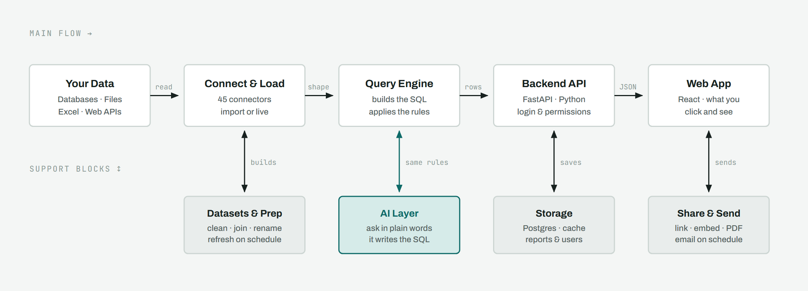
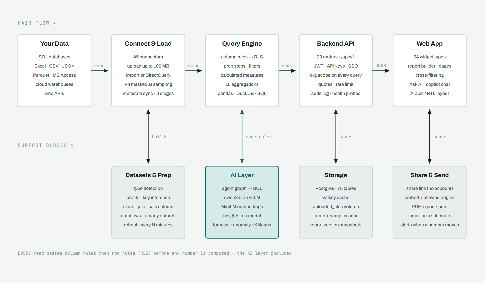
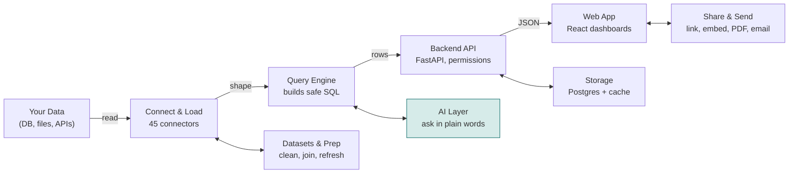

# Datalytics — project map

A self-hosted data analytics platform. Connect data → clean it → build dashboards →
ask questions in plain language → share the result.

**Read part 1 first.** Parts 1-5 are the map. Part 7 is the detail — thirteen topics,
read *one at a time*.

| | |
|---|---|
| Where the code is | `AI_data_tool/data_analytics/` |
| Not part of the app | `WrenAI/`, `superset_ref/`, `maps_project/` — reference material only |
| Runs on | Docker Compose: frontend `:3001` · API `:8000` · Swagger `:8000/docs` |
| Stack | React 18 + TypeScript + Vite · Python 3.12 + FastAPI · PostgreSQL 16 · Valkey · DuckDB |

---

## 1 · The picture



Data goes left to right. The four blocks underneath support the flow.
The AI layer is highlighted because it goes through **the same** security rules
as a normal chart.

### More detail, same picture



### What each block does

| Block | What it does |
|---|---|
| **Your Data** | Where the numbers really live — a company database, an Excel file, a web API. |
| **Connect & Load** | Opens the door to that source. Either copies the data in (*Import*) or asks the source live on every click (*DirectQuery*). |
| **Datasets & Prep** | Turns raw data into a clean, named table: fix types, rename columns, join two tables, refresh it every night. |
| **Query Engine** | The brain. A chart says "sales by month"; this block writes the real SQL and hides rows or columns the user may not see. |
| **AI Layer** | You type a question in normal English or Arabic; it turns it into SQL, runs it, and answers with a table or a chart. |
| **Backend API** | The one door for the web app. Checks who you are, what you may open, returns JSON. |
| **Storage** | Postgres keeps users, datasets, reports and settings. A cache keeps recent results so charts load fast. |
| **Share & Send** | Public link, embed in another site, print to PDF, or email the report every Monday. |
| **Web App** | Everything you touch: pages, dashboards, the report designer, the chat box. |

---

## 2 · What a user actually does

| # | Step | Where |
|---|---|---|
| 1 | **Bring in the data** — upload a CSV/Excel file, or connect a database. | `Upload` · `Connections` |
| 2 | **Look at it and clean it** — see columns, types, statistics; fix names, drop bad rows, join tables. | `DatasetDetail` · `Dataflows` |
| 3 | **Build the report** — drag widgets onto a grid, pick a dimension and a measure. Click one bar and every other chart follows. | `ReportBuilder` |
| 4 | **Ask instead of building** — "top 10 customers last quarter". Or ask the copilot inside a dashboard to change a widget. Or let the platform propose whole dashboards for the job you describe. | `AskAI` · `InsightsHub` · `SuggestDashboardsDialog` |
| 5 | **Share it** — link, embed, PDF, or a scheduled email. | `SharedReport` · `EmbeddedReport` · `ReportPrint` |

---

## 3 · Features

### Data
- **45 connectors** — PostgreSQL, MySQL, SQL Server and Oracle families; cloud
  warehouses (Snowflake, BigQuery, Databricks, ClickHouse, Trino — import only);
  SQLite, DuckDB, MS Access; any web API.
- **Custom connectors** — an admin wraps one of those base types in a named preset with
  settings already filled in, locks the fields nobody should change, and it appears in the
  catalog as its own tile. People connect through it without ever seeing the locked values.
- **File upload** — CSV, XLSX, JSON, Parquet (XML when `lxml` is installed), up to 100 MB.
- **Two modes** — *Import* copies the data in; *DirectQuery* asks the live source every time.
- **Auto profiling** — column types, statistics, cardinality, null rates, key inference,
  semantic typing, PII detection and masking.
- **Prep & dataflows** — dedupe, null handling, trim/case, replace, rename, retype,
  split, filter, drop columns, aggregate, join. Save the result as a new dataset.
- **Custom functions** — name a formula once per dataset, with parameters, and call it from
  any calculated column.
- **Scheduled refresh** — keeps imported data current, with backoff after failures.
- **Lineage** — which report uses which dataset uses which source.

### Reports & dashboards
- **64 widget types** — bar, line, pie, scatter, map, KPI, table, crosstab, gauge, text, buttons…
- **Multi-page reports** on a 12-column drag-and-drop grid.
- **Cross-filtering** — click a bar and the page follows. Per widget: send, receive, both or
  ignore, and the choice is saved with the report instead of being lost on reload.
- **16 aggregations** + running sum / running average + calculated measures and columns.
- **Themes** (`default`, `ocean`, `sunset`, `forest`, `mono`, `contrast`) and **page templates**.
- **Print & PDF export**, and full **right-to-left (Arabic)** layout.
- **Version history** — every edit snapshots the previous state; restore is itself undoable.

### AI
- **Ask AI** — a chat over your data: question in, table or chart out, history kept.
- **Report copilot** — a chat button inside a dashboard that edits widgets or answers data questions.
- **Insights Hub** — automatic findings: trends, standouts, laggards, correlations, outliers, data quality.
- **Dashboard suggestion** — describe your job and get whole dashboards proposed for a dataset:
  profiled, validated against what each widget type needs, and every tile executed before you
  see it. Leave the description empty and the Insights Hub picks the charts instead — no model.
- **Analysis catalogue** — nineteen analyses in one registry, thirteen runnable from a single
  screen and by the assistant: eight inferential tests (t-test/ANOVA, chi-square, correlation,
  OLS, logistic, mixed model, survival, pairwise), key influencers, association rules,
  segmentation (KMeans), an automated explanation, and goal seek. Plus forecasting (AutoETS)
  and anomaly detection (PyOD) as widgets. Every test reports an **effect size** beside its
  p-value — at two million rows a p-value alone is nearly content-free.
- **Ask the assistant a statistical question** — "is revenue really different between regions,
  or is it just noise?" runs a t-test rather than a `GROUP BY`, over the same row- and
  column-secured frame. Anything it cannot serve falls back to SQL.
- **Runs offline** — the model endpoint is self-hosted; `llm_enabled=False` removes the AI layer completely.
- **Same security** — the AI never sees rows or columns the user may not see.

### Sharing & security
- **Workspaces & folders** — share a folder subtree with a role or a team.
- **Roles** — org-scoped rows in the database, not hard-coded names.
- **Row-level security** — a salesperson sees only their own region.
- **Column rules** — the `cost` column is *removed*, not blanked, for people who may not see it.
- **Share links** (no account needed) and **embedding** with an origin allow-list.
- **SSO** — OIDC and SAML per organisation, resolved by email domain. Works with Keycloak.

### Admin & operations
- Admin pages: Users, Roles, Org units, Row security, Column security, SSO, API keys,
  Custom connectors, Export policy, Audit.
- Monitoring pages: Activity, Jobs, Deliveries.
- **Quotas** — queries/day, agent asks/day, storage MB, concurrent asks.
- **Alerts** — email when a condition becomes true (rising edge only).
- **Backup/restore** and an **offline bundle** script for air-gapped installs.

---

## 4 · Editing the diagram yourself

The pictures above are PNGs. Here is the same diagram as **Mermaid** — a text
format that draws itself. Change any word and it redraws.



How to use it:

1. **Easiest** — open <https://mermaid.live>, paste on the left, see the picture on
   the right, download PNG or SVG.
2. **draw.io** — `Arrange → Insert → Advanced → Mermaid`, paste, insert. Then drag
   the boxes by hand.
3. **VS Code** — install *Markdown Preview Mermaid Support*, then preview this file.
   GitHub renders the block above natively.
4. **Hand-drawn look** — <https://excalidraw.com>, no code.

---

## 5 · Running it

```powershell
cd "AI_data_tool\data_analytics"

# everything at once: stack up, wait for /health/ready, create the admin,
# seed demo content, print every login
.\scripts\demo_up.ps1

# or plain docker
docker compose up --build
```

> A fresh stack creates an Organization and an Admin **role** but no **user**, and
> there is no signup endpoint — so run `demo_up.ps1` (or create the first admin
> yourself) or nobody can sign in.

Demo logins (created by seeding, deleted by unseeding):

| Login | Password | Sees |
|---|---|---|
| `demo-global@example.invalid` | `demo-password` | Everything |
| `demo-emea@example.invalid` | `demo-password` | Europe rows only, no `cost` column |

Tear down: `.\scripts\demo_down.ps1` (add `-Stack` to stop containers too).

---

## 6 · Where to go next

- **[Part 7 below](#7--deep-dive-thirteen-topics)** — thirteen topics, each with *what it is ·
  where the code is · how it works · how to try it · how to test it*.
- `AI_data_tool/data_analytics/ARCHITECTURE.md` — the full seven-layer architecture (long).
- `AI_data_tool/data_analytics/docs/DEMO_WALKTHROUGH.md` — four click-by-click demo stories.
- `AI_data_tool/data_analytics/docs/OFFLINE_DEPLOYMENT.md` · `BACKUP_AND_RECOVERY.md`

---

## 7 · Deep dive: thirteen topics

Read **one section at a time**. Every section has the same five parts:

> **What** it is · **Where** the code is · **How** it works · **Try it** in the app · **Test it** on the command line

Paths are relative to `AI_data_tool/data_analytics/`.

**The thirteen topics**

1. [Auto profiling](#1--auto-profiling)
2. [Prep & dataflows](#2--prep--dataflows)
3. [Scheduled refresh](#3--scheduled-refresh)
4. [Templates & themes](#4--templates--themes)
5. [Version history](#5--version-history)
6. [The AI part — which model does what](#6--the-ai-part--which-model-does-what)
7. [Insights Hub vs metadata sync](#7--insights-hub-vs-metadata-sync)
8. [Runs offline](#8--runs-offline)
9. [Same security](#9--same-security)
10. [Sharing & security, and Keycloak](#10--sharing--security-and-keycloak)
11. [Admin & operations](#11--admin--operations)
12. [Quotas and alerts](#12--quotas-and-alerts)
13. [Dashboard suggestion](#13--dashboard-suggestion)

[Setting up the test environment](#setting-up-the-test-environment) is at the end of this
part — do that once, then every "Test it" line works.

---

### 1 · Auto profiling

**What.** When you upload a file or connect a source, the platform describes the data
for you: what type each column is, how many distinct values, how many nulls, which
column is probably the primary key, which two columns are probably related, and which
columns hold personal data.

**Where.**
- `backend/app/services/ingest.py` — `load_file()`, `detect_types()` for uploads
- `backend/app/services/metadata/` — the pipeline for connected sources
- `backend/app/services/pii.py` — personal-data detection and masking

**How.** For a connected source the metadata sync runs six stages in order:

| # | Stage | What it produces |
|---|---|---|
| 1 | discover | tables and columns |
| 2 | profile | statistics, top values, null rate |
| 3 | sample | ~1000 masked rows into a local DuckDB cache |
| 4 | infer_keys | declared foreign keys, plus candidates from value overlap |
| 5 | infer_sem | semantic type, role (measure/dimension/id/date), description |
| 6 | drift | fingerprint the schema and notice when it changes |

Three things worth knowing:
- **Stages fail independently.** A warehouse that times out on one wide table does not
  cost you the other five stages. Only a stage-1 failure marks the run failed.
- **PII is masked before anything is stored or sent.** The mask carries a hash, not a
  shape (`a****@c***.com`), because stage 4 compares values across columns — shape-only
  masking would collapse distinct values and invent relationships that do not exist.
- **The author always wins.** If you renamed a column or wrote a description, the next
  sync will not overwrite it.

**Try it.** `Connections` → open a source → **Sync**. Then `SourceReview` shows tables,
inferred keys, semantic types and anything that drifted. For a file: `Upload` a CSV →
`DatasetDetail` shows the detected types and statistics.

**Test it.**
```powershell
python -m pytest tests/test_infer_keys_accuracy.py -q     # precision/recall floors
python -m pytest tests/test_pii.py tests/test_catalog_sync.py -q
```

---

### 2 · Prep & dataflows

**What.** Two related things.

- **Prep** = a list of cleaning steps attached to *one dataset*, applied every time the
  data is loaded. This is the Power Query equivalent.
- **Dataflow** = the same recipe promoted to a **first-class object**: it can produce
  *several* outputs, has its own schedule, and has its own permissions instead of
  borrowing whatever the reports that use it allow.

**Where.**
- `backend/app/services/prep.py` — the steps and how they apply
- `backend/app/routers/dataflows.py` — the dataflow object
- `frontend/src/components/report/PrepPipelinePanel.tsx` — the editor
- `frontend/src/pages/Dataflows.tsx` — the dataflow page

**How.**
- Steps available: dedupe, null handling, trim/case, replace values, rename, retype,
  split, row filter, remove column, aggregate — plus **join** to another dataset.
  Maximum 50 steps, stored as one JSON list.
- **Non-destructive.** The uploaded file is never rewritten. Remove a step and what it
  changed comes back. That is what makes the editor safe to experiment in.
- **Order matters and is fixed:**
  `load → column security → RLS → PREP → dataset filter → calculated columns`.
  Prep runs *after* security on purpose: an aggregate step must summarise only the rows
  you may see, and a fill-from-mean must impute from the visible slice.
- **Materialize** (`POST /datasets/{id}/materialize`) runs the pipeline once and writes
  the result as a new dataset — that is how "three datasets joined" becomes one
  listable dataset instead of a view that re-joins on every read. It records its recipe,
  so `POST /datasets/{id}/rebuild` can re-run it.
- **Materialize refuses governed sources.** A snapshot would freeze one person's
  row-security slice as everyone's data. It also refuses export-blocked sources, because
  a materialized copy is downloadable.
- **Permissions: authoring is gated, reading is not.** Someone with `view` on a dataflow
  still sees its output data in full — the output is an ordinary dataset, narrowed by
  the reader's own RLS.
- Validation is **hard at save time** (the API returns 400) and **soft at apply time** —
  a column deleted by a re-upload degrades the one step that used it, instead of
  blanking every widget.
- **Custom functions are the reuse layer above calculated columns.** A named, parameterized
  formula stored on the dataset (`services/custom_functions.py`); calling one **expands its
  body into the caller's expression before the safety check runs**, so a custom function can
  never introduce a primitive the expression sandbox does not already allow — the evaluator
  itself is unchanged. Two rules follow from that: a name may not collide with a measure's
  (checked in *both* directions), and a **row-security rule may not call one** — expansion is
  wired into `apply_calculated_columns` only, never into `apply_filter_expr`/`apply_rls_filter`,
  so a rule can never quietly come to mean something else because someone edited the function
  later. The call fails like any undefined name: a 400 at save time.

**Try it.** `DatasetDetail` → **Prep pipeline** → add "drop rows where cost is empty" →
compare the tile before and after. Then `Dataflows` → **New** → build a recipe with two
outputs → **Run**. For a custom function: `DatasetDetail` → **Calculated columns** →
**Custom functions** → **Add** → name `PROFIT_MARGIN`, parameters `revenue, cost`, expression
`(revenue - cost) / revenue` → **Test** it with sample values → save, then call
`PROFIT_MARGIN(revenue, cost)` from a calculated column (it is in the expression palette).

**Test it.**
```powershell
python -m pytest tests/test_prep_steps.py tests/test_prep_steps_api.py tests/test_prep_join.py -q
python -m pytest tests/test_dataflows_api.py tests/test_dataflow_permissions.py -q
python -m pytest tests/test_custom_functions.py -q
```

---

### 3 · Scheduled refresh

**What.** An import-mode dataset re-reads its source on a schedule, so a dashboard built
on Monday still shows Friday's numbers.

**Where.**
- `backend/app/services/refresh_scheduler.py` — the loop
- `backend/app/services/dataset_refresh.py` — one refresh
- `frontend/src/pages/monitoring/MonitoringJobs.tsx` — what ran, and what failed

**How.**
- The scheduler runs **in-process**, so there is one per uvicorn worker. Without a guard,
  four workers would refresh the same dataset four times at once, each overwriting the
  same file while the others read it. The guard is a **Postgres advisory lock per
  dataset** — the database is already the one thing every worker shares. On SQLite (tests
  and single-process dev) the lock is skipped, which is safe because those have one worker.
- `TICK_SECONDS = 60` — the loop wakes every minute and picks up anything due.
- `MIN_INTERVAL_MINUTES = 5` — a 1-minute schedule against a production database is a
  self-inflicted denial of service.
- `MAX_ITEMS_PER_TICK = 25` — after downtime everything is due at once; the cap turns
  that stampede into a drain over a few ticks, oldest first.
- `ITEM_CONCURRENCY = 3` — each item gets its own DB session, because an AsyncSession is
  not concurrency-safe.
- **Backoff on failure**, by attempt count, and it never gives up: an item that failed six
  times is retried daily, because the fix is usually on the other side (a database comes
  back, a credential is rotated) and nobody wants to hunt for a "re-enable" button.

**Try it.** `DatasetDetail` → **Refresh schedule** → every 15 minutes. Then
`Monitoring → Jobs` to watch runs and failures.

**Test it.**
```powershell
python -m pytest tests/test_refresh_schedule.py tests/test_scheduler_backoff.py -q
python -m pytest tests/test_dataset_refresh_modes.py tests/test_scheduled_materialization.py -q
```

---

### 4 · Templates & themes

**What.** Two separate things people often confuse.

- **Theme** = the colour palette of the charts in a report. One string on the report row.
- **Page template** = a saved page layout (widgets and their config) you can drop into
  another report.

**Where.**
- `frontend/src/components/report/themes.ts` — the palettes
- `backend/app/services/page_templates.py` — serialise / rehydrate a page
- `backend/app/routers/widget_templates.py` — single-widget templates

**How.**
- Six themes: `default`, `ocean`, `sunset`, `forest`, `mono`, `contrast`. Each is ten
  colours. `contrast` is Okabe-Ito **reordered by alternating luminance**, so consecutive
  series differ in brightness as well as hue — they stay distinguishable in greyscale and
  to common forms of colour blindness. A test pins the minimum luminance gap.
- Colour alone is never the only signal: `SERIES_DASHES` and `SERIES_PATTERNS` give each
  series a second channel (a dash pattern for lines, an SVG fill pattern for areas, bars
  and pies), so a printed or greyscale chart still reads.
- A page template is one **serialise → rehydrate** pair, and the same pair serves three
  features: custom templates, built-in templates, and *importing a page from another
  report* (which is serialise-then-rehydrate with nothing stored in between).
- Widget ids that point at other widgets (a container) are stored as **indices** and
  remapped on rehydrate. A reference that leaves the page is dropped, not carried — a
  templated child pointing at a container that is not in the template would render nowhere.

**Try it.** `ReportBuilder` → **Report settings → Theme** → pick `ocean`, watch every chart
change. Then right-click a page tab → **Save as template**, and add it to another report.

**Test it.**
```powershell
python -m pytest tests/test_report_theme.py tests/test_page_templates.py tests/test_widget_templates.py -q
```
```powershell
cd ..\frontend
npx vitest run src/components/report/chartUtils.test.ts
```

---

### 4b · Custom visuals — the two-way contract

A **Custom Visual** widget embeds a page you host and hands it that widget's
shaped data. Since 2026-09-10 the page can select back, so a hand-built map or a
bespoke chart participates in cross-filtering like any built-in widget.

The page receives, on load and whenever the data changes:

```js
window.addEventListener('message', e => {
  if (e.data?.type === 'datalytics:data') draw(e.data.data)   // the shaped result
})
```

and selects by posting to its parent:

```js
parent.postMessage({ type: 'datalytics:select', value: 'Europe' }, '*')
parent.postMessage({ type: 'datalytics:clear' }, '*')          // selection cleared
```

**What the report will and will not accept.** The frame is sandboxed to
`allow-scripts`, so its origin is opaque and every message it sends arrives as
`origin: "null"` — indistinguishable from any other sandboxed frame on the page.
The report therefore identifies the sender by **window identity**, not origin.

The page sends a **value**; the report supplies the **column** — the widget's own
dimension — and applies the selection through the same path a click on a bar
takes. So a custom visual has exactly the power of a click:

- it cannot filter on a column it was not given (a `column` in the payload is ignored);
- it cannot broadcast on a page whose interaction settings forbid it — there, no
  listener is attached at all;
- it cannot reach the app, the parent document, or any credential.

---

### 5 · Version history

**What.** Every change to a report saves the state *before* the change. You can look at
the list, restore an old one, and undo the restore.

**Where.**
- `backend/app/routers/reports.py` — capture on mutation, restore endpoint
- `ReportVersion` table in `backend/app/models/models.py`
- `frontend/src/components/report/VersionHistoryPane.tsx`, opened from
  `frontend/src/pages/ReportBuilder.tsx` (the **History** tab in the right-hand panel)

**How.**
- Capture is **pre-mutation**: the version records what the report looked like *before*
  the edit that triggered it. The trap is that by the time the revision counter bumps, the
  ORM objects are already dirty — so the capture re-selects the stored state rather than
  reading the in-memory objects.
- **Restore replaces content, not identity.** Pages and widgets come back; the report's
  name and publish state stay as they are. Restoring an old version does not un-publish
  a live report.
- **A restore is itself a version**, so restoring the wrong one is undoable.
- The window is **pruned** — history does not grow forever.
- The same revision counter also detects a concurrent edit (two people in one report).

**Try it.** `ReportBuilder` → open a report → delete a widget → right panel → **Version
history** → restore the entry above → the widget is back. Restore again to undo.

**Test it.**
```powershell
python -m pytest tests/test_report_versions.py -q
```

---

### 6 · The AI part — which model does what

**What.** "AI" in this app is not one model. Fourteen different things wear that label below,
and only six of them call a language model at all.

| Feature | What actually runs | Config key |
|---|---|---|
| **Ask AI / NL→SQL agent** | `qwen3.5` on a **self-hosted vLLM** endpoint, OpenAI-compatible | `llm_base_url`, `llm_model`, `llm_enabled` |
| **Report copilot** (dashboard chat) | The same LLM, via `services/agent/nodes/copilot.py` | same |
| **Column/table descriptions** (metadata stage 5) | The same LLM — **opt-in**, and the only part of profiling that leaves the box | same |
| **Insights narrative** (the paragraph) | The same LLM, phrasing numbers already computed. Falls back to a template paragraph | same |
| **Insights findings** (the numbers) | **No model.** Six deterministic detectors in pandas | — |
| **Dashboard suggestion** (dataset + a description of your job) | The same LLM, fenced by a data profile, `REQUIRED_ROLES` validation and real execution — [topic 13](#13--dashboard-suggestion) | same |
| **Dashboard suggestion** (description left empty) | **No model.** The Insights Hub findings pick the charts | — |
| **Retrieval / semantic search** | Default is **lexical TF-IDF in pure numpy**. Optional embeddings backend: `Xenova/paraphrase-multilingual-MiniLM-L12-v2` (ONNX, in the `embeddings` container) | `embedding_base_url`, `embedding_model`, `embedding_dim` |
| **Forecast widget** | **AutoETS** (`statsforecast`) — statistics, not an LLM | — |
| **Anomaly detection** | **Isolation Forest / ECOD** (PyOD) | — |
| **Segmentation** | **KMeans** (scikit-learn) | — |
| **Statistical tests, explanation, goal seek** | **No model.** scipy/statsmodels/numpy, dispatched from the analysis registry | — |
| **Choosing WHICH analysis answers a question** | The same LLM — and only to pick the columns, from an enum built out of the secured frame, so it cannot name a column that is missing or forbidden | same |
| **PII detection, semantic types** | Regex classifiers over the masked sample | — |

**How the agent works.** It is an explicit graph, not a prompt chain
(`backend/app/services/agent/graph.py`):

```
classify → (clarify) → context → plan → DAG[ generate → ladder → policy
                                             → execute → sanity ] → explain
```

- The **repair loop lives inside a node**: at most `MAX_ATTEMPTS` generations, each retry
  fed the exact validation rung that rejected the previous attempt. The graph stays acyclic.
- **The agent inherits RLS.** `graph.py` imports `resolve_rls_expr` from `core/rls.py`
  directly, so generated SQL is filtered by the same rules as a hand-built widget. You
  cannot ask the agent for data your account cannot see.
- The model endpoint is treated as **unreliable by design** — it may be rebooted or
  saturated. Failure degrades to a documented answer, never an exception.
- Concurrency is shared across features: `llm_max_concurrency = 12` in total, with
  `llm_reserved_interactive = 2` slots that background work may never occupy — so your
  question does not queue behind 82 table descriptions.

**Try it.** `AskAI` → "total sales by region last quarter". Then open a dashboard and use
the chat button (copilot) → "make this chart a line chart".

**Test it.**
```powershell
python -m pytest tests/ -k "agent" -q
python -m pytest tests/test_insights.py tests/test_insight_narrative.py -q
.\run_eval_gate.ps1        # agent quality gate (needs a live model endpoint)
```

---

### 7 · Insights Hub vs metadata sync

**Short answer: they are not connected.** They are two different automatic-description
features, and they operate on two different things.

| | Metadata sync | Insights Hub |
|---|---|---|
| Operates on | a **source** (a database connection) | a **dataset** (rows you can query) |
| Looks at | the schema and a masked sample | the whole secured frame |
| Produces | catalog: types, keys, semantic roles, descriptions, drift | findings: trends, standouts, outliers, quality problems |
| Endpoint | `POST /api/v1/sources/{id}/sync` | `POST /api/v1/datasets/{id}/insights` |
| Code | `services/metadata/sync.py` | `services/insights.py` |
| Who consumes it | the agent's schema context, `SourceReview` | the `InsightsHub` page |

The only thing they share is that both *can* use the LLM for prose, and both apply the
same security rules. Metadata sync does **not** feed the Insights Hub.

**The six insight detectors**, each scoring findings 0–1 so unrelated kinds rank in one list:

| Detector | Finds |
|---|---|
| `trend` | last full period vs the average of prior periods, per measure |
| `standout` | a category member carrying an outsized share of a measure |
| `laggard` | the weakest member of an otherwise even category |
| `correlation` | strongly moving measure pairs |
| `outlier_impact` | rows beyond the IQR fences, and the share of the total they carry |
| `data_quality` | heavy missingness, gaps in date coverage |

Every number is **computed, never guessed** — each finding carries the figures its
sentence states. The LLM only rephrases; if it states a number the evidence does not
contain, the reply is thrown away and the template paragraph is used instead.

**Novelty**: a finding you have already seen is ranked down, so the second scan does not
repeat the first (`apply_novelty`, compared against stored `insights_scan` results).

**Try it.** `InsightsHub` → pick a dataset → **Scan**. `SourceReview` → pick a source →
**Sync**. They are different pages, on purpose.

**Test it.**
```powershell
python -m pytest tests/test_insights.py tests/test_insight_novelty.py tests/test_insight_narrative.py -q
```

---

### 8 · Runs offline

**What.** The platform is designed to run with **no internet access at all** —
an air-gapped network, a factory, a bank.

**Where.** `backend/app/services/net_guard.py` · `scripts/build_offline_bundle.ps1` ·
`frontend/src/offlineAssets.test.ts` · `docs/OFFLINE_DEPLOYMENT.md`

**How.**
- **Frontend assets are bundled, not CDN-loaded.** A test (`offlineAssets.test.ts`) pins
  this — add a CDN `<link>` and the build fails.
- **Map geography ships with the image** (`world-atlas`), so map widgets work with no tile server.
- **The model endpoint is self-hosted** (your own vLLM box). Set `llm_enabled = False` and
  the AI layer disappears entirely — every other feature still works.
- **The embeddings model is baked into the image**, downloaded at build time only.
- `scripts/build_offline_bundle.ps1` produces image tarballs plus a `MANIFEST.json`
  recording exact image IDs and digests, so what you carried across the air gap is
  verifiable on the other side.
- Nothing in the running stack fetches from the public internet.

**Try it.** Set `llm_enabled=false` in `.env`, restart, and confirm the app still loads,
charts still render, and the Ask AI page says the feature is off rather than erroring.

**Test it.**
```powershell
cd ..\frontend
npx vitest run src/offlineAssets.test.ts
```

---

### 9 · Same security

**What.** One sentence: **every path that reads data goes through the same two gates**,
in the same order — column rules first, then row rules — and there is no exception for
the AI, for prep, for alerts, or for a scheduled email.

**Where.** `backend/app/core/rls.py` — the single enforcement point.

| Function | Purpose |
|---|---|
| `apply_user_context()` | bind the acting user to the query |
| `resolve_rls_expr()` | the row filter for this user + dataset |
| `expand_author_expressions()` | expand author-written rule expressions |
| `resolve_denied_columns()` | which columns this user may not see |

**How.**
- **RLS is applied during query construction**, not by filtering results afterwards. The
  hidden rows are never loaded.
- **Column denial removes the column from the projection.** It is *gone*, not blanked —
  so there is nothing to un-blank in the browser's network tab.
- Authorisation is two layers: **organisation scope** decides which rows are reachable at
  all; **RLS** decides which of those you may see.
- The agent imports `resolve_rls_expr` directly. This is the one deliberate
  upward-dependency exception in the whole architecture, and it exists so generated SQL
  inherits governance rather than re-implementing it.
- Prep applies the same three functions, so a prepared frame is governed exactly like a
  widget query.
- Alerts and scheduled emails resolve RLS **as their creator** — "no viewer" must never
  mean "no RLS".
- A test pins the list of call sites: adding a new `apply_rls_filter` call fails the build
  until it is reviewed and allow-listed.

**Try it.** Sign in as `demo-global@example.invalid`, open *Use case — Regional
performance review*: all regions, `cost` present. Sign out, sign in as
`demo-emea@example.invalid`, open the **same report**: Europe only, `cost` gone. Then ask
the agent "what were total sales?" — the answer respects the same rules.

**Test it.**
```powershell
python -m pytest tests/ -k "rls or column_security" -q
python -m pytest tests/test_rls_base_frame_choke_point.py -q
```

---

### 10 · Sharing & security, and Keycloak

### The layers, from widest to narrowest

| Layer | Question it answers | Where |
|---|---|---|
| Organisation | which rows exist for you at all | `core/org_scope.py` |
| Workspace folders | which reports appear in your **menu** | `workspace_folder_roles` |
| `ReportCapability` | may you open / edit this report | `core/capability.py` |
| Row security (RLS) | which **rows** of a dataset | `core/rls.py` |
| Column security | which **columns** | `core/rls.py` |

> **Folder visibility is not access control.** `GET /reports/{id}` returns a report to any
> member of the org regardless of where it is filed. Hiding a menu entry is tidiness.
> Real access is `ReportCapability`; real data limits are RLS and column rules. A test
> (`TestVisibilityIsNotAccessControl`) asserts this deliberately, so turning the menu into
> an ACL breaks a test rather than quietly making the docs wrong.

Two defaults worth remembering:
- **A folder with no role rows is visible to everyone.** Grants *restrict*; they are not a
  licence that must first be issued. The opposite default would empty every non-admin menu
  the day it shipped.
- **Restriction is subtree-effective.** A report filed in a folder you cannot see is absent
  from your tree entirely — not moved to "Unfiled", which would defeat the restriction.

### Sharing outward

- **Share link** — the recipient needs no account and sees only that report.
- **Embed** — a token-addressed config with an **origin allow-list**, and per-widget
  visibility resolved against the **creator's** permissions. There is no per-viewer licence.

### Is Keycloak useful here?

**Yes, and it plugs in with no code change — but understand exactly what it does and does not do.**

- Each organisation has one IdP row (`org_idps`), resolved at login **by the user's email
  domain**. `protocol` is `oidc` or `saml`. For OIDC you give it the issuer URL
  (`…/.well-known/openid-configuration`), client id, and client secret (stored encrypted).
  A Keycloak realm is exactly that shape.
- **What Keycloak solves:** one central place for accounts and passwords, MFA, password
  policy, AD/LDAP federation, and one sign-on across your other apps.
- **What Keycloak does NOT solve:** *what a user can see inside Datalytics*. Roles, report
  capabilities, row rules and column rules are all assigned **inside Datalytics**, in the
  Admin pages, on the org-scoped `roles` table.
- **Important:** SSO **authenticates users an admin already created.** A successful
  Keycloak login whose email has no matching user in the org is **refused, not
  provisioned**. So adopting Keycloak does not remove the step of creating the user and
  giving them a role here.

**Verdict:** worth it if you already run Keycloak or need MFA/AD. Not worth it if you have
a handful of users — it adds a second system without reducing the per-user setup here.

### Login examples

Set up by `.\scripts\demo_up.ps1`.

| Login | Role | Menu | Rows | Columns | Can edit? |
|---|---|---|---|---|---|
| the admin printed by `demo_up.ps1` | Admin (`is_org_admin`) | every folder, including restricted ones | all | all | yes, plus all Admin pages |
| `demo-global@example.invalid` | `Demo — Global analyst` | **Widget gallery** only (Use cases is restricted to the EMEA role) | all regions | `cost` present | own reports |
| `demo-emea@example.invalid` | `Demo — EMEA analyst` | **both** folders — the grant is what makes the difference visible | Europe only (`region == 'Europe'`) | `cost` **removed** | own reports |

The point of the pair: open the *same* report as both, and the difference is data, not a
different page.

**Try it.** `Admin → Row security` shows the rule as one expression on the **role**, not on
the user. `Admin → Column security` shows the `cost` rule. Click 🔓 on a folder to restrict
it to roles — 🔒 means restricted.

**Test it.**
```powershell
python -m pytest tests/test_workspace.py tests/test_embed.py tests/test_share_links.py -q
python -m pytest tests/ -k "sso or saml" -q
```

---

### 11 · Admin & operations

**What.** Everything an operator needs after the app is running.

**Admin pages** (`frontend/src/pages/admin/`):

| Page | Does |
|---|---|
| `AdminUsers` | create and edit users |
| `AdminRoles` | roles (org-scoped rows; `is_org_admin` is the flag that matters) |
| `AdminOrgUnits` | organisation units, used by row rules that climb a hierarchy |
| `AdminRowSecurityRules` | one expression per role per dataset, e.g. `region == 'Europe'` |
| `AdminColumnSecurityRules` | which columns a role may not see |
| `AdminSso` | the org's OIDC/SAML identity provider |
| `ApiKeys` | programmatic access |
| `AdminCustomConnectors` | connector presets — a base type with settings pre-filled and locked |
| `AdminExportPolicy` | who may download data |
| `AdminAudit` | admin action log |
| `PlatformOrgs` | tenancy — separate from Admin, gated by a platform-admin allowlist |

**Custom connector presets** deserve a note, because they are the one admin page that
changes what everyone else *sees*. A preset (`services/custom_connectors.py`,
`custom_connectors` table) wraps one existing base type from `connectors.py` with a fixed
`base_config` and a list of **locked fields**. It appears in the connection catalog as its
own tile, and `apply_preset_locks` re-applies the locked values on every create and update —
so a user cannot widen one by editing the connection afterwards, and a `PUT` cannot desync a
preset-attached source's type. Secret fields round-trip through a sentinel value, never the
plaintext: saving a preset without retyping the password keeps the stored one.

**Monitoring pages** (`frontend/src/pages/monitoring/`): `MonitoringActivity` (queries and
slow queries), `MonitoringJobs` (refreshes and their failures), `MonitoringDeliveries`
(scheduled emails, one row per attempt).

**Health probes**, with a deliberate split:

| Endpoint | Means | Touches the database? |
|---|---|---|
| `/health` and `/health/live` | is the process alive | **no** — a liveness probe that opens a DB connection turns a 30-second Postgres blip into a restart loop |
| `/health/ready` | can this replica serve right now | yes — Postgres required (503 if down), Valkey optional (reports `degraded`, still 200) |

**Observability** — `core/telemetry.py`, OpenTelemetry traces and metrics, **off by
default** and a hard no-op when off (the packages are not even imported). Four metrics
only: widget query duration, widget query total, cache operations, quota rejections.
Span query strings are scrubbed before export, because the embed URL carries a live token.

**Backup** — two volumes must survive as a **pair**: `postgres_data` and `uploaded_files`.
A database restored without the files looks intact and fails at the first import-mode
widget. `scripts/backup.ps1` / `restore.ps1` enforce the ordering (files first on backup,
database first on restore). See `docs/BACKUP_AND_RECOVERY.md`.

**Test it.**
```powershell
python -m pytest tests/test_monitoring_endpoints.py tests/test_admin_audit.py -q
python -m pytest tests/ -k "health" -q
python -m pytest tests/test_custom_connectors.py tests/test_data_sources_custom_connector.py -q
```

---

### 12 · Quotas and alerts

These two are unrelated despite both living in "operations". One protects **the system**,
the other watches **your data**.

### Quotas — protect the system from a tenant

Four independent limits per organisation (`services/quotas.py`, `Quota` table). **All are
nullable, and null means unlimited** — no quota row (the common case) changes nothing.

| Limit | Counted from | Window |
|---|---|---|
| `max_queries_per_day` | `query_runs` | midnight UTC |
| `max_agent_asks_per_day` | `agent_runs` | midnight UTC |
| `max_storage_mb` | sum of `Dataset.file_size` for the org | current |
| `max_concurrent_asks` | an in-process counter, not a DB count | right now |

Details that matter:
- The quota **row** is cached (short TTL) because it is read on every widget/ask/upload
  request. The **counts** are deliberately *not* cached — a cached count would defeat the
  point.
- `QuotaExceeded` is a **domain exception, not an HTTPException**, because quotas are
  enforced from the schedulers too, where no HTTP request exists. `main.py` turns it into
  a `429` with `Retry-After`. If you write `except HTTPException` around an
  `enforce_*` call, you will silently miss quota rejections.
- Rejections are counted as a metric labelled by **kind**, never by message — the message
  interpolates the limit and would mint a metric series per value.

### Alerts — watch your data and email someone

An alert is an aggregate expression over a dataset, e.g. `SUM(revenue) < 100000`,
evaluated on a schedule (`services/alerts.py`).

- Evaluated by **the same sandbox the widgets use**, with RLS resolved **as the alert's
  creator** — an alert has no viewer, and no viewer must never mean no RLS.
- **Rising-edge firing.** The email goes out when the condition *becomes* true, and re-arms
  only after a clear evaluation. An alert that emails every tick while true trains its
  recipients to delete it, which is worse than no alert.
- A row-level condition (a Series, not a single boolean) fires if **any** row qualifies,
  matching how a display rule treats row matches.
- Every attempt writes one `Delivery` log row — visible in `Monitoring → Deliveries` —
  and that write can never raise.

**Try it.** `DatasetDetail` → **Alerts** → `SUM(revenue) < 100000`, daily, to your email.
`Admin` → quotas for an org. Then `Monitoring → Deliveries` to see what was sent.

**Test it.**
```powershell
python -m pytest tests/test_quotas.py tests/test_batch_quota.py -q
python -m pytest tests/test_refresh_schedule.py tests/test_delivery_log.py tests/test_scheduled_delivery.py -q
```

---

### 13 · Dashboard suggestion

**What.** "I have the data — what should I even be looking at?" Three engines answer three
different versions of that question.

| Starting point | Answers | Uses a model? |
|---|---|---|
| A **connection** — tables you have not modelled yet | SQL plus a widget list | yes |
| A **dataset + a description of your job** | whole dashboards, tailored to that person | yes |
| A **dataset, no description** | whole dashboards picked from the Insights Hub findings | **no** |

**Where.**
- `backend/app/services/suggest_dashboard.py` — the connection-catalog path
- `backend/app/services/suggest_dataset_dashboard.py` — the dataset + persona path
- `backend/app/services/suggest_from_insights.py` — the model-free path
- `backend/app/services/dataset_profile.py` — what the model is told about the data
- `backend/app/services/widget_roles.py` — `REQUIRED_ROLES`: what each widget type needs
- `frontend/src/components/dataset/SuggestDashboardsDialog.tsx` — the dialog
- `POST /datasets/{id}/suggest-dashboards`

**How.** A model handed 64 widget types will cheerfully propose tiles that render blank, so
nothing reaches you until it has survived **three gates**:

1. **The profile decides the menu.** `dataset_profile.py` measures every column — role,
   cardinality, missing values, range, commonest values, plus coordinate pairs, parent-child
   references, nestings and the date span. Widget types the data cannot support are never
   offered in the first place.
2. **`REQUIRED_ROLES` decides the shape.** It is the server-side mirror of the frontend
   `ROLE_SPECS`, pinned by a parity test. Anything missing a required field is dropped.
3. **Execution decides the rest.** Every survivor is run through `get_widget_data` and
   dropped if the shaper reports nothing to draw.

Then the details that matter:

- **An empty goal takes the fast lane.** With nothing to tailor to there is nothing for a
  model to add, so `generate_insights` picks the charts and each caption is the finding's own
  sentence: **~4 seconds against ~28**, deterministic, and repeatable. The response carries
  `source: "insights" | "model"`, so the dialog can say which engine answered.
- Both paths also return **relations** — pairs of widgets sharing a dimension — applied as
  cross-filter actions in a **second pass**, once the real widget ids exist.
- Those interactions live in `widget.config.interaction` and are hydrated by
  `CrossFilterProvider`, so an accepted suggestion still cross-filters after a reload.
- **It proposes only.** The browser creates the report; nothing is written until you accept.

**Try it.** `Dashboard` → a dataset row's **⋯** → **Suggest dashboards** → type what your job
is → accept one, then click a bar and watch the other tiles follow. Run it a second time with
the box **empty** and compare the wait — that is the difference between the two engines.

**Test it.**
```powershell
python -m pytest tests/test_suggest_dataset_dashboard.py tests/test_suggest_from_insights.py -q
python -m pytest tests/test_dataset_profile.py tests/test_widget_roles.py -q
python -m pytest tests/test_suggest_dashboard.py tests/test_suggest_dashboards_endpoint.py -q
```

---

### Setting up the test environment

Do this **once**. Backend tests run against **in-memory SQLite** — no Docker, no Postgres.

```powershell
cd "AI_data_tool\data_analytics\backend"
python -m venv .venv
.\.venv\Scripts\pip install -r requirements.txt
.\.venv\Scripts\Activate.ps1        # now `python -m pytest ...` works
```

Frontend:

```powershell
cd "AI_data_tool\data_analytics\frontend"
npm install
npx vitest run                       # all 1,740 tests
```

**Three traps:**

1. **A missing `pytest_asyncio` makes `conftest.py` fail to import.** pytest then exits
   **4** and collects nothing. Always build the venv from `requirements.txt`.
2. **Trust pytest's own exit code, not a wrapper's.** An RTK-proxied invocation has
   reported "No tests collected" with a zero exit. Run `python -m pytest` directly.
3. **`backend/conftest.py` asserts a minimum collected-test count**, so a run that
   silently loses most of the suite fails instead of passing. It stands down for
   deliberate subset runs (`-k`, `-m`, `--lf`, or explicit paths — which is what every
   command in this document uses).

The whole suite: `python -m pytest -q` (~3,970 backend tests across 317 modules).

> Verified on 2026-09-09 on this machine: the venv above was built from
> `requirements.txt`, and the test files cited in sections 1-5, 7, 10 and 12 were run
> together — **187 passed, exit 0**, no Docker and no Postgres.
>
> Re-checked on 2026-09-10: the files cited in the new material — sections 2 (custom
> functions), 11 (custom connectors) and 13 (dashboard suggestion) — were run against the
> same venv, **322 passed, exit 0**.
