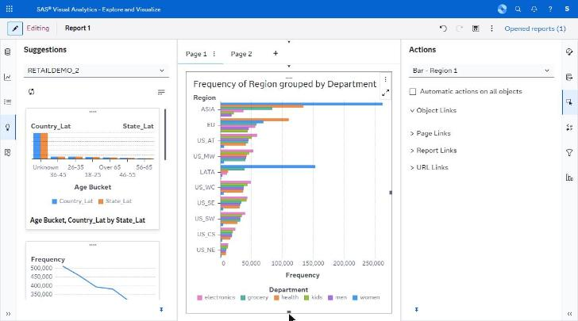
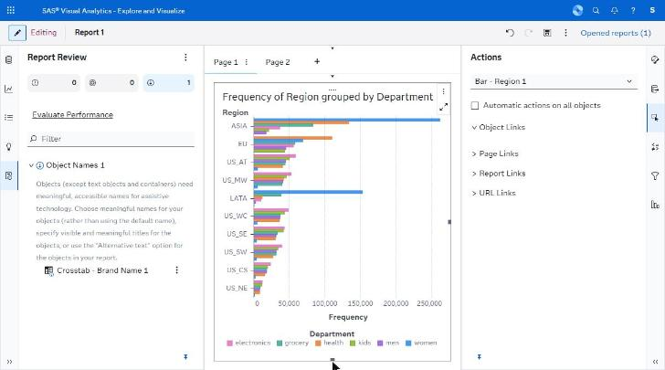
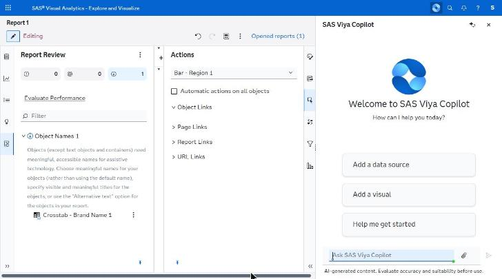
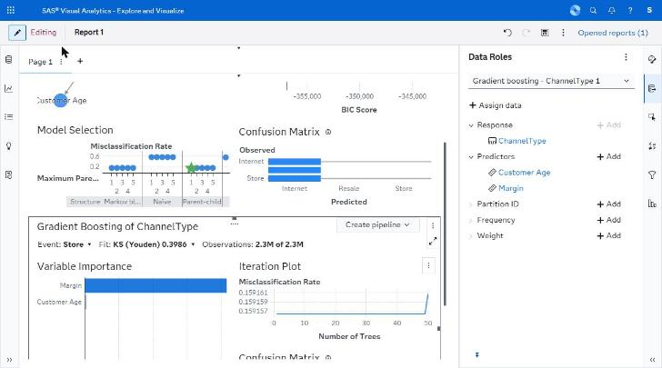

# analytics/ — capture manifest

*Suggestions, report review and the AI assistant panel.*

**Images are being collected (1 of 29 present — see `SHOT_LIST.md`).** `V29_gradient-boosting_fitted.png` is supplied.

_Historical note:_ The browser automation used for this crawl can display a screen to the operator but cannot write image files to disk, and the mandated capture paths (Firefox `Ctrl+Shift+S`, Chrome DevTools "Capture node screenshot") are unreachable from it. Rather than substitute prose for images silently, each state below is catalogued with the action that produced it and a pointer to where its contents are described in full.

Every state listed here was **directly observed** in the running application. To produce the images, re-run these states and capture them; the IDs are stable and referenced from the other spec files.

| ID | Screen | Route | State | Action that produced it | Key elements | Described in |
|---|---|---|---|---|---|---|
| V19 | Editor | same | Suggestions pane | Rail → Suggestions | Thumbnail cards with captions | C.2 |
| V20 | Editor | same | Report Review pane | Rail → Report Review | Severity counters, Evaluate Performance | C.2 |
| V21 | Editor | same | AI side panel | Banner AI icon | Welcome, 3 chips, prompt box, disclaimer | C.1 S7 |
| V29 | Editor | same | Fitted Gradient boosting + Data Roles | Fit a Gradient boosting object, open Roles tab | Model Selection, Confusion Matrix, Variable Importance, Iteration Plot, Create pipeline, Response/Predictors/Partition/Frequency/Weight | G.2i |

## Images

**4 of 4 present.**

| ID | File | Present | Hold window (2026-09-23, EEST) |
|---|---|---|---|
| V19 | `V19_suggestions-pane.png` | yes | 12:04:13-12:04:24 |
| V20 | `V20_report-review-pane.png` | yes | 12:04:40-12:04:51 |
| V21 | `V21_ai-copilot-panel.png` | yes | 12:05:22-12:05:33 |
| V29 | `V29_gradient-boosting-fitted.png` | yes | supplied |

## Captures

### V19 — Suggestions pane, thumbnail cards

### V20 — Report Review, severity counters and a finding

### V21 — SAS Viya Copilot panel: 3 chips, prompt box, disclaimer

### V29 — Fitted Gradient boosting with Data Roles

