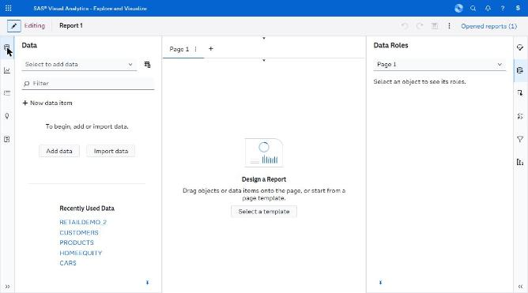

# dashboards/ — capture manifest

*The blank report canvas and its empty state.*

**Images are supplied by the capture run, not by the crawl.** The browser automation can display a screen but cannot write an image file anywhere reachable (four routes tried — see `../screenshots/CAPTURE_STATUS.md`). Every state below was instead *held still* by Claude for ~11 seconds while an external timer captured the screen, so the images exist as timestamped frames. `import-captures.py` files them here automatically from those timestamps; `captures.json` is the index it reads.

Every state listed here was **directly observed** in the running application. The IDs are stable and are referenced from the other spec files.

| ID | Screen | Route | State | Action that produced it | Key elements | Described in |
|---|---|---|---|---|---|---|
| V02 | Editor | same | Blank report, empty canvas | New report | Rail, "Design a Report", Select a template, empty Data pane | C.1 S2 |

## Images

**1 of 1 present.**

| ID | File | Present | Hold window (2026-09-23, EEST) |
|---|---|---|---|
| V02 | `V02_blank-report-empty-canvas.png` | yes | manual |

## Captures

### V02 — Blank report, empty canvas and empty Data pane

