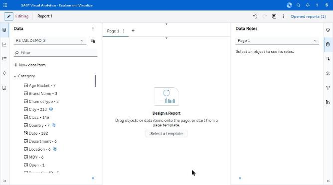
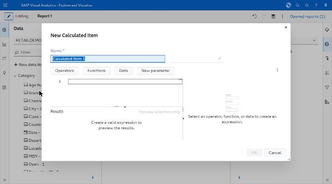
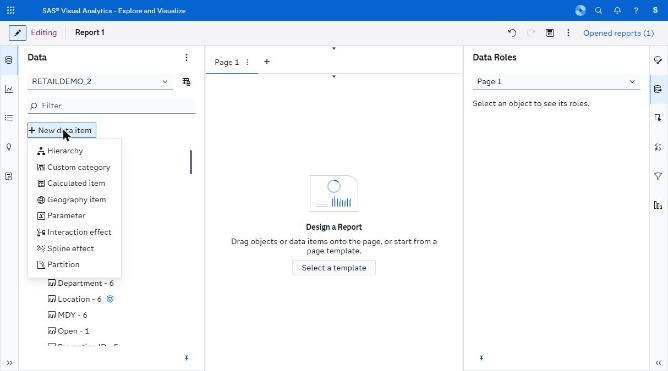

# data/ — capture manifest

*Data pane with a source loaded, and the expression editor.*

**Images are supplied by the capture run, not by the crawl.** The browser automation can display a screen but cannot write an image file anywhere reachable (four routes tried — see `../screenshots/CAPTURE_STATUS.md`). Every state below was instead *held still* by Claude for ~11 seconds while an external timer captured the screen, so the images exist as timestamped frames. `import-captures.py` files them here automatically from those timestamps; `captures.json` is the index it reads.

Every state listed here was **directly observed** in the running application. The IDs are stable and are referenced from the other spec files.

| ID | Screen | Route | State | Action that produced it | Key elements | Described in |
|---|---|---|---|---|---|---|
| V03 | Editor | same | Data loaded | Recently Used Data → table | Item tree, distinct counts, sensitivity shields | C.2 Data |
| V13 | Editor | same | Expression editor | + New data item → Calculated item | Toolbar, line-numbered editor, error count, Results grid | D.A6 |

## Images

**3 of 3 present.**

| ID | File | Present | Hold window (2026-09-23, EEST) |
|---|---|---|---|
| V03 | `V03_data-pane-table-loaded.png` | yes | manual |
| V13 | `V13_expression-editor.png` | yes | manual |
| V31 | `V31_new-data-item-menu.png` | yes | manual |

## Captures

### V03 — Data pane, RETAILDEMO_2 loaded, sensitivity shields

### V13 — New Calculated Item expression editor

### V31 — + New data item menu: Hierarchy / Custom category / Calculated item / Geography item / Parameter / Interaction effect / Spline effect / Partition

