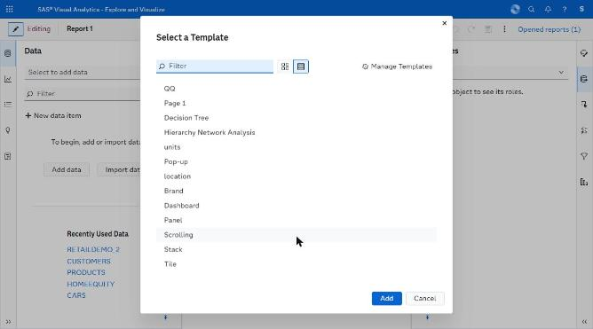
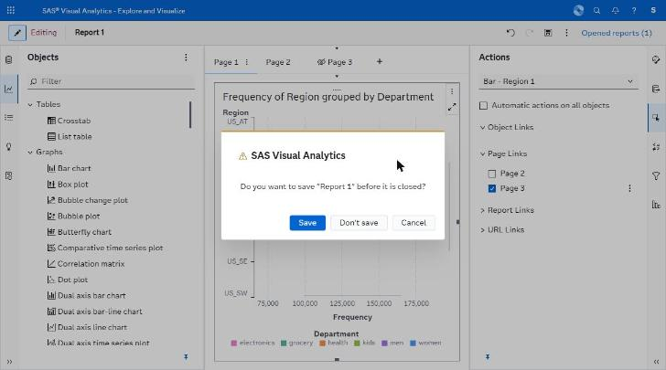
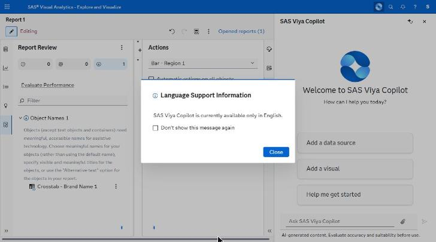

# dialogs/ — capture manifest

*Template picker, pop-up page modal, save confirmation.*

**Images are supplied by the capture run, not by the crawl.** The browser automation can display a screen but cannot write an image file anywhere reachable (four routes tried — see `../screenshots/CAPTURE_STATUS.md`). Every state below was instead *held still* by Claude for ~11 seconds while an external timer captured the screen, so the images exist as timestamped frames. `import-captures.py` files them here automatically from those timestamps; `captures.json` is the index it reads.

Every state listed here was **directly observed** in the running application. The IDs are stable and are referenced from the other spec files.

| ID | Screen | Route | State | Action that produced it | Key elements | Described in |
|---|---|---|---|---|---|---|
| V24 | Editor | same | Template dialog | Select a template | List/grid toggle, Manage Templates | D.A13 |
| V26 | Viewer | same | Pop-up page modal | Double-click a linked mark | Modal, ×, Close, Export as PDF, resize grip | C.1 S6 |
| V27 | Editor | same | Save confirmation | ⋮ → Close on an unsaved report | "Do you want to save …?" Save / Don't save / Cancel | C.4 |

## Images

**3 of 4 present.**

| ID | File | Present | Hold window (2026-09-23, EEST) |
|---|---|---|---|
| V24 | `V24_template-picker.png` | yes | manual |
| V26 | `V26_popup-page-modal.png` | n/a — **BLOCKED** | — |
| V27 | `V27_save-confirmation.png` | yes | 12:18:39-12:18:50 |
| V32 | `V32_copilot-language-dialog.png` | yes | 12:05:1x |

## Captures

### V24 — Select a Template dialog

### V27 — Save confirmation on close, cancelled

### V32 — Copilot language-support dialog

