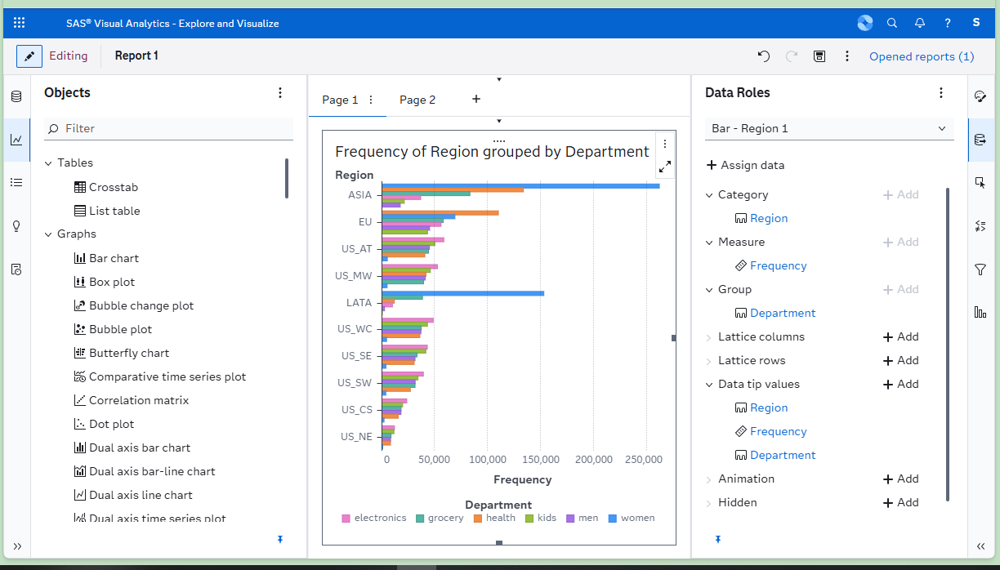
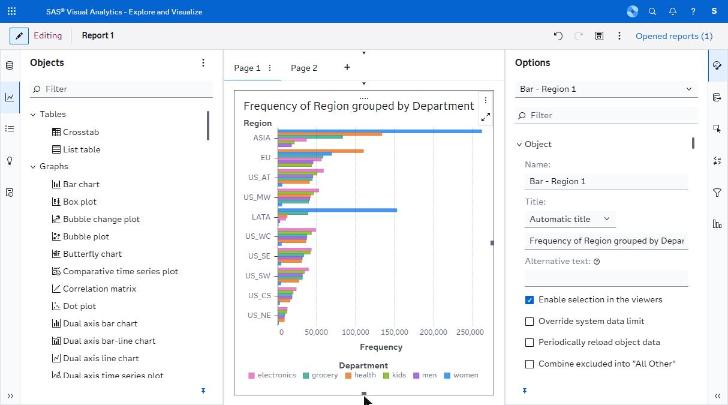
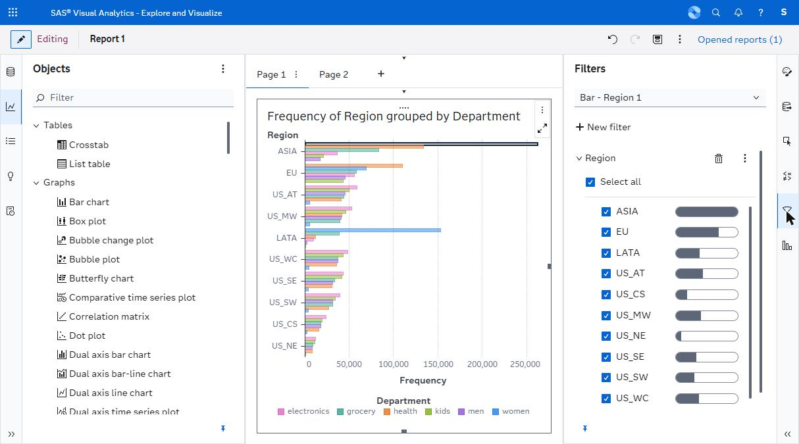
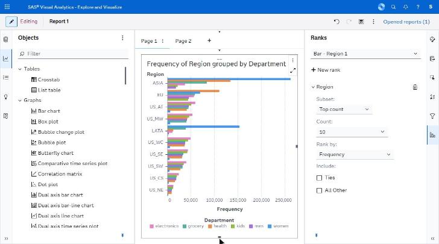
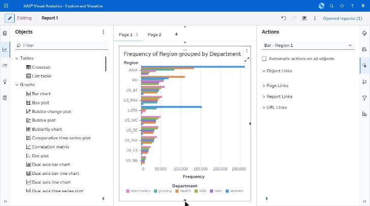

# forms/ — capture manifest

*Property panes: roles, options, filters, ranks, actions.*

**Images are supplied by the capture run, not by the crawl.** The browser automation can display a screen but cannot write an image file anywhere reachable (four routes tried — see `../screenshots/CAPTURE_STATUS.md`). Every state below was instead *held still* by Claude for ~11 seconds while an external timer captured the screen, so the images exist as timestamped frames. `import-captures.py` files them here automatically from those timestamps; `captures.json` is the index it reads.

Every state listed here was **directly observed** in the running application. The IDs are stable and are referenced from the other spec files.

| ID | Screen | Route | State | Action that produced it | Key elements | Described in |
|---|---|---|---|---|---|---|
| V07 | Editor | same | Data Roles pane | Select object → Roles tab | 8 role groups, greyed "+ Add" on full single roles | G.1 |
| V08 | Editor | same | Options pane with sections expanded | Options tab with an object selected | Collapsible sections, Totals and Subtotals (the pane's settings-search box exists but was never exercised) | C.3 |
| V10 | Editor | same | Filters pane, category filter | + New filter | Value checkboxes, frequency bars, Include missing ✓ | C.3, H.6 |
| V11 | Editor | same | Ranks pane | + New rank | Subset, Count 10, Rank by, Ties, All Other | D.A8 |
| V12 | Editor | same | Actions pane | Actions tab | Automatic actions, Object/Page/Report/URL Links | D.A10 |

## Images

**5 of 5 present.**

| ID | File | Present | Hold window (2026-09-23, EEST) |
|---|---|---|---|
| V07 | `V07_data-roles-eight-groups.png` | yes | 12:00:37-12:00:48 |
| V08 | `V08_options-pane-expanded.png` | yes | 12:01:11-12:01:22 |
| V10 | `V10_filters-pane-category.png` | yes | 12:02:01-12:02:12 |
| V11 | `V11_ranks-pane.png` | yes | 12:02:53-12:03:04 |
| V12 | `V12_actions-pane.png` | yes | 12:03:20-12:03:31 |

## Captures

### V07 — Data Roles, 8 role groups, greyed +Add on full roles

### V08 — Options pane, sections expanded

### V10 — Filters pane, category filter with frequency bars

### V11 — Ranks pane: Top count, 10, Rank by, Ties, All Other

### V12 — Actions pane: Object / Page / Report / URL Links

