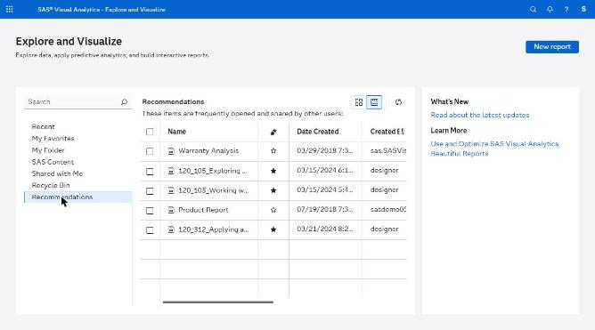
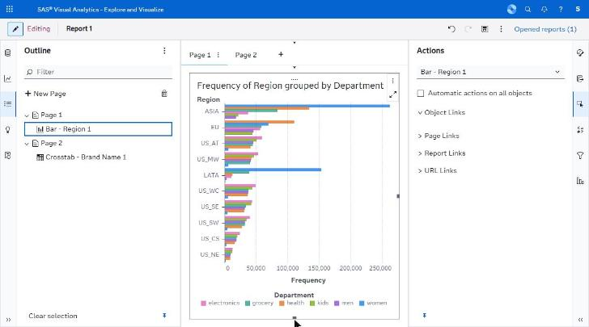
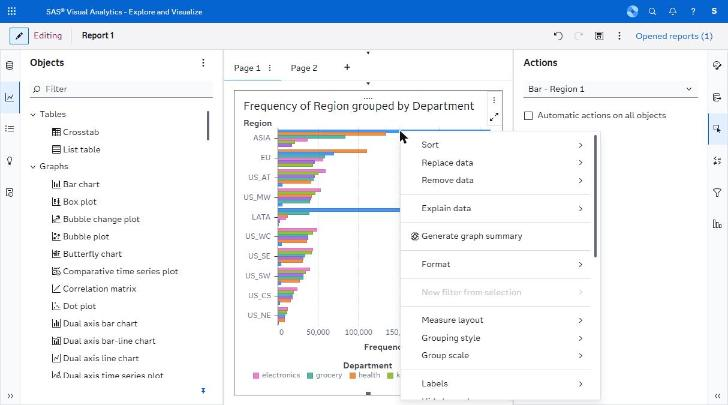
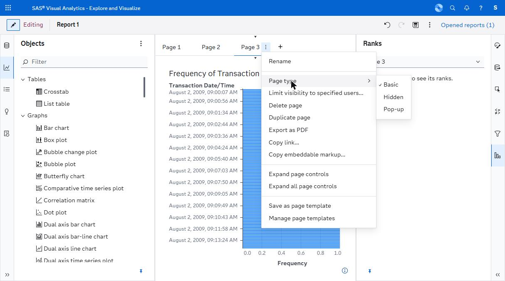
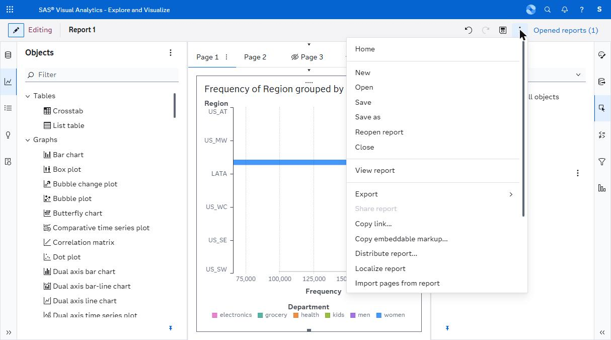

# navigation/ — capture manifest

*Landing page, outline tree, context menus and page-type menus.*

**Images are supplied by the capture run, not by the crawl.** The browser automation can display a screen but cannot write an image file anywhere reachable (four routes tried — see `../screenshots/CAPTURE_STATUS.md`). Every state below was instead *held still* by Claude for ~11 seconds while an external timer captured the screen, so the images exist as timestamped frames. `import-captures.py` files them here automatically from those timestamps; `captures.json` is the index it reads.

Every state listed here was **directly observed** in the running application. The IDs are stable and are referenced from the other spec files.

| ID | Screen | Route | State | Action that produced it | Key elements | Described in |
|---|---|---|---|---|---|---|
| V01 | Landing | `/SASVisualAnalytics/` | Populated, Recommendations selected | Initial load | Folder list, search, sort, grid/list toggle, cards, New report, recovery card | C.1 S1 |
| V18 | Editor | same | Outline pane | Rail → Outline | Page/object tree, New Page | C.2 |
| V22 | Editor | same | Context menu on a chart | Right-click a mark | 25-item menu with submenus | H.1 |
| V23 | Editor | same | Page ⋮ menu + Page type submenu | Page tab ⋮ | Basic ✓ / Hidden / Pop-up (greyed with one page) | D.A12 |

## Images

**5 of 5 present.**

| ID | File | Present | Hold window (2026-09-23, EEST) |
|---|---|---|---|
| V01 | `V01_landing-recommendations.png` | yes | manual |
| V18 | `V18_outline-pane.png` | yes | 12:03:46-12:03:57 |
| V22 | `V22_context-menu-on-mark.png` | yes | 12:06:09-12:06:20 |
| V23 | `V23_page-menu-page-type.png` | yes | 12:06:50-12:07:01 |
| V30 | `V30_report-menu-distribution.png` | yes | 12:18:2x |

## Captures

### V01 — Landing page, Recommendations selected

### V18 — Outline pane, three-page tree

### V22 — Context menu on a chart mark

### V23 — Page menu with Page type submenu

### V30 — Report menu: Export / Copy link / Copy embeddable markup / Distribute report

