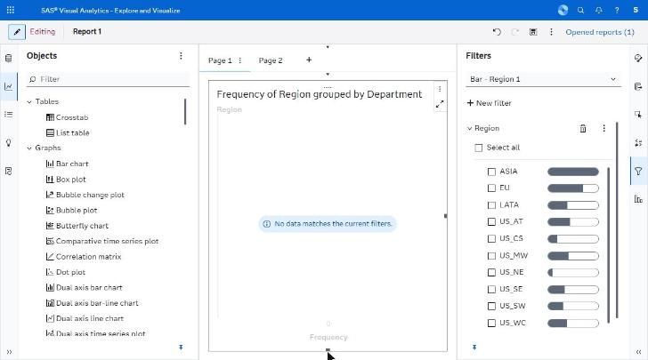
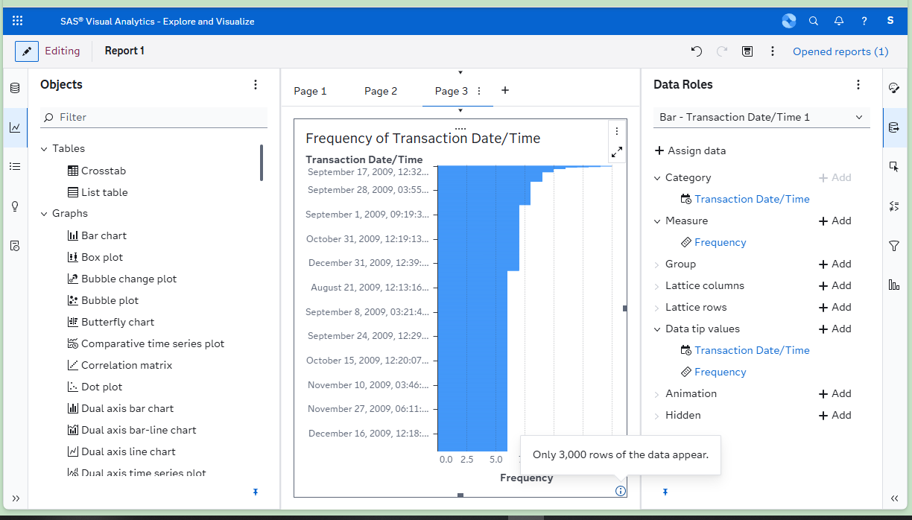
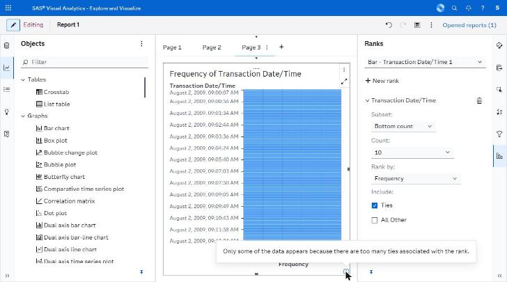
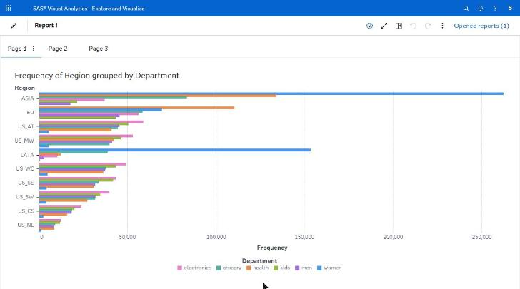
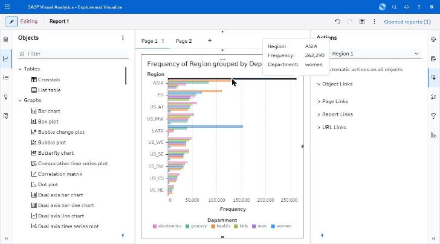

# states/ — capture manifest

*Empty, loading, capped, error, selected, hover and view-mode states.*

**Images are supplied by the capture run, not by the crawl.** The browser automation can display a screen but cannot write an image file anywhere reachable (four routes tried — see `../screenshots/CAPTURE_STATUS.md`). Every state below was instead *held still* by Claude for ~11 seconds while an external timer captured the screen, so the images exist as timestamped frames. `import-captures.py` files them here automatically from those timestamps; `captures.json` is the index it reads.

Every state listed here was **directly observed** in the running application. The IDs are stable and are referenced from the other spec files.

| ID | Screen | Route | State | Action that produced it | Key elements | Described in |
|---|---|---|---|---|---|---|
| V14 | Editor | same | Empty-result error | Filter to a non-matching value | Axis frame + "No data matches the current filters." | C.5 |
| V15 | Editor | same | Row-cap notice | Bar chart on 1.7M categories | ⓘ "Only 3,000 rows of the data appear." | C.5 |
| V16 | Editor | same | Tie-cap notice | Rank with Ties on | ⓘ "…too many ties associated with the rank." | D.A8 |
| V17 | Editor | same | Loading | Object re-query | Spinner + "Loading…" | C.5 |
| V25 | Viewer | same | View mode | Pencil toggle | Rails hidden, tabs for Basic pages only | D.A16 |
| V28 | Editor | same | Selected + hover | Click then hover a mark | Highlight, dimmed peers, data tip | C.5 |

## Images

**5 of 6 present.**

| ID | File | Present | Hold window (2026-09-23, EEST) |
|---|---|---|---|
| V14 | `V14_empty-result-no-data-matches.png` | yes | 12:10:31-12:10:42 |
| V15 | `V15_row-cap-3000-rows.png` | yes | 12:12:41-12:12:52 |
| V16 | `V16_tie-cap-notice.png` | yes | 12:14:35-12:14:46 |
| V17 | `V17_loading-spinner.png` | n/a — **BLOCKED** | — |
| V25 | `V25_view-mode.png` | yes | 12:15:13-12:15:24 |
| V28 | `V28_selected-plus-hover.png` | yes | 12:07:27-12:07:38 |

## Captures

### V14 — No data matches the current filters.

### V15 — Only 3,000 rows of the data appear.

### V16 — Too many ties associated with the rank.

### V25 — View mode, rails hidden, Basic page tabs only

### V28 — Mark selected plus hover data tip

