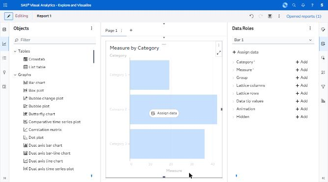
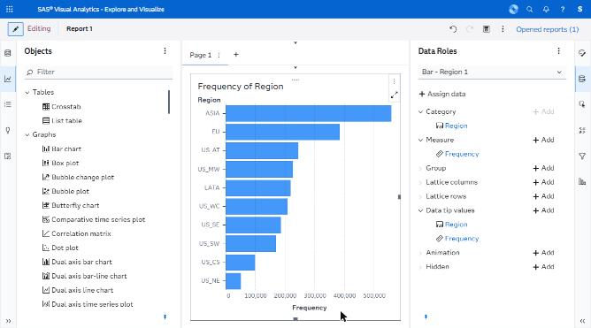
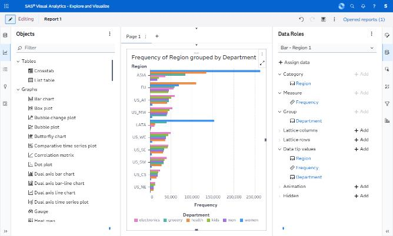
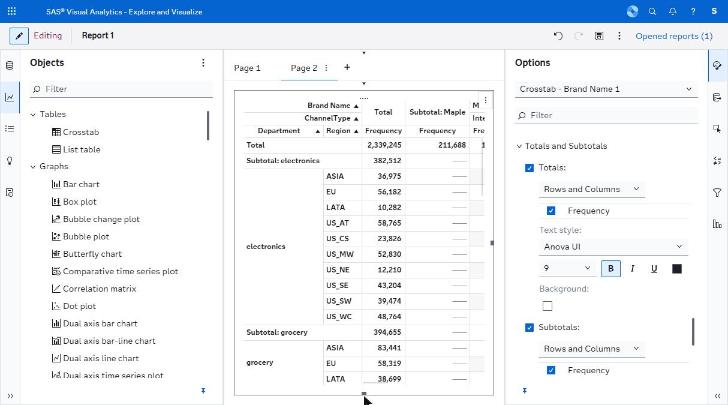

# visualizations/ — capture manifest

*Object placeholder, rendered chart, grouped chart with legend, crosstab with totals.*

**Images are supplied by the capture run, not by the crawl.** The browser automation can display a screen but cannot write an image file anywhere reachable (four routes tried — see `../screenshots/CAPTURE_STATUS.md`). Every state below was instead *held still* by Claude for ~11 seconds while an external timer captured the screen, so the images exist as timestamped frames. `import-captures.py` files them here automatically from those timestamps; `captures.json` is the index it reads.

Every state listed here was **directly observed** in the running application. The IDs are stable and are referenced from the other spec files.

| ID | Screen | Route | State | Action that produced it | Key elements | Described in |
|---|---|---|---|---|---|---|
| V04 | Editor | same | Object placeholder | Double-click Bar chart | Synthetic "Measure by Category" sample + Assign data | C.5 |
| V05 | Editor | same | Rendered chart | Assign Region (+ auto Frequency) | "Frequency of Region", descending bars | G.2 |
| V06 | Editor | same | Grouped chart + legend | Add Department to Group | 6-colour categorical legend | L.2 |
| V09 | Editor | same | Crosstab with totals + subtotals, nested both axes | Enable Totals and Subtotals | "Subtotal: ASIA", "Subtotal: Maple" | G.2 |

## Images

**4 of 4 present.**

| ID | File | Present | Hold window (2026-09-23, EEST) |
|---|---|---|---|
| V04 | `V04_object-placeholder-synthetic-sample.png` | yes | manual |
| V05 | `V05_rendered-chart-frequency-of-region.png` | yes | manual |
| V06 | `V06_grouped-chart-with-legend.png` | yes | 11:56:56-11:57:07 |
| V09 | `V09_crosstab-totals-subtotals.png` | yes | 11:59:58-12:00:09 |

## Captures

### V04 — Bar chart placeholder with synthetic sample

### V05 — Frequency of Region, descending bars

### V06 — Grouped bar chart, 6-colour Department legend

### V09 — Crosstab nested both axes, Totals and Subtotals

