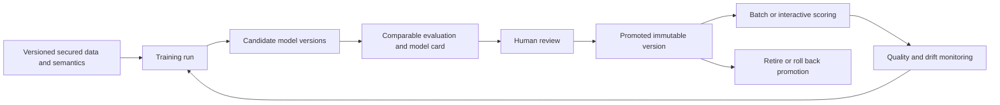
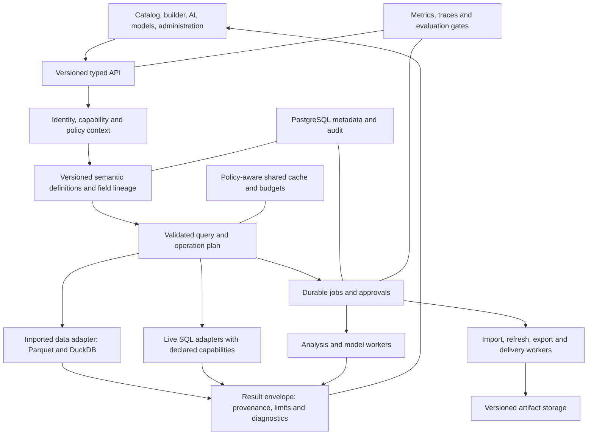
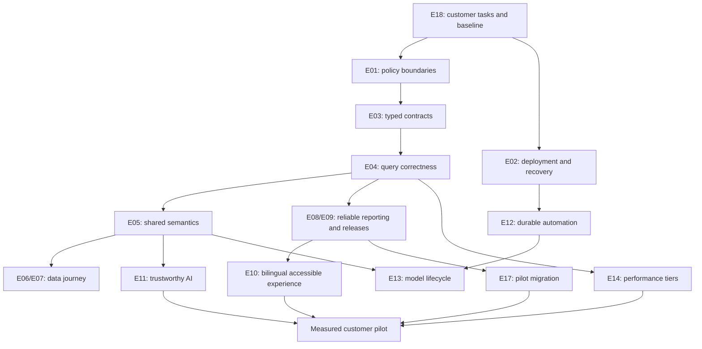

# Datalytics versus SAS: gap analysis and plan to outperform

Prepared 24 September 2026. Scope: the current application, the supplied SAS Visual Analytics / Data Explorer evidence, and a limited check of official SAS product descriptions. This is an assessment and proposed delivery plan; no application implementation has been changed.

## 1. Recommendation

**Build the fastest trustworthy path from business data to a reviewed, shareable decision for a clearly defined customer segment.** Your application already has substantial reporting, preparation, statistics, AI, permissions, and delivery functionality. The strongest next investment is completing and validating those capabilities as one dependable experience.

The repository does **not** establish that Datalytics outperforms SAS today. It also does not support a meaningful statement such as “80% of SAS is complete.” SAS pane entries, application widget types, analytical handlers, and successful user workflows count different things.

The most promising initial position is **Arabic/English self-service operational analytics for teams that need controlled deployment and understandable answers**. This is a recommendation based on the existing RTL/localization, local model integration, semantic metadata, reporting, and access-control foundations—not a confirmed market requirement. Validate it with customers before committing the entire roadmap.

The order of work should be:

1. Establish numerical correctness, consistent authorization, recoverability, and a measured baseline.
2. Finish the most valuable data-to-report workflows, especially live-source limitations and reusable preparation.
3. Deliver evidence-backed bilingual AI, reliable automation, and reproducible model workflows.
4. Demonstrate better task completion time, answer quality, operational effort, and cost for the selected segment.
5. Expand algorithms, connectors, and scale only where customer demand and measurements justify them.

## 2. Evidence, scope, and assumptions

### Sources and confidence

| Reference | What it establishes | What it does not establish |
|---|---|---|
| [SAS feature inventory](sas_new_data/SAS_VISUAL_ANALYTICS_DETAILED_FEATURES.md), abbreviated **SAS inventory** below | Captured controls, documented interactions, some populated examples, and explicit evidence limits | Complete SAS platform capability, every release/license, numerical equivalence, successful execution of every workflow |
| [Application understanding](APPLICATION_UNDERSTANDING.md), abbreviated **App assessment** | Repository architecture, API/entity/page inventories, traced behavior and risks | Current test success, customer satisfaction, production scale or security certification |
| Current application source links in this document | Targeted checks of implementations, restrictions, and UI wiring | Runtime performance or an exercised security exploit |
| Official SAS pages linked below | Vendor-described product capabilities beyond the local capture | A benchmark, entitlement confirmation, or proof of performance in the captured installation |

Status terms used below:

- **Implemented:** an application code path exists; this is not a claim that it passed runtime acceptance here.
- **Partial:** a related capability exists, with a known limitation or an incomplete equivalence assessment.
- **Backend only:** services/APIs exist but the end-user workflow is not wired through a discovered screen.
- **Not found:** no corresponding implementation was identified in the inspected scope; verify before declaring universal absence.
- **Needs Verification:** the evidence cannot support a confident conclusion.
- **Proposed:** a future design, target, estimate, or commercial hypothesis.

The SAS inventory contains 78 pane entries, including a saved template and multiple presentations of related containers. The current [WidgetType union](AI_data_tool/data_analytics/frontend/src/types/report.ts) contains 74 literals; controls and containers also have subtypes. Neither number proves parity. The app assessment records 25 analysis registrations, some without a generic callable handler. These are three different inventories.

### Important competitive corrections

SAS currently describes conversational dashboard creation and exploration through Viya Copilot, automated analytics, embedding, and self-managed deployment. Consequently, “has AI,” “can embed,” and “can run under customer control” are not sufficient differentiators. Compete on measured quality and operational experience. [Official SAS Visual Analytics description](https://www.sas.com/en_us/software/visual-analytics.html).

The broader SAS ecosystem also describes model versioning, validation, deployment, monitoring, and model cards. Your local capture only partially covers that lifecycle, but its absence from the captures does not mean SAS lacks it. Compare lifecycle work against the appropriate product scope and entitlement. [Official SAS Model Manager description](https://www.sas.com/en_us/software/model-manager.html).

CAS supports single-machine and distributed execution; a pandas/DuckDB application is not automatically equivalent to that architecture. Any competitive scale claim needs measured workloads and disclosed deployment resources. [SAS Visual Analytics for SAS Viya, architecture excerpt](https://support.sas.com/content/dam/SAS/support/en/books/sas-visual-analytics-for-sas-viya/75441_excerpt.pdf).

### Planning assumptions

This plan assumes a team product, initially focused on tabular operational analytics, imported files and selected SQL sources, with Arabic and English users. It assumes customer-managed deployment matters. Team size, budget, target industry, concurrency, data volume, deployment requirements, and access to a suitably licensed SAS baseline remain **Needs Verification**. The roadmap below includes a smaller-team alternative.

## 3. The practical difference today

| Area | SAS evidence | Your application | Assessment / next action |
|---|---|---|---|
| Report authoring | Detailed shared inspector and numerous object-specific options; strong populated crosstab evidence | Broad builder, 74 widget literals, reusable renderers, filters, rules, navigation, templates | Broad overlap. Prove the highest-value workflows and close specific option/semantic gaps rather than chase counts |
| Data preparation | Rich report Data pane plus separate Explorer workbench | Prep pipelines, joins, metadata, reusable data views, aggregates, source review | Extend existing capabilities; improve discoverability, dependency handling and cross-mode consistency |
| Live data | Capture does not establish SAS live-query equivalence | DirectQuery exists but explicitly refuses calculations, named measures, source expressions, animation and lattice settings in the widget route | Confirmed app limitation; support a declared subset and make execution mode obvious |
| Statistical depth | GLM/GAM/effects and model option surfaces beyond basic regression | Real inferential services and model widgets; narrower modeling controls and no discovered GAM family | Close selected gaps after reproducibility and evaluation are dependable |
| Machine learning lifecycle | Most local training captures are placeholders; broader Model Manager describes lifecycle tools | Train/store/score/delete; no saved-model version/promotion/monitoring lifecycle | Major product gap for customers requiring governed predictive operations |
| Conversational AI | Local copilot behavior poorly captured; official SAS product has conversational AI | Native semantic context, bounded SQL validation/execution, persisted runs and copilot actions | Good foundation; advantage must be demonstrated through trustworthy bilingual task outcomes |
| Governance | Explorer permission matrix; full SAS enforcement not established locally | Org isolation, capabilities, RLS/CLS, audit, SSO, export policies, shares and embeds | Substantial code, but identified policy-boundary risks are a release gate |
| Automation | Local capture leaves many import/job/delivery outcomes untested | Schedules/alerts/delivery implemented; dataflows and automation exposure incomplete | Finish end-to-end authoring, review, recovery, and idempotency |
| Scale and operations | CAS architecture supports distributed processing | Modular monolith, local files, pandas/DuckDB, SQL sources, in-process scheduler/caches | No performance winner established; address measured bottlenecks and multiworker behavior |
| Arabic and accessibility | Not comprehensively established by local captures | RTL, Arabic formats/local fonts, translations and accessibility-related tests | Potential focus area; validate full workflows, linguistic quality, and exported artifacts |

App evidence: [architecture, domains and frontend](APPLICATION_UNDERSTANDING.md#4-system-architecture), [widget execution route](AI_data_tool/data_analytics/backend/app/routers/widget_data.py), [analysis registry](AI_data_tool/data_analytics/backend/app/services/analysis/registry.py), [frontend routes](AI_data_tool/data_analytics/frontend/src/App.tsx), and [architectural risks](APPLICATION_UNDERSTANDING.md#21-current-architectural-risks--technical-debt).

## 4. Detailed capability comparison

Each row describes a capability family, not a pass/fail feature score. SAS evidence refers to the named section of the supplied inventory. Epic IDs refer to the implementation backlog in section 10.

### 4.1 Data access, exploration, and semantics

| ID | SAS inventory capability | Datalytics evidence and difference | Priority / intended work |
|---|---|---|---|
| D01 | Source gallery, connection forms, auth options, test/connect | Connector registry and connections UI exist. A registry entry is not a certified driver; SAS gallery entries also were not all tested | **P1 E07:** certify a small supported connector set end to end |
| D02 | Import queue, per-item/batch controls and destination configuration | Upload and refresh exist; equivalent persistent multi-item queue and source-specific option coverage are **Needs Verification** | **P1 E07:** resumable queued imports with preview, per-file outcomes and explicit overwrite rules |
| D03 | CSV encodings/delimiters, multi-sheet Excel, directory/document/image/ORC/Esri options | Do not infer equivalent support from generic upload. Several SAS paths were only configured or rejected | **P1/P3 E07:** prioritize CSV/Excel/Parquet and required databases; defer specialized formats absent demand |
| D04 | Sources/libraries, loaded versus unloaded resources, metadata and sample grids | Datasets, connections, source objects, preview, lineage and metadata exist; no CAS-style load/unload lifecycle is required by the app architecture | **P1 E06:** explain imported/live/materialized state and freshness in one catalog |
| D05 | Name/label, formats, aggregation, classification, hidden items | Column metadata and builder controls cover much of this; report-local SAS customization differs from dataset-level app metadata | **P1 E05:** separate shared meaning from report overrides and preview change impact |
| D06 | Search, grouping, selection, inline edits and field actions | Builder, hierarchy tree, column panels and outlier details exist; complete action-by-action parity untested | **P1 E08:** cohesive field browser with typed contextual commands |
| D07 | Joins: inner/left/right/full, composite keys, chosen columns | Prep join service validates composite key pairs; joins and match feedback are already implemented. Included-column UX and null/cardinality equivalence need testing | **P1 E06:** preview fan-out, unmatched keys, security scope, and resulting schema before commit |
| D08 | Separate aggregated data source with preview | Prep aggregation and managed aggregates exist; a performance aggregate and a user-authored derived dataset are distinct concepts | **P1 E06:** make output grain and metric lineage explicit, with reusable derived outputs |
| D09 | Replace/remove source, refresh and dependency consequences | Report dataset association/refresh exist; a complete dependency-aware replacement wizard was not established | **P1 E05:** field mapping, impact preview, atomic replacement and rollback |
| D10 | Calculated items, expression helpers and preview | Expression builder, calculated columns, custom functions and measure evaluation exist. Syntax and semantics differ from SAS | **P0/P1 E03/E05:** typed contracts, clear row/aggregate contexts, golden formula fixtures |
| D11 | Saved data views, default view, application to sources | **Implemented**: snapshots include semantics/prep/hierarchy; apply reports skipped pieces. DataViewsBar is hidden for DirectQuery | **P1 E06:** version, compatibility report and governed reuse; do not rebuild from scratch |
| D12 | Source mapping for linked actions; unique row identifier | Dataset relationships/mapping diagnostics and keyed prep operations exist. SAS-style identifier lifecycle/uniqueness guarantees are not established | **P1 E05:** stable field identity, relationship validation, declared grain and uniqueness checks |
| D13 | Hierarchies, custom categories, parameters, geography | Existing hierarchy, CustomCategoryPanel, report parameters, geography/boundary-set editing | **P1 E08:** verify complete create/use/edit/reopen/export workflows and incompatible-role guidance |
| D14 | Partition creation, interaction effects, spline effects | Training/validation prep partition exists, with seed and optional key. Dedicated typed interaction/spline effects were not found | **P2 E13:** deterministic partitions first; add effects only for selected supported models |
| D15 | Sensitive-item discovery and profile/outlier details | Sensitivity metadata, column controls and secured analysis/profile paths exist | **P0/P1 E01/E06:** verify profiling, samples and metadata do not bypass policies |

Evidence: [connector registry](AI_data_tool/data_analytics/backend/app/services/connectors.py), [dataset routes](AI_data_tool/data_analytics/backend/app/routers/datasets.py), [prep engine](AI_data_tool/data_analytics/backend/app/services/prep.py), [prep editor definitions](AI_data_tool/data_analytics/frontend/src/components/report/prepPipeline/model.ts), [data view service](AI_data_tool/data_analytics/backend/app/services/data_views.py), [DataViewsBar](AI_data_tool/data_analytics/frontend/src/components/report/DataViewsBar.tsx), [DataView](AI_data_tool/data_analytics/frontend/src/components/report/DataView.tsx), [ReportBuilder](AI_data_tool/data_analytics/frontend/src/pages/ReportBuilder.tsx).

### 4.2 Reporting and visual exploration

| ID | SAS inventory capability | Datalytics evidence and difference | Priority / intended work |
|---|---|---|---|
| V01 | Required roles, compatible fields, per-object overrides | Frontend roles and backend role metadata exist; JSON payloads still permit contract drift | **P0/P1 E03:** one versioned capability contract driving UI, validation and execution |
| V02 | List table, detail/aggregate data, hidden fields, totals | Table/list/matrix/crosstab branches exist | **P1 E08:** correct detail versus aggregate behavior, column controls and export parity |
| V03 | Crosstab hierarchy, merged/indented rows, measure orientation and subtotal placement | Crosstab/matrix, totals/subtotals and placement controls exist; full SAS hierarchy/intersection equivalence is not established | **P1 E08:** make pivot correctness a flagship acceptance suite |
| V04 | Per-cell bars/heatmaps and intersection-specific formatting | Rules, intervals, value maps and data bars exist. Inspected DisplayRule schema has no explicit hierarchy-intersection selector | **P1 E08:** scoped cell/total rules with documented precedence and recomputed totals |
| V05 | 19 explicit statistical aggregations plus inherited Default | Widget service already has advanced statistics including standard error, skewness, kurtosis, CV and t/p calculations | **P0 E04:** verify formulas/nulls/degrees of freedom across execution paths; counting functions is insufficient |
| V06 | Shared axes, legends, reference lines, palettes and style overrides | Shared renderer options and capability gating exist. Applicability is intentionally type-specific | **P1 E08:** consumer-tested options and reset semantics; add missing high-use settings selectively |
| V07 | Thirty graph entries including dual axes, distribution, time and schedules | Many direct analogues exist, plus area/funnel/ribbon/hierarchical renderers. Dedicated targeted-bar and all SAS suboptions are not established | **P1/P3 E08:** prioritize data-backed common graphs, then demand-driven long-tail charts |
| V08 | Ten geographic entries and combined layers | Ten map-prefixed widget types, boundary sets, matching UI and custom map layers exist | **P2 E15:** validate CRS/lookup, missing regions, legends and secure/offline tile behavior; SAS captures were configuration-only |
| V09 | Five prompt controls including numeric/date slider | Slicer modes include buttons, lists, multi-dropdown, search and text; other numeric/date filter controls exist. Exact SAS required/default/aggregate-slider parity needs verification | **P1 E08:** coherent single/multi/range controls, accessibility and scope rules |
| V10 | Flow/stacking/precision/scrolling/prompt containers | Container modes group/tabs/scroll/prompt/precision exist | **P1 E08:** verify nesting, child IDs, keyboard use, persistence and print layout |
| V11 | Text/image/web/data-driven/job content | Text, image, web, custom visual and script capabilities exist. A script tile is not equivalent to managed SAS job content | **P0 E01; P2 E16:** secure extension contracts; defer arbitrary user code until isolated |
| V12 | Basic/advanced, source/object/common and aggregate filters | Existing filters, expressions, parameters and cross-filter state; mode restrictions and silent author-filter fallback deserve attention | **P0/P1 E04/E05:** explicit scopes, deterministic order and visible errors |
| V13 | Top/bottom count/percent, ties and All Other | Ranking controls and backend rank paths exist; exact ties/rounding/null/non-additive semantics need comparison | **P1 E04/E08:** define and test rank semantics, totals and category recovery |
| V14 | Object/page/report/URL actions; automatic linking | CrossFilterContext, interaction settings, relationship mapping, drillthrough/tooltip/popups and bookmarks exist | **P1 E08:** cycle prevention, clear/reset, parameter encoding and policy enforcement at targets |
| V15 | Save to Objects pane, duplicate/convert/move and template insertion | Widget/page reuse, templates and type changes have app foundations; object-subtree portability needs verification | **P2 E09:** versioned portable packages with dependency remapping |
| V16 | Image/PDF/Excel/data export entries | App has report PDF/package and data/export paths; visual fidelity and complete Excel feature equivalence are unproven | **P1 E09:** test output contents, Arabic fonts, pagination, filters and authorization |
| V17 | Shell undo/redo/save; incomplete captured history/sharing | App has undo, revision polling, history, grants, share links, embeds and comments | **P1 E09:** complete release snapshots and concurrent-edit conflict handling; do not claim SAS lacks these |
| V18 | Alternative text and layout controls | App has alt text, tab order, mobile layout, RTL and accessibility-related tests | **P1 E10:** complete task-level keyboard/screen-reader/mobile/RTL verification |

Evidence: [widget types and roles](AI_data_tool/data_analytics/frontend/src/types/report.ts), [capability gating](AI_data_tool/data_analytics/frontend/src/components/report/widgetCapabilities.ts), [WidgetConfigPanel](AI_data_tool/data_analytics/frontend/src/components/report/WidgetConfigPanel.tsx), [WidgetRenderer](AI_data_tool/data_analytics/frontend/src/components/report/WidgetRenderer.tsx), [display-rule contract](AI_data_tool/data_analytics/frontend/src/lib/displayRules.ts), [widget computation](AI_data_tool/data_analytics/backend/app/services/widget_data.py), [report routes](AI_data_tool/data_analytics/backend/app/routers/reports.py).

### 4.3 Governance, automation, extensibility, and operations

| ID | SAS evidence / comparison boundary | Datalytics evidence and difference | Priority / intended work |
|---|---|---|---|
| O01 | Explorer principals, inherited permissions and action gating; full authentication not captured | Roles, SSO, organization scoping, RLS/CLS, grants, export policies and audit implemented | **P0 E01:** unify effective policy across every reader/executor; test bypass paths |
| O02 | Local capture does not establish AI SQL security | Multi-stage SQL validation, trusted joins, policy checks and bounded execution exist | **P0/P1 E01/E11:** protect context/results/logs as well as final SQL; evaluate abstention and adversarial inputs |
| O03 | Report sharing/embedded markup visible; full behavior not exercised | Token shares, embed authorization and creator/viewer identity rules implemented | **P0 E01; P1 E09:** make identity and data scope explicit; prove revocation and export isolation |
| O04 | Import job creation entries; execution not demonstrated | Dataflow APIs exist; no routed editor found | **P1 E12:** recipe editor, preview, scheduling, history and recovery |
| O05 | Broader automated workflows outside capture | AutomationRunner has seven real steps and durable outputs; creation/review API/UI not discovered | **P1/P2 E12:** expose controlled run creation, approvals, cancel/retry and provenance |
| O06 | Captures do not prove delivery capabilities or their absence | Schedules, alerts, email/webhook/PDF delivery, failures and retry records exist | **P1 E12/E02:** idempotency, credential rotation, recipient policies and failure recovery |
| O07 | SAS lineage/catalog/Studio/Model Studio handoffs documented | App integrates source review, lineage, dataset/report/AI and model panels | **P1 E06/E11:** preserve task context and make one guided journey; measure switching burden |
| O08 | SAS CAS supports distributed execution; captured UI is not a performance test | pandas/DuckDB/Parquet + external SQL; local artifacts and per-process gates/caches | **P0/P2 E02/E14:** benchmark, durable workers, coherent artifact access, distributed quotas |
| O09 | SAS operational controls not fully captured | Existing Docker/Compose, monitoring, cache and scheduler; readiness/migration/packaging risks | **P0 E02:** reproducible production deployment, fail-closed migrations and restore drills |
| O10 | SAS SDK/API ecosystem described officially; protocol not captured locally | Large REST API, custom visuals, notebook/semantic surface and report packages | **P2 E16:** stable public contracts, versioning and a supported embedding SDK |

Evidence: [capability logic](AI_data_tool/data_analytics/backend/app/core/capability.py), [row/column security](AI_data_tool/data_analytics/backend/app/core/rls.py), [dataflows](AI_data_tool/data_analytics/backend/app/routers/dataflows.py), [automation runner](AI_data_tool/data_analytics/backend/app/services/automation_runner.py), [App routes](AI_data_tool/data_analytics/frontend/src/App.tsx), and [App assessment: configuration through risks](APPLICATION_UNDERSTANDING.md#13-configuration-and-deployment).

## 5. Analytics and modeling: the substantive gaps

Source comparison: [SAS analytics/statistics/ML inventory](sas_new_data/SAS_VISUAL_ANALYTICS_DETAILED_FEATURES.md#analytics-statistics-and-machine-learning), [app analysis registry](AI_data_tool/data_analytics/backend/app/services/analysis/registry.py), [inferential services](AI_data_tool/data_analytics/backend/app/services/analysis/inferential.py), [model widgets](AI_data_tool/data_analytics/backend/app/services/model_widgets.py), [saved model routes](AI_data_tool/data_analytics/backend/app/routers/prediction_models.py), and [App assessment: modeling/lifecycles](APPLICATION_UNDERSTANDING.md#16-model-and-report-lifecycles).

| SAS object / capability | Current app counterpart | Difference and action |
|---|---|---|
| Automated explanation | explain_response, key influencers, explanation UI | Real foundation. Validate explanations against computed evidence, nonlinear cases, confounding, missingness and sampling |
| Automated prediction / what-if | Candidate prediction, model scoring, predictive panels | Partial equivalence. Unify what-if inputs, supported feature types, uncertainty and out-of-distribution warnings |
| Forecasting and scenarios | Forecast widget, ETS/simple forecast services, forecast scenarios and forecast goal | Implemented family. Add reproducible rolling backtests, baseline comparison, calendar semantics and diagnostic views |
| Network analysis | Network/geo-network renderers and analytical configuration | Do not equate a layout with every analytical graph measure. Certify supported metrics/traversal and large-graph limits |
| Path analysis | Sankey renderer | A Sankey is not automatically transaction path analysis. Verify/add event ordering, transaction boundaries, repeat compression, ties and drop-off semantics |
| Text topics | Topic service and analysis UI | Local lexical/topic capability is narrower than an established multilingual NLP product. Benchmark representative Arabic/English corpora before expanding |
| Linear regression | Regression inference and model_linear | Implemented. Verify weights, effects, diagnostics and comparison semantics individually |
| Cluster | Segmentation and model_cluster | Implemented. Document feature scaling, k selection, seeds, missing values and assessment |
| Decision tree | Decision-tree analysis and model_tree | Implemented. SAS capture advertises richer pruning/tuning controls; add only controls the engine consumes and validates |
| Generalized additive model | No dedicated GAM implementation found in inspected analysis/model services | Gap for customers needing spline effects. Add after typed effects and validation infrastructure |
| Generalized linear model | Logistic GLM, plus linear regression | These do not establish the captured Normal/Poisson/Binomial/Gamma distribution-link matrix. Add supported combinations with diagnostics |
| Logistic regression | glm_logistic and model_logistic | Implemented family. Validate event level, calibration, threshold, class imbalance and held-out metrics |
| Nonparametric logistic regression | No dedicated counterpart found | Defer until the target users need additive nonlinear classification |
| Model comparison | model_compare, compatibility helpers, candidate comparison | Partial. Ensure identical data/splits/target/event/metric, and distinguish a candidate comparison from a production champion lifecycle |
| Bayesian network | No dedicated implementation found | Lower-priority expansion; establish a concrete business need first |
| Factorization machine | No dedicated implementation found | Lower priority unless recommendation workloads are selected |
| Forest | Random forest candidates in automated prediction | Algorithm exists; dedicated forest tuning/diagnostic UI and lifecycle parity are not established |
| Gradient boosting | No dedicated implementation found in inspected analysis/model services | A possible high-value tabular extension after lifecycle/evaluation gates; measure benefit over current baseline/forest |
| Neural network | No dedicated tabular neural-network workflow found | An LLM connection is not this capability. Defer without a task requiring it |
| Support vector machine | No dedicated implementation found | Defer unless quality/latency benchmarks justify it |
| Register/export/pipeline | App saves a fitted model artifact and scores it; no saved-model version/publish/update lifecycle | Prioritize reproducibility and versioned promotion before adding a long algorithm menu |

SAS examples beyond the fitted linear model are frequently configuration-only. Therefore the table describes differences in exposed scope and inspected app implementation, not measured superiority of SAS algorithms.

Your application also contains inferential tests, mixed models, survival analysis, pairwise comparisons, association rules, anomaly methods, and one-variable goal seeking. These are useful assets. Their absence from a particular SAS object catalog does not establish absence from the SAS platform.

**Optimization boundary:** the app's goal seek fits and inverts a single linear relationship. Schedule and network widgets visualize data; they do not establish resource optimization, vehicle routing, or a general mathematical programming engine. Do not add a general solver platform to the first roadmap unless optimization is an explicit customer requirement.

### Proposed minimum reproducible modeling contract

Every persisted training run should record dataset/source version or a reproducible snapshot reference; semantic/preparation version; policy fingerprint; feature definitions and ordering; target and event; partition membership or stable split definition; seed; library/runtime versions; hyperparameters; fitted preprocessing; evaluation metrics; caveats; artifact hash; and responsible user.

Evaluate preprocessing leakage explicitly: splitting rows is insufficient if feature selection, imputation, scaling, or category discovery was fitted across both training and validation data. Use group/time-aware splits where the business problem requires them. Keep a final test set separate from model-selection data when making a generalization claim.

Proposed lifecycle:

This is a proposed addition, not the current behavior. The current saved-model path is train/store/list/score/delete, with training-scope checks. Keep report history, source schema history, semantic releases and model versions as separate concepts.

## 6. Release blockers before a competitive enterprise pilot

These are code-grounded concerns from the App assessment and targeted rechecks. They are not a penetration-test result. Reproduce them with synthetic data in an isolated environment; never validate against customer secrets.

| Priority | Finding | Why it matters | Required exit condition |
|---|---|---|---|
| P0 | Script admin checks exist on report widget mutation, while the authenticated widget-data route accepts a caller-supplied type/config and dispatches computation | A separate execution entry may bypass the intended authoring restriction; script code runs as the server user | All script entry points enforce the same privilege at execution. Disable scripts for the pilot or isolate approved execution in a restricted worker. Negative tests cover direct API and shared/embed routes |
| P0 | DirectQuery checks denied columns in selected top-level strings/filter fields, but does not pass denied columns into run_direct_query | Nested roles/raw-row paths may not receive equivalent protection | Recursive typed reference collection plus executor-side projection control; unauthorized fields never appear in results, errors, metadata or cache hits |
| P0 | Dataset authoring capability and report/dataset read capability use different historical rules | UI/API operations may disagree about effective authority | One documented capability matrix, including owner/admin/grantee/legacy/unowned cases; all mutations use it |
| P0 | App-layer organization/RLS/CLS enforcement is spread across frame, SQL, share, export and AI readers | Protecting a chart is insufficient if another route can read the data | A cross-surface isolation suite passes for imports, DirectQuery, previews, joins, downloads, AI, model scoring, schedules and shares |
| P0 | Migration failures may be suppressed; fallback table creation does not prove schema correctness | A deployed instance can start with schema drift | A dedicated migration step fails deployment on incompatibility; readiness verifies required schema revision |
| P0 | Backend packaging depends on source mounts; local artifacts and per-process coordination complicate replicas | Recovery/replica behavior is not assured | Reproducible image, non-root execution, documented artifacts, backup/restore drill and worker-restart acceptance |
| P1 | Report version snapshots omit related state, and restore replaces IDs | Restoring a report can remove references or leave JSON links unresolved | A complete, versioned snapshot with explicit identity/remapping rules and round-trip tests |
| P1 | Long-lived browser JWTs, configuration defaults, secrets and private-host connector access need deployment decisions | Secure production behavior cannot be inferred from development defaults | Documented session lifecycle/revocation approach, secret rotation, approved connector network policy and tested production configuration |

Primary evidence: [widget route](AI_data_tool/data_analytics/backend/app/routers/widget_data.py), [script tile](AI_data_tool/data_analytics/backend/app/services/script_tile.py), [capability resolver](AI_data_tool/data_analytics/backend/app/core/capability.py), [report versions](AI_data_tool/data_analytics/backend/app/routers/reports.py), [App assessment: security](APPLICATION_UNDERSTANDING.md#12-authentication-and-authorization), [App assessment: risks](APPLICATION_UNDERSTANDING.md#21-current-architectural-risks--technical-debt).

A table-level PostgreSQL RLS layer can be evaluated as defense in depth for metadata. It will not protect external databases, files, exports or Python frames by itself. Do not treat it as a substitute for unified application enforcement.

## 7. Where to outperform: five measurable product bets

These are hypotheses to validate, not claims that SAS lacks the capabilities.

| Product bet | Existing advantage to build on | Concrete experience to deliver | Evidence of winning |
|---|---|---|---|
| Faster trusted answers | Semantic provenance, source review, bounded agent execution and stored results | Ask a question; clarify ambiguity; show the answer with metric definition, filters, source, freshness and reproducible query; save it as a governed visual | Better correct task-completion time on a blinded benchmark, with no policy failures |
| Arabic/English operational analytics | Direction context, Arabic formats, translations/local fonts and Arabic-related analysis | Mixed Arabic/English schemas and questions work through exploration, authoring, sharing, mobile and PDF/Excel | Higher task success and lower correction burden among target bilingual users |
| One continuous workflow | Data preparation, reports, AI, inference, scheduling and source review already coexist | Import/connect → validate meaning → inspect quality → report → explain change → subscribe, without re-entering context | Fewer manual steps and handoff errors; shorter onboarding measured on the same task |
| Reusable business knowledge | Confirmed metadata, entities, glossary, data views and schema drift | Confirm a business definition once; reuse it across reports/AI; preview the effects of a change; promote a version | Consistent answers across surfaces and fewer metric disputes/repair operations |
| Predictable deployment and ownership cost | Modular monolith, open components and local model integration | Install, upgrade, restore, support and monitor a defined workload with a clear bill of materials | Lower verified three-year cost and operator hours for an equivalent service level |

For an initial pilot, select **one** coherent business scenario, such as regional sales and margin performance using transactions, products and branches. This supports joins, non-additive margins, geography, RLS by region, bilingual terms, forecasts, alerts and report delivery in one realistic story. Treat retail as an example; choose the vertical from customer interviews.

The desired outcome is: an analyst connects approved data, resolves its meaning, produces a correct report, explains a change, and safely distributes it with less effort. A larger menu is useful only when it improves that outcome.

## 8. Target architecture: evolve the existing application

Keep React, FastAPI, PostgreSQL and the existing analytical services initially. Introduce enforceable boundaries around policy, semantics, execution, job state and versioned artifacts. A wholesale rewrite or immediate microservice split would add migration cost before proving the product advantage.

All new boxes are proposed responsibilities. Many underlying functions already exist. Extract them incrementally from oversized routes/services behind stable interfaces; avoid duplicating the current implementation into a second engine.

### Required contracts

| Contract | Proposed minimum contents | Migration approach |
|---|---|---|
| SecurityContext | Organization, actor/effective viewer, capability, policy version/fingerprint, allowed fields, row predicate, export/sensitivity decisions | Wrap existing identity/RLS/capability helpers; require at every raw-data and execution boundary |
| FieldRef | Stable ID, physical source reference, logical type, semantic role, lineage, display metadata | Add IDs while preserving name-based compatibility; never silently resolve ambiguous renamed fields |
| WidgetDefinition | Version, roles/cardinality/types, supported options, execution modes, renderer and migration function | Start from existing role/capability registries; validate runtime JSON and generate client types |
| SemanticDefinition | Grain, relationships/cardinality, dimensions, metrics, expressions, units/currency, calendar and owner/review state | Build on current column metadata/entities/glossary/data views; preserve provenance |
| QueryPlan | Typed references, calculations, scope/order of filters, joins, aggregations, post-aggregation formulas, ranks, limit/sample policy | Add a normalized representation at existing execution boundaries before replacing internals |
| ResultEnvelope | Schema, rows/result, exact/sample/truncated status, source and semantic version, policy fingerprint, timing, warnings and request ID | Extend current results compatibly; make the same metadata visible to widgets, exports and AI |
| Job | State, owner/org, immutable inputs, idempotency key, progress, attempt/lease, cancellation, output refs and sanitized errors | Extend durable schedule/automation records or introduce a common job layer; migrate one workload at a time |
| PublishedArtifact | Versioned report/model definition, dependency manifest, artifact checksums, approval, creation metadata and explicit data freshness behavior | Keep editing drafts separate; avoid implying structural snapshots freeze underlying data |

### Execution and deployment decisions

- Use the same semantic and policy validation before both imported and live execution. Define capabilities per connector and reject unsupported operations before a user invests in a report.
- Extend DirectQuery in stages: common typed calculations and safe aggregates first, then named metrics and post-aggregation expressions. Require execution-plan and result parity tests. Offer a clearly labeled materialized alternative when a source cannot support a request.
- Prefer DuckDB/columnar scans where supported and beneficial, preserving the existing pandas path for suitable bounded analyses. Measure which operations actually fall back and expose costly plans to administrators.
- Move long imports, training, exports and refreshes out of request-bound execution. Start with a durable database-backed job/lease design if that meets the workload; add a broker when measured throughput or operational requirements warrant it.
- Introduce a storage interface for files/artifacts, checksums, retention and access. Use local storage for a supported single-node deployment; use shared/object storage for replicas only with explicit consistency and authorization rules.
- Make concurrency and quotas global where required. Multiple API processes must not each grant the entire organization's work budget.
- Secure caches by policy/identity scope, semantic/data version and parameters. Invalidate on permission changes as well as data refresh.
- If arbitrary scripts remain a product requirement, run them with a separate identity and constrained filesystem/network/resources in isolated jobs. An ordinary subprocess plus timeout is insufficient.
- Do not replace existing libraries solely to resemble SAS. Distributed engines, new state libraries, orchestration frameworks and model registries need a measured requirement and a migration case.

## 9. Semantic and lifecycle changes that deserve explicit design

### A. Shared meaning versus report-local presentation

Today much app meaning lives in dataset metadata, while the SAS Data pane describes report-level customizations. Preserve both layers explicitly: a reviewed shared metric can have a report-local label/format without changing every report; changing its business formula should create a reviewed semantic version and show affected consumers.

Add dependency edges for calculated fields, metrics, views, joins, widgets, parameters, model features and exports. A rename should preserve identity. Removing/replacing a source should produce an impact report, required mappings, and an atomic migration—not silently drop broken configuration.

### B. Numerical semantics

Write down the actual evaluation order, including policy filtering, preparation, joins, row calculations, author filters, aggregation, aggregate expressions, aggregate filters, ranking/All Other and formatting. Ordering can change both correctness and security. Define each expression's scope rather than treating every formula as an interchangeable string.

Use non-additive fixtures: margin = total profit / total revenue; distinct customers across overlapping regions; weighted averages; median subtotals; percent-of-total after filtering. Never compute an average total by simply summing or averaging displayed aggregates unless that is the defined business measure.

Validate null grouping, empty groups, zero denominators, negative values, quantile conventions, sample/population statistics, time zones, fiscal periods and tie handling. SAS capture defaults do not settle these definitions.

### C. Report editing and publication

Separate an editable draft from an immutable published definition. A release should identify its semantic dependencies and whether it reads live data, a refreshable materialization, or a frozen result snapshot. Show that distinction to viewers.

Version pages, widgets, parameters, navigation references, translations, bookmarks and other included configuration deliberately. Access grants, recipients and secrets should follow separately documented policy; copying a snapshot must not restore revoked access. Restoring old content must preserve or explicitly remap IDs and revalidate links. Use revision preconditions to detect concurrent edits before considering real-time collaboration.

### D. Persistent automation

Use the existing seven-step runner as a foundation. Design the user-facing review boundary, permitted actions and durable job contract before exposing it. Store typed step inputs/outputs, approval actor/version, sanitized failures and retries. A repeated worker attempt must not silently send duplicate emails, duplicate reports or repeated webhooks. Where an external provider cannot guarantee exactly-once delivery, document at-least-once behavior and use deduplication/idempotency when supported.

### E. Model/data versioning

Introduce versioned training inputs, model artifacts, scoring runs and promotion records where needed. Do not rename the existing ReportVersion or SchemaVersion into a universal model lifecycle. Preserve security scope and policy provenance through derived features; string equality of an RLS expression alone is not a comprehensive long-term authorization model.

## 10. Prioritized implementation backlog

**Priority:** P0 = prerequisite for trusted pilot; P1 = core customer workflow; P2 = differentiation after foundations; P3 = demand-driven expansion. **Sizing:** M = roughly 2–4 engineer-weeks; L = 4–8; XL = 8–16+ for the bounded slice described. These are initial planning ranges, not measured estimates, and exclude general support/product work. E01/E02 and integration findings can change them substantially. A full enterprise implementation of an epic can exceed the range.

Owners are role assignments to make work actionable, not an assumption that those people already exist.

| Epic | Scope / owner / size | Depends on | Minimum acceptance criteria | Primary implementation starting points |
|---|---|---|---|---|
| **E01 P0: consistent security** | Execution authorization, nested field policies, capability reconciliation, share/export/AI boundaries. Backend lead + security reviewer; L–XL | Isolated fixtures and policy inventory | Denied-field/row/tenant negative suite across every execution surface; script boundary closed or feature disabled; revocation/cache tests; no unresolved critical/high pilot findings | core/capability.py, core/rls.py, routers/widget_data.py, shared.py, embed.py, services/script_tile.py |
| **E02 P0: production baseline** | Reproducible image, schema gate, readiness, artifacts, backup, worker/replica behavior. Platform + backend; L–XL | Current deployment inventory | Clean install/upgrade/rollback rehearsal; failed migration blocks readiness; restore meets agreed RPO/RTO; restart produces no lost committed work | backend/app/main.py, Docker/Compose, migrations, scheduler, cache/storage boundaries |
| **E03 P0/P1: typed capabilities** | Versioned widget/analysis/connector schemas and client contracts. Backend + frontend; L | Existing registry inventory | Unknown/invalid nested fields rejected; UI exposes only supported options; legacy saved configs migrate; contract tests cover each declared option consumer | schemas/schemas.py, services/widget_roles.py, frontend types/report.ts and widgetCapabilities.ts |
| **E04 P0/P1: numerical/query consistency** | Declared evaluation semantics; goldens; staged import/DirectQuery parity. Query engineer; XL | E01/E03 | All selected metrics match expected fixtures and agree across supported engines; unsupported cases have explicit errors; no silent semantic fallback | widget_data.py, direct_query.py, measure_eval.py, prep.py, pushdown paths |
| **E05 P1: semantic contracts** | Stable fields, grain, metric versions, source replacement and impact preview. Backend + frontend; XL | E03; E01 for access | Rename preserves bindings; incompatible replacement blocked with actionable mappings; one metric gives the same result in chart/AI/export; changes show affected consumers | datasets.py, metadata services, semantic.py, ModelView/MeasuresPanel/CalcColumnsPanel |
| **E06 P1: unified data workspace** | Guided catalog/profile/prep/join/view/lineage journey. Frontend + data engineer; L–XL | E01; E05 incrementally | Import → secured profile → composite join → saved view → report is completed without manual payloads; preview shows fan-out, unmatched keys and freshness | DatasetDetail, Connections, SourceReview, DataView, PrepPipelinePanel, data_views.py |
| **E07 P1: certified ingestion** | Initial CSV/Excel/Parquet and 2–3 customer-selected SQL connectors; recoverable queue. Data engineer + QA; L–XL | E02/E03 | Driver auth/schema/types/timezone tests; cancellation and retries; per-item import outcome; duplicate handling; no partial dataset masquerading as ready | Upload, Connections, connectors.py, ingest paths, source sync |
| **E08 P1: reliable reporting core** | Pivot/rules/controls/interactions, options and empty/error states for core objects. Frontend + query engineer; XL | E03/E04 | Selected 15–20 object families pass populated role→configure→filter→save/reopen→export tests; pivot fixture suite passes; no visible no-op controls | ReportBuilder, WidgetConfigPanel, WidgetRenderer, chartRenderers, display_rules.py |
| **E09 P1: report releases/distribution** | Complete snapshots, reference remapping, edit conflicts, sharing/export fidelity. Full stack; L–XL | E01/E03/E05 | Draft edits do not alter released definitions; restore preserves documented dependencies; grants remain current; exports match viewer scope; conflicts are visible | reports.py, shared.py, embed.py, VersionHistoryPane, ReportPrint, delivery |
| **E10 P1/P2: bilingual accessible UX** | Critical Arabic/English workflows, format/calendar choices, RTL and assistive access. Frontend + design/QA; L | E08; E07 for import locale | Keyboard/screen-reader critical tasks succeed; Arabic PDF/mixed-direction labels readable; numerical answers agree across languages; locale/timezone explicit | DirectionContext, arabicFormats.ts, TranslationsPane, report/analysis/forms |
| **E11 P1/P2: trustworthy conversational workflow** | Clarification, provenance, reversible report proposals, bilingual evaluations and cost limits. AI + backend/frontend; XL | E01/E04/E05 | Held-out answer benchmark meets target; every numerical claim links to computed evidence; refusals/ambiguities scored; unauthorized context/results absent; actions preview before commit | agent graph/context/validators, knowledge.py, copilot routes, AskAI, CopilotChat |
| **E12 P1/P2: usable automation** | Dataflow editor, runner API/UI, review queue, durable jobs and delivery deduplication. Full stack + platform; XL | E01/E02/E03 | User can create/preview/run/review/cancel/retry from UI; restart resumes safely; audit includes input/output/approval; overlapping workers do not repeat committed effects | routers/dataflows.py, automation_runner.py, scheduler, MonitoringJobs/Deliveries |
| **E13 P2: reproducible predictive lifecycle** | Training versions, honest evaluation, model cards, promotion/rollback and batch scoring; selected GLM/boosting additions. Data scientist + backend; XL | E01/E02/E04/E05/E12 job foundation | Reproduced metrics within declared tolerance; no leakage; comparable splits; immutable promoted artifact; scoring references model/data version; drift triggers review | prediction_models.py, analysis/model_store.py, model_widgets.py, ModelSettings, PredictionModelsPanel |
| **E14 P2: measured performance** | Query instrumentation, columnar execution, aggregate reuse, limits and multiworker fairness. Query + platform; L–XL per tier | E02/E04 + baseline | Meets defined workload SLO at 1/10/50 active users; memory bounded; cancellation frees work; fallback/truncation visible; no policy cache leakage | widget_data.py, direct_query.py, caches, aggregates.py, gates and telemetry |
| **E15 P2/P3: geographic analytics** | Target-region boundaries, lookup diagnostics, layers, provider control and map accessibility. Frontend + data engineer; L | E03/E04/E10 | Known/unmatched names validated; same values in map/table; controlled tile access; data-derived tooltips respect policy; map exports tested | boundary_sets.py, GeoMatchCheck, MapLayersEditor, geo and map renderers |
| **E16 P2/P3: embedding/extensions** | Supported SDK, versioned extension messages, sandbox policy and public API examples. Platform/full stack; L | E01/E03/E09 | Host-origin/identity tests; documented events/errors/versioning; supported upgrade path; examples work without internal imports | embed.py, EmbeddedReport, CustomVisual, API client and semantic surface |
| **E17 P1/P2: assisted migration** | Inventory, supported-feature mapping, package validation and reconciliation for pilot reports. Solutions engineer + full stack; L | E05/E08/E09 | Selected reports reproduced against expected totals/filter behavior; unsupported formulas listed; owners approve results; rollback/source reports retained | report package endpoints, data views, semantic mapping, import tools |
| **E18 P0 onward: customer validation** | Target persona discovery, benchmark harness, usability/pilot evidence and cost model. Product + QA + analyst; M initially, ongoing | Customer access; technical benchmarks need E01/E02 | Predefined evaluation protocol, held-out tasks, recorded deployment context, measured results and signed pilot acceptance | backend/evals, existing tests, browser test harness, benchmark fixtures and product evidence |

The paths above are relative to the application frontend/src or backend/app as appropriate. The root [App assessment source-file guide](APPLICATION_UNDERSTANDING.md#25-important-source-files) and inventories provide the exact locations. These are starting points, not instructions to make every listed module larger; extract small services around stable contracts as work proceeds.

### Dependency order

Some workstreams can overlap, but overlap does not remove release gates. E15/E16 and most new algorithms are optional later branches.

## 11. Phased roadmap and delivery gates

The following is a **provisional 9–12 month program for the focused product**, assuming approximately 6–8 delivery contributors with backend/query, frontend, platform, QA and analytical expertise. It is not an estimate to replace the entire SAS ecosystem. Size and sequence must be recalibrated after the first four weeks. The 90-day milestone is a narrow, gated pilot candidate—not completion of every P1 epic.

| Phase | Indicative window | Deliverable | Gate before expansion |
|---|---|---|---|
| 0: establish truth | Weeks 1–2 | Supported customer scenario, exact baseline build/config, security triage, sample benchmark, deployment inventory, feature acceptance ledger | Named target users, actual workloads, reproducible environment, identified unsupported cases |
| 1: trustworthy foundation | Weeks 3–6 | E01/E02 pilot slices; typed core objects; key metric/policy goldens; disabled unsafe capabilities where needed | Security invariants pass; migrations/readiness/restore work; baseline correctness established |
| 2: complete the core journey | Weeks 7–12 | One connector + files, prep/join/view, core report/pivot, scoped share/export, bilingual critical screens, evidence-backed AI slice | Two or three design partners can complete the selected workflow; no unresolved release blockers |
| 3: operational product | Months 4–6 | Broader supported connector set, report releases, dataflow/review UI, durable jobs, expanded live semantics and AI evaluations | Repeatable upgrades/recovery; pilot retention; stable numerical/security contracts; measured SLOs |
| 4: predictive differentiation | Months 7–9 | Reproducible model versions/promotion, selected forecasting/GLM/boosting improvements, domain templates and migration tooling | Out-of-sample validation, model rollback, measured customer value, verified operating cost |
| 5: evidence-led expansion | Months 10–12+ | Performance tier expansion, SDK/maps or additional algorithms chosen from demand | Published benchmark and support envelope; investment justified by usage and customer commitments |

### First 90 days, concretely

| Period | Work to complete | Demonstration / decision |
|---|---|---|
| Days 1–10 | Interview 5–8 target users; choose one scenario; capture deployment/test baseline; reproduce authorization concerns with synthetic fixtures; inventory high-use report features | Agree the selected workload and stop promoting unverified capability claims |
| Days 11–20 | Close/disable script exposure; enforce nested field restrictions; reconcile dataset capabilities; make migrations/readiness deterministic; execute a restore rehearsal | Security and recovery review determines whether a customer-data pilot is permitted |
| Days 21–35 | Typed contracts for the pilot objects; golden fixtures for joins, RLS/CLS, margin, distinct counts, totals, dates and ranks; record unsupported DirectQuery operations | Same intended result through supported imported/live paths, or explicit refusal with a materialization option |
| Days 36–50 | Connect/import → profile → prepare → save view → report guided path; certified pilot source; error recovery and freshness labels; complete core pivot/control interactions | A new analyst completes the workflow without developers editing JSON |
| Days 51–65 | Share/export identity and artifact checks; report revision conflicts; Arabic/English workflow and PDF QA; assistant explanations reference calculations and clarify ambiguity | A restricted viewer sees exactly permitted data across interactive and delivered outputs |
| Days 66–80 | Representative pilot tasks, failure/restart drills, concurrent workload tests, user feedback; fix the top recurring blockers | Compare time-to-correct-answer, error rate and operator effort with the agreed baseline |
| Days 81–90 | Re-run frozen holdout; document support limits and cost; choose next two epics based on results | Release the narrow pilot only if gates pass; otherwise continue hardening and revise scope |

If deep security or numerical defects consume the period, defer advanced AI actions and model features. Time elapsed is not a substitute for passing the gate.

### Team and cost planning

Suggested capacity: one backend/security lead, one query/data engineer, one or two frontend engineers, one platform engineer, one QA/automation engineer, plus an analyst/data scientist and a product/design owner (some roles can be shared). Assign a named owner for statistical correctness; it is not automatically covered by ordinary API tests.

For a 1–2 engineer team, restrict the initial scope to E01/E02, the selected E04/E08 reporting slice, one SQL connector and files, and the highest-value bilingual/AI workflow. Plan by completed gates rather than compressing the full roadmap into the same calendar. Model lifecycle, SDK and specialized analytics become later increments.

Use actual loaded staff rates rather than an invented budget:

`Engineering investment = sum(role allocation × months × loaded monthly rate) + independent QA/security work + infrastructure + design-partner support + contingency.`

For customer cost comparisons use a three-year view:

`TCO = software/support + compute/storage/network + model inference + installation/migration + administration + training + upgrade/recovery effort.`

Obtain a comparable SAS quote with required components, deployment and support. There is no verified SAS price or app operating-cost measurement in the evidence. Do not promise a percentage saving before this calculation.

## 12. Benchmark plan: define “outperform” before measuring it

### Fair comparison protocol

1. Use a licensed SAS environment with the necessary components. Record product/release, entitlements, source modes, hardware, configuration, network, models and caching.
2. Freeze datasets, expected outputs, security policies and tasks before testing. Distinguish comparison to VA alone from comparison to VA plus Data Explorer/Model Manager.
3. Compare both equivalent-resource runs and each product's sensible production configuration. Report resources and cost with every result; do not pretend architectures are identical.
4. Separate cold start, cold query, warm query and interactive repeat actions. Randomize task order and use several trials; publish distributions and uncertainty, not one favorable run.
5. For user studies, use counterbalanced tasks, equivalent onboarding and participants representative of the chosen persona. Record prior product experience and assistance.
6. Score correctness before speed. A fast wrong total, silent sample or unauthorized answer is a failed task.
7. Keep a held-out dataset/task set. If SAS access is unavailable, report absolute app metrics and customer baselines; leave relative SAS claims **Needs Verification**.

### Dataset and concurrency ladder

| Tier | Proposed workload | Purpose |
|---|---|---|
| Correctness | Tiny deterministic tables with nulls, duplicates, skew, sparse periods, mixed languages and deliberate policy boundaries | Hand-verifiable joins, statistics, ranks, percentages, missingness and access invariants |
| Starter | 100K fact rows plus dimensions, typical operational widths | Onboarding, correctness at realistic size, initial interaction baseline |
| Department | 1M fact rows, 20–50 representative columns, 10–12 widgets, multiple roles | Primary initial product benchmark; narrow/wide and low/high-cardinality variants |
| Larger import | 10M rows with defined memory/storage budget | Future controlled expansion; current imported widget path has limits, so rejection is not a latency result |
| Warehouse | 10M then 100M+ external rows, selective and broad SQL aggregations | Future DirectQuery/source-pushdown envelope; report source-engine cost separately |
| Concurrency | 1, 10, then 50 active users with queries, refreshes and exports | Queueing, fairness, tail latency, shared caches and resource ceilings |

These sizes are test proposals, not existing capacity claims. Test skew, cardinality, join fan-out and width as well as row count. Memory consumption often changes more with those factors than with a simple count.

### Proposed success thresholds

Recalibrate absolute targets after the baseline. The relative targets below are product ambitions, not predictions or measurements.

| Metric | Initial target | Conditions / measurement |
|---|---|---|
| Core numerical correctness | 100% of approved deterministic fixtures pass | Exact counts/identities; predeclared tolerances for floating/statistical outputs; independent expected results |
| Access isolation | Zero successful prohibited reads/actions in the test matrix | Includes metadata, logs, caches, AI context, exports, model scoring and asynchronous jobs; finite tests are not a proof of universal security |
| New-user time to first correct shared report | At least 30% lower than the matched SAS task, with no loss of task success | Timed controlled study; report participants, task definitions and confidence intervals |
| Recurring analysis task completion | At least 25% less analyst time | Includes finding data, correcting semantics, validating the answer and distributing it |
| Warm interaction latency | p95 ≤ 2 seconds on the defined department workload | Declare hardware, 10 active users, supported queries, cache state, chart count and source latency; larger tiers have separate budgets |
| Initial report load | p95 ≤ 5 seconds on that same workload | Measure usable data-backed content, not the first skeleton; include widget errors |
| AI answer latency | p95 ≤ 20 seconds for the agreed query set | Report model/hardware, token budget, source execution and retries separately; correct/refused outcomes scored independently |
| AI grounded answer accuracy | ≥ 95% on answerable holdout tasks; ≥ 95% correct handling of ambiguous/unanswerable cases | Human-approved SQL/result rubrics; refusal does not count as a correct answer to an answerable question |
| AI evidence coverage | 100% of numerical answer claims trace to a result/definition | A source citation alone is insufficient if it does not support the actual value |
| Bilingual quality | Arabic task success within 5 percentage points of English, then improve both | Matched task difficulty; include mixed scripts, schema aliases, date/currency and dialect variants selected by customers |
| Pilot reliability | Proposed 99.5% successful eligible job completion within agreed deadline | Report failures/retries, user cancellations and excluded upstream outages separately; later SLA negotiated from evidence |
| Recovery | Proposed RPO ≤ 24h and RTO ≤ 4h for the initial supported deployment | Customer requirements may be stricter; pass a real restore drill including files and secrets configuration |
| Three-year TCO | Aim for ≥ 25% lower cost for the matched workload/service level | Use actual quotes, infrastructure, labor and support; no claim until verified |

Do not average a severe security/correctness failure into an attractive composite score. Those are disqualifying gates. After they pass, a weighted product score can use analyst task success/time, operational effort, latency and cost; choose weights with customers before seeing results.

### Evaluation corpus

Build at least 200 representative questions for the initial AI program: straightforward metrics, joins, time comparisons, derived measures, follow-ups, ambiguous definitions, unanswerable requests and adversarial/policy cases. Create Arabic and English variants where appropriate, but do not count translations as independent business coverage. Separate development, regression and held-out sets by business task/template to avoid leakage. Use deterministic expected results where possible and independent analyst review for narrative claims.

For statistical/model evaluation, retain seeds, split definitions, raw expected summaries, tolerance decisions and library versions. Evaluate forecasts with rolling origins and naive/seasonal baselines. Evaluate classification with suitable precision/recall/calibration metrics and regression with baseline-relative errors; the selected metric must match the business cost of mistakes.

## 13. End-to-end acceptance journeys

These turn feature names into a product definition. Use the same secured sample organization and representative dataset wherever possible.

### Journey A: from imperfect files to a reusable dataset

1. Upload a CSV and a workbook with deliberate encoding, date, missing-value and duplicate-key issues.
2. Preview inferred types and choose explicit corrections; identify worksheet and import locale where supported.
3. Review quality findings using only permitted rows/columns.
4. Prepare, join on composite keys, inspect matched/unmatched keys and row multiplication, and select output fields.
5. Save a reusable data view or recipe; apply it to a compatible second input and inspect skipped/incompatible pieces.
6. Refresh the source; a changed column produces an actionable impact report.
7. Cancel/retry a failed run; no half-written output appears as a successful dataset.

Acceptance: expected row counts and totals match, transformations are inspectable, freshness/provenance is visible, permissions persist, and the second analyst reproduces the result without editing code. Reuse current prep/data-view code; the new work is workflow completeness and verified behavior.

### Journey B: a correct regional financial pivot

1. Define Revenue, Profit and Margin with an explicit grain and formula.
2. Build rows Region → Branch, columns Month, and several measures.
3. Apply a region control, a date range, an aggregate filter and top-N ranking.
4. Display grand totals/subtotals, data bars, and a rule limited to a selected subtotal/intersection.
5. Switch supported orientation/layout options and save/reopen the report.
6. Export to the declared supported formats and compare values, filters and Arabic/English formatting.

Acceptance: Margin totals recompute from the underlying permitted numerator/denominator, distinct counts do not double-count, rank/All Other is documented, hidden/denied columns do not leak, and exported totals equal the permitted interactive result.

### Journey C: equivalent questions on imported and live data

1. Load the same source snapshot into import mode and expose it through a certified live connector.
2. Apply the same role, row policy, denied columns, metric definition, filters and parameters.
3. Run selected charts, previews, analyses, exports and AI queries.
4. Inspect result provenance, exact/sample/truncated flags, generated plan and cache behavior.
5. Attempt an unsupported expression and an unauthorized nested field reference.

Acceptance: supported results agree within the declared tolerance; unsupported behavior is refused clearly before misleading rendering; denied references remain denied on warm caches and raw/detail responses. Do not promise every operation supports both modes in the first release.

### Journey D: a trustworthy bilingual question becomes a report

Example: “Why did branch revenue fall last month?” Use the actual pilot's business vocabulary.

1. Ask in Arabic or English; the assistant resolves the metric, date/calendar and comparison population.
2. If “last month” or “revenue” is ambiguous, request a targeted clarification.
3. Execute through the same policy and semantic contracts as ordinary reporting.
4. Show computed differences and evidence-backed contributing factors; distinguish association from causation.
5. Explain sampling, exclusions, missing data and uncertainties in the answer.
6. Propose a report change with a visible preview/diff; the user accepts or rejects it.
7. Reopen the saved result and reproduce it against the recorded version or explicitly disclosed live data.

Acceptance: every number has computational evidence; language does not change authorization or calculation; a malicious instruction embedded in a field description/data value cannot change tool permissions; rejected proposals do not mutate the report.

### Journey E: publish, share, change and restore safely

1. Author a draft with parameters, bookmarks, navigation, translations and role-specific pages.
2. Review and publish a definition; create a time-limited share or approved embed.
3. Edit the draft and verify viewers continue to see the selected published definition.
4. Change a user's policy/revoke a share and verify effect on cached and fresh requests.
5. Restore a previous definition and validate IDs, links, page visibility and dependent objects.
6. Try concurrent edits from two browser sessions.

Acceptance: version behavior is explicit, denied access is never restored by content rollback, shares disclose effective identity/data freshness, reference integrity holds, and conflicts are detected rather than silently overwritten.

### Journey F: dependable scheduled delivery and automation

1. Create a dataflow/automation from the UI with permitted inputs and recipients.
2. Preview outputs; review proposed report changes before approval.
3. Execute a refresh → analysis → report → delivery sequence.
4. Interrupt the worker after an output is committed; restart and inspect recovery.
5. Simulate unavailable SMTP/webhook/source services and retry after recovery.
6. Revoke the creator's access before the next scheduled run.

Acceptance: current permissions apply at execution, approvals bind to the reviewed input/version, committed effects are deduplicated where supported, failures show actionable sanitized details, and every output has traceable lineage. Outbound delivery tests use controlled test recipients/endpoints.

### Journey G: model comparison and reproducible deployment

1. Prepare data and choose a stable random/group/time split appropriate to the problem.
2. Train a baseline and candidate using only permitted training data, with preprocessing fitted inside training.
3. Compare on identical evaluation rows, target/event and metrics.
4. Inspect a model card, scope, limitations, calibration/error slices and artifact provenance.
5. Approve an immutable version, score new rows, and track unknown categories/distribution changes.
6. Roll back to the previous promoted version and reproduce a scoring run.

Acceptance: metrics reproduce within tolerance, comparisons are eligible, no split leakage occurs, scoring enforces current data policy, and drift creates a review task rather than automatically replacing the model without approval.

### Journey H: operate and recover the product

1. Install from release artifacts in a clean supported environment.
2. Configure identity, secrets, storage, source egress and observability.
3. Upgrade a realistic older database/fileset; exercise a deliberately failing migration in a test environment.
4. Run the declared workload while refreshing/exporting/training asynchronously.
5. Restore metadata and artifacts to a clean environment, re-establish configuration and verify report/model dependencies.

Acceptance: startup/readiness accurately reflects dependencies, secrets do not appear in logs, resources stay within budgets, and recovery meets the declared RPO/RTO. An installation needing undocumented manual fixes is not a completed deployment capability.

## 14. Validation and release engineering

The app already has substantial backend/frontend tests and an evaluation directory. Extend that investment. The App assessment documents SQLite-based fixtures and default-disabled embedding/pushdown paths, so a large passing unit suite alone would not establish production equivalence. Current pass/fail counts were not measured for this analysis. [App testing assessment](APPLICATION_UNDERSTANDING.md#19-testing).

| Layer | Required additional assurance | Why it belongs in the plan |
|---|---|---|
| Unit/domain | Independent expected formulas, null/edge cases, expression type rules and reference migrations | Protect numerical semantics and dependency behavior |
| Contract | Generated/validated frontend-backend schemas; capability options have actual consumers | Prevent controls that persist but do nothing and nested JSON drift |
| PostgreSQL integration | Real migrations, constraints, transactions, advisory locks and worker coordination | SQLite cannot establish production database behavior |
| Engine parity | pandas, DuckDB and selected real SQL drivers under identical semantic/policy fixtures | Detect mode-specific answers and authorization differences |
| End-to-end browser | Journeys A–H, including save/reopen, failed states, role changes and downloads | Validate that APIs, UI and persistence connect into usable workflows |
| Visual/export | Core object screenshots plus value checks, mobile/RTL, PDF pagination/font embedding and selected spreadsheet outputs | A chart that looks plausible may still contain wrong numbers; test both |
| Security regression | Org/user/role matrix, direct API requests, nested configs, cache reuse, share/embed, script execution, injection and egress | Validate boundaries outside the normal UI happy path |
| Reliability/load | Restart mid-job, overlapping workers, upstream errors, disk pressure, cancellation and recovery | Prove bounded behavior rather than only eventual happy-path success |
| AI/statistical evaluations | Frozen development/holdout sets, reproducible metrics and analyst adjudication | Avoid evaluating an assistant by fluent prose or a model by training score |
| Usability/accessibility | Representative users, keyboard-only/screen-reader tasks, Arabic/English comparisons | Convert technical functionality into measurable user advantage |

Start CI with fast contracts and core invariants on every change, production-like integration on a suitable cadence, and the full benchmark/recovery suite before releases. Record duration/flakiness so checks stay usable. Do not replace behavior tests with assertions that a string or registration exists in source.

A release candidate needs: explicit supported capabilities; passing critical correctness/security cases; no unexplained numeric drift; migration and restore evidence; fixed benchmark context/results; validated critical user journeys; and a reviewed list of remaining limitations. This is the definition of dependable scope, not a claim of exhaustive verification.

## 15. UX, localization and adoption work

### Navigation and progressive detail

Create a coherent journey across Data, Reports, Ask, Models and Operations using the existing screens. Carry the selected dataset, role context, filters and semantic version between them. Keep advanced technical details available to analysts/administrators without requiring ordinary viewers to understand SQL or storage engines.

A field should answer: what does it mean, what values can I use, is it fresh, where did it come from, and can I use it here? A metric should answer: how was it calculated, at which grain, with which filters, and who approved it? Show reasons for unavailable roles and actions rather than leaving unexplained empty pickers.

For the builder, prioritize searchable properties, contextual actions, clear selection, direct formatting and consistent undo. Reuse existing capability gating. Each new option must have a consumer, persistence behavior, undo behavior and an acceptance scenario.

### Arabic and regional requirements

RTL is a foundation, not full Arabic support. Test mixed-direction field names, SQL snippets, numbers and punctuation; editable aliases; financial units/currency without implied FX conversion; explicit calendars/time zones; pluralization; Arabic fonts in downloads; keyboard traversal; screen-reader labels; and long translated text.

Define supported Arabic language varieties through user research. Build a bilingual glossary with approved business aliases and preserve physical identifiers independently. Ask for clarification when a term has multiple metric meanings. Do not silently translate a business definition into a different calculation.

Treat Arabic sentiment/topic quality as a separate evaluation task. Existing lexical handling does not establish quality for dialects, negation, sarcasm or domain-specific vocabulary. Use permission-approved corpora and human annotation; select a more capable model only if it improves measured outcomes within deployment/cost constraints.

### Product packaging and onboarding

Offer a supported deployment profile with sample data, guided setup, health diagnostics, backup instructions and an honest capability matrix. Give customers a small set of tested domain templates with formulas and provenance, not only decorative report templates.

Define service expectations: supported connectors/versions, maximum validated workloads, upgrade policy, retention, support response, and incident handling. These operational commitments can matter more in procurement than another chart type.

## 16. Migration from SAS and customer proof

Do not promise one-click migration of arbitrary SAS reports, expressions, jobs or serialized models. The supplied evidence does not define a complete export format, expression grammar or model artifact contract.

An achievable first offering is **assisted migration of selected reporting workflows**:

1. Inventory customer reports, data sources, roles, calculations, filters, layouts, exports, jobs and owners using authorized artifacts and supported interfaces.
2. Classify each requirement as supported directly, mapped with a semantic difference, manual reconstruction, or unsupported.
3. Recreate shared business definitions and source mappings before rebuilding visuals.
4. Rebuild the highest-value reports using current app capabilities; generate an explicit exception log.
5. Run both products against the same approved data snapshot and role contexts. Reconcile totals, filters, timestamps, missing values, geography and delivery outputs.
6. Have the report owner approve the outcome; retain the previous reporting path until an agreed observation period passes.
7. Record actual migration effort and maintenance effort in the TCO comparison.

Do not execute SAS code or import opaque model binaries as Python artifacts. A future expression translator needs a defined supported grammar, diagnostics for unsupported operations and numerical tests; no silent approximation.

For market validation, recruit two or three design partners from the proposed segment, with named analysts and administrators. Agree a small set of recurring decisions and success criteria. Track repeat use, report maintenance time, assistant corrections, support incidents and renewal intent—not just demo reactions.

Prioritize features using evidence: frequency of the customer problem, impact on a completed decision, number of users affected, confidence in demand, delivery cost and maintenance burden. Security/correctness remain prerequisites rather than discretionary scored features.

## 17. What to defer and why

| Work to defer initially | Reason | Trigger to reconsider |
|---|---|---|
| Full SAS ecosystem replacement | VA, Explorer, Model Studio/Manager and adjacent services are a much wider scope than a dashboard application | Funded customer requirements with explicit boundaries |
| Every algorithm in the catalog | Additional algorithms without reproducible data/evaluation/lifecycle add surface area with little reliable value | A validated task is not served well by current models |
| CAS imitation or an immediate distributed-engine rewrite | Architecture parity is not a customer outcome; costs and operational complexity are unmeasured | Defined workload cannot meet required SLO/cost after measured optimization |
| Dozens of nominal connectors | Registry breadth without integration tests is a weak product promise | A committed customer source with a repeatable certification environment |
| Arbitrary custom code for ordinary users | Current subprocess execution is not a sandbox | Isolated execution design and security review pass; customer need justifies it |
| Real-time multiplayer authoring | Revision/conflict handling and robust releases solve more immediate problems | Evidence of frequent simultaneous editing and a clear interaction design |
| Automated production model promotion | Drift/retraining without review can replace a model for the wrong reason | Mature evaluation, approval policy, rollback and monitoring requirements |
| General optimization/routing/scheduling solver | Current goal seek and visualization do not constitute a solver domain | Customers explicitly require mathematical optimization and fund the domain work |
| Niche Explorer file modes and SAS-specific transport details | Captured UI/protocol details do not imply valuable app requirements | Target workflows depend on those exact inputs or interoperability |

## 18. Risks to the plan and decision rules

| Risk | Mitigation / decision rule |
|---|---|
| Treating old documentation as live product truth | Maintain a source-linked acceptance ledger with implementation, test, runtime and customer evidence recorded separately |
| Existing test count creates false confidence | Run production-like integration and complete workflows; publish what remains untested |
| Fixes to one query path break another | Use shared semantics and a capability matrix; release parity improvements in small slices |
| Metadata changes affect many reports/AI answers | Version reviewed definitions and show impact before applying changes |
| Building a large semantic engine before proving demand | Start with the selected scenario's metrics, field identity and policy requirements; expand from actual incompatibilities |
| AI cost/latency or unreliable answers | Measure model choice, retrieval, retries and task success; cache safely; clarify/abstain; retain deterministic pathways |
| Ambitious scope exceeds staffing | Gate expansion and restrict supported scope; do not spread one engineer across every epic |
| Deployment simplicity hides operational debt | Include restore, upgrades, observability and support in the acceptance definition and TCO |
| Competitive claims cannot be reproduced | Publish the workload, configuration, exclusions and results; use “target” until a comparison has actually been run |

## 19. Needs Verification

Before turning this proposal into a committed implementation schedule, resolve:

1. Target customers, buying reason, deployment restrictions, willingness to pay and the first business scenario.
2. Available engineering/QA/data-science capacity, budget and delivery constraints.
3. Exact SAS release, licensed components and a permitted environment for fair comparison; the capture's Learners/LTS label is not an entitlement manifest.
4. Current application test/build status and real usage; the assessment and this comparison are static analysis, not executed acceptance.
5. Controlled validation of script execution authorization, nested DirectQuery column protection and capability inconsistencies.
6. Supported driver versions and actual connector/import interoperability, including locales, credentials and optional dependencies.
7. Detailed crosstab hierarchy/intersection, slider, source replacement, path-analysis and export equivalence where the matrix marks uncertainty.
8. Numerical conventions on both sides: nulls, quantiles, sample statistics, non-additive totals, weighted models, ranks and calendars.
9. End-to-end completeness of advanced model options and algorithms, including versions/libraries and real predictive quality.
10. Source/dataset sizes, schema width/cardinality, concurrency, refresh/delivery load, inference resources and current performance.
11. Actual production schema/migration state, artifact storage, session policy, observability, backup and recovery behavior.
12. Full Arabic/localization/accessibility needs and measured user success; no claim that SAS lacks Arabic capability is made here.
13. Whether dataflow/automation workflows are intentionally internal or unfinished user-facing product work.
14. Actual SAS quote, app support costs and matched infrastructure/labor assumptions for cost claims.

Unknowns should become short discovery tasks or acceptance tests. They should not be replaced with invented feature scores or precise completion dates.

## 20. Source guide and final decision

| Read first | Why |
|---|---|
| [SAS detailed features](sas_new_data/SAS_VISUAL_ANALYTICS_DETAILED_FEATURES.md) | Comparison baseline and evidence restrictions; links to the underlying object/Data pane/Explorer notes |
| [APPLICATION_UNDERSTANDING.md](APPLICATION_UNDERSTANDING.md) | Full source/entity/API/page map and known architectural risks |
| [Widget data route](AI_data_tool/data_analytics/backend/app/routers/widget_data.py) | DirectQuery restrictions, parameter/security handling and execution entry |
| [Widget computation](AI_data_tool/data_analytics/backend/app/services/widget_data.py) | Aggregations, transformations, chart shaping and numerical behavior |
| [Capability resolver](AI_data_tool/data_analytics/backend/app/core/capability.py) and [RLS/CLS](AI_data_tool/data_analytics/backend/app/core/rls.py) | Effective permissions and policy boundaries |
| [Report routes](AI_data_tool/data_analytics/backend/app/routers/reports.py) | Publication, snapshots, sharing, templates, parameters and distribution |
| [Prep engine](AI_data_tool/data_analytics/backend/app/services/prep.py) and [saved data views](AI_data_tool/data_analytics/backend/app/services/data_views.py) | Existing preparation/reuse foundations to extend |
| [ReportBuilder](AI_data_tool/data_analytics/frontend/src/pages/ReportBuilder.tsx), [WidgetConfigPanel](AI_data_tool/data_analytics/frontend/src/components/report/WidgetConfigPanel.tsx), [capabilities](AI_data_tool/data_analytics/frontend/src/components/report/widgetCapabilities.ts) | Current authoring surface and renderer-option boundaries |
| [Analysis registry](AI_data_tool/data_analytics/backend/app/services/analysis/registry.py), [model widgets](AI_data_tool/data_analytics/backend/app/services/model_widgets.py), [prediction routes](AI_data_tool/data_analytics/backend/app/routers/prediction_models.py) | Difference between registered analyses, interactive models and persisted prediction lifecycle |
| [Dataflows](AI_data_tool/data_analytics/backend/app/routers/dataflows.py), [automation](AI_data_tool/data_analytics/backend/app/services/automation_runner.py), [frontend routes](AI_data_tool/data_analytics/frontend/src/App.tsx) | Existing engines and missing discovered user-facing workflow wiring |

Official SAS references were checked on 24 September 2026 and used only for the specific product-scope corrections in section 2. They are vendor descriptions, not executed benchmarks.

**Recommended decision:** fund a focused reliability-and-workflow program first, followed by measured differentiation. Your app has enough breadth to make a credible pilot possible, but broad enterprise superiority is not established. The immediate deliverable should be one secure, numerically correct, bilingual data-to-decision workflow that users can complete faster and operate at a demonstrably lower total cost. Expand only from that evidence.

Assessment verification: compared the supplied inventories, rechecked key implementation paths and restrictions, and organized the plan against all major SAS capability families. No application source was modified, dependencies installed, services started, security exploits executed, or benchmark/test suite run for this document. Numeric targets, staffing ranges and schedules are proposals requiring validation.
