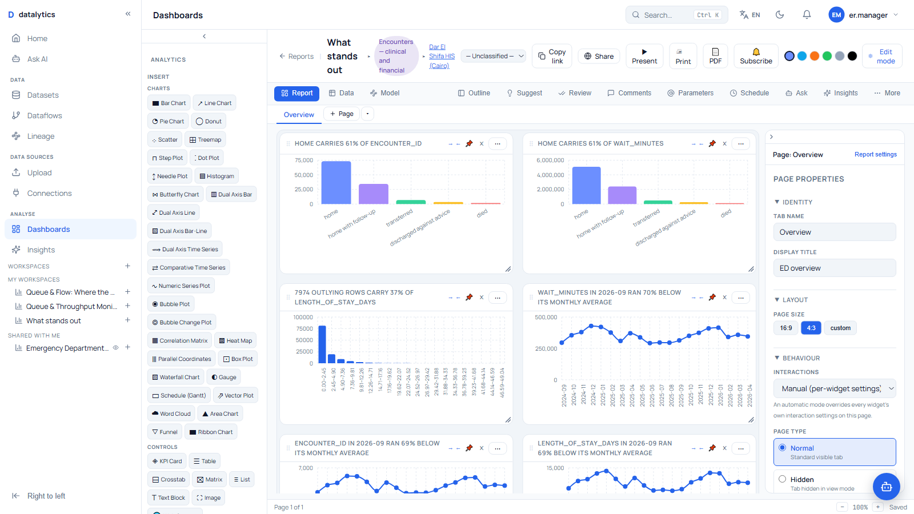
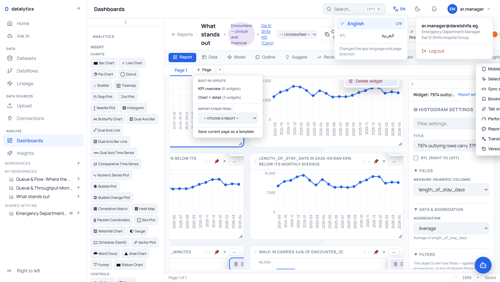
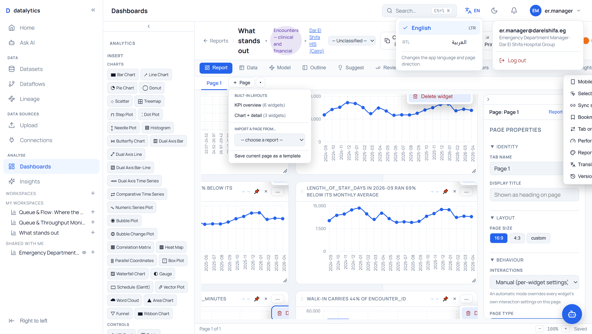
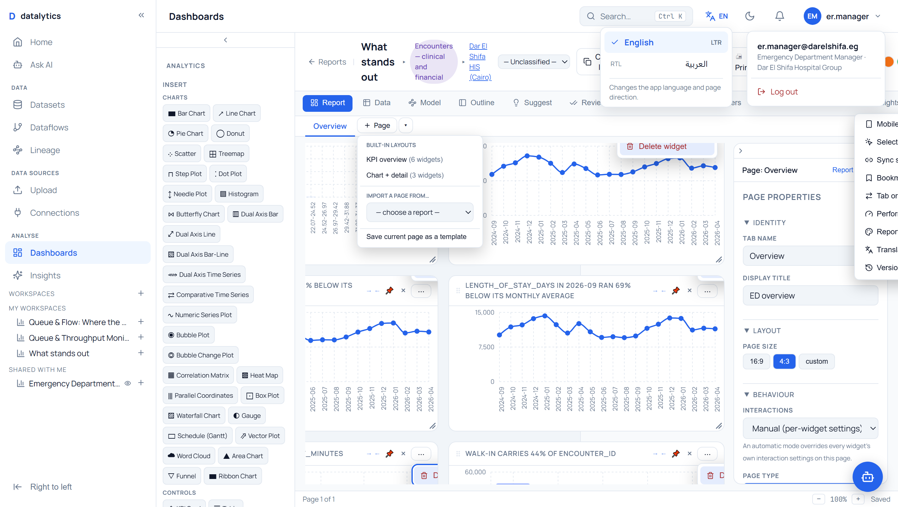

# Settings audit — Page Properties, Report settings, widget options

Every settings surface in the report builder, driven as a person drives it, then
**reloaded** to see what survived.

The question is not whether the panels render. They all render. The question is
whether a choice made in one is still there tomorrow — because this audit began
after finding a panel whose every setting was discarded on reload, and nothing
about looking at it said so.

---

## What was checked

| Surface | Controls | Do the settings persist? | Can a screen reader name them? |
|---|---:|---|---|
| **Widget settings** (Fields, Sort & limit, Format, Axes, Appearance, …) | 41 | ✅ verified by reload | ✅ 41 of 41 |
| **Page Properties** | 20 | ✅ verified by reload | ❌ → ✅ 3 were unnamed, now fixed |
| **Interactions** | 6 | ❌ → ✅ **saved nothing at all**, now fixed | ✅ |
| **Report settings** (parameters) | per parameter | ✅ explicit Save, loaded back on mount | ✅ |

Two further defects, found by looking at what the fields *offer* rather than
whether they save:

| Defect | Reach |
|---|---|
| **Fields that want a number offered text columns** | 16 widget types |
| **The canvas laid tiles out at a stale 900px** | every dashboard, both modes |

---

## 1. Interactions saved nothing

The panel offers a complete model: broadcast/receive direction, a
filter-or-highlight receive mode, per-pair actions, sync across pages.

Every one of those choices lived in React state and nowhere else. A search for
`interaction` across the routers, the schemas and the models returned **zero
matches**. Set a widget to receive-only, press F5, and it is broadcasting again
— with no error, no warning, and nothing on screen to say a setting was lost.

**Fixed.** They live in `widget.config.interaction` — the JSON the widget
already owns, so no migration — hydrated by `CrossFilterProvider` at mount and
written on change. Two traps, both pinned by tests:

- Hydration is a **lazy `useState` initialiser**, not an effect. The settings
  panel defaults a widget to "broadcasts and receives" the first time it opens,
  and a value that arrived a tick later would be overwritten while the user
  watched the panel they opened to look at it.
- That default must not be **saved**, or clicking a tile would rewrite its
  config. `initInteraction` sets local state only; `setInteraction` persists.

`interactionPersistence.test.tsx` — 10 tests, including both traps.

### Proof it works now

Built a dashboard, **reloaded the browser**, then clicked one bar:

```
before -> source chart: 5 bars | related chart: 5 bars
clicked the 'home' bar
after  -> source chart: 5 bars | related chart: 1 bar
```


A filter chip reads `discharge_disposition = home`, the related chart carries a
"1 filter" badge, and the charts that were *not* related are untouched.

---

## 2. Fields that want a number offered text columns

Reported from a real screenshot: a bar chart's **TARGET (PER-BAR ATTAINMENT)**
holding `group (categorical)`. A per-bar attainment target is a number.

The cause was one line — only two roles were ever filtered by type:

```js
const options = (rf.role === 'measure' || rf.role === 'measure2')
  ? measureOptions([roleValues[rf.role]])
  : colOptions              // ← everything else got the whole column list
```

So **sixteen widget types** offered a text column where a number was required:

| Role | Widget types |
|---|---|
| `target` | bar, gauge |
| `size`, `color` | bubble, bubble_change, vector_plot |
| `lat`, `lon`, `lat2`, `lon2` | all 7 coordinate maps |
| `direction` | vector_plot |
| `start`, `end` (dates) | schedule, dual_axis_time_series, comparative_time_series, bubble_change |

`color` is even labelled **"Color (numeric, optional)"** — the label said numeric
and the dropdown offered text.

**Nothing downstream objects.** Every one of these returns HTTP 200:

```
bar,        target = a text column   →  200, target silently dropped
map_points, lat/lon = text columns   →  200, rows: [], dropped: 120000
vector_plot direction = text         →  200, direction is nonsense
```

A blank map with a 200 response is the worst kind of failure this codebase keeps
producing, so the fix is at the only place that can prevent it: the list that
offered the choice. `roleAccepts(role)` in `types/report.ts` says what each role
takes, and the dropdown is filtered by it.

A value **already stored** is never hidden — it stays on the list marked
`(current)`. A widget saved before this rule existed must not open with its field
blanked, because the next unrelated edit would then save the blank.

Confirmed in the running app, on the same bar chart from the report:

```
Target (per-bar attainment)
   — select column —
   wait_minutes, length_of_stay_days, died, readmitted_30d,
   satisfaction_score, total_cost_egp, branch_lat, branch_lon,
   age_years, bmi, smoker, has_diabetes, has_hypertension
```

No `department`, no `discharge_disposition`, no `group`.
`roleColumnTypes.test.tsx` — 25 tests.

---

## 3. The canvas ignored most of the page

The grid sized itself from `useState(900)` and a `ResizeObserver` attached in a
`useEffect([])` that returned early when the ref was null. The canvas renders
inside a branch that only exists once the report has loaded — so on first paint
the ref *was* null, the effect returned, and **no observer was ever attached**.
Every tile was then laid out at 900px for the life of the page.

Measured live at a 1600px viewport:

| | canvas | tiles span | wasted |
|---|---:|---:|---:|
| View mode, before | 843px | 900px | overflowing by 55px |
| Edit mode, before | 1098px | 900px | **200px empty** |
| View mode, after | 843px | 843px | 2px |
| Edit mode, after | 1098px | 1098px | 2px |

On a wide screen the wasted strip was several hundred pixels — the empty right-
hand area in the report.

A callback ref cannot miss the node: it fires when the element attaches whatever
order things render in, and again when a view/edit branch swap replaces it. One
guard came out of the fix: **zero is not a width**. A collapsed panel, a hidden
tab or anything under jsdom reports 0, and twelve columns out of zero pixels is a
negative cell width — the last real measurement is kept until a real one arrives.

`useMeasuredWidth.test.tsx` — 11 tests.

| | |
|---|---|
| The canvas using its full width |  |

---

## 4. Three Page Properties controls had no accessible name

The panel's `fld` helper rendered a `<label>` with no `for`, so three controls
were labelled only visually:

| Control | Announced as |
|---|---|
| Tab name | "edit text" |
| Display title | "edit text" |
| Filter column | "combo box" |

A label not tied to its control is decoration. It also means the control cannot
be found by name in a test — which is exactly how the Interactions panel next
door went a whole release saving nothing without a single test noticing.

**Fixed.** `fld` derives an id from the label and hands it to the control, but
only when the field holds a *single* form control: where it holds a group of
buttons or radios, each already carries its own name and pointing the label at
their wrapper would be worse than leaving it.

```
before   PAGE PROPERTIES: 17 named, 3 unnamed
after    PAGE PROPERTIES: 20 named, 0 unnamed
```

---

## 5. What was already correct

**Widget settings persist.** Changed Aggregation → `avg`, Sort order → `asc`,
Sort by → `name` through the real controls, reloaded, and all three came back.
All 41 controls carry an accessible name.

**Report settings persist.** The parameters panel is the one surface that saves
*explicitly* rather than on a debounce — `parametersApi.list` on mount, a Save
button, a toast on success and the server's own message on failure. Explicit is
a legitimate choice here: a half-typed parameter name should not be written to a
report other people are reading.

**Page Properties persist.** Changed Tab name → `Overview` and Display title →
`ED overview`, reloaded, both survived. They save into the page's own fields and
into `mobile_layout`, which doubles as the page's settings JSON.

| | |
|---|---|
| Widget settings, every group open |  |
| Page Properties |  |
| Page Properties after a reload |  |

---

## How this was tested

Not by reading the code. Every check signs in as a real user
(`er.manager@darelshifa.eg`), opens a real dashboard, drives the real control by
setting its value and firing the events React listens for, waits for the panel's
own debounce, **reloads the page**, and reads the control back.

The one thing worth copying from this: *reload before you believe a setting
saved*. Both defects here were invisible without it — the panel showed the right
value the entire time it was in memory.
