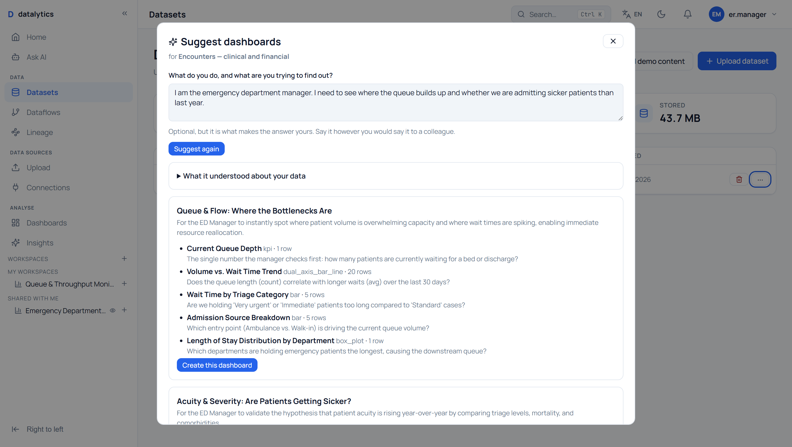
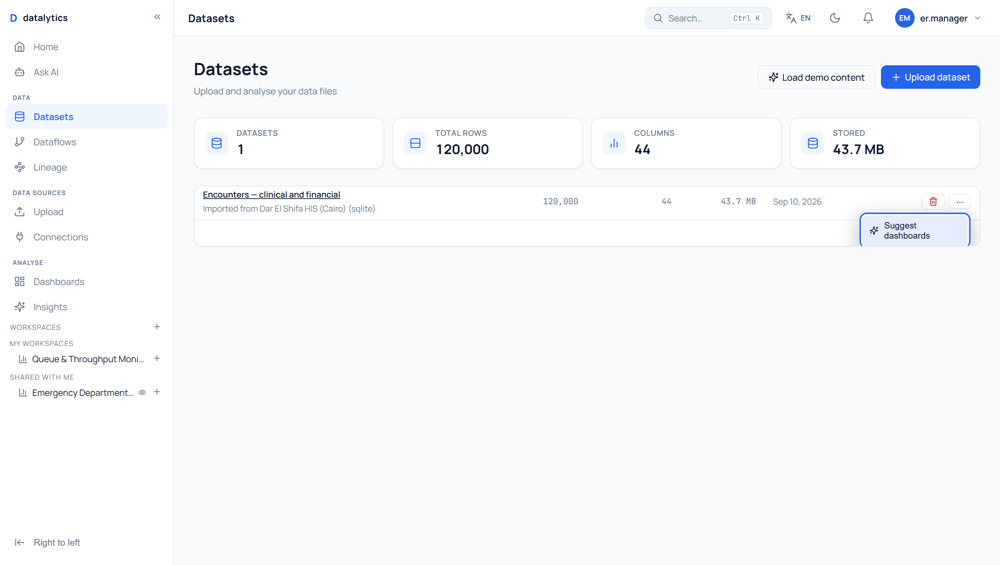
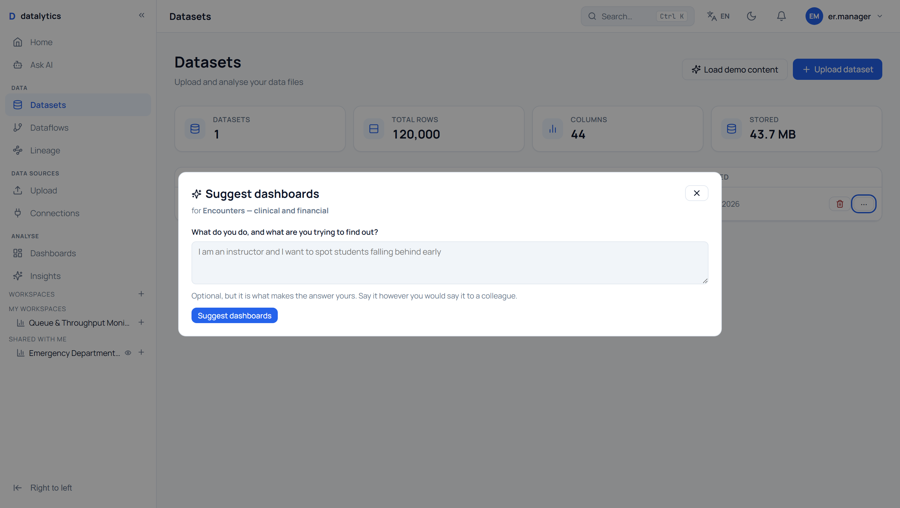
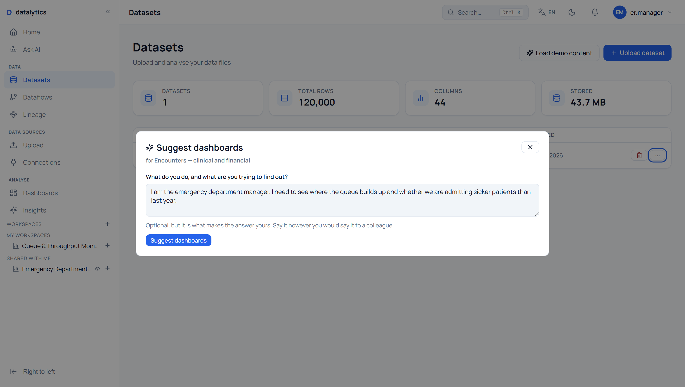
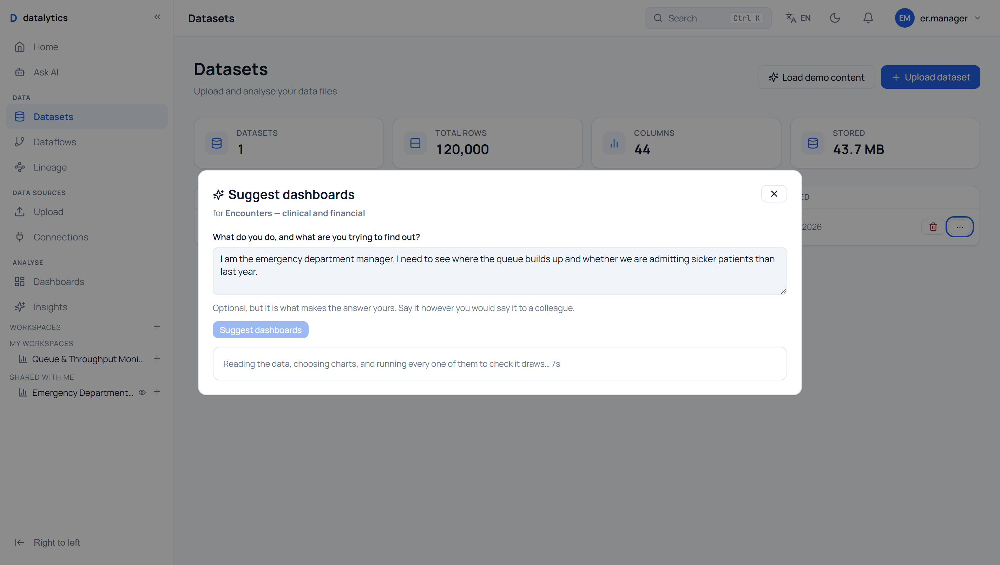
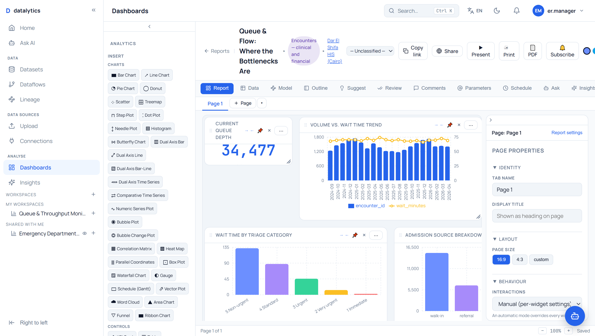
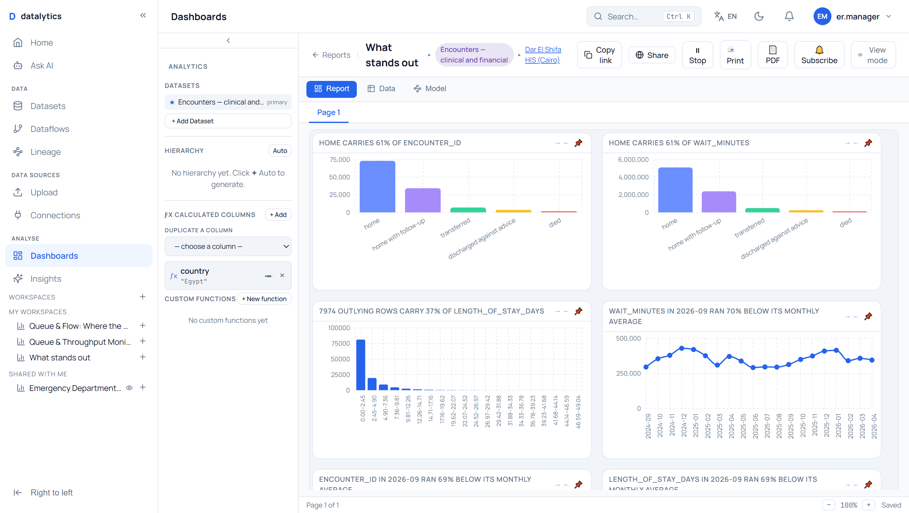
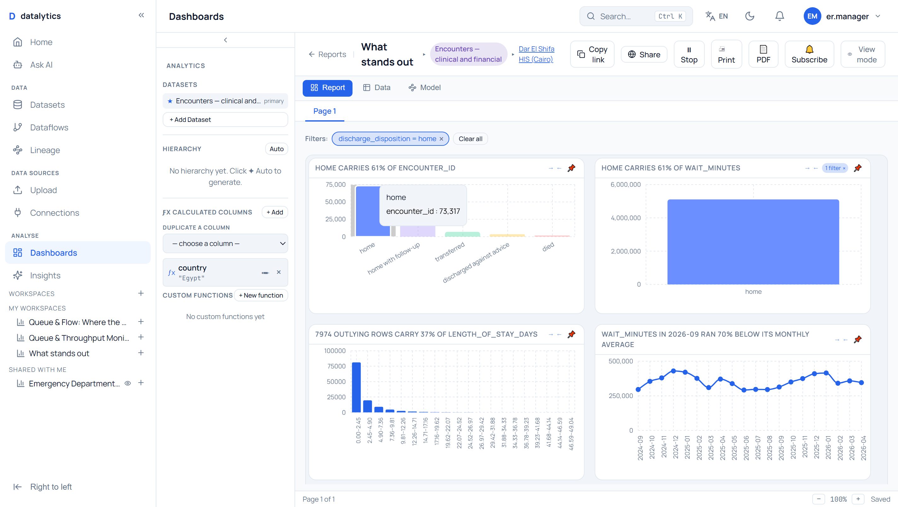

# Suggest dashboards

**Datasets → ⋯ → Suggest dashboards**

You tell it what you do. It reads your data, proposes whole dashboards for
*that* job, and builds the one you pick.



---

## The idea

Every dataset already had two ways to get a chart: build one yourself, or accept
a statistically "interesting" finding. Neither knows who you are. A hospital's
encounter table is one dataset, but the emergency department manager, the
finance manager and the infection-control lead each want a completely different
page out of it, and none of them wants the page an average of the three would
produce.

So this asks you, in one box, in your own words:

> *I am the emergency department manager. I need to see where the queue builds
> up and whether we are admitting sicker patients than last year.*

and returns three dashboards. The second one it returned for that sentence was
titled **"Acuity & Severity: Are We Getting Sicker?"**

The box is optional. Left empty, it proposes dashboards for whoever owns the
data and says in each rationale who it thinks that is.

---

## What actually happens

```
your words  ─┐
             ├─►  prompt  ─►  model  ─►  proposals  ─►  validate  ─►  RUN EACH  ─►  you choose
data profile ─┘                                            │             │
                                                    reject and         drop what
                                                    ask again          draws nothing
```

### 1. It profiles the data first

Not the column list — a column list is not enough to choose a chart with. For
every column: its role, how many distinct values, how much is missing, its range,
its commonest values. Then the structure that unlocks whole widget families:
latitude/longitude pairs, parent-child references, nestings, and the span of the
date column with a bucket size that suits it.

It also records what must **not** happen: which columns are identifiers (never
summed), which are personal (never used as a dimension), which are 0/1 flags
(whose share is an average, never a count).

You can see all of it. The panel has a **"What it understood about your data"**
section above the proposals, because a suggestion you cannot check is one you
cannot trust.

### 2a. If you said nothing, no model is used at all

An empty box means there is nothing to tailor to — so the model is not asked.
The statistics engine picks the charts instead:

```
insights.generate_insights   →  what actually stands out in this data
suggest_widgets_from_findings→  the chart that shows each finding
                             →  the same three gates as any other path
```

**4 seconds instead of 28**, no network call, and the same data always gives the
same dashboard. Every chart's caption is the finding's own sentence, with the
figures already in it — *"home carries 61% of wait_minutes"*, *"7,974 outlying
rows carry 37% of length_of_stay_days"*.

The panel says which engine answered, because the two are not trustworthy in the
same ways and only one of them is reproducible:

> Chosen from what stands out in your data — no AI was used, and the same data
> will always give the same charts.

### 2b. The model chooses the charts

Not a rule. A rule — one KPI, one trend, one breakdown — produces the same
dashboard for a hospital and a bookshop, and nobody asked for that dashboard.
Which of 64 chart types suits *this* data for *this* person is a judgement, and
that is what the model is for.

It is given a menu **already filtered by what your data supports**. No
coordinates, no map types offered. No date column, no time series offered. Each
entry says what the chart is for and which fields it requires.

### 3. Everything is checked, then actually run

A model handed 64 widget types will bind a bubble chart to one measure and sum a
column of identifiers. Three gates stop that reaching you:

| Gate | Refuses |
|---|---|
| **Menu** | widget types this data cannot support |
| **Validation** | invented columns, missing required fields, arithmetic on identifiers, personal columns as dimensions, counting a 0/1 flag, filters on columns that do not exist |
| **Execution** | anything that returns nothing to draw |

The third is the one that matters. **Every widget you are offered has been run
against your data**, and the panel shows the row count each one returned. That
is why the cards say `bar · 12 rows` and not just a chart title.

If everything is rejected, it goes back to the model once with the specific
complaints and asks again.

### 4. It says how the widgets connect — and wires them up

Two charts cut by the same column are not merely both on the page: clicking a
department in one is a question the other can answer. The proposal lists those
pairs in plain words —

> *home carries 61% of encounter_id filters home carries 61% of wait_minutes —
> both are cut by discharge_disposition.*

— and accepting it stores them as real cross-filter actions, so the dashboard
arrives already linked.

Only a shared **dimension** counts. Two charts that merely share a measure are
not related: clicking a bar in "cost by department" tells "cost over time"
nothing it can apply. A KPI is never a source, because it has no dimension to
click.

The actions are written in a **second pass**, after every widget exists. A
relation is stored against a real widget id, and those ids do not exist while the
widgets are still being created — writing the proposal's own indices there would
point each action at whatever widget happens to hold that id.

### 5. Nothing is created until you say so

The server only ever proposes. Pressing **Create this dashboard** makes the
report with the same API calls you could make by hand, and drops you in the
builder to edit it. It is a first draft, not a finished page.

---

## What it looks like end to end

| | |
|---|---|
| The menu item, beside Delete |  |
| The panel |  |
| Saying who you are |  |
| Working — it says what it is doing and counts |  |
| Three dashboards to choose from |  |
| The one you picked, built |  |

Typically **25–30 seconds**: profiling, one model call, then every proposed
widget executed (four at a time).

---

## Tried as three different people

Same platform, three logins, three datasets, nothing changed but the sentence in
the box.

**Emergency department manager** — *"where the queue builds up and whether we are
admitting sicker patients"*

> Queue & Flow: Where the Bottlenecks Are · Acuity & Severity: Are We Getting
> Sicker? · Operational Efficiency & Outcomes

Six widgets each, including a dual-axis chart pairing a **count** of encounters
with a **median** wait — two different kinds of number on two axes.

**Chief pharmacist** — *"where the medicines budget goes and which drug classes
are growing fastest"*

> Medicines Budget & Growth Tracker · Dispensing Operations & Efficiency

Total budget, spend by class, budget-vs-volume trend, fastest-growing classes,
average unit cost trend.

**Laboratory manager** — *"turnaround time and how often results come back
abnormal"*

> Lab Operations: Turnaround & Abnormality Pulse · Clinical Impact

Median turnaround, volume-vs-speed trend, and — because `abnormal_flag` holds
`H`/`L`/`N` rather than a number — abnormal counts expressed as a **filter**,
`abnormal_flag in (H, L)`.

---

## What building it found

Every one of these was found by using the feature as a person would, against the
live model, and every one is fixed with tests.

| # | What went wrong | Why it mattered |
|---|---|---|
| 1 | **A KPI with a dimension** | The model proposed "Current Median Wait Time" grouped by department. A KPI renders `rows[0]`, so the tile showed **62** — Laboratory Medicine's median — under a headline label. The hospital's real median is 60. KPIs are now dimensionless, as the product's own demo content builds them |
| 2 | **A KPI with no measure** | Having been told to drop the dimension, the model dropped the measure too, leaving "a median of nothing" that rendered a table's first row. Now refused |
| 3 | **The validator contradicted the prompt** | The prompt said a KPI must have no dimension; the validator demanded one. Every KPI was discarded — three dashboards came back with no headline number at all |
| 4 | **`average` is not `avg`** | Six usable widgets thrown away in one answer over a spelling. Synonyms are normalised now |
| 5 | **`"dimension": null` read as a column named None** | The model wrote the key explicitly to show it had obeyed. Three more good widgets discarded |
| 6 | **A number in a field** | A gauge arrived with `target: 20`, meaning "the goal is 20". The engine looked for a column called 20, found none, and drew the tile with no target and no complaint |
| 7 | **Counting a 0/1 flag** | "Abnormal Rate by Branch" configured as `count` of `abnormal_flag` would have shown **466,948** — every lab result ever — under the word "Rate". `count` ignores the column it counts |
| 8 | **No filter vocabulary** | With no way to express "where status is H or L", the model wrote SQL into a field: `abnormal_flag IN ('H','L')`. Six widgets lost. `filters` are now part of the contract |
| 9 | **26 labels under one axis** | Not high cardinality — just more categories than a half-width tile can label. Category axes cap at 12 |
| 10 | **The panel span forever** | The request finished in 28 seconds; the panel counted to 220 and kept going. React StrictMode double-mounts in development, the cleanup set the "still mounted" flag false, and the effect never set it back — so the answer arrived to a component that believed it was gone |
| 11 | **Same org read as permission to read** | The endpoint checked that the dataset belonged to the caller's tenant, which is not the same as the caller being allowed to read it. `GET /datasets/{id}` and `widget-data` both 404 for a dataset you were not given; this one returned a full profile — **including sample values from the columns**, on its way to a model. It now applies `require_dataset_read`, the same gate `widget-data` uses |
| 12 | **Sequential probing** | 18 widgets executed one after another, each re-reading a 120,000-row dataset. Now four at a time |

Ten of the twelve were invisible: no error, no warning, no failed request —
just a tile with the wrong number on it, or a panel that never finished.

### The one that was not in this feature at all

Relations have to survive a reload, which meant asking where interactions were
stored. **They were not stored anywhere.**

The Interactions panel offers a full model — broadcast/receive direction, a
filter-or-highlight receive mode, per-pair actions, sync across pages — and
every one of those choices lived in React state and nowhere else. Nothing read
them back; nothing wrote them down. Set a widget to receive-only, press F5, and
it is broadcasting again with no indication anything was lost. A search for
`interaction` across the routers, the schemas and the models returned **zero
matches**.

They now live in `widget.config.interaction` — the JSON the widget already owns,
so no migration — hydrated by the provider at mount and saved on change. Two
traps, both pinned by tests:

- the settings panel defaults a widget to "broadcasts and receives" the first
  time its panel opens, which would overwrite a stored value that had not
  hydrated yet. Hydration is now a lazy initialiser, so the map exists on the
  first render.
- that same default must not be *saved*, or clicking a tile would rewrite its
  config. `initInteraction` sets without persisting; `setInteraction` does both.

### One found next door

Checking #11 against the rest of the product turned up the same gap in an
endpoint that already shipped: **`POST /datasets/{id}/insights` returns 200 for
any dataset id in the caller's org**, including ones the dataset list itself
404s for. Verified live — as `er.manager@darelshifa.eg`:

```
GET  /datasets/145              404 Dataset not found
POST /datasets/145/widget-data  404 Dataset not found
POST /datasets/145/insights     200      <-- findings over data they cannot open
```

It is the same one-line fix (`await require_dataset_read(db, current_user,
dataset_id)` beside the existing `check_org`). Left alone here because it is
outside what this feature was asked to change, and flagged rather than
quietly altered.

---

## Proof that the relations are real

Built through the panel with the box left empty, then the browser **reloaded**,
so nothing was left in memory. Clicking the `home` bar in one chart:

| | |
|---|---|
| Before the click |  |
| After — the related chart is down to one bar |  |

```
before -> source chart: 5 bars | related chart: 5 bars
clicked the 'home' bar
after  -> source chart: 5 bars | related chart: 1 bar
```

A filter chip reads `discharge_disposition = home`, the related chart carries a
"1 filter" badge — and the charts that were *not* related are untouched, which is
what makes it a relation rather than a page-wide filter.

## Limits worth knowing

1. **It proposes; it does not audit.** The charts draw and the numbers are real,
   but whether a box plot of turnaround by division is the *clinically* useful
   cut is a judgement for the person who does that job.
2. **A rate from a text column needs a calculated column.** It can filter to the
   rows you want and count them; it cannot express "the proportion of results
   flagged H" as a single measure without one.
3. **Import-mode datasets only.** DirectQuery is refused, because the profile
   and every probe would be a round trip to the source database.
4. **It sees exactly what you see.** The profile is built from the secured frame,
   so a column your role may not read never reaches the model — which matters
   here, because the profile carries sample values.

---

## Where it lives

| | |
|---|---|
| `backend/app/services/dataset_profile.py` | what the model is told about the data |
| `backend/app/services/suggest_dataset_dashboard.py` | the menu, the prompt, the three gates |
| `backend/app/services/widget_roles.py` | what each widget type must be given, pinned to the frontend spec |
| `backend/app/routers/datasets.py` | `POST /datasets/{id}/suggest-dashboards` |
| `frontend/src/components/dataset/SuggestDashboardsDialog.tsx` | the panel |
| `frontend/src/pages/Dashboard.tsx` | the menu item |

**203 tests** — 186 backend across four modules (`test_widget_roles`,
`test_dataset_profile`, `test_suggest_dataset_dashboard`,
`test_suggest_dashboards_endpoint`), 17 frontend.
